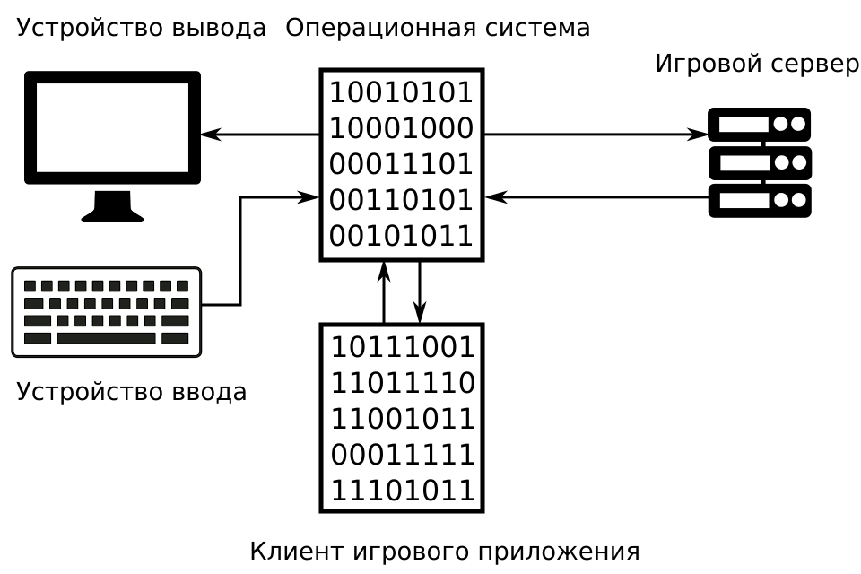
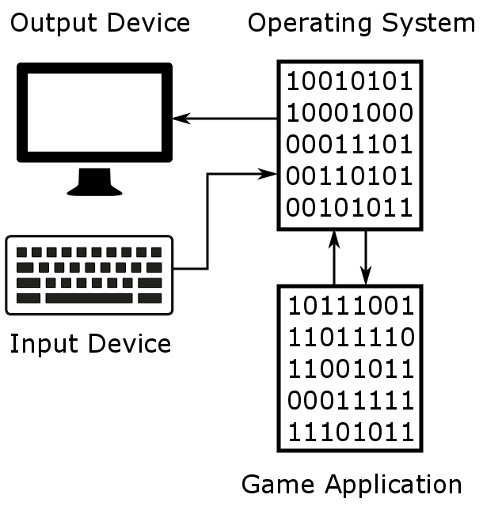

# Игровое приложение

Перед изучением внутреннего устройства ботов, нам следует рассмотреть типичное игровое приложения. Его принцип работы не зависит от игрового жанра.

Сначала мы рассмотрим онлайн игру. Иллюстрация 1-1 демонстрирует её логические элементы.

**Иллюстрация 1-1.** *Элементы типичного приложения онлайн игры*

Запуская игру на компьютере, вы создаете новый **вычислительный процесс**. Он имеет собственную **область памяти**, которая выделяется **операционной системой** (ОС). Память - это только один из ресурсов предоставляемых ОС. Примеры других ресурсов - это устройства ввода-вывода (монитор, клавиатура, мышь, сетевой адаптер). Процессорное время - еще один ресурс, который определяет как часто конкретный процесс получает управление в многозадачной ОС.

Возможно, вы спросите: "Зачем нужна ОС для запуска игры? Разве не проще работать приложениям вообще без неё?" ОС - это прежде всего удобная платформа для разработки. Без неё, каждой компании, создающей программы, пришлось бы изобретать собственные средства для работы с устройствами. Это потребовало бы много времени и усилий. Намного проще использовать **драйвера устройств** и **системные библиотеки**, предоставляемые ОС.

Вернемся к иллюстрации 1-1. Прямоугольники соответствуют элементам приложения, а стрелки - направлению передачи данных.

ОС обрабатывает команды работающего процесса для отображения картинки на мониторе или для отправки сетевых пакетов на сервер через сетевой адаптер. Также ОС отвечает за уведомление процесса о событиях на устройствах. Примеры таких событий: нажатие клавиши на клавиатуре или получение пакета от сервера. ОС выполняет эти задачи с помощью драйверов устройств и **системных библиотек**. На иллюстрации они объединены в единый блок "Операционная Система".

Рассмотрим обработку однократного действия игрока. Воспользуемся, иллюстрацией для отслеживания элементов участвующих в обработке. Предположим, что мы перемещаем персонажа. Для этого нажимаем клавишу на клавиатуре. Обработка нажатия состоит из следующих шагов:

1. **Устройство ввода -> Операционная система**
Клавиатура посылает сигнал о нажатии клавиши **контроллеру прерываний**. Это устройство передает сигналы в процессор в порядке очереди и с учётом приоритетов. На программном уровне сигналы обрабатываются драйвером ОС.

2. **Операционная система -> Клиент игрового приложения**
ОС получает от драйвера событие, соответствующее нажатию клавиши. Затем ОС сообщает процессу игры об этом событии. Обычно, события нажатий клавиш получает процесс, чье окно является активным в данный момент. Предположим, что активно игровое приложение.

3. **Клиент игрового приложения**
После получения события о нажатии клавиши, процесс обновляет состояние игровых объектов в своей памяти. В нашем случае изменение касается местоположения персонажа.

4. **Клиент игрового приложения -> Операционная система**
Процесс должен сообщить игровому серверу о новом местоположении персонажа. Для этого процесс обращается к ОС через системную библиотеку, чтобы отправить сетевой пакет. Этот пакет содержит новую информацию о персонаже. Системная библиотека обращается к драйверу сетевого адаптера, чтобы отправить пакет.

5. **Операционная система -> Игровой сервер**
Игровой сервер получает сетевой пакет. Затем он проверяет, соответствует ли новая информация о персонаже игровым правилам. Если проверка прошла успешно, сервер принимает эти данные и отправляет клиенту подтверждение. Если к серверу подключено несколько клиентов, он рассылает новую информацию о персонаже им всем.

6. **Операционная система -> Клиент игрового приложения**
Через контроллер прерываний сетевой адаптер посылает сигнал в процессор о получении сетевого пакета от игрового сервера. Сигнал обрабатывается драйвером, создается соответствующее событие на уровне ОС, которое передается процессу игрового приложения.

7. **Клиент игрового приложения**
Процесс извлекает из сетевого пакета код подтверждения игрового сервера. Если код сообщает об ошибке, местоположение игрового персонажа остается неизменным. В противном случае, процесс пометит в своей памяти, что новая информация о персонаже была успешно принята сервером.

8. **Клиент игрового приложения -> Операционная система**
Процесс игрового приложения обращается к системной библиотеке ОС (в случае Windows это обычно DirectX) для отображения на мониторе нового положения персонажа.

9. **Операционная система -> Устройство вывода**
Библиотека ОС выполняет необходимые расчеты и обращается к драйверу для отрисовки картинки на экране.

Практически все действия игрока выполняются по описанному алгоритму независимо от устройства ввода (клавиатура, джойстик или мышь). В случае, если не требуется подтверждение действия со стороны игрового сервера (например при открытии меню), алгоритм будет несколько отличаться.

Состояние игровых объектов может меняться как из-за действий игрока, так и из-за событий на стороне сервере (например срабатывание таймера). Эти события будут обрабатываться по алгоритму, который состоит из рассмотренных выше шагов с 6 по 9. В этом случае сервер уведомляет клиента об изменении. После этого процесс игрового приложения обновляет состояние игровых объектов и перерисовывает картинку на экране.

Большинство современных онлайн игр работают по рассмотренной схеме. Жанр игры (RPG, стратегия реального времени, шутер и т.д.) в этом случае не важен. Все они используют **архитектуру клиент-сервер**.

Иллюстрация 1-2 демонстрирует схему однопользовательской игры. В отличие от схемы онлайн игры, здесь отсутствует игровой сервер. Все действия игрока отражаются только на памяти процесса игрового приложения. Состояние всех игровых объектов хранится на локальном компьютере.

**Иллюстрация 1-2.** *Элементы типичного приложения 
однопользовательской игры*

Однопользовательские и онлайн игры взаимодействуют с ресурсами ОС через системные библиотеки по одинаковым алгоритмам.

В случае онлайн игры, состояние игровых объектов хранится на сервере и клиенте. При этом информация на стороне сервера более приоритетна. Это значит, что если информация клиента отличается, она будет заменена на ту, что хранится на сервере. Таким образом сервер контролирует корректность состояния игровых объектов. В случае однопользовательской игры такого контроля нет.
