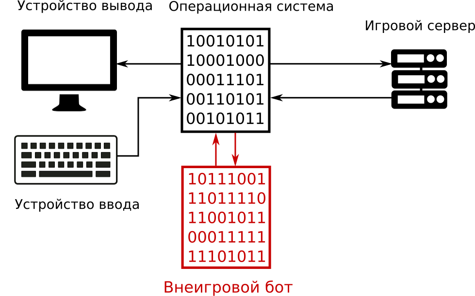
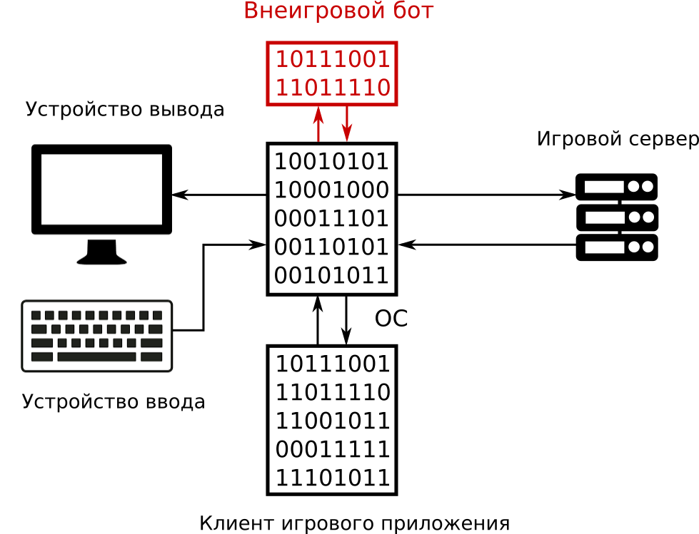
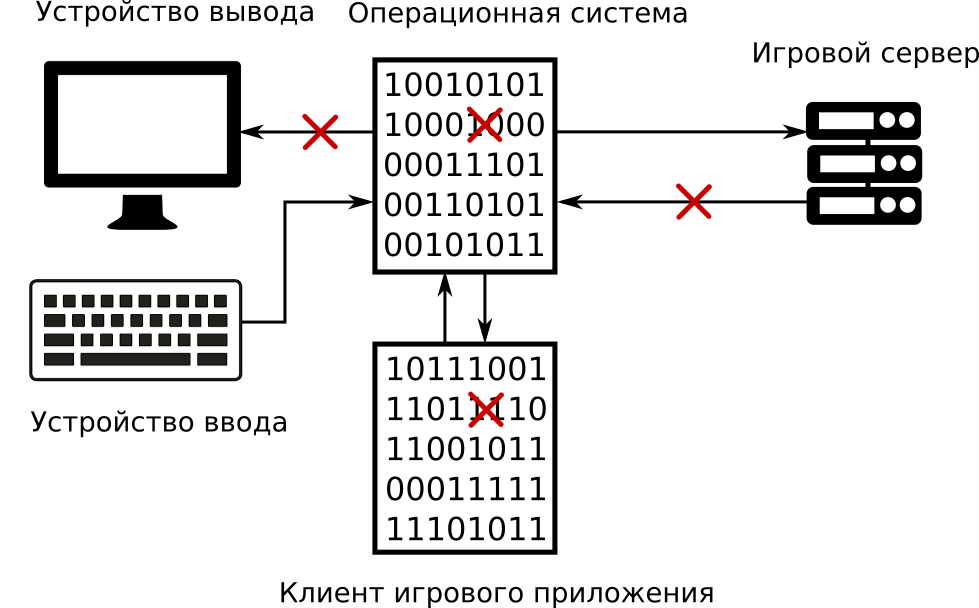

# Виды ботов

Классификация поможет нам лучше разобраться в игровых ботах. Существует два основных подхода к решению этой задачи: классификация разработчиков и сообщества игроков.

## Классификация сообщества игроков

Изучая информацию о ботах в Интернете, вы наверняка встретите термины "внутриигровой" (in-game) и "внеигровой" (out-game). Эти термины широко используются и означают виды ботов, которые хорошо знакомы сообществу игроков. Основа для такой классификации - это способ взаимодействия с игровым приложением.

Внутриигровые боты получили свое название из-за того, что интегрируются в процесс игрового приложения так, как показано на иллюстрации 1-3. Специальные приемы позволяют одному процессу ОС получить доступ к памяти другого процесса. Таким образом бот манипулирует состояниями игровых объектов (например читает их, модифицирует и записывает обратно).

**Иллюстрация 1-3.** *Схема работы внутриигрового бота*

Внеигровые боты работают отдельно от процесса игрового приложения, как на иллюстрации 1-4. Вместо чтения игровых данных из памяти другого процесса, они используют возможности ОС для взаимодействия между процессами или сетевыми **хостами** (компьютерами подключенными к сети, например клиент игрового приложения и сервер).

**Иллюстрация 1-4.** *Схема работы внеигрового бота*

Существует два типа внеигровых ботов. Первый тип полностью подменяет собой игровое приложение. Вместо запуска игры, вы запускаете бота, который взаимодействует напрямую с игровым сервером. Самое сложное при разработке таких ботов - заставить сервер принять бота за настоящее игровое приложение.

Второй тип внеигровых ботов работает одновременно с игрой. В этом случае бот собирает информацию о состоянии игровых объектов и симулирует действия игрока через системные библиотеки ОС. Иллюстрация 1-5 демонстрирует схему такой работы.

**Иллюстрация 1-5.** *Внеигровой бот, работающий одновременно с игрой*

В Интернете также встречается упоминание про ботов "кликеров". Их можно отнести ко второму типу внеигровых ботов. Особенность кликеров в том, что они симулируют нажатия клавиш и действия мыши через системные библиотеки ОС. При этом никакого доступа к памяти процесса игрового приложения или обмена сетевыми пакетами с сервером не происходит.

## Классификация разработчиков

Классификация сообщества игроков удобна для пользователей. Познакомившись с ней, легко представить возможности и приемы использования каждого вида ботов. Проблема в том, что эта классификация не отражает детали реализации бота. Эта информация была бы полезна для разработчиков.

Чтобы построить классификацию для разработчиков, следует взять за основу именно детали реализации ботов. Например, к разным видам будут относиться боты, которые читают состояние объектов из памяти игрового приложения и те, которые обмениваются сообщениями с сервером.

Рассмотрим еще раз схему приложения онлайн игры. Отметим красными крестами точки, где бот может перехватить информацию о состоянии игровых объектов. Иллюстрация 1-6 демонстрирует результат.

**Иллюстрация 1-6.** *Точки перехвата информации ботом*

Мы получили следующий список точек:

* **Устройство вывода**
С помощью системных библиотек ОС можно перехватывать данные, отправляемые на устройства вывода (например монитор или звуковую карту). Например, игровой объект отрисовывается на экране. Он имеет определенные цвета в зависимости от своего состояния. Бот может анализировать эти цвета и делать вывод о состоянии объекта.

* **Операционная система**
Бот может замещать или модифицировать системные библиотеки ОС или драйвера. Это позволит ему прослеживать взаимодействие игрового приложения с ОС. Альтернативное решение - запускать игру в виртуальной машине или эмуляторе ОС (например Wine). Как правило, эмуляторы имеют дополнительные средства журналирования событий. Эта информация поможет боту определить состояние игровых объектов.

* **Игровой сервер**
Бот может перехватывать сетевые пакеты, которые сервер и клиент игрового приложения отправляют друг другу. Каждый из них содержит часть информации об объектах. Перехватив достаточно пакетов, можно получить всю необходимую боту информацию.

* **Клиент игрового приложения**
Бот может получить доступ к памяти процесса игрового приложения и прочитать из неё информацию. Системные библиотеки ОС предоставляют функции для этого.

Главная задача любого бота - это совершать действия. При этом бот не должен выдавать себя, то есть игровой сервер должен принимать его действия так, как будто их совершил игрок. Иллюстрация 1-7 демонстрирует точки на схеме, в которых бот может внедрять свои действия.

**Иллюстрация 1-7** *Точки внедрения ботом своих действий*

Список точек получился следующий:

* **Устройство ввода**
Если бот контролирует устройство ввода, с точки зрения ОС это достаточно сложно распознать. Разработчик может подменить стандартную клавиатуру или мышь устройством, которое получает команды от бота и симулирует нажатия клавиш. Пример такого устройства - плата Arduino.

* **Операционная система**
Так же как в случае с перехватом информации, бот может подменить компоненты ОС. Например, можно загрузить специальный драйвер, который уведомляет ОС о нажатии клавиши. При этом драйвер будет полностью под управлением бота. Также некоторые системные библиотеки позволяют встраивать события нажатия клавиш в процесс игрового приложения.

* **Игровой сервер**
Бот может уведомлять сервер о симулируемых действиях напрямую, посылая ему сетевые пакеты. Процедура отправки таких пакетов может быть скопирована у игрового приложения.

* **Клиент игрового приложения**
Бот может встраивать симулируемые действия и новое состояние объектов напрямую в память процесса игрового приложения. Таким образом сама игра будет обрабатывать эти действия и сообщать о них серверу.

В классификации разработчиков каждый бот может использовать одну из рассмотренных точек перехвата данных и внедрения своих действий. Таким образом мы получили 16 возможных комбинаций.

## Сравнение ботов

Таблица 1-1 отображает соответствие между классификациями разработчиков и сообщества игроков. Столбцы соответствуют точкам перехвата данных ботом, а строки - точкам внедрения действий.

**Таблица 1-1** *Соответствие классификаций*

|  | Перехват сетевых пакетов | Чтение памяти | Перехват устройств вывода | Перехват на уровне ОС |
| -- | -- | -- | -- | -- |
| Внедрение в сетевые пакеты | Внеигровые боты | - | - | - |
| Внедрение в память | - | Внутриигровые боты | - | - |
| Внедрение на уровне устройств ввода | - | - | - | - |
| Внедрение на уровне ОС | - | - | Кликеры | - |

Классификация сообщества игроков покрывает только малую часть возможных вариантов реализаций ботов. Но эти варианты являются наиболее эффективными комбинациями точек перехвата и внедрения данных. Это не значит, что все три комбинации дают одинаковый результат. Каждая из них имеет свои достоинства и недостатки.

Перед тем как оценивать различные реализации ботов, определимся с критериями оценки. Рассмотрим три критерия:

1. Насколько трудозатратна реализация бота?

2. Насколько надежно работает бот в смысле принятия неверных решений?

3. Насколько сложно обнаружить бота разработчикам игры?

Кликеры наиболее просты для разработки и сопровождения. В то же время, этот вид ботов наименее надежен в использовании из-за большого количества совершаемых ошибок. Обнаружение кликеров - достаточно сложная задача для систем защиты игрового приложения.

Внеигровые боты наиболее сложны в реализации. При этом, их легко обнаружить. Их сильная сторона - максимальная надежность в работе.

Внутриигровые боты являются средним вариантом между кликерами и внеигровыми ботами. Они сложнее в разработке чем первые, но проще чем вторые. Их можно обнаружить, но это сложнее чем в случае внеигровых ботов. Надежность работы намного выше чем у кликеров.

Почему наиболее эффективны именно точки перехвата и внедрения данных, попавшие в классификацию сообщества игроков? Чтобы ответить на этот вопрос, мы рассмотрим каждый вариант реализации ботов с точки зрения оценки трудоемкости реализации, надежности и сложности обнаружения.

* **Сетевые пакеты**
Анализ сетевых пакетов - самый сложный метод перехвата данных. Разработчик бота должен реализовать протокол взаимодействия игрового клиента и сервера. Очевидно, документация на этот протокол доступна только разработчикам игры. Обычно, единственная доступная информация о протоколе - это перехваченные пакеты. Как правило, они зашифрованы и расшифровать их однозначно довольно сложно. С другой стороны наиболее полная информация об игровых объектах может быть получена только напрямую от сервера. В этом случае игровой клиент еще не успел её модифицировать или отфильтровать.

* **Память процесса игрового приложения**
Анализ памяти процесса - второй по сложности метод перехвата данных. Разработчики игр распространяют свои приложения в виде двоичных файлов. Эти файлы генерирует **компилятор** после прохода по исходному коду игры, который представляет собой читаемый текст. Проблема в том, что процесс компиляции необратим без неоднозначностей. Более того системы защиты ещё более затрудняют изучение алгоритмов и структур данных игрового приложения. С другой стороны анализ памяти процесса даёт почти такую же полную информацию о состоянии игровых объектов, что и анализ сетевых пакетов.
Внедрять действия бота в память процесса достаточно опасно, так как это может привести к отказу приложения.

* **Устройства вывода**
Перехват устройств вывода - одна из простейших техник сбора информации об игровых объектов. Но в то же время этот метод наименее надежен. Например, алгоритмы распознавания изображений часто совершают ошибки, принимая один объект за другой. Эффективность этого подхода во многом зависит от интерфейса игры.

* **Устройства ввода**
Внедрение действия бота через эмулятор устройства ввода - эффективная техника для обхода систем защиты игры. С другой стороны, необходимо купить это устройство и разработать прошивку для него. Если система защиты позволяет, намного проще использовать внедрение действий бота на уровне ОС.

* **Операционная система**
Перехват данных на уровне ОС - универсальный и надежный метод. Существует несколько открытых проектов (например graphics.stanford.edu/~mdfisher/D3D9Interceptor.html), которые позволяет замещать системные библиотеки. В этом случае игровое приложение взаимодействует с подмененными библиотеками, которые собирают информацию о вызываемых функциях ОС. Анализ этой информации позволит определить состояние игровых объектов.
Внедрение действий бота с помощью системных библиотек ОС достаточно просто реализовать. С другой стороны система защиты легко обнаруживает эту технику.

В итоге, мы подтвердили, что классификация сообщества игроков покрывает наиболее эффективные или простые для реализации комбинации техник перехвата и внедрения данных. В то же время, она игнорирует неэффективные и редко встречающиеся комбинации. Мы будем следовать этой классификации на протяжении всей книги.

# Выводы

В этой главе мы получили общее представление о ботах и их видах. Также мы рассмотрели некоторые аспекты их реализации. Теперь вы можете легко различить кликеров, внутриигровых и внеигровых ботов. Более того, вы представляете, как они работают, а также их сильные и слабые стороны.

