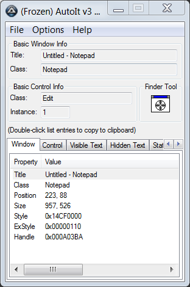
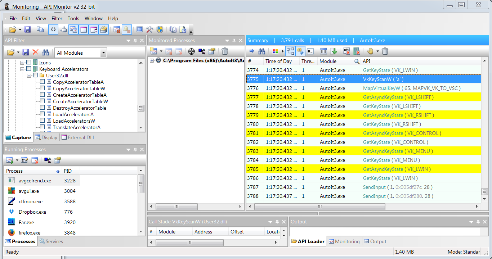

# Внедрение данных на уровне ОС

## Windows API

Главная задача любой ОС - это управление программными и аппаратными ресурсами компьютера, а также предоставление к ним доступа для запущенных процессов. Аппаратные ресурсы мы уже рассматривали. Это память, процессорное время, периферийные устройства. Примеры программных ресурсов: примитивы синхронизации и алгоритмы, реализованные в системных библиотеках.

В этой книге мы рассматриваем только ОС Windows. Под ней вы сможете запустить все приведённые примеры. В дальнейшем для простоты будем подразумевать Windows, когда говорим ОС.

Иллюстрация 2-1 демонстрирует, как ОС предоставляет доступ к своим ресурсам. Каждый запущенный процесс может обратиться к Windows для выполнения какого-то действия (например создание нового окна, отправки сетевого пакета, выделения дополнительной памяти и т.д.). Для каждого из этих действий у ОС есть соответствующая подпрограмма. Подпрограммы, которые решают задачи из одной области (например работа с сетью), собраны в отдельные системные библиотеки. На иллюстрации приведены библиотеки *kernel32.dll*, *gdi32.dll* и другие.


**Иллюстрация 2-1.** *Доступ к ресурсам ОС через WinAPI*

Способ, которым процесс может вызвать системную подпрограмму, строго определён, хорошо задокументирован и остаётся неизменным для данной версии ОС. Такое взаимодействие можно сравнить с юридическим договором: если процесс выполняет предварительные условия для вызова подпрограммы, ОС гарантирует указанный в документации результат. Такой договор называется **интерфейс прикладного программирования Windows** (Windows API или WinAPI).

Программное обеспечение очень гибко и легко меняется, согласно возникающим требованиям. Так каждое обновление Windows вносит изменения в некоторые детали реализации ОС (например какую-то системную библиотеку). Эти детали реализации связаны между собой (типичный случай - одна библиотека вызывает подпрограммы другой). Таким образом, даже небольшое изменение может оказать значительное влияние на систему в целом. То же самое справедливо и для игрового приложения. Единственное, что позволяет программному обеспечению работать в этом море  постоянных изменений - это надежные интерфейсы. Именно WinAPI гарантирует согласованное состояние системы и обеспечивает совместимость между новыми версиями ОС и приложения.

На иллюстрации 2-1 приведены два типа приложений. **Win32 приложение** взаимодействует с подмножеством системных библиотек через WinAPI интерфейс. Win32 - это историческое название, которое возникло в первой 32-битной версии Windows (Windows NT). Библиотеки, доступные через WinAPI (также известные как **WinAPI библиотеки**), содержат **высокоуровневые подпрограммы**. Термин "высокоуровневый" означает, что подпрограммы оперируют сложными абстракциями, такими как окно, элемент управления, файл и т.д.

Второй тип приложений называется **нэйтив** (иногда переводится, как "родной"). Они взаимодействуют с более низкоуровневыми библиотеками и ядром Windows через **нэйтив API** (Native API). Преимущество этих библиотек в том, что они становятся доступны на раннем этапе загрузки системы, когда многие функции ОС еще не работоспособны. Подпрограммы этих библиотек оперируют простыми абстракциями, такими как страница памяти, процесс, поток и т.д.

WinAPI библиотеки вызывают подпрограммы низкоуровневых библиотек. Такое подход позволяет создавать сложные абстракции из более простых. Низкоуровневые библиотеки в свою очередь вызывают функции ядра.

Драйвера предоставляют упрощенное представление устройств для системных библиотек. Это представление включает в себя набор подпрограмм, которые выполняют характерные для данного устройства действия. WinAPI и низкоуровневые библиотеки могут обратиться к этим подпрограммам через функции ядра.

**Слой аппаратной абстракции** (Hardware Abstraction Layer или HAL) - это модуль ядра ОС, который предоставляет универсальный доступ к различному аппаратному обеспечению. Главная задача HAL - облегчить портирование и сопровождение Windows на новых аппаратных платформах. Подпрограммы HAL используются ядром ОС и драйверами устройств.

## Симуляция нажатий клавиш

Теперь мы рассмотрим способы симуляции нажатий клавиш. Это наиболее простой метод контроля ботом игрового приложения.

### Нажатия клавиш в активном окне

Рассмотрим, какие возможности предлагает AutoIt для решения нашей задачи. В списке доступных функций (www.autoitscript.com/autoit3/docs/
functions.htm) есть функция `Send`. Мы воспользуемся ей в тестовом скрипте, который будет нажимать клавишу "a" в окне приложения Блокнот (Notepad).

Алгоритм работы нашего скрипта выглядит следующим образом:

1. Найти окно Блокнота среди всех открытых окон.

2. Переключится на него.

3. Симулировать нажатие клавиши "a".

Для поиска окна приложения мы воспользуемся функцией `WinGetHandle`. Её первый параметр является обязательным и может быть как заголовком окна, так и его классом. Функция возвращает **дескриптор** (handle) окна. Дескриптор - это структура данных, которая представляет некоторый ресурс или объект ОС. Большинство функций WinAPI оперируют этими структурами при работе с объектами.

Указывать класс окна при вызове функции `WinGetHandle` предпочтительнее. Всегда есть вероятность, что окна некоторых работающий приложений будут иметь одинаковые заголовки (например пустые).

Для чтения класса окна Блокнота необходимо выполнить следующие шаги:

1. Запустить приложение Au3Info. Вы можете найти его в каталоге установки AutoIt. Путь к приложению по-умолчанию: `C:\Program Files (X86)\AutoIt3\Au3Info.exe`.

2. Перетащить иконку "Finder Tool" на окно Блокнота и отпустить.

Вы увидите результат, как на иллюстрации 2-2.



**Иллюстрация 2-2.** *Приложение AutoIt3 Info*

Класса окна Блокнота отображается на панели "Basic Info Window". Этот класс - "Notepad".

Скрипт `Send.au3`, представленный в блоке кода 2-1, реализует описанный алгоритм симуляции нажатия клавиши "a".

**Блок кода 2-1.** *Скрипт `Send.au3`*
```AutoIt
$hWnd = WinGetHandle("[CLASS:Notepad]")
WinActivate($hWnd)
Send("a")
```
В первой строке мы получаем дескриптор окна Блокнота с помощью функции `WinGetHandle`. Далее мы переключаем фокус ввода на это окно функцией `WinActivate`. Последнее действие - симуляция нажатия клавиши "a".

Чтобы запустить этот скрипт, создайте в вашем редакторе исходного кода файл с именем `Send.au3` и скопируйте в него приведенный выше код. Запустите скрипт двойным щелчком по иконке этого файла.

### `Send` функция

Функция `Send` представляет собой обертку над низкоуровневой подпрограммой WinAPI. Мы можем найти эту подпрограмму с помощью приложения API Monitor, которое перехватит все системные вызовы скрипта `Send.au3`.

Для подключения API Monitor к работающему процессу надо выполнить следующие шаги:

1. Запустить 32-битную версию API Monitor.

2. Переключится на панель "API Filter" щелчком мыши. Нажать комбинацию клавиш *Ctrl+F* - откроется диалог поиска. Ввести в поле "Find what:" текст “Keyboard and Mouse Input” и нажать кнопку "Find Next". Закрыть диалог поиска и активировать найденный флажок (check box) “Keyboard and Mouse Input”. 

3. Нажать *Ctrl+M* для открытия диалога "Monitor New Process". Выбрать приложение `AutoIt3.exe` в поле "Process" и нажать кнопку "OK". Путь к этому приложению по-умолчанию: `C:\Program Files (x86)\AutoIt3\AutoIt3.exe`.

4. В открывшемся диалоге "Run Script" выбрать скрипт `Send.au3`. Сразу после этого он отработает.

5. Переключиться на панель "Summary" окна API Monitor. С помощью диалога поиска, который вызывается по *Ctrl+F*, найти текст 'a' (с одинарными кавычками).

Иллюстрация 2-3 демонстрирует ожидаемый результат. Согласно перехваченным вызовам, `VkKeyScanW` - единственная WinAPI функция, получающая в качестве параметра символ "a". Если мы обратимся к официальной документации WinAPI (docs.microsoft.com/en-us/windows/desktop/apiindex/windows-api-list), выяснится что эта функция не выполняет нажатия клиавиши. Она вместе с функцией `MapVirtualKeyW` только подготавливает параметры для вызова `SendInput`, который и симулирует нажатие.



**Иллюстрация 2-3.** *Перехват вызовов WinAPI с помощью API Monitor*

Мы узнали достаточно, чтобы симулировать нажатие клавиши "a" напрямую через WinAPI вызовы. Удалим третью строчку скрипта `Send.au3` и заменим её новым блоком кода. При этом оставим первые два вызова `WinGetHandle` и `WinActivate` без изменений. Блок кода 2-2 демонстрирует результат.

**Блок кода 2-2.** *Скрипт `SendInput.au3`*
```AutoIt
$hWnd = WinGetHandle("[CLASS:Notepad]")
WinActivate($hWnd)

Const $KEYEVENTF_UNICODE = 4
Const $INPUT_KEYBOARD = 1
Const $iInputSize = 28

Const $tagKEYBDINPUT = _
    'word wVk;' & _
    'word wScan;' & _
    'dword dwFlags;' & _
    'dword time;' & _
    'ulong_ptr dwExtraInfo'

Const $tagINPUT = _
    'dword type;' & _
    $tagKEYBDINPUT & _
    ';dword pad;'

$tINPUTs = DllStructCreate($tagINPUT)
$pINPUTs = DllStructGetPtr($tINPUTs)
$iINPUTs = 1
$Key = AscW('a')

DllStructSetData($tINPUTs, 1, $INPUT_KEYBOARD)
DllStructSetData($tINPUTs, 3, $Key)
DllStructSetData($tINPUTs, 4, $KEYEVENTF_UNICODE)

DllCall('user32.dll', 'uint', 'SendInput', 'uint', $iINPUTs, _
        'ptr', $pINPUTs, 'int', $iInputSize)
```
Здесь мы использовали функцию AutoIt `DllCall`. С её помощью можно вызвать подпрограмму, написанную на языке C или C++, из указанной **динамческой библиотеки** (DLL). Именно такой подпрограммой является `SendInput`. Её входные параметры должны иметь типы, согласно документации WinAPI. Некоторые из них AutoIt не поддерживает на уровне синтаксиса. Поэтому нам нужны дополнительные функции, чтобы их подготовить.

Рассмотрим, какие параметры мы передали в функцию `DllCall`:

* `user32.dll` - имя библиотеки, подпрограмму которой требуется вызвать.

* `uint` - это тип возвращаемого значения подпрограммы.

* `SendInput` - её имя.

* `uint, $iINPUTs, ptr, $pINPUTs, int, $iInputSize` - пары тип-переменная, которые являются входными параметрами подпрограммы.

Согласно WinAPI документации, декларация функции `SendInput` выглядит следующим образом:
```C++
UINT SendInput(UINT cInputs, LPINPUT pInputs, int cbSize);
```
Строчку вызова функции `DllCall` на AutoIt можно представить следующим эквивалентом на языке C++:
```C++
SendInput(iINPUTs, pINPUTs, iInputSize);
```
Рассмотрим входные параметры, переданные нами в `SendInput`:

1. `iINPUTs` - количество структур типа `INPUT`, которые передаются вторым параметром. В нашем случае - одна структура.

2. `pINPUTs` - указатель на массив структур типа `INPUT` из одного элемента. Этот массив подготавливается в несколько этапов. Сначала мы объявляем AutoIt переменные, описывающие структуры `KEYBDINPUT` и `INPUT`. Структура `KEYBDINPUT` нужна, поскольку является одним из полей `INPUT`. Такое отношение называется **вложенные структуры**. Следующий шаг - создание C++ структуры через вызов `DllStructCreate`. Результат сохраняется в переменной `tINPUTs`. С помощью функции `DllStructGetPtr` мы получаем указатель на эту структуру и помещаем его в `pINPUTs`. Когда структура создана, мы записываем её поля через `DllStructSetData` вызовы. Обратите внимание, что второй параметр `DllStructSetData` - это номер поля структуры начиная с единицы. В случае вложенных структур их поля нумеруются последовательно. То есть элемент 1 соответствует полю `dword type` структуры `INPUT`, а элемент 3 - полю `word wScan` структуры `KEYBDINPUT`.

3. `iInputSize` - размер одной структуры `INPUT` в байтах. В нашем случае это константное значение, рассчитанное по формуле:
```
dword + (word + word + dword + dword + ulong_ptr) + dword =
4 + (2 + 2 + 4 + 4 + 8) + 4 = 28
```
Слагаемые в скобках - это размеры полей вложенной структуры `KEYBDINPUT`. Вопрос вызывают последние 4 байта. Возможно, вы обратили внимание, что объявленная в скрипте `Send.au3` структура `INPUT` имеет последнее поле типа `dword` для выравнивания.

Определение структуры `INPUT` согласно документации WinAPI выглядит следующим образом:
```C++
typedef struct tagINPUT {
  DWORD type;
  union {
    MOUSEINPUT    mi;
    KEYBDINPUT    ki;
    HARDWAREINPUT hi;
  };
} INPUT, *PINPUT;
```
Вложенная структура `KEYBDINPUT` на самом деле помещена в блок `union` с другими структурами `MOUSEINPUT` и `HARDWAREINPUT`. Это означает, что под все три структуры будет выделена одна и та же область памяти. Использоваться она будет только одной из них. Так как область одна, её размер должен соответствовать самой большой структуре, которой является `MOUSEINPUT`. Она больше `KEYBDINPUT` на одно поле типа `dword`, т.е. на 4 байта. Именно из-за них мы добавили поле для выравнивания в наше определение `KEYBDINPUT`.

Скрипт `SendInput.au3` демонстрирует преимущества высокоуровневых языков, таких как AutoIt. Они скрывают от пользователя множество несущественных деталей. Это позволяет оперировать простыми абстракциями и функциями. Кроме того, приложения, написанные на таких языках, короче и яснее.

### Нажатия клавиш в неактивном окне

Функция AutoIt `Send` симулирует нажатие клавиш в активном окне. Другими словами, вы не можете свернуть это окно или переключится на другое. В некоторых случаях это неудобно. Функция `ControlSend` позволяет обойти такое ограничение.

Мы можем переписать скрипт `Send.au3` с использованием `ControlSend`, как демонстрирует блок кода 2-3.

**Блок кода 2-3.** *Скрипт `ControlSend.au3`*
```AutoIt
$hWnd = WinGetHandle("[CLASS:Notepad]")
ControlSend($hWnd, "", "Edit1", "a")
```
Мы должны передать в функцию `ControlSend` третьим параметром элемент интерфейса (или control), который получает симулируемое нажатие клавиши. Это можно сделать несколькими способами. В нашем случае мы передаем класс элемента "Edit1", который можно узнать с помощью утилиты Au3Info точно так же, как и класс окна.

С помощью API Monitor мы можем узнать, что функция `ControlSend` делает `SetKeyboardState` WinAPI вызов внутри себя. В качестве упражнения предлагаю вам переписать скрипт `ControlSend.au3` так, чтобы он вызывал `SetKeyboardState` напрямую.

Скрипт `ControlSend.au3` работает корректно во всех случаях, кроме одного - симуляция нажатия клавиши в развернутом на весь экран окне приложения DirectX. Проблема заключается в том, что такое окно не имеет элементов интерфейса. Возможное решение - не указывать третий параметр `controlID` функции `ControlSend`. Блок кода 2-4 демонстрирует исправленный скрипт.

**Блок кода 2-4.** *Скрипт `ControlSendDirectX.au3`*
```AutoIt
$hWnd = WinGetHandle("Warcraft III")
ControlSend($hWnd, "", "", "a")
```
Этот скрипт ищет окно игры Warcraft 3 по его заголовку и симулирует в нем нажатие клавиши "a". Узнать заголовок окна DirectX приложения может быть сложно, потому что иногда нет возможности выйти из полноэкранного режима. В этом случае утилиты вроде Au3Info вам не помогут.

Вместо них вы можете использовать API Monitor. Если в окне приложения вы наведёте курсор мыши на интересующий вас процесс на панели "Running Process", вы увидите заголовок окна этого приложения, как показано на иллюстрации 2-4.


**Иллюстрация 2-4.** *Чтение заголовка окна приложения в API Monitor*

Если вы не можете найти нужный процесс на пенели "Running Process", попробуйте запустить API Monitor с правами администратора. Если это не помогло, и у вас установлена 64-битная версия Windows, попробуйте запустить обе версии API Monitor - 32 и 64-битную. В одной из них процесс должен появится.

Заголовок некоторых окон в полноэкранном режиме пустой. Из-за этого вы не сможете передать его в функцию `WinGetHandle` и получить дескриптор. Альтернативное решение - передавать класс окна. К сожалению, API Monitor не отображает эту информацию.

Чтобы получить класс окна, открытого в полноэкранном режиме, вы можете воспользоваться скриптом AutoIt, приведённом в блоке кода 2-5.

**Блок кода 2-5.** *Скрипт `GetWindowTitle.au3`*
```AutoIt
#include <WinAPI.au3>

Sleep(5 * 1000)
$handle = WinGetHandle('[Active]')
MsgBox(0, "", "Title   : " & WinGetTitle($handle) & @CRLF _
       & "Class : " & _WinAPI_GetClassName($handle))
```
После запуска скрипт ждёт 5 секунд, в течении которых вы должны переключиться на интересующее вас окно. После этого вы получите его заголовок и класс в открывшемся диалоговом окне.

Рассмотрим скрипт подробнее. В первой строчке стоит **ключевое слово** (или keyword) `include`. С его помощью AutoIt включает содержание указанного скрипта в текущий. Мы включаем скрипт `WinAPI.au3`, в котором реализована функция `_WinAPI_GetClassName`. Эта функция возвращает класс окна по его дескриптору.

Далее с помощью функции `Sleep` скрипт ждёт 5 секунд. После этого дескриптор активного в данный момент окна сохраняется в переменную `handle`. Функция `MsgBox` создаёт диалоговое окно, в котором выводится результат. Заголовок окна возвращает функция `WinGetTitle`.

## Симуляция действий мыши

В некоторых играх для управления персонажем может быть достаточно только клавиатуры. Однако, в большинстве случаев игрок должен пользоваться и клавиатурой, и мышью. AutoIt предлагает несколько функций, которые позволят симулировать основные действия мышью: щелчки, перемещение курсора, зажимание кнопки.

### Действия мыши в активном окне

Мы воспользуемся графическим редактором Microsoft Paint для тестирования скриптов, симулирующих действия мыши. Самое простое действие - это однократный щелчок в указанной точке экрана. Блок кода 2-6 демонстрирует соответствующйи скрипт.

**Блок кода 2-6.** *Скрипт `MouseClick.au3`*
```AutoIt
$hWnd = WinGetHandle("[CLASS:MSPaintApp]")
WinActivate($hWnd)
MouseClick("left", 250, 300)
```
Для тестирования этого скрипта, вы должны:

1. Запустить приложение Paint.

2. Переключится на инструмент "Кисти" (Brushes).

3. Запустить файл `MouseClick.au3`.

Скрипт нарисует чёрную точку по координатам x=250 и y=300. Вы можете проверить корректность её координат с помощью утилиты ColorPix.

Для симуляции щелчка мыши мы использовали функцию AutoIt `MouseClick`. Она имеет четыре параметра:

1. Кнопка мыши, которой выполнится щелчок. Основные варианты: левая (left), правая (right), средняя (middle).

2. Координаты позиции курсора.

3. Число последовательных кликов.

4. Скорость мыши для перемещения кусрора в указанные координаты.

`MouseClick` вызывает внутри себя WinAPI функцию `mouse_event`.

Координаты позиции курсора можно задавать в одном из трёх режимов, представленных в таблице 2-1. 

**Таблица 2-1.** *Режимы координат, поддерживаемые WinAPI*
| Режим | Описание |
| -- | -- |
| 0 | Координаты относительно левой-верхней точки активного окна. |
| 1 | Абсолютные координаты экрана. Это режим по-умолчанию. |
| 2 | Координаты относительно левой-верхней точки клиентской части окна (без заголовка, меню и границ). |


**Иллюстрация 2-5.** *Режимы координат, поддерживаемые WinAPI*

Рассмотрим иллюстрацию 2-5. Каждый номер соответствует режиму координат из таблицы 2-1. Например, точка с номером "0" демонстриурет координату относительно активного окна. Её координаты X0 и Y0.

