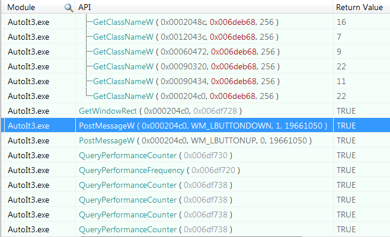

# Внедрение данных на уровне ОС

Главная задача любой ОС - это управление программными и аппаратными ресурсами компьютера, а также предоставление к ним доступа для запущенных процессов. Аппаратные ресурсы мы уже рассматривали. Это память, процессорное время, периферийные устройства. Примеры програмных ресурсов - примитивы синхронизации и алгоритмы, реализованные в системных библиотеках.

В этой книге мы будем рассматривать только ОС Windows. Под ней вы сможете запустить все приведённые примеры. В дальнейшем для простоты будем подразумевать Windows, когда говорим ОС.

Иллюстрация 2-1 демонстрирует, как ОС предоставляет доступ к своим ресурсам. Каждый запущенный процесс может обратиться к Windows для выполнения какого-то действия (например создание нового окна, отправки сетевого пакета, выделения дополнительной памяти и т.д.). Для каждого из этих действий у ОС есть соответствующая подрограмма. Подпрограммы, которые решают задачи из одной области (например работа с сетью), собраны в отдельные системные библиотеки. На иллюстрации приведены библиотеки *kernel32.dll*, *gdi32.dll* и другие.


**Иллюстрация 2-1.** *Доступ к ресурсам ОС через WinAPI*

Способ, которым процесс может вызвать системную подпрограмму, строго определён, хорошо задокументирован и остаётся неизменным для данной версии ОС. Такое взаимодействие можно сравнить с юридическим договором. Если процесс выполняет предварительные условия для вызова подпрограммы, ОС гарантирует указанный в документации результат. Такой договор называется **интерфейс прикладного программирования Windows** (Windwos API или WinAPI).

Программное обеспечение очень гибко и легко меняется, согласно возникающим требованиям. Например, каждое обновление Windows вносит изменения в некоторые детали реализации ОС (например какую-то системную библиотеку). Эти детали реализации связаны между собой (например одна библиотека вызывает подпрограммы другой). Таким образом, даже небольшое изменение может оказать значительное влияние на систему в целом. То же самое справедливо и для игрового приложения. Единственное, что позволяет програмному обеспечению работать в этом море  постоянных изменений - это надежные интерфейсы. Именно WinAPI гарантирует согласованное состояние системы и обеспечивает совместимость между новыми версиями ОС и приложения.

На иллюстрации 2-1 приведены два типа приложений. **Win32 приложение** взаимодействует с подмножеством системных библиотек через WinAPI интерфейс. Win32 - это историческое название которое возникло в первой 32-битной версии Windows (Windows NT). Библиотеки, доступные через WinAPI (также известные как **WinAPI библиотеки**), содержат **высокоуровневые подпрограммы**. Термин "высокоуровневый" означает, что подпрограмма оперирует сложными абстракциями, такими как окно, элемент управления, файл и т.д.

Второй тип приложений называется **нэйтив** (иногда переводится, как "родной"). Они взаимодействуют с более низкоуровневыми библиотеками Windows и ядром ОС через **нэйтив API** (Native API). Преимущество этих библиотек в том, что они становятся доступны на раннем этапе загрузки системы, когда многие функции ОС еще не работоспособны. Подпрограммы этих библиотек оперируют простыми абстракциями, такими как страница памяти, процесс, поток и т.д.

WinAPI библиотеки вызывают подпрограммы низкоуровневых библиотек. Такое подход позволяет создавать сложные абстракции из более простых. Низкоуровневые библиотеки в свою очередь вызывают функции ядра.

Драйвера предоставляют упрощенное представление устройств для системных библиотек. Это представление включает в себя набор подпрограмм, которые выполняют характерные для данного устройства действия. WinAPI и низкоуровневые библиотеки могут обратиться к этим подпрограммам через функции ядра.

**Уровень аппаратной абстракции** (Hardware Abstraction Layer или HAL) - эти специальная библиотека...

----

# OS Level Embedding Data

## Windows API

The main goal of OS is to manage software and hardware resources and to provide access to them for launched applications. Memory, CPU and peripheral devices are examples of hardware resources that are managed by OS. Examples of software resources are [**synchronization primitives**](https://en.wikipedia.org/wiki/Synchronization_primitive#Synchronization_in_Windows). Another example is algorithms implemented into the system libraries. Windows OS will be implied each time when we mention OS throughout the book.

This scheme illustrates how Windows provides access to its resources:


Every launched application can ask Windows to perform an action. For instance, a creation of a new window, drawing a line on the screen, sending a packet via a network, allocating memory, etc. All these actions are implemented in subroutines. Subroutines that solve tasks from one domain are gathered into separate system libraries. You can see "kernel32.dll", "gdi32.dll" and other system libraries in the scheme. 

The way application is calling a subroutine of OS is strictly defined, well documented and kept unchanged. This way of communication between applications and OS is called Windows Application Programming Interface (API) or Windows API (WinAPI). WinAPI is quite important to keep compatibility of new versions of applications and new versions of OS. We can compare WinAPI with special kind of contract. If application follows the contract, OS promises to perform its requests with certain results.

There are two kinds of applications pictured here. The **Win32 application** is an application that interacts with a subset of Windows libraries through WinAPI. Win32 is a historical name for this kind of applications that appears in the first 32-bit version of Windows (Windows NT). Libraries, that are available through WinAPI (also known as WinAPI libraries), provide high-level subroutines. The high-level term means that these subroutines operate with complex abstractions like window, control, file, etc.

The second kind of applications is native applications. These applications interact with underlying internal Windows libraries and [**kernel**](https://en.wikipedia.org/wiki/Kernel_%28operating_system%29) through [**Native API**](https://en.wikipedia.org/wiki/Native_API). The libraries become available during the stage of system boot when other components of OS are unavailable. Also, these libraries provide low-level subroutines. Low-level subroutines operate with simple abstractions like memory page, process, thread, etc.

WinAPI libraries use subroutines of internal libraries. This approach allows them to get complex abstractions as combination of simple ones. Implementation of internal libraries is based onto kernel functions that are available through the system calls. 

Device drivers provide a simplified representation of devices for the overlying libraries. This representation includes a set of subroutines which perform typical actions with a device. These subroutines are available for both WinAPI libraries and internal libraries through functions of a kernel.

[**Hardware Abstraction Layer**](https://en.wikipedia.org/wiki/Microsoft_Windows_library_files#Hal.dll) (HAL) is a library that provides an abstract representation of physical hardware. The main goal of this library is to simplify launching Windows on new hardware platforms. HAL provides subroutines with the hardware specific implementation for both device drivers and kernel. These subroutines allow developers to work with different hardware in the same way. The interface of these subroutines is kept unchanged. Also, the interface does not depend on the underlying hardware. Therefore, developers can minimize the changes in their source code to port Windows on new platforms.

## Keyboard Strokes Simulation

### Keystroke in Active Window

First of all, it will be useful to consider ways that are provided by AutoIt for keypress simulation. The most straightforward way of simulation is [`Send`](https://www.autoitscript.com/autoit3/docs/functions/Send.htm) function. You can find it in the list of [available functions](https://www.autoitscript.com/autoit3/docs/functions.htm).

Our test script presses the "a" key in running Notepad window. The script performs the following algorithm:

1. Find a Notepad window.
2. Switch to the Notepad window.
3. Simulate the "a" key press.

The script can find the Notepad window with the [`WinGetHandle`](https://www.autoitscript.com/autoit3/docs/functions/WinGetHandle.htm) function. The first parameter of the function can be either a title of a window, handle of a window or window class. But the most reliable way is to specify the class of Notepad window, which can be found the following way:

1. Open the `C:\Program Files (X86)\AutoIt3\Au3Info.exe` application. Installation path of AutoIt can be different in your case.
2. Drag-and-drop the sight of "Finder Tool" to the Notepad window.
3. You will get a result like this:


Information, that we are looking for, is specified in the "Class" field of the "Basic Window Info" block. Class of the Notepad window is "Notepad".

This is a [`Send.au3`](https://ellysh.gitbooks.io/video-game-bots/content/Examples/ClickerBots/OSLevelEmbeddingData/Send.au3) script that implements described key pressing algorithm with `Send` function:
```AutoIt
$hWnd = WinGetHandle("[CLASS:Notepad]")
WinActivate($hWnd)
Send("a")
```
In the first line, a Notepad window handle is found via the `WinGetHandle` function. The second line switches to the Notepad window with the `WinActivate` function. And the last line simulates the "a" key press. You can just put this code snippet into the file with `Send.au3` name and launch it by double click.

### AutoIt Send Function Internals

Actually, the `Send` function uses one of the WinAPI subroutines or functions. We can discover an exact WinAPI function that is used. API Monitor is a suitable tool to hook WinAPI calls performed by the script. We will rely on this tool in our research.

These are steps to monitor WinAPI calls that are performed by the `Send.au3` script:

1. Launch the API Monitor 32-bit application.
2. Find by the *Ctrl+F* hotkey and select the "Keyboard and Mouse Input" item of the "API Filter" sub-window.
3. Press *Ctrl+M* hotkey to open the "Monitor New Process" dialog.
4. Specify `C:\Program Files (x86)\AutoIt3\AutoIt3.exe` application in the "Process" field and click "OK" button.
5. Specify the `Send.au3` script in the opened "Run Script" dialog. The script will be launched after this action.
6. Find the 'a' text (with single quotes) in the "Summary" sub-window of the API Monitor application.

You will get a result similar to this:


`VkKeyScanW` is a function that explicitly receives the "a" character as a parameter. But it does not perform the key press simulation according to WinAPI documentation. Actually, `VkKeyScanW` and further `MapVirtualKeyW` function are used to prepare input parameters for the [`SendInput`](https://msdn.microsoft.com/en-us/library/windows/desktop/ms646310%28v=vs.85%29.aspx) WinAPI function, which finally performs keypress simulation.

Now we can try to implement the script, that presses "a" key in the Notepad window, through a direct interaction with WinAPI functions. The most important thing for the script is the way to simulate a keypress. Thus, usage of high-level `WinGetHandle` and `WinActivate` AutoIt function will be kept.

This is a [`SendInput.au3`](https://ellysh.gitbooks.io/video-game-bots/content/Examples/ClickerBots/OSLevelEmbeddingData/SendInput.au3) script that performs key press simulation through an interaction with WinAPI functions:
```AutoIt
$hWnd = WinGetHandle("[CLASS:Notepad]")
WinActivate($hWnd)

Const $KEYEVENTF_UNICODE = 4
Const $INPUT_KEYBOARD = 1
Const $iInputSize = 28

Const $tagKEYBDINPUT = _
    'word wVk;' & _
    'word wScan;' & _
    'dword dwFlags;' & _
    'dword time;' & _
    'ulong_ptr dwExtraInfo'
    
Const $tagINPUT = _
    'dword type;' & _
    $tagKEYBDINPUT & _
    ';dword pad;'

$tINPUTs = DllStructCreate($tagINPUT)
$pINPUTs = DllStructGetPtr($tINPUTs)
$iINPUTs = 1
$Key = AscW('a')

DllStructSetData($tINPUTs, 1, $INPUT_KEYBOARD)
DllStructSetData($tINPUTs, 3, $Key)
DllStructSetData($tINPUTs, 4, $KEYEVENTF_UNICODE)

DllCall('user32.dll', 'uint', 'SendInput', 'uint', $iINPUTs, _
        'ptr', $pINPUTs, 'int', $iInputSize)
```
We call `SendInput` WinAPI functions through the [`DllCall`](https://www.autoitscript.com/autoit3/docs/functions/DllCall.htm) AutoIt function here. You should pass a name of the library, a name of the called function, returned type and input parameters of the function to the `DllCall`. The most code lines of the `SendInput.au3` script prepares input parameters to call the `SendInput` WinAPI function.

The first parameter of the `SendInput` function is a number of [**structures**](https://en.wikipedia.org/wiki/Struct_%28C_programming_language%29). Structures have the [`INPUT`](https://msdn.microsoft.com/en-us/library/windows/desktop/ms646270%28v=vs.85%29.aspx) type. Only one structure is used in our script. Therefore, the `iINPUTs` variable equals to one.

The second parameter is a [**pointer**](https://en.wikipedia.org/wiki/Pointer_%28computer_programming%29) to the array of `INPUT` structures. This is also possible to pass a pointer to the single structure. We use the `tagINPUT` variable to represent fields of the structure according to the WinAPI documentation. Only two fields of the structure are important in our case. The first one has the `type` name and the second one has the [`KEYBDINPUT`](https://msdn.microsoft.com/en-us/library/windows/desktop/ms646271%28v=vs.85%29.aspx) type. You probably noticed that we have a situation of nested structures. The `INPUT` structure contains within itself the `KEYBDINPUT` one. The `tagKEYBDINPUT` variable is used for representing fields of the `KEYBDINPUT` structure. The `tagINPUT` variable is used to create a structure in the script memory by [`DllStructCreate`](https://www.autoitscript.com/autoit3/docs/functions/DllStructCreate.htm) call. Next step is receiving pointer of the created `INPUT` structure with the [`DllStructGetPtr`](https://www.autoitscript.com/autoit3/docs/functions/DllStructGetPtr.htm) function. And the last step is writing actual data to the `INPUT` structure with the [`DllStructSetData`](https://www.autoitscript.com/autoit3/docs/functions/DllStructSetData.htm) function.

Third parameter of the `SendInput` function is the size of the single `INPUT` structure. This is the constant that equals to 28 bytes in our case:
```
dword + (word + word + dword + dword + ulong_ptr) + dword =
4 + (2 + 2 + 4 + 4 + 8) + 4 = 28
```
The question is, why we need the last padding dword field in the `INPUT` structure? This is a definition of the `INPUT` structure:
```C++
typedef struct tagINPUT {
  DWORD type;
  union {
    MOUSEINPUT    mi;
    KEYBDINPUT    ki;
    HARDWAREINPUT hi;
  };
} INPUT, *PINPUT;
```
You can see the `union` C++ keyword here. This keyword means that one of the specified structures will be stored in this memory area. Therefore, amount of the reserved memory should be enough to store the biggest structure among the possible variants: `MOUSEINPUT`, `KEYBDINPUT` or `HARDWAREINPUT`. The biggest structure is `MOUSEINPUT`. It has dword extra field compared to `KEYBDINPUT` structure that is used in our case.

This script demonstrates the benefits that are provided by a high-level language such as AutoIt. The language hides from a developer a lot of inconsiderable details. This approach allows you to operate with simple abstractions and functions. Moreover, your applications become shorter and clearer.

### Keystroke in Inactive Window

The `Send` AutoIt function simulates a keystroke in an active window. It means that you cannot minimize or switch to background the window in which you want to simulate keystrokes. This is not suitable in some cases. AutoIt has a function called [`ControlSend`](https://www.autoitscript.com/autoit3/docs/functions/ControlSend.htm) that is useful in this situation.

We can rewrite our `Send.au3` script to use `ControlSend` function. This is a source of [`ControlSend.au3`](https://ellysh.gitbooks.io/video-game-bots/content/Examples/ClickerBots/OSLevelEmbeddingData/ControlSend.au3) script:
```AutoIt
$hWnd = WinGetHandle("[CLASS:Notepad]")
ControlSend($hWnd, "", "Edit1", "a")
```
You can see that now we should specify the control, which processes the keystroke. The control has an `Edit1` class in our case according to information from Au3Info tool. Instead of the class of control, you can specify its name or id.

We can use the API Monitor application to clarify the underlying WinAPI function that is called by `ControlSend` one. This is the [`SetKeyboardState`](https://msdn.microsoft.com/en-us/library/windows/desktop/ms646314%28v=vs.85%29.aspx) WinAPI function. You can try to rewrite our `ControlSend.au3` application to use `SetKeyboardState` function directly for an exercise.

But now we face a difficulty with sending keystrokes to the maximized DirectX window. The problem is, DirectX window does not have internal controls. Actually, simulation of keystrokes works correctly if you just skip the `controlID` parameter of the `ControlSend` function.

This is a [`ControlSendDirectx.au3`](https://ellysh.gitbooks.io/video-game-bots/content/Examples/ClickerBots/OSLevelEmbeddingData/ControlSendDirectx.au3) script that simulates the `a` keystroke in the inactive Warcraft III window:
```AutoIt
$hWnd = WinGetHandle("Warcraft III")
ControlSend($hWnd, "", "", "a")
```
You can see that we use the "Warcraft III" title of the window here to get its handle. Discovering this title is tricky because it is impossible to switch off fullscreen mode of the DirectX window in the most cases. The problem is tools like Au3Info do not give you any possibility to gather information from fullscreen windows. You can use an API Monitor application for this goal. Just move a mouse cursor on the desired process in the "Running Process" sub-window. This is a result of the Notepad application:


If the target process does not exist in the sub-window, you can try to enter into administrator mode of API Monitor application or to launch 32 or 64 version of API Monitor.

Some fullscreen windows have empty titles. You cannot select a window by title text in case if it is empty. Another way to do this is to select a window for its class. But API Monitor does not provide information about a class of the window.

This is a [`GetWindowTitle.au3`](https://ellysh.gitbooks.io/video-game-bots/content/Examples/ClickerBots/OSLevelEmbeddingData/GetWindowTitle.au3) script that shows you a message with title text and class of currently active window:
```AutoIt
#include <WinAPI.au3>

Sleep(5 * 1000)
$handle = WinGetHandle('[Active]')
MsgBox(0, "", "Title   : " & WinGetTitle($handle) & @CRLF _
       & "Class : " & _WinAPI_GetClassName($handle))
```
The first line of the script contains the [`include`](https://www.autoitscript.com/autoit3/docs/keywords/include.htm) keyword. It allows you to append a specified file to the current script. The `WinAPI.au3` file contains a definition of the [`_WinAPI_GetClassName`](https://www.autoitscript.com/autoit3/docs/libfunctions/_WinAPI_GetClassName.htm) function. The function provides a class of the specified window. There is a five seconds delay after starting the script, which is achieved by calling [`Sleep`](https://www.autoitscript.com/autoit3/docs/functions/Sleep.htm) function.
You should switch to the target fullscreen window during this delay. Then a handle of the currently active window is saved into the `handle` variable. The last function called [`MsgBox`](https://www.autoitscript.com/autoit3/docs/functions/MsgBox.htm) simply shows a message with results.

## Mouse Simulation

Simulation of keyboard strokes is enough for controlling player's character in some games. But most of the modern video games have complex control. Both keyboard and mouse devices are used there. AutoIt language has several functions that allow you to simulate typical mouse actions like clicking, moving and holding mouse button pressed. Now we consider these functions.

### Mouse Actions in Active Window

We will use the standard Microsoft Paint application to test our mouse simulation scripts. This is a [`MouseClick.au3`](https://ellysh.gitbooks.io/video-game-bots/content/Examples/ClickerBots/OSLevelEmbeddingData/MouseClick.au3) script that simulates mouse click in the active Paint window:
```AutoIt
$hWnd = WinGetHandle("[CLASS:MSPaintApp]")
WinActivate($hWnd)
MouseClick("left", 250, 300)
```
You should launch the Paint application, switch to the "Brushes" tool, and launch the "MouseClick.au3" script. The script draws a black dot at the point with coordinates x=250 and y=300. The ColorPix application, which has been mentioned in the [Tools](tools.md) section, will help you to check a correctness of the coordinates. The [`MouseClick`](https://www.autoitscript.com/autoit3/docs/functions/MouseClick.htm) AutoIt function is used here and it has the following parameters:

1. Mouse button (left, right, middle, etc).
2. Click coordinates.
3. A number of clicks.
4. Move speed.

The [`mouse_event`](https://msdn.microsoft.com/en-us/library/windows/desktop/ms646260%28v=vs.85%29.aspx) WinAPI function is used by `MouseClick` one.

You can specify coordinates of mouse actions in one of three possible modes. This is a list of these modes:

| Mode | Description |
| -- | -- |
| 0 | Relative coordinates to the active window |
| 1 | Absolute screen coordinates. This mode is used by default. |
| 2 | Relative coordinates to the client area of the active window |

This screenshot illustrates all these modes:


Each titled number corresponds to the mouse coordinate mode. For example, the dot number "0" has coordinates relative to the active window. The "x" and "y" letters, which are indexed by "0", are corresponding coordinates of this dot.

You can select a mode of coordinates with `MouseCoordMode` parameter of the [`Opt`](https://www.autoitscript.com/autoit3/docs/functions/AutoItSetOption.htm) AutoIt function. This is a modified `MouseClick.au3` script that will use relative coordinates to client area of the active window:
```AutoIt
Opt("MouseCoordMode", 2)
$hWnd = WinGetHandle("[CLASS:MSPaintApp]")
WinActivate($hWnd)
MouseClick("left", 250, 300)
```
This script draws a black dot in the Paint window. Coordinates of this dot differ from the coordinates of the dot that we have got before the script modification. 

The mode with relative coordinates to the client area provides more precise positioning for simulation of mouse actions. It is recommended to use this mode for clicker bots. This mode works well for both normal and full-screen windows. However, it will be difficult to check the correctness of your script with tools like ColorPix, since it works with absolute coordinates.

Drag and drop is a common action in video games. AutoIt provides a [`MouseClickDrag`](https://www.autoitscript.com/autoit3/docs/functions/MouseClickDrag.htm) function that simulates this action. This is a [`MouseClickDrag.au3`](https://ellysh.gitbooks.io/video-game-bots/content/Examples/ClickerBots/OSLevelEmbeddingData/MouseClickDrag.au3) script that demonstrates a work of the `MouseClickDrag` function:
```AutoIt
$hWnd = WinGetHandle("[CLASS:MSPaintApp]")
WinActivate($hWnd)
MouseClickDrag("left", 250, 300, 400, 500)
```
When you launch this script, you will see a drawn line in the Paint window. Line starts at the point with absolute coordinates equal to x=250 and y=300. The line ends at the point with Coordinates x=400 and y=500. The `MouseClickDrag` AutoIt function uses the same `mouse_event` WinAPI function internally. Both `MouseClick` and `MouseClickDrag` AutoIt functions perform mouse actions in the currently active window.

### Mouse Actions in Inactive Window

AutoIt provides [ControlClick.htm](https://www.autoitscript.com/autoit3/docs/functions/ControlClick.htm) function that allows you to simulate a mouse click in inactive window. This is a [`ControlClick.au3`](https://ellysh.gitbooks.io/video-game-bots/content/Examples/ClickerBots/OSLevelEmbeddingData/ControlClick.au3) script for example:
```AutoIt
$hWnd = WinGetHandle("[CLASS:MSPaintApp]")
ControlClick($hWnd, "", "Afx:00000000FFC20000:81", "left", 1, 250, 300)
```
It performs a mouse click inside the inactive or minimized Paint window. The `ControlClick` function is very similar to `ControlSend` one. You should specify the control where the mouse click is simulated. The control of the Paint window, which is used for drawing, has the `Afx:00000000FFC20000:81` class according to information gathered by the Au3Info tool.

If you pass the same coordinates as input parameters for both `MouseClick` and `ControlClick` functions, mouse click actions, which are simulated by the functions, have different coordinates. The coordinates, which are passed to the `ControlClick` function, are relative coordinates to the target control where the mouse click is performed. This means that simulation of a mouse click in our example occurs at the point with x=250 and y=300 coordinates that are relative to the left-up corner of the control for drawing. On the other hand, mode of the coordinates, which is passed to the `MouseClick` function, is defined by the `MouseCoordMode` AutoIt option.

The `ControlClick` AutoIt function performs two calls of the [`PostMessageW`](https://msdn.microsoft.com/en-us/library/windows/desktop/ms644944%28v=vs.85%29.aspx) WinAPI function internally:



The first call of the `PostMessageW` function has the `WM_LBUTTONDOWN` input parameter. This call allows us to simulate the mouse button down the action. The second call has the `WM_LBUTTONUP` parameter to simulate the mouse button up action.

The `ControlClick` function works very unreliable with minimized DirectX windows. Some of tested by me applications just ignore this simulation of mouse actions. Other applications process these actions only after activation of their window. It means that minimized DirectX application hangs until it is not restored to the normal mode again.

## Summary

We have considered AutoIt functions that allow us to simulate typical keyboard and mouse actions in some game window. There are two types of these functions. The first type allows us to simulate actions in active windows only. The second type of functions works with both active and inactive (or minimized) windows. The primary drawback of the second type of functions is low reliability. Therefore, it is recommended to use the first type of functions for development of bot applications.
