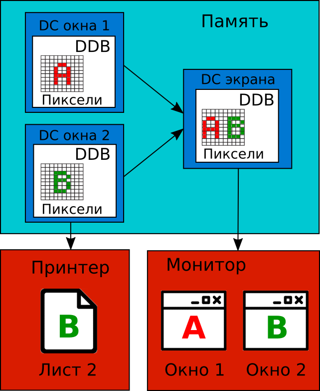
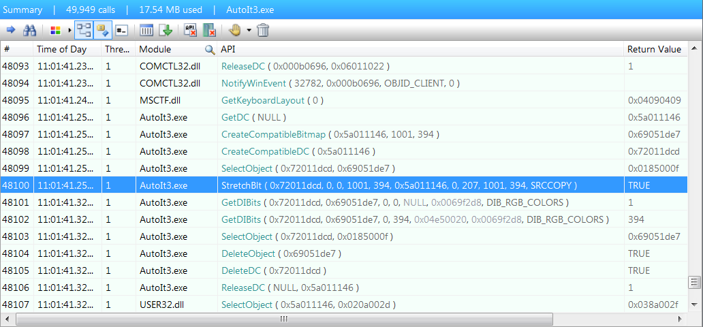
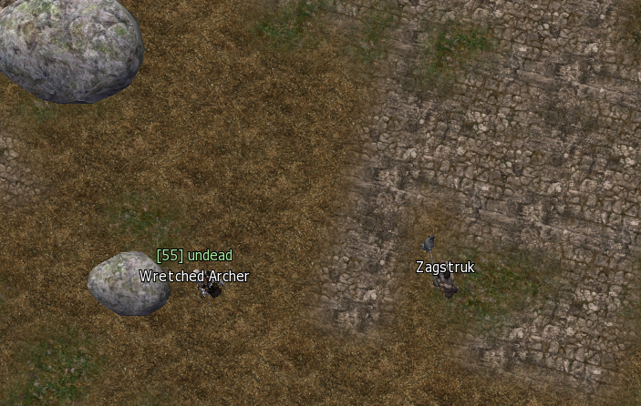

# Перехват устройств вывода

В этом разделе мы познакомимся с методами перехвата данных с устройств вывода. Сначала мы изучим, какие возможности Windows предоставляет приложениям для работы с этими устройствами. Затем рассмотрим способы перехвата выводимых на них изображений.

## Интерфейс графических устройств Windows

[**Интерфейс графических устройств**](https://ru.wikipedia.org/wiki/GDI) (Graphics Device Interface или GDI) – один из основных компонентов Windows, который отвечает за представление графических объектов и передачу их на устройства вывода. Обычно все элементы интерфейса окна приложения конструируются с использованием графических объектов, таких как **контекст устройства** (device context или DC), **битовое изображение** (bitmap), кисти, цвета, шрифты.

Ключевая концепция GDI – это контекст устройства. Он представляет собой абстракцию, благодаря которой разработчики могут единообразно работать с графическими объектами независимо от устройства вывода (монитором, принтером, плоттером или графопостроителем и т.д). Сначала все операции по подготовке изображения выполняются над контекстом устройства в памяти. Затем готовый результат отправляется на устройство вывода.

На иллюстрации 2-7 приведены два контекста устройств, которые содержат изображения окон двух приложений A и B. Так же на ней представлен DC, соответствующий итоговому изображению всего рабочего стола. ОС может собрать это изображение из всех видимых окон и визуальных элементов рабочего стола (например панели задач). Когда контекст устройства подготовлен в памяти, ОС выводит его содержимое на экран.



***Иллюстрация 2-7.** Отображение графических объектов на устройства вывода*

Предположим, вам нужно напечатать документ, открытый в текстовом редакторе (окно B). В этом случае ОС просто отправляет DC окна этого приложения на принтер. Контексты устройств, связанные с другими открытыми в данный момент окнами игнорируются.

Контекст устройства представляет собой структуру в памяти. Разработчики могу работать с ней только через WinAPI функции. Каждый DC содержит [**аппаратно-зависимое битовое изображение**](https://ru.wikipedia.org/wiki/BMP#DIB_%D0%B8_DDB) (Device Depended Bitmap или DDB). Битовое изображение – это представление поверхности для рисования в памяти. Все операции над графическими объектами в контексте устройства отражаются на соответствующем битовом изображении. Следовательно, оно хранит результат всех этих операций.

Битовое изображение состоит из двух основных частей:

1. Массив битов, описывающих наименьшие логические элементы изображения, которые называются [**пикселями**](https://ru.wikipedia.org/wiki/%D0%9F%D0%B8%D0%BA%D1%81%D0%B5%D0%BB%D1%8C).

2. Метаинформация.

У каждого пикселя есть два параметра: координаты и цвет. Их соответствие задаётся двумерным массивом. Номера элементов массива (индексы) равны координатам пикселя по осям X и Y. Числовое значение элемента массива соответствует коду цвета в палитре, которая связана с данным битовым изображением. Для анализа изображения все элементы двумерного массива должны обрабатываться последовательно.

Когда изображение подготовлено в контексте устройства, оно передается на настоящее устройство вывода. Как правило, функции системных библиотек выполняют необходимые преобразования изображения. Например, библиотека `vga.dll` подготавливает его для вывода на экран. Благодаря им, драйвер устройства получает картинку в удобном для него формате.

## Функции AutoIt для анализа изображений

AutoIt предоставляет функции для анализа текущего изображения на экране. Все они оперируют объектами GDI. Сейчас мы подробно рассмотрим эти функции.

### Анализ отдельного пикселя

Самая простая операция при анализе изображения – это чтение цвета одного пикселя. Для этого необходимо знать его координаты. AutoIt поддерживает несколько режимов координат, которые представлены в таблице 2-3. Они идентичны режимам координат позиционирования курсора мыши из таблицы 2-2.

***Таблица 2-3.** Режимы координат функций анализа изображений AutoIt*

| Режим | Описание |
| --- | --- |
| 0 | Координаты относительно левой верхней точки активного окна. |
| 1 | Абсолютные координаты экрана. Это режим по умолчанию. |
| 2 | Координаты относительно левой верхней точки клиентской части окна (без заголовка, меню и границ). |

Выбрать нужный режим координат можно с помощью функции `Opt`, вызванной с первым параметром `PixelCoordMode`. Например, следующий вызов переключает скрипт во второй режим:
```
Opt("PixelCoordMode", 2)
```
Функция AutoIt `PixelGetColor` читает цвет пикселя. Входными параметрами она принимает координаты X и Y пикселя. Функция возвращает код цвета в **десятичной системе счисления**. Листинг 2-10 демонстрирует её использование.

***Листинг 2-10.** Скрипт `PixelGetColor.au3`*
```AutoIt
$color = PixelGetColor(200, 200)
MsgBox(0, "", "Цвет пикселя: " & Hex($color, 6))
```
Скрипт `PixelGetColor.au3` читает цвет пикселя с координатами x = 200, y = 200. После этого функция `MsgBox` выводит диалоговое окно с результатом. После запуска скрипта, вы увидите сообщение вроде: "Цвет пикселя 0355BB".

Цвет кодируется числом 0355BB в [**шестнадцатеричной системе счисления**](https://ru.wikipedia.org/wiki/%D0%A8%D0%B5%D1%81%D1%82%D0%BD%D0%B0%D0%B4%D1%86%D0%B0%D1%82%D0%B5%D1%80%D0%B8%D1%87%D0%BD%D0%B0%D1%8F_%D1%81%D0%B8%D1%81%D1%82%D0%B5%D0%BC%D0%B0_%D1%81%D1%87%D0%B8%D1%81%D0%BB%D0%B5%D0%BD%D0%B8%D1%8F). Такое представление широко распространено и называется [**цветовой моделью RGB**](https://ru.wikipedia.org/wiki/RGB). В ней любой цвет представляется координатами в трёхмерном [**цветовом пространстве**](https://ru.wikipedia.org/wiki/%D0%A6%D0%B2%D0%B5%D1%82%D0%BE%D0%B2%D0%BE%D0%B5_%D0%BF%D1%80%D0%BE%D1%81%D1%82%D1%80%D0%B0%D0%BD%D1%81%D1%82%D0%B2%D0%BE). Трём его осям соответствуют цвета: X – красный (Red), Y – зеленый (Green) и Z – синий (Blue). Таким образом цвет 0355BB из нашего примера соответствует точки с координатами: X = 03, Y = 55, Z = BB. Большинство графических редакторов и утилит используют этот способ кодирования.

Если вы переместите окно Notepad так, чтобы перекрыть им точку с координатой x = 200, y = 200 рабочего стола, результат возвращаемый скриптом `PixelGetColor.au3` изменится. Это означает, что он анализирует не конкретное окно, а изображение всего рабочего стола.

Иллюстрация 2-8 демонстрирует перехваченные WinAPI вызовы скрипта `PixelGetColor.au3`.


***Иллюстрация 2-8.** WinAPI вызовы скрипта `PixelGetColor.au3`*

Функция `PixelGetColor` делает внутри себя три WinAPI вызова в следующей последовательности: `GetDC`, `GetPixel`, `ReleaseDC`. `GetDC` получает входным параметром значение "NULL". Таким образом мы выбираем контекст устройства всего экрана для дальнейших операций. Если мы передадим в функцию `GetDC` дескриптор окна, мы получим DC его клиентской области. Таким образом наш скрипт сможет анализировать неактивные или перекрытые окна.

Дескриптор окна можно передать третьим параметром в AutoIt функцию `PixelGetColor`. Листинг 2-11 демонстрирует это решение.

***Листинг 2-11.** Скрипт `PixelGetColorWindow.au3`*
```AutoIt
$hWnd = WinGetHandle("[CLASS:MSPaintApp]")
$color = PixelGetColor(200, 200, $hWnd)
MsgBox(0, "", "Цвет пикселя: " & Hex($color, 6))
```
Скрипт `PixelGetColorWindow.au3` должен вернуть цвет пикселя в окне Paint, даже если оно неактивно. Мы ожидаем прочитать белый цвет с кодом "FFFFFF", потому что область для рисования по умолчанию пуста.

Скрипт работает корректно, если окно Paint активно. Теперь попробуем перекрыть его окном другого приложения (например интерпретатором командной строки CMD). Скрипт прочитает чёрный цвет вместо белого.

Сравним WinAPI вызовы скриптов `PixelGetColorWindow.au3` и `PixelGetColor.au3`, перехваченные с помощью приложения API Monitor. В обоих случаях функция `GetDC` получает "NULL" входным параметром. Такое поведение похоже на ошибку в реализации функции `PixelGetColor` версии 3.3.14.1 AutoIt. Возможно, она будет исправлена в следующий версиях. Попробуем эту ошибку обойти.

Проблема функции `PixelGetColor` в некорректном параметре при вызове `GetDC`. Мы знаем, к каким WinAPI функциям обращается `PixelGetColor`. Поэтому можем вызвать их напрямую из нашего скрипта, но с корректными параметрами. Результат приведен в листинге 2-12.

***Листинг 2-12.** Скрипт `GetPixel.au3`*
```AutoIt
#include <WinAPIGdi.au3>

$hWnd = WinGetHandle("[CLASS:MSPaintApp]")
$hDC = _WinAPI_GetDC($hWnd)
$color = _WinAPI_GetPixel($hDC, 200, 200)
MsgBox(0, "", "Цвет пикселя: " & Hex($color, 6))
```
Скрипт `GetPixel.au3` начинается с ключевого слова `include`. С его помощью мы включаем файл `WinAPIGdi.au3`, который содержит обертки `_WinAPI_GetDC` и `_WinAPI_GetPixel` для соответствующих WinAPI функций. Этот скрипт читает цвет пикселя окна Paint, независимо от того перекрыто оно или нет.

У рассмотренного нами решения есть одна проблема. Если вы свернёте окно Paint и запустите скрипт, он вернёт белый цвет. Этот результат выглядит корректным. Теперь попробуем изменить цвет рабочей области Paint, залив её для примера красным. Свернём окно снова, и запустим скрипт. Он опять прочитает белый цвет, хотя мы ожидаем красный. Рассмотрим, почему это происходит.

У каждого окна есть клиентская область. В этой области находятся все элементы интерфейса кроме заголовка окна, его границ и главного меню. Наша проблема с чтением цвета пикселя возникла из-за того, что размер клиентской области свернутого окна равен нулю. Следовательно, контекст устройства, связанный с окном, имеет пустое битовое изображение. При попытке чтения несуществующего пикселя, функция WinAPI `GetPixel` возвращает белый цвет.

Мы можем прочитать размер клиентской области окна с помощью скрипта, представленного в листинге 2-13.

***Листинг 2-13.** Скрипт `GetClientRect.au3`*
```AutoIt
#include <WinAPI.au3>

$hWnd = WinGetHandle("[CLASS:MSPaintApp]")
$tRECT = _WinAPI_GetClientRect($hWnd)
MsgBox(0, "Прямоугольник", _
            "Левый край: " & DllStructGetData($tRECT, "Left") & @CRLF & _
            "Правый край: " & DllStructGetData($tRECT, "Right") & @CRLF & _
            "Верхний край: " & DllStructGetData($tRECT, "Top") & @CRLF & _
            "Нижний край: " & DllStructGetData($tRECT, "Bottom"))
```
Скрипт `GetClientRect.au3` выводит X и Y координаты верхней левой и правой нижней точки клиентской области окна Paint. Если оно свёрнуто, все координаты равны нулю. В противном случае мы получим ненулевые числа.

Ограничение при работе со свёрнутым окном крайне неудобно, если вы планируете запускать бота и переключаться на другие приложения. У этой проблемы есть решение. Windows позволяет восстановить свернутое окно в прозрачном режиме. После этого можно скопировать битовое изображение его клиентской области в DC, связанный с оперативной памятью, и свернуть окно снова. Для копирования можно воспользоваться WinAPI функцией `PrintWindow`. После можно анализировать копию с помощью известной нам AutoIt обертки `_WinAPI_GetPixel`.

Следующая [статья](https://www.codeproject.com/Articles/20651/Capturing-Minimized-Window-A-Kid-s-Trick) подробно рассматривает работу со свёрнутыми окнами.

### Анализ изменений картинки

Мы рассмотрели методы чтения цвета отдельно взятого пикселя. Однако, в большинстве случаев точные координаты нужного пикселя в окне игрового приложения неизвестны. Причина этого в том, что мы имеем не статическую картинку, а изображения движущихся игровых объектов. Следовательно, мы должны найти способ анализа изменений на экране. AutoIt предоставляет несколько функций, подходящих для решения этой задачи.

Предположим, что мы ищем конкретный игровой объект на экране. Мы знаем его цвет, но не координаты. Эта задача является обратной той, которую решает функция AutoIt `PixelGetColor`. Для поиска координат игрового объекта по его цвету можно воспользоваться функцией `PixelSearch`. Листинг 2-14 демонстрирует пример.

***Листинг 2-14.** Скрипт `PixelSearch.au3`*
```AutoIt
$coord = PixelSearch(0, 207, 1000, 600, 0x000000)
If @error = 0 then
    MsgBox(0, "", "Координата чёрной точки: x = " & $coord[0] & " y = " &
$coord[1])
else
    MsgBox(0, "", "Чёрная точка не найдена")
endif
```
Скрипт `PixelSearch.au3` ищет пиксель чёрного цвета с кодом 000000 в прямоугольной области экрана с координатами верхнего левого угла x = 0, y = 207 и правого нижнего – x = 1000, y = 600. Если в процессе поиска происходит ошибка, мы обрабатываем её с помощью **макроса** `@error`. В этом случае выводится сообщение: "Чёрная точка не найдена".

Макрос `@error` можно рассматривать, как глобальную переменную. Если в процессе работы AutoIt функции происходит ошибка, её код будет записан в `@error`. При обработке ошибки важно проверять макрос сразу после вызова функции, поскольку последующие вызовы могут переписать его значение.

Воспользуемся приложением Paint, чтобы протестировать скрипт `PixelSearch.au3`. Сначала поставим чёрную точку с помощью карандаша или кисти в области для рисования. Затем запустим скрипт. Он выведет координаты точки в диалоговом окне. Если этого не произошло, убедитесь, что Paint не перекрывают другие окна.

Проверим, какие WinAPI вызовы делает функция `PixelSearch`. Для этого запустим скрипт `PixelSearch.au3` из приложения API Monitor. Подождём, пока он отработает. После этого будем искать текст "0, 207" (координаты точки) в окне "Summary". Вы должны найти вызов WinAPI `StretchBlt`, как показано на иллюстрации 2-9.



***Иллюстрация 2-9.** WinAPI вызовы функции PixelSearch*

Функция `StretchBlt` копирует битовое изображение из DC экрана в контекст устройства памяти, который также известен как **совместимый контекст устройства** (compatible device context). Чтобы проверить это предположение, сравним входные параметры вызовов `GetDC`, `CreateCompatibleBitmap`, `CreateCompatibleDC`, `SelectObject` и `StretchBlt` в окне API Monitor.

Функция `GetDC` возвращает дескриптор DC экрана, который в нашем случае равен 0x5a011146. Что означает это шестнадцатеричное число? Воспользуемся документацией WinAPI, чтобы уточнить определение типа `HDC`, соответствующее дескриптору DC:
```C++
typedef void *PVOID;
typedef PVOID HANDLE;
typedef HANDLE HDC;
```
`HDC` представляет собой указатель на область памяти. Следовательно, 0x5a011146 – это адрес памяти, где хранится дескриптор.

Вызов `CreateCompatibleBitmap` идёт после `GetDC`. Он создаёт битовое изображение для работы над ним в памяти. Первым входным параметром `CreateCompatibleBitmap` принимает дескриптор DC экрана. Далее с помощью `CreateCompatibleDC` создаётся совместимый контекст устройства. Вызовом `SelectObject` в него загружается битовое изображение. После этого вызов `StretchBlt` может выполнить копирование изображения из контекста экрана (дескриптор 0x5a011146) в совместимый DC в памяти.

На следующем шаге AutoIt функции `PixelSearch` происходит WinAPI вызов `GetDIBits`. Он конвертирует аппаратно-зависимое битовое изображение (DDB) в **аппаратно-независимое** (DIB). Зачем это нужно? DIB формат более удобен, поскольку позволяет работать с изображениями как с обычным массивом.

Заключительный шаг функции `PixelSearch` – проход по всем пикселям DIB и сравнение цвета каждого из них с заданным. Для этой операции вызовы WinAPI не нужны.

Пример C++ реализации захвата изображений с экрана доступен в WinAPI [документации](https://docs.microsoft.com/en-us/windows/win32/gdi/capturing-an-image). Эта реализация демонстрирует копирование битового изображения в совместимый DC и преобразование DDB в DIB.

У функции `PixelSearch` есть необязательный пятый параметр, через который можно передать дескриптор окна. В этом случае поиск пикселя происходит именно в нём. Если параметр не указан, функция ищет на всём экране.

Листинг 2-15 демонстрирует поиск пикселя в заданном окне.

***Листинг 2-15.** Скрипт `PixelSearchWindow.au3`*
```AutoIt
$hWnd = WinGetHandle("[CLASS:MSPaintApp]")
$coord = PixelSearch(0, 207, 1000, 600, 0x000000, 0, 1, $hWnd)
If @error = 0 then
    MsgBox(0, "", "Координата чёрной точки: x = " & $coord[0] & " y = " &
$coord[1])
else
    MsgBox(0, "", "Чёрная точка не найдена")
endif
```
Согласно документации AutoIt, скрипт `PixelSearchWindow.au3` должен искать пиксель в перекрытом окне Paint, но этого не происходит. Похоже, что мы снова столкнулись с ошибкой, которая проявлялась ранее в функции `PixelGetColor`. API Monitor подтвердит, что в WinAPI вызов `GetDC` снова передается "NULL" вместо дескриптора окна. По этой причине `PixelSearch` всегда обрабатывает DC экрана, независимо от своего пятого параметра. Вы можете обойти эту ошибку, если будете работать с WinAPI напрямую. Пример аналогичного решения приведён в листинге 2-12. В этом случае вам необходимо полностью повторить алгоритм функции `PixelSearch`.

`PixelChecksum` – это ещё одна функция AutoIt для анализа движущихся изображений. Рассмотренные нами ранее функции `PixelGetColor` и `PixelSearch` позволяют получить информацию о единственном пикселе. `PixelChecksum` работает иначе. Она обнаруживает изменение изображения в заданной области экрана. Это может быть полезно, когда бот должен реагировать на игровые события.

Функция `PixelChecksum` рассчитывает [**контрольную сумму**](https://ru.wikipedia.org/wiki/%D0%9A%D0%BE%D0%BD%D1%82%D1%80%D0%BE%D0%BB%D1%8C%D0%BD%D0%B0%D1%8F_%D1%81%D1%83%D0%BC%D0%BC%D0%B0) (checksum) для пикселей в указанной области. Эта сумма представляет собой число, полученное в результате применения определённого алгоритма к набору данных. Простейшим примером такого алгоритма может быть суммирование кодов цветов пикселей. Если цвет хотя бы одного пикселя поменяется, результирующая контрольная сумма также изменится.

Листинг 2-16 демонстрирует применение функции `PixelChecksum`.

***Листинг 2-16.** Скрипт `PixelChecksum.au3`*
```AutoIt
$checkSum = PixelChecksum(0, 0, 50, 50)
while $checkSum = PixelChecksum(0, 0, 50, 50)
    Sleep(100)
wend
MsgBox(0, "", "Изображение в области экрана изменилось")
```
Скрипт `PixelChecksum.au3` выводит диалоговое окно, если меняется изображение в области экрана между точками с координатами x = 0, y = 0 и x = 50, y = 50. В скрипте многократно вызывается функция `PixelChecksum`. Первый раз она вычисляет начальное значение контрольной суммы. После этого функция вызывается каждые 100 миллисекунд в цикле `while`. Временная задержка выполняется с помощью вызова `Sleep`. Цикл продолжается до тех пор, пока контрольная сумма не изменится. Как только это происходит, цикл прерывается и выводится диалоговое окно.

Рассмотрим внутренние вызовы функции `PixelChecksum`. API Monitor покажет нам ту же самую последовательность WinAPI вызовов, что и для функции `PixelSearch`. Это означает, что AutoIt следует одному и тому же алгоритму для получения DIB из изображения на экране. Однако, последний шаг этих двух функций отличается. `PixelChecksum` вычисляет контрольную сумму по указанному алгоритму. Вы можете выбрать один из двух доступных алгоритмов: **ADLER** или **CRC32**. Рассмотрим их различия.

Любой алгоритм расчёта контрольных сумм имеет **коллизии**. Коллизия – это два разных набора входных данных, для которых функция возвращает одинаковый результат. Алгоритмы предлагаемые AutoIt отличаются скоростью и надежностью. CRC32 работает медленнее чем ADLER, но имеет меньше коллизий. Следовательно, надёжность CRC32 выше, и использующий его бот будет реже ошибаться.

Все рассмотренные AutoIt функции для анализа пикселей работают в полноэкранных окнах DirectX приложений. Вы можете использовать их для разработки своих ботов без каких либо ограничений.

## Библиотеки для анализа изображений

Мы рассмотрели средства AutoIt для анализа изображений на экране. Кроме них есть более мощные функции, предоставляемые сторонними библиотеками. Рассмотрим их подробнее.

### Библиотека FastFind

Библиотека FastFind предоставляет мощные функции для анализа изображений, которые хорошо подходят для поиска игровых объектов на экране. Эти функции доступны как из AutoIt скриптов, так и из C++ приложений.

Для вызова функции библиотеки из AutoIt скрипта выполните следующие шаги:

1. Создайте отдельную папку для вашего скрипта. Для примера назовём её `FFDemo`.

2. Скопируйте файл `FastFind.au3` из архива FastFind библиотеки в папку `FFDemo`.

3. Скопируйте также один из файлов `FastFind.dll` или `FastFind64.dll`. Если вы работаете на 64-битной версии Windows, вам нужен файл `FastFind64.dll`, иначе – `FastFind.dll`.

4. Включите файл `FastFind.au3` в ваш скрипт с помощью `include`:
```AutoIt
#include "FastFind.au3"
```

Теперь вы можете вызывать функции FastFind в своём скрипте.

Для работы с функциями библиотеки из C++ приложения сделайте следующее:

1. Скачайте и установите C++ компилятор. Это может быть IDE **Visual Studio Community** с сайта Microsoft, в которую уже встроен компилятор. Альтернативным решением является набор инструментов [**MinGW**](https://nuwen.net/mingw.html).

2. Если вы используете MinGW, создайте файл с исходным кодом (например `test.cpp`). В случае Visual Studio, создайте проект "Win32 Console Application".

3. Скопируйте код из листинга 2-17 в свой CPP файл.

4. Скопируйте из архива библиотеки файл `FastFind.dll` в папку вашего проекта. `FastFind64.dll` следует копировать только в том случае, если вы собираетесь компилировать 64-битные исполняемые файлы.

5. Если вы используете MinGW, создайте файл с именем `Makefile` и следующим содержанием:
```Makefile
all:
    g++ test.cpp -o test.exe
```

6. В случае использования MinGW, скомпилируйте приложение с помощью команды `make`, запущенной в командной строке CMD. Для Visual Studio достаточно нажать горячую клавишу F7.

***Листинг 2-17.** Файл `test.cpp`*
```С++
#include <iostream>

#define WIN32_LEAN_AND_MEAN
#include <windows.h>

using namespace std;

typedef LPCTSTR(CALLBACK* LPFNDLLFUNC1)(void);

HINSTANCE hDLL;               // Дескриптор DLL библиотеки
LPFNDLLFUNC1 lpfnDllFunc1;    // Указатель на функцию
LPCTSTR uReturnVal;

int main()
{
    hDLL = LoadLibraryA("FastFind");
    if (hDLL != NULL)
    {
        lpfnDllFunc1 = (LPFNDLLFUNC1)GetProcAddress(hDLL, "FFVersion");

        if (!lpfnDllFunc1)
        {
            // Обработка ошибки
            FreeLibrary(hDLL);
            cout << "error" << endl;
            return 1;
        }
        else
        {
            // Вызов функции
            uReturnVal = lpfnDllFunc1();
            cout << "version = " << uReturnVal << endl;
        }
    }
    return 0;
}
```
После компиляции вы получите исполняемый EXE файл. Запустив его, вы увидите вывод версии библиотеки FastFind в консоль:
```
version = 2.2
```
В нашем примере мы использовали **явную компоновку библиотеки** (explicit library linking) для доступа к её функциям. Также возможно альтернативное решение – **неявная компоновка библиотеки** (implicit library linking). Вы можете применять любой подход для работы с FastFind. Но во втором случае вам придётся использовать тот же компилятор C++ (желательно и той же версии), что и разработчики FastFind.

Какие задачи мы сможем решить с помощью библиотеки? Прежде всего, у нас появился более надёжный метод поиска игрового объекта. Функция `FFBestSpot` ищет область экрана, которая содержит максимальное число пикселей заданного цвета. Рассмотрим пример её использования.

На иллюстрации 2-10 приведён снимок экрана (или **скриншот**) популярной MMORPG игры Lineage 2. На нём вы видите модели двух персонажей. В правой части расположен персонаж игрока с именем "Zagstruk". Слева от него находится монстр "Wretched Archer". Чтобы определить его координаты, применим функцию `FFBestSpot`.

Сначала нам нужно выбрать подходящий цвет для поиска. Лучше всего для этой цели подойдёт цвет текста над персонажами. При их перемещении, эти надписи не меняют свою геометрию. Также они не зависят от световых эффектов, приближении и угла поворота камеры. В этом случае поиск функцией `FFBestSpot` будет достаточно надёжным. Монстр, в отличие от игрока, имеет дополнительный текст зелёного цвета. Именно его мы и будем искать.



***Иллюстрация 2-10.** Скриншот известной MMORPG игры Lineage 2*

В некоторых случаях для поиска у нас нет статичных элементов интерфейса таких, как надписи над игровыми объектами. Тогда приходится искать модели персонажей. Функция `FFBestSpot` может оказаться недостаточно надёжной для этой задачи и часто давать ошибочный результат. Причина заключается в том, что тени и световые эффекты могут менять цвета моделей.

Листинг 2-18 демонстрирует поиск текста зелёного цвета с помощью функции `FFBestSpot`.

***Листинг 2-18.** Скрипт `FFBestSpot.au3`*
```AutoIt
#include "FastFind.au3"

Sleep(5 * 1000)

const $sizeSearch = 80
const $minNbPixel = 50
const $optNbPixel = 200
const $posX = 700
const $posY = 380

$coords = FFBestSpot($sizeSearch, $minNbPixel, $optNbPixel, $posX, $posY, _
                     0xA9E89C, 10)

if not @error then
    MsgBox(0, "Coords", $coords[0] & ", " & $coords[1])
else
    MsgBox(0, "Coords", "Текст не найден")
endif
```
Если вы запустите скрипт `FFBestSpot.au3` и переключитесь на окно с иллюстрацией 2-10, появится диалоговое окно с координатами текста. После старта, скрипт ждёт пять секунд, в течении которых вы должны переключиться на скриншот игры. Функция `FFBestSpot` отработает после этой задержки. Таблица 2-4 описывает её входные параметры.

***Таблица 2-4.** Входные параметры функции `FFBestSpot`*

| Параметр | Описание |
| --- | --- |
| sizeSearch | Ширина и высота квадратной области экрана для поиска. |
| minNbPixel | Минимальное число пикселей, которое должно быть в искомой области. |
| optNbPixel | Оптимальное число пикселей, которое должно быть в искомой области. |
| posX | Примерная координата X искомой области. |
| posY | Примерная координата Y искомой области. |
| 0xA9E89C | Искомый цвет в шестнадцатеричной системе счисления. |
| 10 | Допустимое отклонение цвета от каждого из основных цветов (красный, зелёный, синий). Значение должно быть в диапазоне от 0 до 255. |

Функция `FFBestSpot` возвращает массив из трёх элементов, если ей удаётся найти указанную область. В противном случае возвращается ноль, и выставляется макрос `@error` с кодом ошибки. Первые два элемента массива с результатом – это X и Y координаты найденной области. Третий элемент равен числу пикселей указанного цвета в ней. Более подробную информацию о функции вы можете найти в файле документации `FastFind.chm` из архива библиотеки.

Функция `FFBestSpot` хорошо подходит для поиска элементов интерфейса, таких как индикатор здоровья, иконки, окна и текст. Кроме того, с её помощью можно успешно искать игровые объекты в 2D играх.

Вторая задача, которую хорошо решает FastFind, заключается в обнаружении изменений изображения на экране. Функция `FFLocalizeChanges` реализует подходящий алгоритм. Для демонстрации её работы воспользуемся окном приложения Notepad.

Скрипт `FFLocalizeChanges.au3`, приведённый в листинге 2-19, определяет координаты текста, который вы введёте в окне Notepad.

***Листинг 2-19.** Скрипт `FFLocalizeChanges.au3`*
```AutoIt
#include "FastFind.au3"

Sleep(5 * 1000)
FFSnapShot(0, 0, 0, 0, 0)

MsgBox(0, "Info", "Измените изображение")

Sleep(5 * 1000)
FFSnapShot(0, 0, 0, 0, 1)

$coords = FFLocalizeChanges(0, 1, 10)

if not @error then
    MsgBox(0, "Coords", "x1 = " & $coords[0] & ", y1 = " & $coords[1] & _
           " x2 = " & $coords[2] & ", y2 = " & $coords[3])
else
    MsgBox(0, "Coords", "Изменения не обнаружены")
endif
```
Для тестирования скрипта `FFLocalizeChanges.au3` выполните следующие шаги:

1. Запустите приложение Notepad и разверните его окно на весь экран.

2. Запустите скрипт.

3. Переключитесь на окно Notepad.

4. Ожидайте диалоговое окно с сообщением "Измените изображение".

5. Введите несколько символов в Notepad в течение пяти секунд.

6. Ожидайте диалоговое окно с координатами введённого текста.

Функции библиотеки FastFind оперируют абстракцией **SnapShot** (снимок). SnapShot – это копия текущего изображения на экране в память. По сути такой снимок очень похож на DIB. Когда мы использовали функцию `FFBestSpot`, она создавала SnapShot неявно. Затем на нём отрабатывал алгоритм поиска нужной области.

Функция `FFLocalizeChanges` принимает входными параметрами два SnapShot: до и после изменения. Она не знает, в какой момент времени произошло изменение. Поэтому SnapShot'ы должен создавать пользователь библиотеки с помощью функции `FFSnapShot`. Получившиеся снимки будут сохранены в массиве, индексы которого начинаются с нуля. По умолчанию после каждого вызова `FFSnapShot` индекс инкриминируется. Но его можно указать и явно в пятом параметре функции. Первые четыре параметра `FFSnapShot` – это X и Y координаты верхнего левого и правого нижнего углов сохраняемой области. Если все координаты равны нулю, скопировано будет изображение всего экрана.

Рассмотрим алгоритм скрипта `FFLocalizeChanges.au3`. После пятисекундной задержки вызывается функция `FFSnapShot`, которая создаёт SnapShot экрана с первоначальным изображением окна Notepad. Затем выводится сообщение "Измените изображение", после которого пользователь вводит текст. Спустя пять секунд, скрипт делает еще один SnapShot. Оба SnapShot'а передаются в функцию `FFLocalizeChanges`, которая вычисляет координаты изменившейся области.

Входные параметры `FFLocalizeChanges` приведены в таблице 2-5.

***Таблица 2-5.** Входные параметры функции `FFLocalizeChanges`*

| Параметр | Описание |
| --- | --- |
| 0 | Индекс первого SnapShot для сравнения. |
| 1 | Индекс второго SnapShot для сравнения. |
| 10 | Допустимое отклонение цвета. Этот параметр работает так же, как и для функции `FFBestSpot`. |

Функция `FFLocalizeChanges` возвращает массив из пяти элементов. Первые четыре из них – это X и Y координаты верхнего левого и правого нижнего углов изменённой области. Пятый элемент хранит число отличающихся пикселей. `FFLocalizeChanges` представляет собой хорошую альтернативу AutoIt функции `PixelChecksum`, потому что реже ошибается и предоставляет больше информации об обнаруженном изменении.

Функции библиотеки FastFind работают с перекрытыми окнами, но не со свернутыми. Большинству из них можно передать дескриптор окна через необязательный входной параметр. Также все функции работают корректно с полноэкранными окнами DirectX приложений.

### Библиотека ImageSearch

Библиотека ImageSearch решает одну единственную задачу. Она ищет заданный фрагмент изображения в указанной области экрана.

Для вызова функций библиотеки из AutoIt скрипта выполните следующие шаги:

1. Создайте папку для проекта (например с именем `ImageSearchDemo`).

2. Скопируйте в неё файлы `ImageSearch.au3` и `ImageSearchDLL.dll` из архива библиотеки.

3. Включите файл `ImageSearch.au3` в ваш скрипт:
```AutoIt
#include "ImageSearch.au3"
```

После этого все функции библиотеки станут доступны.

Если вы разрабатываете C++ приложение и планируете работать с ImageSearch, необходимо выполнить явную компоновку библиотеки. Пример этого метода приведён в предыдущем разделе, посвящённом FastFind.

Для демонстрации возможностей ImageSearch напишем скрипт для поиска иконки приложения Notepad на экране. Для начала подготовим фрагмент изображения, который будем искать. В нашем случае это иконка, приведённая на иллюстрации 2-11.


***Иллюстрация 2-11.** Иконка Notepad*

Вы можете создать эту иконку с помощью приложения Paint. Для этого запустите приложение Notepad, сделайте скриншот окна, вставьте его в Paint и вырежьте иконку. Сохраните результат в файл с именем `notepad-logo.bmp` в папку с проектом `ImageSearchDemo`.

Листинг 2-20 демонстрирует скрипт `Search.au3` для поиска иконки на экране.

***Листинг 2-20.** Скрипт `Search.au3`*
```AutoIt
#include <ImageSearch.au3>

Sleep(5 * 1000)

global $x = 0, $y = 0
$search = _ImageSearch('notepad-logo.bmp', 0, $x, $y, 20)

if $search = 1 then
    MsgBox(0, "Coords", $x & ", " & $y)
else
    MsgBox(0, "Coords", "Фрагмент изображения не найден")
endif
```
Чтобы протестировать скрипт, выполните следующие шаги:

1. Запустите приложение Notepad.

2. Запустите скрипт `Search.au3`.

3. Сделайте активным окно Notepad.

4. Ожидайте сообщения с координатами иконки.

Если у вас возникли проблемы с последними версиями библиотеки, вы можете воспользоваться более старой, но стабильной [сборкой](https://github.com/ellysh/ImageSearch).

Параметры функции `_ImageSearch` приведены в таблице 2-6.

***Таблица 2-6.** Входные параметры функции `_ImageSearch`*

| Параметр | Описание |
| --- | --- |
| notepad-­logo.bmp | Путь к файлу с фрагментом изображения для поиска. |
| 0 | Флаг для выбора точки, координаты которой вернёт функция. Значение 0 соответствует верхнему левому углу фрагмента. Значение 1 – координатам его центра. |
| x | Переменная для записи X координаты найденного фрагмента. |
| y | Переменная для Y координаты. |
| 20 | Допустимое отклонение цвета. |

В случае успешного поиска, функция возвращает нулевое значение. Если же произошла ошибка, возвращается её код.

Функция `_ImageSearch` ищет фрагмент изображения на всём экране. Библиотека также предоставляет функцию `_ImageSearchArea` для поиска только в указанной области экрана. Пример её вызова выглядит следующим образом:
```AutoIt
$search = _ImageSearchArea('notepad-logo.bmp', 0, 100, 150, 400, 450, $x, $y, 20)
```
Четыре дополнительных параметра функции (со второго по шестой) – это координаты области экрана для поиска. В нашем примере она ограничена точками x = 100, y = 150 и x = 400, y = 450. `_ImageSearchArea` возвращает такой же результат, как и функция `_ImageSearch`: код ошибки и координаты найденного фрагмента через седьмой и восьмой входной параметр.

Функции библиотеки ImageSearch работают только с текущим изображением на экране. Это значит, что вы не можете перекрыть или свернуть окно анализируемого приложения. Полноэкранные окна DirectX приложений обрабатываются корректно.

Библиотека ImageSearch – это надёжный инструмент для поиска статичных фрагментов в окне игрового приложения. Она хорошо подходит для обнаружения элементов интерфейса и 2D объектов.

## Выводы

Мы рассмотрели функции AutoIt для анализа пикселей изображения на экране и для обнаружения изменений этого изображения.

Мы изучили основные возможности библиотек FastFind и ImageSearch. Первая из них предоставляет более мощные функции анализа пикселей. Вторая позволяет найти фрагмент изображения на экране.