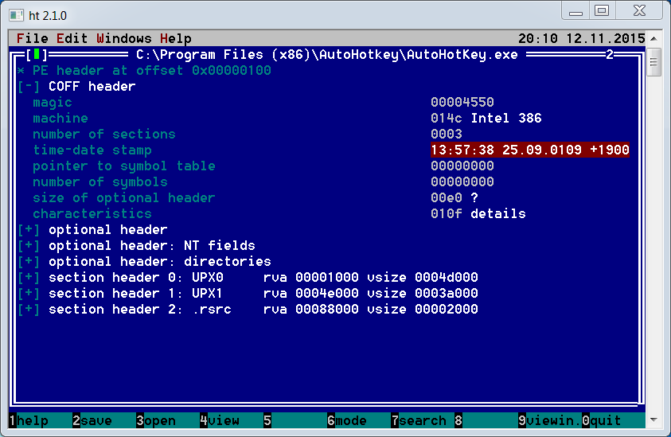

# Приёмы защиты от кликеров

Мы узнали основные принципы работы кликеров. Теперь попробуем взглянуть на них со стороны разработчиков систем защиты. Как можно обнаружить ботов этого типа? На этот вопрос мы попробуем ответить в этом разделе.

В первой главе мы рассмотрели архитектуру типичного игрового приложения. Как вы помните, оно имеет две части: клиентскую и серверную. Зачастую, система защиты придерживается той же архитектуры и разделена на две части. Клиентская часть контролирует точки перехвата и внедрения данных на стороне пользователя (драйвера, ОС, приложение). Серверная часть следит за взаимодействием игрового приложения и сервером. Большинство техник по обнаружению кликеров работают на клиентской стороне.

Главная цель любой системы защиты – установить факт несанкционированного чтения или модификации игровых данных. Другими словами – отличить действия человека и программы. Когда нарушение обнаружено, у системы защиты есть несколько вариантов реакции:

1. Уведомить администратора игрового сервера о подозрительных действиях игрока. Для этого достаточно сделать запись в лог файл на стороне сервера.

2. Разорвать соединение между подозрительным пользователем и сервером.

3. Заблокировать игрока по IP адресу. Это предотвратит его дальнейшие попытки подключения к серверу.

Мы рассмотрим только алгоритмы обнаружения ботов, но не способы блокировки их работы. Также уделим внимание возможным путям обхода этих алгоритмов.

## Тестовое приложение

Для тестирования алгоритмов обнаружения ботов, мы воспользуемся приложением Notepad. Предположим, что это игровой клиент, который мы должны защитить. Напишем простейший AutoIt скрипт, который выполняет роль кликера и вводит текст в Notepad. Наша цель – его обнаружить.

Листинг 2-28 демонстрирует скрипт `SimpleBot.au3`, который печатает буквы "a", "b", "c" в окне Notepad.

**Листинг 2-28.** *Скрипт `SimpleBot.au3`*
```AutoIt
$hWnd = WinGetHandle("[CLASS:Notepad]")
WinActivate($hWnd)

Sleep(200)

while True
    Send("a")
    Sleep(1000)
    Send("b")
    Sleep(2000)
    Send("c")
    Sleep(1500)
wend
```
Для тестирования запустите Notepad, а затем скрипт `SimpleBot.au3`. Он переключится на нужное окно и будет вводить буквы в бесконечном цикле.

Скрипт `SimpleBot.au3` – это отправная точка нашего исследования, цель которого отличить симулируемые ботом нажатия клавиш от действий пользователя в окне Notepad. Прототипы алгоритмов защиты мы будем писать на AutoIt. Благодаря этому получится простой и компактный код для изучения. В реальных системах защиты предпочтительнее использовать компилируемые языки вроде C или C++.

## Анализ действий игрока

### Вычисление временных задержек

Скрипт `SimpleBot.au3` симулирует одни и те же действия в цикле. Их систематичность – это первое, что бросается в глаза. Еще раз обратимся к коду скрипта. Между каждым действием и предыдущим стоят задержки. Человек не может действовать в таких точных временных интервалах. Более того, такая чёткость в задержках не имеет никакого смысла в компьютерной игре, потому что зачастую пользователь должен реагировать на различные случайные ситуации. Если кто-то ведёт себя подобным образом, очень вероятно что это программа.

Алгоритм защиты может замерять задержки между двумя одинаковыми действиями. Если они повторяются через одинаковые интервалы времени с разницей не более 100 миллисекунд, их выполняет бот. Попробуем реализовать такую защиту.

---
Скорость реакции среднестатистического человека примерно равна 300 миллисекундам. У профессиональных игроков она меньше – порядка 150 миллисекунд.
---

Наш скрипт должен выполнять две задачи: перехватывать действия пользователя и измерять временные задержки между ними. Код в листинге 2-29 реализует перехват нажатия клавиш.

**Листинг 2-29.** *Перехват нажатия клавиш*
```AutoIt
global const $gKeyHandler = "_KeyHandler"

func _KeyHandler()
    $keyPressed = @HotKeyPressed

    LogWrite("_KeyHandler() - asc = " & asc($keyPressed) & " key = " & $keyPressed)
    AnalyzeKey($keyPressed)

    HotKeySet($keyPressed)
    Send($keyPressed)
    HotKeySet($keyPressed, $gKeyHandler)
endfunc

func InitKeyHooks($handler)
    for $i = 0 to 255
        HotKeySet(Chr($i), $handler)
    next
endfunc

InitKeyHooks($gKeyHandler)

while true
    Sleep(10)
wend
```
Мы применили функцию AutoIt `HotKeySet`, чтобы назначить обработчик (handler или hook) для нажимаемых клавиш. В пользовательской функции `InitKeyHooks` мы вызываем `HotKeySet` для кода каждой клавиши в `for` цикле от 0 до 255. Таким образом, при любом нажатии на клавиатуре будет вызван обработчик `_KeyHandler`. Он выполняет следующие шаги:

1. Вызывает функцию `AnalyzeKey`, передавая ей код нажатой клавиши. Этот код хранится в макросе `@HotKeyPressed`.

2. Выключает перехват следующего нажатия обрабатываемой клавиши. Для этого снова вызывается функция `HotKeySet`. Данный шаг нужен, чтобы нажатие дошло до приложения Notepad.

3. Вызывает функцию `Send` для симуляции нажатия обрабатываемой клавиши в Notepad.

4. Включает перехват последующих нажатий.

Листинг 2-30 демонстрирует код функции `AnalyzeKey`.

**Листинг 2-30.** *Функция `AnalyzeKey`*
```AutoIt
global $gTimeSpanA = -1
global $gPrevTimestampA = -1

func AnalyzeKey($key)
    local $timestamp = (@SEC * 1000 + @MSEC)
    LogWrite("AnalyzeKey() - key = " & $key & " msec = " & $timestamp)
    if $key <> 'a' then
        return
    endif

    if $gPrevTimestampA = -1 then
        $gPrevTimestampA = $timestamp
        return
    endif

    local $newTimeSpan = $timestamp - $gPrevTimestampA
    $gPrevTimestampA = $timestamp

    if $gTimeSpanA = -1 then
        $gTimeSpanA = $newTimeSpan
        return
    endif

    if Abs($gTimeSpanA - $newTimeSpan) < 100 then
        MsgBox(0, "Alert", "Clicker bot detected!")
    endif
endfunc
```
В функции `AnalyzeKey` мы замеряем задержки между нажатиями клавиши "a". Две глобальные переменные хранят текущее состояние алгоритма:

1. `gPrevTimestampA` – это момент времени (timestamp) первого нажатия.

2. `gTimeSpanA` – это задержка между первым и вторым нажатиями.

При старте скрипта обоим переменным присваивается значение "-1", которое соответствует неинициализированному состоянию. Нашему алгоритму требуется перехватить минимум три нажатия клавиши, чтобы обнаружить бота. Первое нажатие инициализирует переменную `gPrevTimestampA`:
```AutoIt
    if $gPrevTimestampA = -1 then
        $gPrevTimestampA = $timestamp
        return
    endif
```
Момент времени второго нажатия мы используем для расчета переменной `gTimeSpanA`. Она равна разности между временем первого и второго нажатий:
```AutoIt
    local $newTimeSpan = $timestamp - $gPrevTimestampA
    $gPrevTimestampA = $timestamp

    if $gTimeSpanA = -1 then
        $gTimeSpanA = $newTimeSpan
        return
    endif
```
После третьего нажатия мы можем вычислить задержку второй раз (переменная `newTimeSpan`) и сравнить её со значением `gTimeSpanA`:
```AutoIt
    if Abs($gTimeSpanA - $newTimeSpan) < 100 then
        MsgBox(0, "Alert", "Clicker bot detected!")
    endif
```
Если разница между первой и второй задержкой менее 100 миллисекунд, алгоритм защиты выводит сообщение об обнаружении бота.

Полный код представлен в скрипте `TimeSpanProtection.au3` из листинга 2-31. В нём мы опустили реализацию функций `_KeyHandler` и `AnalyzeKey`, поскольку рассмотрели их ранее.

**Листинг 2-31.** *Скрипт `TimeSpanProtection.au3`*
```AutoIt
global const $gKeyHandler = "_KeyHandler"
global const $kLogFile = "debug.log"

global $gTimeSpanA = -1
global $gPrevTimestampA = -1

func LogWrite($data)
    FileWrite($kLogFile, $data & chr(10))
endfunc

func _KeyHandler()
    ; См листинг 2-29
endfunc

func InitKeyHooks($handler)
    for $i = 0 to 256
        HotKeySet(Chr($i), $handler)
    next
endfunc

func AnalyzeKey($key)
    ; См листинг 2-30
endfunc

InitKeyHooks($gKeyHandler)

while true
    Sleep(10)
wend
```

### Анализ последовательности действий

Мы можем незначительно изменить скрипт `SimpleBot.au3`, чтобы обойти защиту `TimeSpanProtection.au3`. Для этого вместо фиксированных задержек между действиями сделаем случайные. Листинг 2-32 демонстрирует исправленную версию бота.

**Листинг 2-32.** *Скрипт `RandomDelayBot.au3`*
```AutoIt
SRandom(@MSEC)

$hWnd = WinGetHandle("[CLASS:Notepad]")
WinActivate($hWnd)

Sleep(200)

while true
    Send("a")
    Sleep(Random(800, 1200))
    Send("b")
    Sleep(Random(1700, 2300))
    Send("c")
    Sleep(Random(1300, 1700))
wend
```
Каждый раз, в вызов `Sleep` мы передаём случайное число, полученное из функции `Random`. Попробуйте протестировать нового бота вместе с защитой `TimeSpanProtection.au3`. Теперь она не может обнаружить кликера.

У скрипта `RandomDelayBot.au3` по-прежнему есть закономерность, которая сразу видна человеку, следящему за его работой. Речь идёт о последовательности нажимаемых кнопок. Очевидно, что игрок не способен безошибочно повторять свои действия десятки и сотни раз. Даже если он и захочет это сделать, в какой-то момент он ошибётся и нажмёт не ту клавишу.

Перепишем скрипт защиты так, чтобы вместо временных задержек он анализировал последовательность нажатий клавиш. Для этого надо изменить функцию `AnalyzeKey`, как показано в листинге 2-33.

**Листинг 2-33.** *Функция `AnalyzeKey`*
```AutoIt
global const $gActionTemplate[3] = ['a', 'b', 'c']
global $gActionIndex = 0
global $gCounter = 0

func Reset()
    $gActionIndex = 0
    $gCounter = 0
endfunc

func AnalyzeKey($key)
    LogWrite("AnalyzeKey() - key = " & $key);

    $indexMax = UBound($gActionTemplate) - 1
    if $gActionIndex <= $indexMax and $key <> $gActionTemplate[$gActionIndex] then
        Reset()
        return
    endif

    if $gActionIndex < $indexMax and $key = $gActionTemplate[$gActionIndex] then
        $gActionIndex += 1
        return
    endif

    if $gActionIndex = $indexMax and $key = $gActionTemplate[$gActionIndex] then
        $gCounter += 1
        $gActionIndex = 0

        if $gCounter = 3 then
            MsgBox(0, "Alert", "Clicker bot detected!")
            Reset()
        endif
    endif
endfunc
```
Новый вариант функции `AnalyzeKey` использует глобальную константу и две переменные:

1. 	`gActionTemplate` – это последовательность действий, которую выполняет предполагаемый бот.

2. `gActionIndex` – индекс в массива `gActionTemplate`, который соответствует последнему перехваченному нажатию.

3. `gCounter` – число обнаруженных повторений последовательности действий.

В функции `AnalyzeKey` есть три основных условия для обработки нажатия клавиши. Первое из них выполняется, если нажатие не соответствует ни одному элементу массива `gActionTemplate`:
```AutoIt
    $indexMax = UBound($gActionTemplate) - 1
    if $gActionIndex <= $indexMax and $key <> $gActionTemplate[$gActionIndex] then
        Reset()
        return
    endif
```
В этом случае мы вызываем функцию `Reset`, которая сбрасывает в ноль значения переменных `gActionIndex` и `gCounter`. После этого мы выходим из `AnalyzeKey`.

Второе условие обработки нажатия выполняется, когда перехваченное действие встречается в массиве `gActionTemplate`, этот элемент не последний и его индекс равен `gActionIndex`:
```AutoIt
    if $gActionIndex < $indexMax and $key = $gActionTemplate[$gActionIndex] then
        $gActionIndex += 1
        return
    endif
```
Это означает, что нажатие попадает в предполагаемую последовательность действий бота. В этом случае мы инкрементируем переменную `gActionIndex` и ожидаем новое нажатие, чтобы сравнить его со следующим элементом последовательности.

Третье условие выполняется, когда перехваченное нажатие соответствует последнему элементу массива `gActionTemplate`:
```AutoIt
if $gActionIndex = $indexMax and $key = $gActionTemplate[$gActionIndex]
then
        $gCounter += 1
        $gActionIndex = 0
        if $gCounter = 3 then
            MsgBox(0, "Alert", "Clicker bot detected!")
            Reset()
        endif
    endif
```
В этом случае мы инкрементируем счётчик совпадения последовательностей `gCounter` и сбрасываем значение `gActionIndex`. Таким образом мы готовы к обнаружению следующих действий бота.

Если ожидаемая последовательность действий происходит три раза подряд, скрипт делает вывод, что работает бот и выдаёт соответствующее сообщение. В этом случае счётчик `gCounter` сбрасывается в ноль, и наш алгоритм работает с начала.

Вы можете запустить скрипты `ActionSequenceProtection.au3` и `RandomDelayBot.au3` для тестирования защиты. Теперь бот успешно обнаруживается.

Очевидно, что рассмотренный алгоритм может ошибиться. Он примет игрока за бота, если тот трижды повторит одни и те же действия. Вероятность такой ошибки можно уменьшить, если мы увеличим пороговое значение для счётчика `$gCounter` в следующем условии:
```AutoIt
        if $gCounter = 3 then
            MsgBox(0, "Alert", "Clicker bot detected!")
            Reset()
        endif
```
У скрипта защиты `ActionSequenceProtection.au3` есть другой серьёзный недостаток. Он способен обнаружить только бота, который запрограммирован на последовательность нажатий "a", "b", "c". Если кликер вместо этого будет выполнять "a", "c", "b", то алгоритм не сможет его обнаружить.

Изменим нашего бота согласно листингу 2-34. Теперь он обходит защиту `ActionSequenceProtection.au3`.

**Листинг 2-34.** *Скрипт `RandomActionBot.au3`*
```AutoIt
SRandom(@MSEC)

$hWnd = WinGetHandle("[CLASS:Notepad]")
WinActivate($hWnd)
Sleep(200)

while true
    Send("a")
    Sleep(1000)

    if Random(0, 9, 1) < 5 then
        Send("b")
        Sleep(2000)
    endif

    Send("c")
    Sleep(1500)
wend
```
Теперь симулируемая ботом последовательной действий случайна. Он нажимает клавишу "b" после "a" с вероятностью порядка 50%. Это приводит к тому, что условия функции `AnalyzeKey` на обнаружение бота перестают выполняться. Каждый раз, когда бот пропускает "b", алгоритм защиты сбрасывает счётчик `gCounter` в ноль. Таким образом, он никогда не достигнет порогового значения.

Мы можем обнаружить бота `RandomActionBot.au3`, если немного изменим наш защитный алгоритм. Вместо проверки нажатий клавиш "на лету", он должен записывать их в один большой файл. Когда этот файл достигнет максимально допустимого размера, скрипт его читает и проверяет на наличие часто повторяющихся последовательностей действий. Если они встречаются, это может быть сигналом о том, что их выполняет программа. В случае бота `RandomActionBot.au3`, такими последовательностями будут "a", "c" и "a", "b", "c".

## Сканирование процессов

Есть альтернативный способ обнаружить кликера. Вместо того, чтобы анализировать действия игрока, алгоритм защиты может найти бота в списке запущенных процессов ОС.

Скрипт `ProcessScanProtection.au3`, приведённый в листинге 2-35, демонстрирует этот подход.

**Листинг 2-35.** *Скрипт `ProcessScanProtection.au3`*
```AutoIt
global const $kLogFile = "debug.log"

func LogWrite($data)
    FileWrite($kLogFile, $data & chr(10))
endfunc

func ScanProcess($name)
    local $processList = ProcessList($name)

    if $processList[0][0] > 0 then
        LogWrite("Name: " & $processList[1][0] & " PID: " & $processList[1][1])
        MsgBox(0, "Alert", "Clicker bot detected!")
    endif
endfunc

while true
    ScanProcess("AutoHotKey.exe")
    Sleep(5000)
wend
```
Мы можем получить список запущенных в данный момент процессов с помощью AutoIt функции `ProcessList`. У неё есть единственный необязательный параметр – имя процесса, который нужно найти. Если передать его, функция вернёт список из одного элемента в случае успешного поиска. Наш скрипт ищет приложение `AutoHotKey.exe`. `ProcessList` возвращает двумерный массив, представленный в таблице 2-7.

**Таблица 2-7.** *Элементы массива, возвращаемого `ProcessList`*

| Элемент массив | Описание |
| --- | --- |
| `processList[0][0]` | Количество найденных процессов. |
| `processList[1][0]` | Имя первого процесса в списке. |
| `processList[1][1]` | Идентификатор (ID или PID) первого процесса в списке. |

Если элемент массива `processList[0][0]` не равен нулю, процесс `AutoHotKey.exe` запущен и работает.

Почему мы ищем процесс `AutoHotKey.exe`, а не `AutoIt.exe`? Дело в том, что мы не сможем протестировать скрипт `ProcessScanProtection.au3` на нашем тестовом боте `SimpleBot.au3`. Оба скрипта написаны на языке AutoIt. Это значит, что как только мы щёлкнем два раза мышью по иконке `ProcessScanProtection.au3`, ОС запустит процесс **интерпретатора** `AutoIt.exe`, который и выполнит наш скрипт. Из-за этого алгоритм защиты будет всегда находить процесс `AutoIt.exe`, независимо от того запущен бот или нет.

Перепишем нашего тестового бота на языке AutoHotKey. Результат приведён в листинге 2-36.

**Листинг 2-36.** *Скрипт `SimpleBot.ahk`*
```AutoIt
WinActivate, Untitled - Notepad
Sleep, 200

while true
{
    Send, a
    Sleep, 1000
    Send, b
    Sleep, 2000
    Send, c
    Sleep, 1500
}
```
Вы можете сравнить скрипты `SimpleBot.ahk` и `SimpleBot.au3`. Они выглядят похоже. Единственное отличие – это синтаксис вызова функций. В AutoHotKey параметры указываются не в скобках, а через запятую и пробел после имени функции.

Теперь мы можем протестировать наш скрипт `ProcessScanProtection.au3`. Для этого выполните следующие шаги:

1. Запустите приложение Notepad.

2. Запустите скрипт `ProcessScanProtection.au3`.

3. Запустите тестового бота `SimpleBot.ahk`. Не забудьте перед этим установить интерпретатор AutoHotKey.

4. Ожидайте, пока алгоритм защиты не обнаружит бота. Когда это случится, вы увидите сообщение.

Есть несколько методов для обхода этого типа защиты. Самый простой – это использовать компилятор скриптов AutoHotKey. Компилятор собирает скрипт и интерпретатор `AutoHotKey.exe` в единый исполняемый EXE файл. Имя этого файла будет соответствовать имени процесса в списке, возвращаемом функцией `ProcessList`. Таким образом, алгоритм защиты `ProcessScanProtection.au3` не сработает.

Для компилирования скрипта `SimpleBot.ahk` выполните следующие шаги:

1. Запустите приложение компилятора AutoHotKey. Окно приложения выглядит как на иллюстрации 2-14. Путь к нему по-умолчанию:
```
C:\Program Files (x86)\AutoHotkey\Compiler\Ahk2Exe.exe
```

2. Выберите скрипт `SimpleBot.ahk` в качестве исходного файла. Диалоговое окно для выбора файла открывается по кнопке "Browse" напротив текста "Source (script file)".

3. Не указывайте имя выходного файла в поле "Destination (.exe file)". В этом случае в той же папке, где находится скрипт, будет создан EXE файл с таким же именем.

4. Нажмите кнопку "> Convert <". По окончании процесса компиляции вы увидите сообщение.


**Иллюстрация 2-14.** *Окно компилятора AutoHotKey*

Попробуйте запустить полученный EXE файл с именем `SimpleBot.exe`. Он ведёт себя точно так же как и скрипт `SimpleBot.ahk`. Единственное отличие в том, что алгоритм защиты `ProcessScanProtection.au3` не может его обнаружить. Причина этого в том, что процесс бота теперь называется `SimpleBot.exe`, а не `AutoHotKey.exe`.

## Вычисление хэш-суммы запускаемого файла

Можем ли мы усовершенствовать скрипт `ProcessScanProtection.au3` так, чтобы он обнаруживал скомпилированную версию бота `SimpleBot.exe`? Как мы выяснили, имя исполняемого файла легко поменять в отличие от его содержания. EXE файл представляет собой машинный код, который выполняется процессором, и заголовки с метаинформацией. Неверное изменение любой из этих частей приведёт к ошибке приложения при старте.

Если система защиты будет искать бота не по имени процесса, а по содержанию его исполняемого файла, её будет сложнее обойти. Вот несколько идей того, что может проверять алгоритм защиты:

1. Рассчитывать хэш-суммы исполняемых файлов всех запущенных процессов и сравнивать их с предопределёнными значениями.

2. Проверять последовательность байт в определённом месте каждого из этих исполняемых файлов.

3. Искать заданную последовательность байт по всему файлу.

Попробуем реализовать первый подход. Скрипт `Md5ScanProtection.au3` из листинга 2-37 считает хэш-сумму по алгоритму MD5 для исполняемого файла каждого из запущенных процессов. Если хэш-сумма совпала с искомой, алгоритм делает вывод о наличии работающего бота.

**Листинг 2-37.** *Скрипт `Md5ScanProtection.au3`*
```AutoIt
#include <Crypt.au3>

global const $kLogFile = "debug.log"
global const $kCheckMd5[2] = ["0x3E4539E7A04472610D68B32D31BF714B", _
 "0xD960F13A44D3BD8F262DF625F5705A63"]

func LogWrite($data)
    FileWrite($kLogFile, $data & chr(10))
endfunc

func _ProcessGetLocation($pid)
    local $proc = DllCall('kernel32.dll', 'hwnd', 'OpenProcess', 'int', _
                          BitOR(0x0400, 0x0010), 'int', 0, 'int', $pid)
    if $proc[0] = 0 then 
        return ""
    endif
    local $struct = DllStructCreate('int[1024]')
    DllCall('psapi.dll', 'int', 'EnumProcessModules', 'hwnd', $proc[0], 'ptr', _
            DllStructGetPtr($struct), 'int', DllStructGetSize($struct), 'int_ptr', 0)

    local $return = DllCall('psapi.dll', 'int', 'GetModuleFileNameEx', 'hwnd', _
                            $proc[0], 'int', DllStructGetData($struct, 1), 'str', _
                            '', 'int', 2048)
    if StringLen($return[3]) = 0 then
        return ""
    endif
    return $return[3]
endfunc

func ScanProcess()
    local $processList = ProcessList()
    for $i = 1 to $processList[0][0]
        local $path = _ProcessGetLocation($processList[$i][1])
        local $md5 = _Crypt_HashFile($path, $CALG_MD5)
        LogWrite("Name: " & $processList[$i][0] & " PID: " _
                       & $processList[$i][1] & " Path: " & $path & " md5: " & $md5)

        for $j = 0 to Ubound($kCheckMd5) - 1
            if $md5 == $kCheckMd5[$j] then
                MsgBox(0, "Alert", "Clicker bot detected!")
            endif
        next
    next
endfunc

while true
    ScanProcess()
    Sleep(5000)
wend
```

Рассмотрим скрипт `Md5ScanProtection.au3`. Весь алгоритм обнаружения бота реализован в функции `ScanProcess`, которая вызывается в цикле `while` каждые пять секунд. В ней мы получаем список запущенных процессов с помощью AutoIt подпрограммы `ProcessList`, который сохраняем в переменную `processList`. После этого с помощью цикла `for` мы проходим по полученному списку. Для каждого его элемента функция `_ProcessGetLocation` читает путь к исполняемому файлу, машинный код которого был загружен в процесс. Узнав этот путь, мы передаём его в подпрограмму `_Crypt_HashFile`, которая считат хэш-сумму по содержимому всего файла. Заключительный шаг алгоритма – сравнение рассчитанной хэш-суммы с искомыми значениями из глобального массива `kCheckMd5`. В нашем примере этот массив содержит MD5 суммы файлов `SimpleBot.exe` и `AutoHotKey.exe`.

Рассмотрим функцию `_ProcessGetLocation`. В ней нам приходится напрямую вызывать три WinAPI подпрограммы: `OpenProcess`, `EnumProcessModules` и `GetModuleFileNameEx`. Первая получает доступ к дескриптору процесса по его идентификатору. Зная этот дескриптор, мы можем запросить дополнительную информацию через WinAPI.

Следующая подпрограмма `EnumProcessModules` читает список *модулей* процесса в массив `struct`. Процесс состоит из нескольких модулей, каждый из которых содержит код (который загружается в память процесса при старте) исполняемого файла или динамической библиотеки DLL. Первый модуль в списке всегда соответствует исполняемому файлу. Его мы и передаём в функцию `GetModuleFileNameEx`. Она извлекает путь к файлу, который соответствует указанному модулю из его метаинформации.

Попробуйте запустить скрипт `Md5ScanProtection.au3` и оба варианта бота: `SimpleBot.ahk` и `SimpleBot.exe`. Новый алгоритм должен их обнаружить.

Может случиться так, что скрипт `SimpleBot.ahk` не будет обнаружен. Это означает, что ваша версия интерпретатора AutoHotKey отличается от моей. Добавьте в массив `kCheckMd5` его хэш-сумму, чтобы это исправить. Эту сумму вы можете узнать из файла `debug.log` с отладочной информацией. В него пишутся все прочитанные защитой процессы и их MD5 суммы.

Есть несколько способов улучшения нашего бота, чтобы обойти алгоритм защиты `Md5ScanProtection.au3`. Все они связаны с изменение содержания исполняемого файла. Наиболее простые варианты следующие:

1. Сделать незначительное изменение в коде скрипта `SimpleBot.ahk` (например уменьшить задержку на пару миллисекунд) и скомпилировать его по новой.

2. Изменить заголовок с метаинформацией исполняемого файла `AutoHotKey.exe`. Для этого можно воспользоваться редактором [**HT editor**](http://hte.sourceforge.net).

Изменение машинного кода, записанного в исполняемый файл, чревато повреждением приложения. В этом случае оно завершится с ошибкой при старте. Но метаинформация, хранимая в **заголовке COFF** (Common Object File Format), не так чувствительна к изменениям. У заголовка есть несколько стандартных полей, одно из которых – время создания файла. Очевидно, изменение этого поля никак не повлияет на функциональность приложения. Этого будет достаточно, чтобы изменить MD5 сумму, рассчитанную по содержанию файла. В этом случае алгоритм защиты `Md5ScanProtection.au3` больше не сможет обнаружить бота.

Выполните следующие шаги, чтобы изменить время создания файла в COFF заголовке:

1. Запустите приложение HT editor с правами администратора. Для удобства скопируйте сначала исполняемый файл редактора в папку к `AutoHotKey.exe`.

2. В окне редактора нажмите клавишу F3, чтобы вызвать диалог открытия файла.

3. Нажмите клавишу Tab, чтобы перейти в список выбора файла. Найдите в нём `AutoHotKey.exe` и нажмите Enter.

4. Нажмите F6, чтобы открыть диалог выбора режима редактирования. В нём включите режим "- pe/header". После этого вы увидите список заголовков файла `AutoHotKey.exe`.

5. Выберите пункт "COFF header" и нажмите Enter. Перейдите на поле  "time-data stamp" заголовка.

6. Нажмите F4 для редактирования поля и измените его. Иллюстрация 2-15 демонстрирует эту операцию.

7. Нажмите F4 и выберите вариант "Yes" в диалоге подтверждения сохранения изменений.



**Иллюстрация 2-15.** *Изменение времени создания файла в HT editor*

В результате мы получили файл `AutoHotKey.exe`, содержание которого отличается от исходного. Попробуйте запустить его и указать нашего бота `SimpleBot.ahk` в диалоге открытия скрипта. Алгоритм защиты `Md5ScanProtection.au3` не сможет его обнаружить.

Можно исправить алгоритм защиты так, чтобы он игнорировал все заголовки исполняемого файла при подсчёте хэш-суммы. Тогда разработчику бота останется только вариант менять его машинный код. Альтернативное решение для усиления защиты – считать MD5 не для всего содержания файла, а только для небольшого набора байтов из строго определённого места. В этом случае для обхода алгоритма надо будет точно знать это место.

## Проверка состояния клавиатуры

Windows предоставляет механизм уровня ядра, который позволяет отличить реальное нажатие клавиши от симулируемого. Рассмотрим, как можно использовать этот механизм для обнаружения кликеров.

Прежде всего, мы должны перехватить событие нажатия клавиши на низком уровне. В этом нам поможет WinAPI подпрограмма `SetWindowsHookEx`. Принцип её работы похож на функцию AutoIt `HotKeySet` – она устанавливает обработчик различных событий ОС. Первый параметр `SetWindowsHookEx` определяет тип перехватываемых событий. В нашем случае он должен быть равен `WH_KEYBOARD_LL`.

Теперь мы должны реализовать функцию-обработчик события. Она получает входным параметром структуру типа `KBDLLHOOKSTRUCT`, которая содержит полную информацию о перехваченном событии. У этой структуры есть поле `flags`. Если в нём присутствует **флаг** (то есть бит в определённой позиции) `LLKHF_INJECTED`, перехваченное нажатие клавиши было симулировано WinAPI подпрограммой `SendInput` или `keybd_event`. Если флага `LLKHF_INJECTED` нет, источником события является клавиатура. Подменить поле `flags` структуры `KBDLLHOOKSTRUCT` достаточно сложно, поскольку оно выставляется на уровне ядра ОС.

Скрипт `KeyboardCheckProtection.au3` из листинга 2-38 демонстрирует проверку флага `LLKHF_INJECTED`.

**Листинг 2-38.** *Скрипт `KeyboardCheckProtection.au3`*
```AutoIt
#include <WinAPI.au3>

global const $kLogFile = "debug.log"
global $gHook

func LogWrite($data)
    FileWrite($kLogFile, $data & chr(10))
endfunc

func _KeyHandler($nCode, $wParam, $lParam)
    if $nCode < 0 then
        return _WinAPI_CallNextHookEx($gHook, $nCode, $wParam, $lParam)
    endIf

    local $keyHooks = DllStructCreate($tagKBDLLHOOKSTRUCT, $lParam)

    LogWrite("_KeyHandler() - keyccode = " & DllStructGetData($keyHooks, "vkCode"));

    local $flags = DllStructGetData($keyHooks, "flags")
    if $flags = $LLKHF_INJECTED then
        MsgBox(0, "Alert", "Clicker bot detected!")
    endif

    return _WinAPI_CallNextHookEx($gHook, $nCode, $wParam, $lParam)
endfunc

func InitKeyHooks($handler)
    local $keyHandler = DllCallbackRegister($handler, "long", _
                                         "int;wparam;lparam")
    local $hMod = _WinAPI_GetModuleHandle(0)
    $gHook = _WinAPI_SetWindowsHookEx($WH_KEYBOARD_LL, _
                        DllCallbackGetPtr($keyHandler), $hMod)
endfunc

InitKeyHooks("_KeyHandler")

while true
    Sleep(10)
wend
```
Алгоритм назначения обработчика нажатий клавиш похож на тот, который мы применяли в скриптах `TimeSpanProtection.au3` и `ActionSequenceProtection.au3`. Только в данном случае мы вызываем WinAPI подпрограмму через AutoIt обёртку `_WinAPI_SetWindowsHookEx` в функции `InitKeyHooks`. Таким образом мы инициализируем обработчик `_KeyHandler`, который будет перехватывать все события клавиатуры.

Функция `InitKeyHooks` выполняет следующие шаги:

1. Регистрирует обработчик `_KeyHandler` через AutoIt функцию `DllCallbackRegister`. Это позволит передать его в WinAPI подпрограммы.

2. Читает в переменную `hMod` дескриптор первого модуля (нумерация начинается с нуля) текущего процесса через обёртку `_WinAPI_GetModuleHandle`. Не забудьте, что наш скрипт выполняется в интерпретаторе AutoIt.

3. Добавляет `_KeyHandler` в цепочку обработчиков через WinAPI подпрограмму `SetWindowsHookEx`. В неё мы должны передать дескриптор модуля, в котором этот обработчик реализован. В нашем случае это переменная `hMod`.

Алгоритм проверки наличия флага `LLKHF_INJECTED` в обработчике `_KeyHandler` выглядит следующим образом:

1. Проверить значение параметра `nCode`. Если оно меньше нуля, мы передаём событие дальше по цепочке обработчиков. В этом случае оно не содержит нужной нам структуры `KBDLLHOOKSTRUCT`.

2. Если параметр `nCode` не равен нулю, вызвать функцию `DllStructCreate` и передать в неё `lParam`. Таким образом мы получаем структуру `KBDLLHOOKSTRUCT`.

3. Прочитать поле `flags` из `KBDLLHOOKSTRUCT` с помощью функции `DllStructGetData`.

4. Проверить наличие флага `LLKHF_INJECTED`. Если он присутствует, нажатие клавиши было симулировано ботом.

Для тестирования алгоритма `KeyboardCheckProtection.au3` запустите Notepad и бота `SimpleBot.au3`. Как только он выполнит первое нажатие клавиши, вы увидите сообщение о его обнаружении.

Есть несколько способов обойти подобную защиту. Их основная идея – симулировать нажатия так, чтобы ядро ОС воспринимало их идущими от клавиатуры. Эти способы следующие:

1. Использовать виртуальную машину (virtual machine или VM).

2. Использовать специальный драйвер клавиатуры вместо WinAPI подпрограмм `SendInput` и `keybd_event` для симуляции нажатий. Пример такого драйвера – [InpOut32](http://www.highrez.co.uk/downloads/inpout32).

3. Эмулировать клавиатуру или мышь на специальном устройстве. Мы рассмотрим этот подход в пятой главе.

Самый простой из этих вариантов – использовать виртуальную машину. У неё есть **виртуальные драйверы устройств**. Они решают две задачи: эмулируют устройства для **гостевой ОС** (запущенной внутри VM) и предоставляют доступ к реальным устройствам. Все события симулируемые на хост-системе (на которой запускается VM) и идущие от реальных устройств проходят через виртуальные драйверы. Из-за этого гостевая ОС не может отличить их источник. Поэтому симулируемые ботом нажатия не будут иметь флага `LLKHF_INJECTED`.

Для запуска VM и нашего тестового бота выполните шаги:

1. Установите одну из следующих виртуальных машин:
    * [Virtual Box](https://www.virtualbox.org/wiki/Downloads)
    * [VMWare Player](https://www.vmware.com/products/workstation-player/workstation-player-evaluation.html)
    * [Windows Virtual PC](https://www.microsoft.com/en-us/download/details.aspx?id=3702)

2. Установите Windows в качестве гостевой ОС.

3. Запустите на ней Notepad и скрипт `KeyboardCheckProtection.au3`.

4. Запустите скрипт `VirtualMachineBot.au3` на хост-системе.

Скрипт `VirtualMachineBot.au3` из листинга 2-39 представляет адаптированную версию нашего бота.

**Листинг 2-39.** *Скрипт `VirtualMachineBot.au3`*
```AutoIt
Sleep(2000)

while true
    Send("a")
    Sleep(1000)
    Send("b")
    Sleep(2000)
    Send("c")
    Sleep(1500)
wend
```
Скрипт `VirtualMachineBot.au3` отличается от `SimpleBot.au3` процедурой переключения на окно Notepad. Теперь бот не может самостоятельно его найти, поскольку Notepad запущен на гостевой ОС. Мы добавили двухсекундную задержку после старта скрипта, чтобы у вас было время переключиться на окно VM и Notepad внутри неё. Алгоритм защиты `KeyboardCheckProtection.au3` не сможет обнаружить скрипт `VirtualMachineBot.au3`.

## Выводы

Мы рассмотрели методы обнаружения кликеров. Каждый из них имеет свои недостатки. Чтобы ваш бот смог работать в обход защите, вы должны хорошо изучить её алгоритмы. Вот несколько идей, как лучше их исследовать:

1. Перехватить выполняемые защитой WinAPI вызовы. Для этой цели подойдёт приложение API Monitor.

2. Применить методы **реверс-инжиниринга** для изучения исполняемых файлов и DLL библиотек системы защиты.

3. Попробовать несколько различных прототипов ботов, чтобы понять, на что именно реагирует защита.

Современные системы защиты на стороне клиента совмещают в себе несколько алгоритмов обнаружения кликеров. Поэтому у хорошего бота должны быть средства их преодоления.
