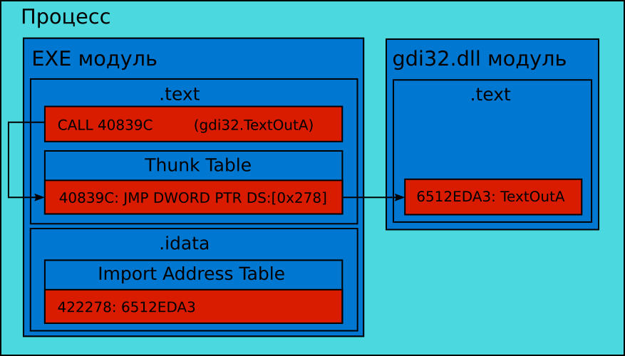
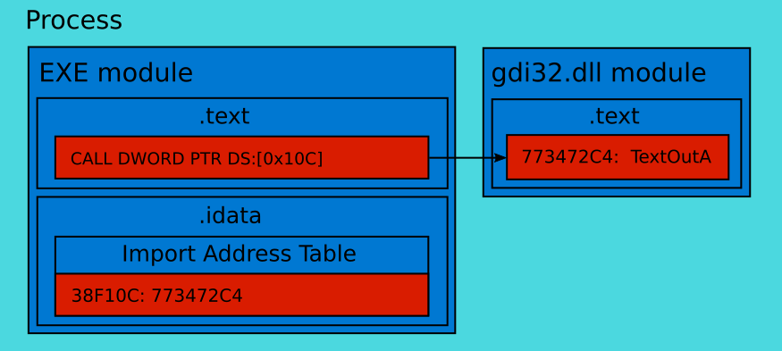
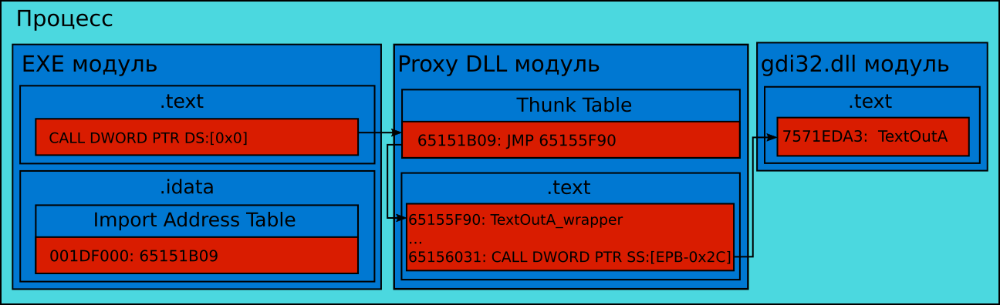
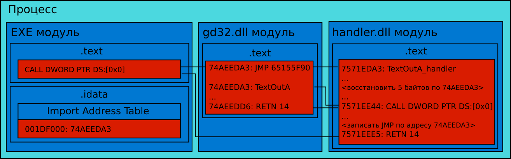

# Перехват данных на уровне ОС

В третьей главе мы рассмотрели методы чтения состояний объектов из памяти процесса игрового приложения. Хорошо продуманная защита может значительно усложнить их применение. В этом случае имеет смысл попробовать альтернативный подход, который заключается в подмене или модификации системных библиотек. Это позволит вам изменить точку перехвата данных. Теперь состояния объектов будут читаться не из памяти процесса, а из используемых им DLL библиотек. Проконтролировать их намного труднее. Высока вероятность, что система защиты с этим не справится.

## Инструменты для разработки

Нам предстоит активная работа с WinAPI функциями и системными библиотеками. Для этой задачи лучше всего подойдёт язык C++. Для компиляции примеров воспользуемся Visual Studio IDE. Инструкцию по её установке вы найдёте в третьей главе.

Есть несколько решений с открытым исходным кодом для перехвата вызовов WinAPI. Первое из них называется [**DLL Wrapper Generator**](https://m4v3n.wordpress.com/2012/08/08/dll-wrapper-generator) (генератор обёрток DLL). Мы будем использовать его, чтобы создавать обёртки для системных библиотек.

Для установки генератора выполните следующие шаги:

1. Скачайте архив со скриптами со [страницы проекта на Github](https://github.com/mavenlin/Dll_Wrapper_Gen/archive/master.zip).

2. Скачайте и установите [Python версии 2.7](http://www.python.org/downloads).

Второе решение, которым мы воспользуемся, называется [**Deviare**](http://www.nektra.com/products/deviare-api-hook-windows). Это [**фреймворк**](https://ru.wikipedia.org/wiki/%D0%A4%D1%80%D0%B5%D0%B9%D0%BC%D0%B2%D0%BE%D1%80%D0%BA) для перехвата вызовов DLL библиотек.

Чтобы установить Deviare, сделайте следующее:

1. Скачайте [архив](http://github.com/nektra/Deviare2/releases/download/v2.8.0/Deviare.2.8.0.zip) с уже собранными исполняемыми файлами и библиотеками фреймворка.

2. Скачайте [архив](http://github.com/nektra/Deviare2/archive/v2.8.0.zip) с исходным кодом той же версии.

3. Распакуйте оба архива в разные каталоги.

Список сборок Deviare доступен на [Github странице проекта](http://github.com/nektra/Deviare2/releases). Ещё раз проверьте, что версии скачанной сборки и исходного кода совпадают.

## Тестовое приложение

Чтобы продемонстрировать методы перехвата WinAPI вызовов, понадобится какое-то целевое приложение. Предлагаю воспользоваться программой, разработанной нами в разделе "Методы защиты от внутриигровых ботов" третьей главы. Немного изменённая версия её исходного кода приведена в листинге 5-9.

_**Листинг 5-9.** Исходный код тестового приложения_
```C++
#include <stdio.h>
#include <stdint.h>
#include <windows.h>
#include <string>

static const uint16_t MAX_LIFE = 20;
volatile uint16_t gLife = MAX_LIFE;

int main()
{
    SHORT result = 0;

    while (gLife > 0)
    {
        result = GetAsyncKeyState(0x31);
        if (result != 0xFFFF8001)
            --gLife;
        else
            ++gLife;

        std::string str(gLife, '#');
        TextOutA(GetDC(NULL), 0, 0, str.c_str(), str.size());

        printf("life = %u\n", gLife);
        Sleep(1000);
    }
    printf("stop\n");
    return 0;
}
```
Алгоритм работы приложения не изменился. Каждую секунду значение глобальной переменной `gLife` уменьшается на единицу, если клавиша "1" не была нажата. В противном случае `gLife` увеличивается на один. Теперь вместо вывода на консоль с помощью функции `printf`, мы делаем WinAPI вызов `TextOutA`. Он печатает строку, переданную в качестве входного параметра, в левом верхнем углу экрана. В нашем случае строка состоит из символов решетки, число которых соответствует значению переменной `gLife`.

Зачем мы изменили функцию вывода информации? Наша цель заключается в перехвате WinAPI вызовов. Функция `printf` предоставляется не WinAPI, а [**библиотекой времени выполнения**](https://ru.wikipedia.org/wiki/%D0%91%D0%B8%D0%B1%D0%BB%D0%B8%D0%BE%D1%82%D0%B5%D0%BA%D0%B0_%D1%81%D1%80%D0%B5%D0%B4%D1%8B_%D0%B2%D1%8B%D0%BF%D0%BE%D0%BB%D0%BD%D0%B5%D0%BD%D0%B8%D1%8F) языка C. В этой библиотеке реализованы низкоуровневые функции, описанные в стандарте языка. Доступ к ним возможен как из приложений, написанных на C, так и C++. Конечно, техника перехвата вызовов подойдёт и для случая с `printf`. Но для примера будет интереснее разобрать вариант именно с WinAPI функцией. Поэтому мы используем `TextOutA`.

Согласно документации WinAPI, функция `TextOutA` реализована в системной библиотеке `gdi32.dll`. Эта информация пригодится нам в дальнейшем.

Скомпилируйте приложение на Visual Studio под 32-разрядную платформу и запустите, чтобы проверить его работу.

## Загрузка DLL библиотек

Перед тем как разбираться с техниками перехвата WinAPI вызовов, рассмотрим взаимодействие приложения и используемой им DLL библиотеки.

Когда мы запускаем какое-то приложение, [**загрузчик программ Windows**](https://ru.wikipedia.org/wiki/%D0%97%D0%B0%D0%B3%D1%80%D1%83%D0%B7%D1%87%D0%B8%D0%BA_%D0%BF%D1%80%D0%BE%D0%B3%D1%80%D0%B0%D0%BC%D0%BC) (PE-загрузчик) читает содержимое исполняемого файла в оперативную память. Точнее в область памяти нового процесса. Загруженный код называется **EXE модулем**. Стандартным форматом исполняемых файлов в Windows является [**PE**](https://ru.wikipedia.org/wiki/Portable_Executable). Он определяет структуру данных (известную как **PE-заголовок**), которая хранится в начале файла. Она содержит всю необходимую информацию для запуска приложения. Список используемых DLL библиотек является её частью.

На следующем шаге PE-загрузчик ищет файлы необходимых DLL библиотек на жёстком диске. Их содержимое читается с диска и записывается в память процесса запускаемого приложения. Загруженный код одной библиотеки называется **DLL модулем**. Было бы логично размещать DLL модули по одним и тем же адресам при каждом запуске приложения. К сожалению, всё не так просто. Эти адреса выбираются случайно механизмом Windows под названием [**Address Space Load Randomization**](https://blogs.msdn.microsoft.com/winsdk/2009/11/30/how-to-disable-address-space-layout-randomization-aslr) (ASLR). Он защищает ОС от некоторых видов вредоносного ПО. Минус такого подхода в том, что компилятор не может использовать статические адреса для вызова функций библиотек из EXE модуля.

Проблема решается с помощью [**Import Table**](http://sandsprite.com/CodeStuff/Understanding_imports.html) (таблица импорта). Кроме неё есть так называемая **Thunk Table** (таблица переходов). Эти таблицы часто путают. Рассмотрим подробнее их внутреннее устройство.

Import Table представляет собой массив структур типа `IMAGE_IMPORT_DESCRIPTOR`: 
```C++
typedef struct _IMAGE_IMPORT_DESCRIPTOR {
    DWORD   OriginalFirstThunk;
    DWORD   TimeDateStamp;
    DWORD   ForwarderChain;
    DWORD   Name;
    DWORD   FirstThunk;
} IMAGE_IMPORT_DESCRIPTOR, *PIMAGE_IMPORT_DESCRIPTOR;
```
Каждая такая структура соответствует одной DLL библиотеке. В поле `Name` хранится имя её файла. Число `OriginalFirstThunk` на самом деле является указателем на первый элемент массива структур типа `IMAGE_THUNK_DATA`:
```C++
typedef struct _IMAGE_IMPORT_BY_NAME {
    WORD    Hint;
    BYTE    Name[1];
} IMAGE_IMPORT_BY_NAME, *PIMAGE_IMPORT_BY_NAME;

typedef struct _IMAGE_THUNK_DATA {
    union {
        PDWORD                 Function;
        PIMAGE_IMPORT_BY_NAME  AddressOfData;
    } u1;
} IMAGE_THUNK_DATA, *PIMAGE_THUNK_DATA;
```
Ключевое слово `union` в определении `IMAGE_THUNK_DATA` говорит о том, что данные могут интерпретироваться двумя способами:

1. Как указатель типа `PDWORD` на функцию в памяти запущенного процесса.

2. Как указатель на структуру типа `IMAGE_IMPORT_BY_NAME`, которая содержит порядковый номер функции в библиотеке и её символьное имя.

Поле `FirstThunk` структуры `IMAGE_IMPORT_DESCRIPTOR` указывает на первый элемента массива, известного как **Import Address Table** (таблица импорта адресов) или IAT. PE-загрузчик перезаписывает её адресами функций из соответствующей загруженной DLL библиотеки. Более подробно структура Import Table описана в [русской](https://rsdn.org/article/baseserv/peloader.xml#EVH) и [английской](https://web.archive.org/web/20180616013724/http://www.ntcore.com/files/inject2it.htm#IntoImportTable1) статьях.

Import Table является частью PE-заголовка. В ней хранится общая информация о требуемых DLL библиотеках. Всё содержимое PE-заголовка загружается в сегмент памяти процесса с правами только на чтение. Thunk Table является частью исполняемого кода. Она содержит переходы (**thunk**) на импортируемые функции. Эти переходы представляют собой ассемблерные инструкции `JMP`. Thunk Table загружается в `.text` сегмент с правами на чтение и исполнение. В этом же сегменте хранится исполняемый код приложения. Import Address Table, на которую указывает `FirstThunk` элементов Import Table, помещается в сегмент `.idata` с правами на чтение и запись.

Некоторые компиляторы генерируют код, не использующий Thunk Table. Благодаря этому удаётся избежать накладных расходов, связанных с дополнительным `JMP` переходом. Код, сгенерированный MinGW компилятором, использует Thunk Table. В этом случае схема вызова импортируемой функции `TextOutA` будет соответствовать иллюстрации 5-1.



_**Иллюстрация 5-1.** Вызов функции `TextOutA` из приложения, скомпилированного MinGW_

Алгоритм вызова выглядит следующим образом:

1. Процессор переходит к инструкции ассемблера `CALL 40839C`. Она выполняет вызов функции. При этом адрес возврата из неё помещается в стек, а управление передаётся элементу Thunk Table по адресу 40839C.

2. Элемент Thunk Table содержит единственную инструкцию `JMP`. Она выполняет безусловный переход на функцию `TextOutA` модуля `gdi32.dll`, загруженном в память исполняемого процесса. Линейный адрес функции извлекается из Import Address Table. Для доступа к ней используется регистр DS, указывающий на сегмент `.idata`. Для расчёт адреса элемента Import Address Table используется сдвиг (в нашем случае равный 0x278):
```
DS + 0x278 = 0x422000 + 0x278 = 0x422278
```

3. Процессор выполняет код `TextOutA`. Последняя инструкция функции — это `RETN`. Она извлекает адрес возврата из стека и осуществляет переход на инструкцию, следующую сразу за `CALL` в EXE модуле, откуда начинался вызов.

Компилятор Visual C++ генерирует код, который не использует Thunk Table. Схема вызова функции `TextOutA` в этом случае выглядит как на иллюстрации 5-2. Алгоритм этого вызова следующий:

1. Процессор выполняет инструкцию ассемблера `CALL DWORD PTR DS:[0x10C]`. В ней происходит чтение линейного адреса функции из Import Address Table. Затем на стек помещается адрес возврата. После этого управление передаётся в функцию `TextOutA` модуля `gdi32.dll`.

2. Процессор выполняет код `TextOutA`. Возврат из неё в EXE модуль происходит по `RETN` инструкции.



_**Иллюстрация 5-2.** Вызов функции `TextOutA` из приложения, скомпилированного Visual C++_

## Техники перехвата WinAPI вызовов

Игровые приложения взаимодействуют с ОС и её ресурсами через системные DLL библиотеки. Например, чтобы вывести на экран текст, вызывается функция `TextOutA` или аналогичная. Перехватив этот вызов, мы узнаем текст, который приложение пытается вывести. Такой подход чем-то напоминает перехват данных устройства вывода. Только теперь мы получаем эти данные до того, как они будут отображены на экране.

Инструмент API Monitor, применявшийся во второй главе, хорошо демонстрирует принцип перехвата WinAPI вызовов. Все WinAPI функции, которые вызывал анализируемый процесс, выводятся в окне "Summary" приложения. Мы можем реализовать бота, который будет вести себя как API Monitor. Но вместо вывода перехваченных вызовов, он должен симулировать действия игрока.

Рассмотрим на примерах две наиболее известные и используемые техники перехвата вызовов.

### Proxy DLL

Идея первой техники заключается в подмене Windows библиотеки. Мы могли бы подготовить DLL библиотеку, которая выглядит так же как системная с точки зрения PE-загрузчика. В этом случае она будет загружена в память процесса приложения. Игра будет взаимодействовать с подложной библиотекой точно так же, как если бы это была системная. Благодаря этому наш код будет получать управление при каждом вызове функции из неё. Подложная библиотека называется **proxy DLL**.

В большинстве случаев надо перехватывать несколько определённых WinAPI вызовов. Все остальные функции замещаемой системной библиотеки нам не интересны и должны работать как обычно. Кроме того при подмене DLL библиотек помните важное правило: процесс должен вести себя с proxy DLL точно так же, как и с оригинальной библиотекой. В противном случае нельзя гарантировать его корректную работу. Эти два обстоятельства наводят на мысль, что proxy DLL должна уметь перенаправлять в оригинальную библиотеку все вызовы приложения.

Когда процесс игрового приложения вызывает функцию proxy DLL, наш код получает управление. Он может симулировать действия пользователя или просто читать для бота состояния игровых объектов. После этого обязательно надо передать управление WinAPI функции, выполнение которой ожидает приложение. В противном случае оно просто завершится с ошибкой или продолжит работу в не консистентном состоянии, то есть его данные окажутся не согласованы.

Итак, если мы не собираемся перехватывать какую-то WinAPI функцию, мы просто перенаправляем её вызов в системную библиотеку. В противном случае сначала отрабатывает наш код, и только потом управление передаётся в системную библиотеку. Это означает, что она должна быть загружена в адресное пространство процесса. Иначе код оригинальных WinAPI функций будет недоступен. Очевидно, что PE-загрузчик ничего не знает про замещённую библиотеку. Он загрузил proxy DLL, и на этом его работа выполнена. Оригинальную библиотеку должна загружать proxy DLL с помощью WinAPI функции `LoadLibrary`.

Иллюстрация 5-3 демонстрирует схему вызова WinAPI функции `TextOutA` через proxy DLL в случае компиляции приложения на Visual C++.



_**Иллюстрация 5-3.** Вызов функции `TextOutA` через proxy DLL_

Алгоритм вызова функции следующий:

1. PE-загрузчик загружает proxy DLL вместо системной библиотеки `gdi32.dll`. При этом он записывает линейные адреса всех функций, экспортируемых proxy DLL, в Import Address Table модуля EXE.

2. Исполнение кода модуля EXE достигает точки вызова функции `TextOutA`. Дальше отрабатывает стандартный алгоритм вызова функции из импортируемой DLL. Инструкция `CALL` сохраняет адрес возврата на стеке и передаёт управление по адресу из Import Address Table. Единственное отличие в том, что управление получает не системная библиотека, а подменяющая её proxy DLL.

3. В proxy DLL есть Thunk Table, элемент которой получает управление от `CALL` инструкции EXE модуля. Именно линейные адреса элементов Thunk Table записываются PE-загрузчиком в Import Address Table модуля EXE.

4. Инструкция `JMP` элемента Thunk Table выполняет безусловный переход в обёртку для функции `TextOutA` под названием `TextOutA_wrapper`, которая реализована в proxy DLL. В ней отрабатывает код бота.

5. В конце кода обёртки находится инструкция `CALL`, которая сохраняет на стеке адрес возврата и передаёт управление оригинальной функции `TextOutA` из модуля `gdi32.dll`.

6. После отработки оригинальной функции `TextOutA`, она возвращает управление в обёртку `TextOutA_wrapper` через инструкцию `RETN`.

7. Инструкция `RETN` в обёртке возвращает управление обратно в EXE модуль.

Может возникнуть вопрос: как proxy DLL узнаёт линейные адреса функций, которые экспортируются системной библиотекой `gdi32.dll`? В обычной ситуации эти адреса читаются PE-загрузчиком. Но сейчас мы не можем его задействовать, ведь он загружает только proxy DLL. Опять же эта задача должна выполняться proxy DLL самостоятельно. WinAPI вызов `GetProcAddress` возвращает линейный адрес функции из указанного модуля по её имени или порядковому номеру.

Ещё один момент остаётся неясным. Что нужно сделать, чтобы PE-загрузчик выбрал proxy DLL вместо системной библиотеки? У Windows есть механизм поиска динамических библиотек. Пути всех системных DLL хранятся в [**реестре**](https://ru.wikipedia.org/wiki/%D0%A0%D0%B5%D0%B5%D1%81%D1%82%D1%80_Windows) и только по ним происходит поиск. Мы не можем просто подменить системную библиотеку в каталоге `Windows`. Скорее всего, её используют многие сервисы и службы ОС. Велика вероятность, что система окажется неработоспособной после такой подмены. Кроме того оригинальная библиотека должна храниться в месте известном всем её клиентам. Ведь все вызовы proxy DLL должны перенаправляться в неё. Правильное решение заключается в том, чтобы поместить proxy DLL в каталог приложения, вызовы которого мы собираемся перехватывать. Чтобы механизм защиты Windows не мешал загрузке библиотеки, его надо отключить. Для этого достаточно отредактировать реестр.

Преимущества использования proxy DLL перед другими техниками перехвата WinAPI вызовов следующие:

1. Очень просто сгенерировать proxy DLL с помощью существующих бесплатных утилит.

2. Подмена библиотеки происходит только для одного конкретного приложения. Все остальные системные сервисы и службы используют оригинальную DLL.

3. Защитить приложение от такого перехвата вызовов может быть сложно.

Недостатки подхода proxy DLL:

1. Некоторые системные библиотеки невозможно подменить (например `kernel32.dll`). Причина этого ограничения в том, что обе WinAPI функции `LoadLibrary` и `GetProcAddress` предоставляются `kernel32.dll`. Это значит, что они должны быть доступны в момент, когда proxy DLL загружает системную библиотеку.

### Пример использования proxy DLL

Применим технику перехвата WinAPI вызовов с помощью proxy DLL на практике. Напишем бота для нашего тестового приложения, который будет поддерживать значение `gLife` больше десяти. Для простоты встроим алгоритм бота в код proxy DLL.

Первая задача заключается в том, чтобы сгенерировать proxy DLL с заглушками для каждой WinAPI функции из замещаемой системной библиотеки `gdi32.dll`. В этом нам поможет скрипт DLL Wrapper Generator. Для его запуска выполните следующие шаги:

1. Скопируйте 32-разрядную версию системной библиотеки `gdi32.dll` в каталог скрипта-генератора. Она находится в каталоге `C:\Windows\system32` в случае 32-разрядной Windows или в `C:\Windows\SysWOW64` для 64-разрядной.

2. Запустите скрипт-генератор из командной строки CMD:
```
python Generate_Wrapper.py gdi32.dll
```

Будет создан Visual Studio проект с исходным кодом proxy DLL в подкаталоге `gdi32`.

---
Во всех примерах мы будем использовать 32-разрядную версию тестового приложения.
---

Теперь реализуем алгоритм бота в сгенерированной proxy DLL. Для этого выполните следующее:

1. В Visual Studio откройте файл проекта gdi32. Его формат устарел, поэтому Visual Studio предложит обновление до актуальной версии. Для этого нажмите кнопку "OK" в диалоге "Upgrade VC++ Compiler and Libraries" (обносить компилятор VC++ и библиотеки).

2. В файле проекта `gdi32.cpp` измените путь до системной библиотеки `gdi32.dll` в вызове `LoadLibrary`. Вам нужна строчка номер 10, которая выглядит следующим образом:
```C++
mHinstDLL = LoadLibrary( "ori_gdi32.dll" );
```
Замените строку "ori_gdi32.dll" на корректный путь библиотеки в вашей системе. В случае 64-разрядной Windows должно получиться следующее:
```C++
mHinstDLL = LoadLibrary( "C:\\Windows\\SysWOW64\\gdi32.dll" );
```

3. В том же файле `gdi32.cpp` замените обёртку функции `TextOutA` с именем `TextOutA_wrapper` на код из листинга 5-10.

_**Листинг 5-10.** Алгоритм бота, реализованный в обёртке функции `TextOutA`_
```C++
extern "C" BOOL __stdcall TextOutA_wrapper(
    _In_ HDC     hdc,
    _In_ int     nXStart,
    _In_ int     nYStart,
    _In_ LPCSTR lpString,
    _In_ int     cchString
    )
{
    if (cchString < 10)
    {
        INPUT Input = { 0 };
        Input.type = INPUT_KEYBOARD;
        Input.ki.wVk = '1';
        SendInput(1, &Input, sizeof(INPUT));
    }

    typedef BOOL(__stdcall *pS)(HDC, int, int, LPCTSTR, int);
    pS pps = (pS)mProcs[696];
    return pps(hdc, nXStart, nYStart, lpString, cchString);
}
```
Полная версия файла `gdi32.cpp` доступна в архиве с примерами к этой книге.

Вспомним код вызова функции `TextOutA` из нашего тестового приложения:
```C++
std::string str(gLife, '#');
TextOutA(GetDC(NULL), 0, 0, str.c_str(), str.size());
```
Здесь мы используем объект `string` [**библиотеки STL**](https://ru.wikipedia.org/wiki/%D0%A1%D1%82%D0%B0%D0%BD%D0%B4%D0%B0%D1%80%D1%82%D0%BD%D0%B0%D1%8F_%D0%B1%D0%B8%D0%B1%D0%BB%D0%B8%D0%BE%D1%82%D0%B5%D0%BA%D0%B0_%D1%88%D0%B0%D0%B1%D0%BB%D0%BE%D0%BD%D0%BE%D0%B2). Его [**конструктор**](https://ru.wikipedia.org/wiki/%D0%9A%D0%BE%D0%BD%D1%81%D1%82%D1%80%D1%83%D0%BA%D1%82%D0%BE%D1%80_(%D0%BE%D0%B1%D1%8A%D0%B5%D0%BA%D1%82%D0%BD%D0%BE-%D0%BE%D1%80%D0%B8%D0%B5%D0%BD%D1%82%D0%B8%D1%80%D0%BE%D0%B2%D0%B0%D0%BD%D0%BD%D0%BE%D0%B5_%D0%BF%D1%80%D0%BE%D0%B3%D1%80%D0%B0%D0%BC%D0%BC%D0%B8%D1%80%D0%BE%D0%B2%D0%B0%D0%BD%D0%B8%D0%B5%29) принимает два входных параметра: длину строки и символ, которым её надо заполнить. В качестве длины мы передаём переменную `gLife`. Дальше объект `string` используется в вызове `TextOutA`. Параметры этой WinAPI функции приведены в таблице 5-5.

_**Таблица 5-5.** Параметры WinAPI функции `TextOutA`_

| Номер параметра | Переданное значение | Описание |
| --- | --- | --- |
| 1 | GetDC(NULL) | Контекст устройства в котором будет напечатана строка. |
| 2 | 0 | Координата X начала строки. |
| 3 | 0 | Координата Y начала строки. |
| 4 | str.c_str() | Указатель на строку с [нуль-символом](https://ru.wikipedia.org/wiki/%D0%9D%D1%83%D0%BB%D1%8C-%D1%82%D0%B5%D1%80%D0%BC%D0%B8%D0%BD%D0%B8%D1%80%D0%BE%D0%B2%D0%B0%D0%BD%D0%BD%D0%B0%D1%8F_%D1%81%D1%82%D1%80%D0%BE%D0%BA%D0%B0) на конце. |
| 5 | str.size() | Длина строки в байтах. |

Алгоритм бота выглядит следующим образом:

1. Последний параметр с именем `cchString` обёртки `TextOutA_wrapper` хранит длину выводимой строки. Эта длина равна переменной `gLife` тестового приложения. Сравниваем её со значением 10.

2. Если длина строки меньше десяти, симулируем нажатие клавиши "1" с помощью WinAPI функции `SendInput`. В противном случае ничего не делаем.

3. Вызываем функцию `TextOutA` из системной библиотеки `gdi32`. Для этого используем указатель на неё, хранящийся в глобальном массиве `mProcs`. Он содержит указатели на все функции, экспортируемые библиотекой `gdi32.dll`. Его инициализация происходит в функции `DllMain` в момент загрузки proxy DLL в память процесса (см листинг 5-11).

_**Листинг 5-11.** Инициализация массива `mProcs` с указателями на функции `gdi32.dll`_
```C++
HINSTANCE mHinst = 0, mHinstDLL = 0;
UINT_PTR mProcs[727] = {0};
LPCSTR mImportNames[] = {...}

BOOL WINAPI DllMain( HINSTANCE hinstDLL, DWORD fdwReason, LPVOID lpvReserved ) {
    mHinst = hinstDLL;
    if ( fdwReason == DLL_PROCESS_ATTACH ) {
        mHinstDLL = LoadLibrary( "C:\\Windows\\SysWOW64\\gdi32.dll" );
        if ( !mHinstDLL )
            return ( FALSE );
        for (int i = 0; i < 727; i++)
        {
            mProcs[i] = (UINT_PTR)GetProcAddress(mHinstDLL, mImportNames[i]);
        }
    } else if ( fdwReason == DLL_PROCESS_DETACH ) {
        FreeLibrary( mHinstDLL );
    }
    return ( TRUE );
}
```
Алгоритм инициализации массива `mProcs` крайне прост. Скрипт-генератор составил список имён экспортируемых библиотекой функций и поместил его в массив `mImportNames`. В функции `DllMain` мы загружаем `gdi32.dll` библиотеку с помощью WinAPI вызова `LoadLibrary`. Затем циклом `for` проходим по массиву `mImportNames` и для каждого имени функции читаем её адрес с помощью `GetProcAddress`. Результат сохраняем массив `mProcs`.

Как в листинге 5-10 мы узнали, что порядковый номер `TextOutA` в массиве `mProcs` равен 696? Этот номер указан в обёртке, которую сгенерировал скрипт DLL Wrapper Generator:
```C++
extern "C" __declspec(naked) void TextOutA_wrapper(){__asm{jmp mProcs[696*4]}}
```
Единственный неясный момент: почему в сгенерированной обёртке индекс 696 умножается на 4? Дело в том, что в языке ассемблера любой массив представляется как байтовый. Однако, каждый элемент массива `mProcs` имеет тип `UINT_PTR`. Это указатель на беззнаковое целое. Размер всех указателей на 32-разрядной платформе равен четырём байтам (или 32 битам). Таким образом, если мы хотим из ассемблера получить доступ к элементу массива `mProcs` с индексом 696, мы должны умножить это число на размер элемента (т.е. на четыре). Язык C++ учитывает размер типа `UINT_PTR` и смещается на нужный элемент без дополнительного умножения.

Наша proxy DLL библиотека почти готова. Последние несколько шагов нужны, чтобы подготовить окружение для её использования:

1. Скомпилируйте проект gdi32 в Visual Studio под 32-разрядную архитектуру.

2. Скопируйте собранную proxy DLL с именем `gdi32.dll` в каталог с тестовым приложением `TestApplication.exe`.

3. Добавьте библиотеку `gdi32.dll` в ключ системного реестра `ExcludeFromKnownDLL`. Для этого через меню Start (пуск) запустите стандартное Windows приложение `regedit`. Путь до нужного ключа следующий:
```
HKEY_LOCAL_MACHINE\System\CurrentControlSet\Control\
Session Manager\ExcludeFromKnownDlls
```

4. Перезагрузите компьютер, чтобы изменения реестра вступили в силу.

Чего мы добились этой правкой реестра? В Windows есть [механизм](https://www.codeproject.com/Articles/325603/Injection-into-a-Process-Using-KnownDlls), защищающий системные библиотеки от подмены вредоносным ПО. Наиболее важные из них указываются в реестре. Таким образом PE-загрузчик загружает эти библиотеки только из предопределённых путей. Однако, есть специальный [**ключ реестра**](https://www.chemtable.com/blog/ru/windows-registry-main-keys.htm) `ExcludeFromKnownDLL` (переводится как "исключить из известных DLL"), который отменяет эту защиту для указанных в нём библиотек. В него надо добавить `gdi32.dll`. После этого PE-загрузчик станет придерживаться стандартной последовательности поиска DLL библиотеки, начиная с текущего каталога запускаемого приложения. Таким образом, будет загружена proxy DLL.

Теперь вы можете запустить наше тестовое приложение. В окне консоли вы увидите, что параметр `gLife` не опускается ниже 10, благодаря действиям бота.

### Модификация WinAPI

Вторая техника перехвата вызовов приложения, которую мы рассмотрим, заключается в модификации системных функций. Предположим, что PE-загрузчик прочитал `gdi32.dll` библиотеку в память процесса. Теперь получив доступ к этой памяти, мы можем модифицировать функции `gdi32.dll` модуля, которые следует перехватить. Достаточно изменить только первую ассемблерную инструкцию, заменив её на переход в наш код.

Есть несколько способов передачи управления из WinAPI функции. Самое распространённое решение заключается в использовании ассемблерных инструкций `JMP` или `CALL`. Таким образом код бота получит управление. После выполнения его алгоритма, мы должны вернуться в оригинальную WinAPI функцию. Но после модификации, этого сделать нельзя. Мы получим [**рекурсию**](https://ru.wikipedia.org/wiki/%D0%A0%D0%B5%D0%BA%D1%83%D1%80%D1%81%D0%B8%D1%8F#%D0%92_%D0%BF%D1%80%D0%BE%D0%B3%D1%80%D0%B0%D0%BC%D0%BC%D0%B8%D1%80%D0%BE%D0%B2%D0%B0%D0%BD%D0%B8%D0%B8), поскольку бот будет циклично вызывать WinAPI функцию, а она — его. Это приведёт к переполнению стека, поскольку в нём сохраняется адрес возврата. В результате приложение завершит свою работу с ошибкой. Чтобы предотвратить этот сценарий, нам следует восстановить первую инструкцию WinAPI функции и только потом её вызывать. Когда она закончит свою работу, надо снова установить переход (`JMP` или `CALL`) на код бота. Так мы будем готовы к следующему вызову.

Каким образом можно модифицировать WinAPI функции в памяти процесса? В третьей главе при разработке бота для Diablo 2 мы рассмотрели способы записи в память. Но тогда речь шла о сегменте данных, который доступен для чтения и записи. Теперь же нам надо модифицировать сегмент кода с доступом на чтение и исполнение. Нам на помощь опять приходит WinAPI, который предоставляет функции `VirtualQuery` и `VirtualProtect`. С их помощью можно поменять флаги доступа к сегменту. Примеры использования этих функций приведены на [форуме](http://forums.codeguru.com/showthread.php?88166-HOW-TO-WRITE-CODE-SEGMENT-IN-WIN32).

Мы разобрались, как модифицировать WinAPI функции и передавать управление в код бота. Но остаётся ещё один вопрос. Чтобы код бота получил управление, он должен находиться в памяти процесса. Кто будет его загружать в нашем случае? PE-загрузчик и игровое приложение исключаются. Значит, это должен сделать сам бот с помощью WinAPI функции `RemoteLoadLibrary`. Подробнее её использование описано в [статье](https://www.codeproject.com/Articles/9229/RemoteLib-DLL-Injection-for-Win-x-NT-Platforms).

Иллюстрация 5-3 демонстрирует порядок вызова функции `TextOutA` после модификации WinAPI. В рассмотренном случае алгоритмы бота реализованы в библиотеке `handler.dll`.



_**Иллюстрация 5-4.** Вызов функции `TextOutA` после модификации WinAPI_

Алгоритм вызова выглядит следующим образом:

1. С помощью WinAPI вызова `RemoteLoadLibrary` библиотека `handler.dll` загружается в память целевого процесса. Сразу после этого её функция `DllMain` получает управление и модифицирует функцию `TextOutA` в загруженном ранее модуле `gdi32.dll`.

2. Исполнение кода EXE модуля достигает инструкции `CALL DWORD PTR DS:[0x0]`. В ней читается линейный адрес функции из Import Address Table. Затем управление передаётся в функцию `TextOutA` модуля `gdi32.dll`.

3. Первая инструкция функции `TextOutA` заменена на `JMP` инструкцию. Она выполняет безусловный переход в обработчик `TextOutA_handler` модуля `handler.dll`.

4. Код бота отрабатывает в обработчике `TextOutA_handler`.

5. Обработчик `TextOutA_handler` восстанавливает в исходное значение первую инструкцию функции `TextOutA` модуля `gdi32.dll`. Затем она вызывается с помощью инструкции `CALL`.

6. После выполнения функция `TextOutA` возвращает управление обратно в обработчик `TextOutA_handler` с помощью инструкции `RETN`.

7. Первая инструкция `TextOutA` снова замещается на `JMP`, которая передаёт управление в модуль `handler.dll`.

8. Обработчик `TextOutA_handler` возвращает управление в EXE модуль с помощью `RETN` на инструкцию следующую за вызовом `TextOutA`.

Техника модификации WinAPI имеет следующие достоинства:

1. Она позволяет перехватывать вызовы функций любой системной библиотеки (в том числе `kernel32.dll`).

2. Существует несколько фреймворков для модификации WinAPI. Они предоставляют в готовом виде большую часть кода для внедрения DLL модуля с обработчиком и модификации первой инструкции перехватываемой функции.

К недостаткам техники можно отнести:

1. Она не позволяет перехватывать вызовы функций, размер кода которых меньше пяти байтов. Это ограничение продиктовано размером инструкции `JMP`. Если функция короче этой инструкции, то её модификация может привести к завершению работы процесса с ошибкой.

2. Достаточно сложно реализовать эту технику вручную без использования фреймворков.

3. Техника работает ненадёжно с многопоточными приложениями. Причина заключается в том, что вызовы модифицированной WinAPI функции никак не синхронизированы. Если она вызывается из первого потока (при этом первая инструкция функции восстанавливается), то её вызовы из других потоков не будут перехвачены.


### Пример модификации WinAPI

Разработаем бота, который использует технику модификации WinAPI. Он будет работать по хорошо знакомому нам алгоритму: симулировать нажатие кнопки "1", если значение `gLife` опустится ниже 10. Для разработки мы воспользуемся фреймворком Deviare.

Сначала познакомимся с фреймворком и его основными возможностями. В архиве с ним распространяется несколько демонстрационных примеров. Один из них под названием **CTest** перехватывает WinAPI вызовы и записывает информацию о них в текстовый файл. В этом примере реализованы основные шаги техники перехвата: загрузка DLL библиотеки с обработчиками вызовов в память целевого процесса и алгоритм модификации WinAPI функций.

Попробуем перехватить вызовы нашего тестового приложение с помощью примера CTest. Для этого выполните следующие действия:

1. Скачайте [архив](http://github.com/nektra/Deviare2/releases/download/v2.8.0/Deviare.2.8.0.zip) с уже собранными исполняемыми файлами и библиотеками фреймворка. Распакуйте его в каталог с именем `deviare-bin`.

2. Скопируйте исполняемый файл тестового приложения `TestApplication.exe` в каталог `deviare-bin`.

3. Откройте для редактирования конфигурационный файл `ctest.hooks.xml` из каталога `deviare-bin`. В нём указаны WinAPI вызовы, которые будут перехвачены. Добавьте в этот список функцию `TextOutA`:
```
<hook name="TextOutA">gdi32.dll!TextOutA</hook>
```

4. В командной строке запустите пример `CTest` со следующими параметрами:
```
CTest.exe exec TestApplication.exe -log=out.txt
```

Рассмотрим параметры командной строки примера `CTest.exe`. Первый из них `exec TestApplication.exe` указывает целевое приложение, которое следует запустить. После запуска в память процесса TestApplication будет загружена DLL библиотека с обработчиками вызовов. Второй параметр `-log=out.txt` указывает текстовый файл для вывода информации о перехваченных вызовах.

После запуска откроются два окна: CTest и TestApplication. Когда значение переменной `gLife` достигнет нуля в окне TestApplication, остановите выполнение приложения CTest нажатием Ctrl+C в его окне.

Откройте лог файл `out.txt` и найдите в нём следующие строчки:
```
CNktDvEngine::CreateHook (gdi32.dll!TextOutA) => 00000000
...
21442072: Hook state change [2500]: gdi32.dll!TextOutA -> Activating
...
21442306: LoadLibrary [2500]: C:\Windows\System32\gdi32.dll / Mod=00000003
...
21442852: Hook state change [2500]: gdi32.dll!TextOutA -> Active
```
Они означают, что CTest успешно модифицировал WinAPI функцию `TextOutA` модуля `gdi32.dll` в памяти тестового приложения. Прокрутите лог файл дальше. Вы найдёте информацию о каждом перехваченном вызове `TextOutA` в следующем виде:
```
21442852: Hook called [2500/2816 - 1]: gdi32.dll!TextOutA (PreCall)
     [KT:15.600100ms / UT:0.000000ms / CC:42258224]
21442852:   Parameters:
              HDC hdc [0x002DFA60] "1795229328" (unsigned dword)
              long x [0x002DFA64] "0" (signed dword)
              long y [0x002DFA68] "0" (signed dword)
              LPCSTR lpString [0x002DFA6C] "#" (ansi-string)
              long c [0x002DFA70] "19" (signed dword)
21442852:   Custom parameters:
21442852:   Stack trace:
21442852:     1) TestApplication.exe + 0x00014A91
21442852:     2) TestApplication.exe + 0x0001537E
21442852:     3) TestApplication.exe + 0x000151E0
21442852:     4) TestApplication.exe + 0x0001507D
```
Как вы видите, CTest извлекает полную информацию о типах и значениях параметров перехваченных функций. Также мы получили точное время перехвата и [трассировку стека](https://en.wikipedia.org/wiki/Stack_trace). Благодаря трассировке можно определить, из какого места тестового приложения был сделан каждый вызов. Эта информация окажется полезной, если вам нужно перехватывать только некоторые вызовы.

Для реализации нашего бота будет достаточно функциональности, которую предоставляет пример CTest. Возьмём его код за основу и добавим в него алгоритм бота. Для этого необходимо выполнить следующие действия:

1. Откройте в Visual Studio файл проекта примера CTest. Его можно найти в [архиве](http://github.com/nektra/Deviare2/archive/v2.8.0.zip) с исходным кодом Deviare по пути `Samples\C\Test\CTest.sln`

2. Откройте файл `MySpyMgr.cpp`, который содержит код обработки перехваченных функций.

3. В открытом файле найдите метод обработчика `CMySpyMgr::OnFunctionCalled`. Он вызывается перед тем, как управление будет передано в WinAPI функцию. Метод достаточно длинный, но всё что в нём происходит — это вывод в лог файл трассировки стека, параметров и возвращаемого значения перехваченной функции.

4. Перед методом `CMySpyMgr::OnFunctionCalled` добавьте функцию `ProcessParam` из листинга 5-12, реализующую алгоритм бота.

_**Листинг 5-12.** Алгоритм бота в функции `ProcessParam`_
```C++
VOID ProcessParam(__in Deviare2::INktParam *lpParam)
{
    CComBSTR cBstrName;
    lpParam->get_Name(&cBstrName);

    unsigned long val = 0;
    HRESULT hRes = lpParam->get_ULongVal(&val);
    if (FAILED(hRes))
        return;

    wprintf(L"ProcessParam() - name = %s value = %u\n", (BSTR)cBstrName, (unsigned int)(val));

    if (val < 10)
    {
        INPUT Input = { 0 };
        Input.type = INPUT_KEYBOARD;
        Input.ki.wVk = '1';
        SendInput( 1, &Input, sizeof( INPUT ) );
    }
}
```

5. В метод `CMySpyMgr::OnFunctionCalled` добавьте вызов функции `ProcessParam`. Найдите следующую строчку:
```C+++
    if (sCmdLineParams.bAsyncCallbacks == FALSE &&
        SUCCEEDED(callInfo->Params(&cParameters)))
    {
        LogPrint(L"  Parameters:\n");
```
Замените её на это:
```C++
if (sCmdLineParams.bAsyncCallbacks == FALSE &&
    SUCCEEDED(callInfo->Params(&cParameters)))
{
    if (SUCCEEDED(cParameters->GetAt(4, &cParam)))
        ProcessParam(cParam);
    LogPrint(L"  Parameters:\n");
```

Разберём подробнее код вызова функции `ProcessParam`. В первом операторе `if` проверяются два условия:

1. Был ли указан ключ командной строки `-async` при запуске CTest. Если был, то параметры перехваченного вызова будут обрабатываться [**асинхронно**](https://proglib.io/p/asynchrony).

2. Из объекта `callInfo` успешно удалось извлечь параметры перехваченной функции и записать их в массив объектов `cParameters`.

Если одна из этих проверок не прошла, алгоритм бота не будет вызван.

Во втором операторе `if` проверяется, что пятый параметр перехваченной функции удалось прочитать без ошибки. Он соответствует длине печатаемой строки. Этот параметр передаётся в следующий далее вызов `ProcessParam`.

---
В C++ все массивы нумеруются с нуля. Поэтому пятый параметр функции `TextOutA` имеет индекс четыре.
---

Рассмотрим алгоритм функции `ProcessParam` из листинга 5-12:

1. В переменную `cBstrName` прочитать имя пятого параметра функции `TextOutA`. Для этого используется метод `get_Name` объекта `lpParam`, в котором хранится вся информация о параметре.

2. В переменную `val` прочитать значение параметра с помощью метода `get_ULongVal` объекта `lpParam`. Если это не удалось, функция `ProcessParam` завершит свою работу.

3. Вывести в консоль имя `cBstrName` и значение `val` параметра с помощью функции `wprintf`. Этот диагностический вывод позволит проверить входные данные для следующего далее алгоритма бота.

4. Проверить, что текущее значение `val` параметра меньше десяти. Если это так, симулировать нажатие клавиши "1".

Чтобы запустить CTest и тестовое приложение, выполните следующие шаги:

1. Скомпилируйте проект CTest под 32-разрядную платформу.

2. Получившийся бинарный файл `CTest.exe` скопируйте с заменой в каталог `deviare-bin`.

3. Скопируйте исполняемый файл тестового приложения `TestApplication.exe` в каталог `deviare-bin`.

4. Запустите приложение CTest следующей командой:
```
CTest.exe exec TestApplication.exe -log=out.txt
```
Иллюстрация 5-5 демонстрирует окна запущенных приложений CTest и TestApplication.


_**Иллюстрация 5-5.** Окна приложений CTest и TestApplication_

В окне TestApplication выводится текущее значение переменной `gLife`. Его же мы видим в окне CTest, но полученное из перехваченного вызова `TextOutA`. Если `gLife` опустится ниже десяти, бот будет симулировать нажатие клавиши "1".

## Выводы

Мы рассмотрели две техники перехвата данных на уровне ОС. Они позволяют получить точную информацию о состоянии игровых объектов. В то же время эти техники имеют несколько преимуществ над чтением данных из памяти процесса игры:

1. Большинство антиотладочных приёмов не защищают от перехвата WinAPI вызовов.

2. Намного проще реализовать обработчик перехваченной функции, чем анализировать память игрового приложения.

3. Системам защиты крайне сложно обнаружить факт перехвата вызовов.

Вы можете использовать техники перехвата WinAPI вызовов не только в алгоритме бота, но и для исследования памяти процесса игрового приложения. Они помогут вам проверить предположения об алгоритмах игры и организации её данных.

В [статье](http://www.reverse-engineering.info/SystemHooking/apispy.htm) рассмотрены техники перехвата WinAPI вызовов, не упомянутые в этой книге.