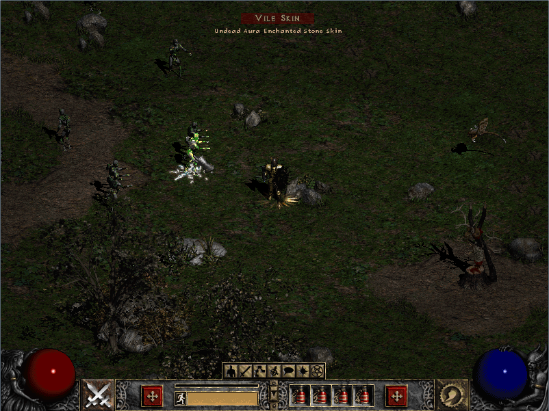
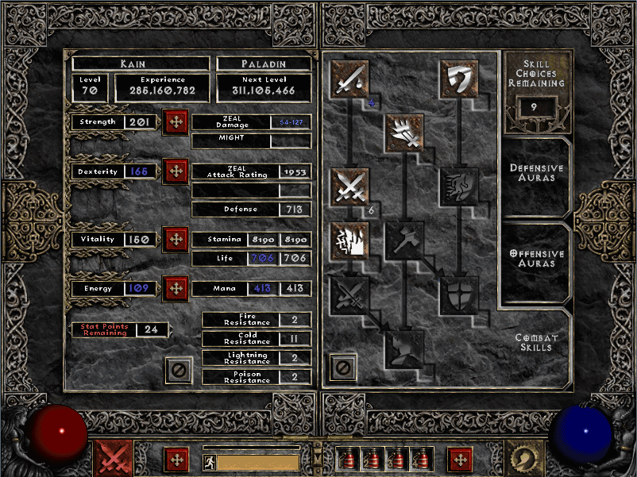
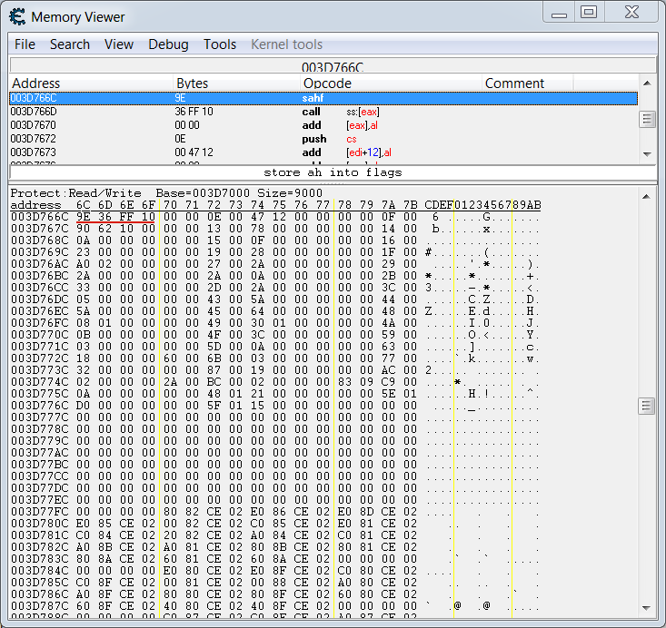
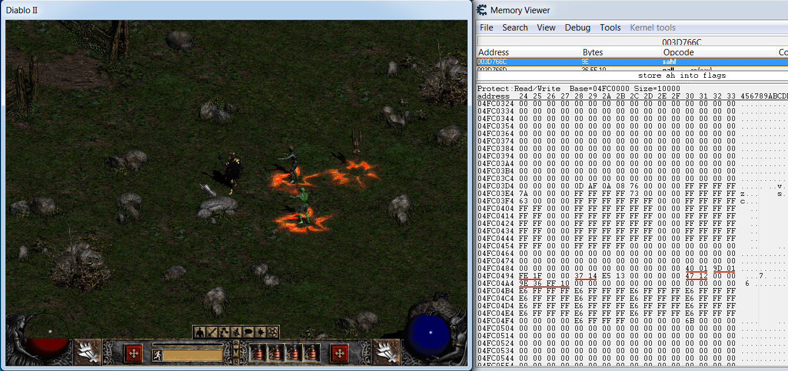
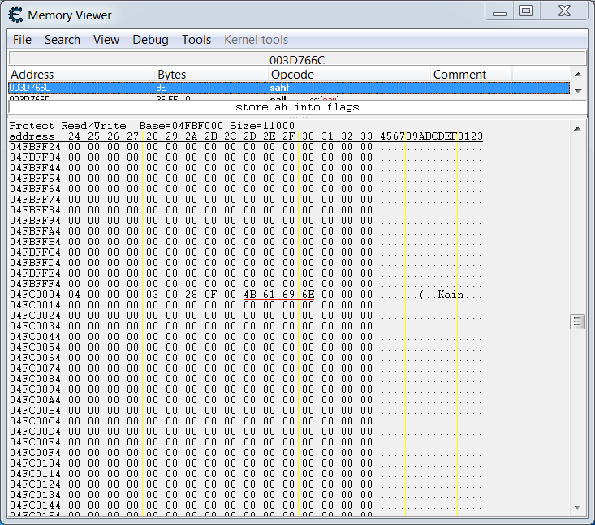
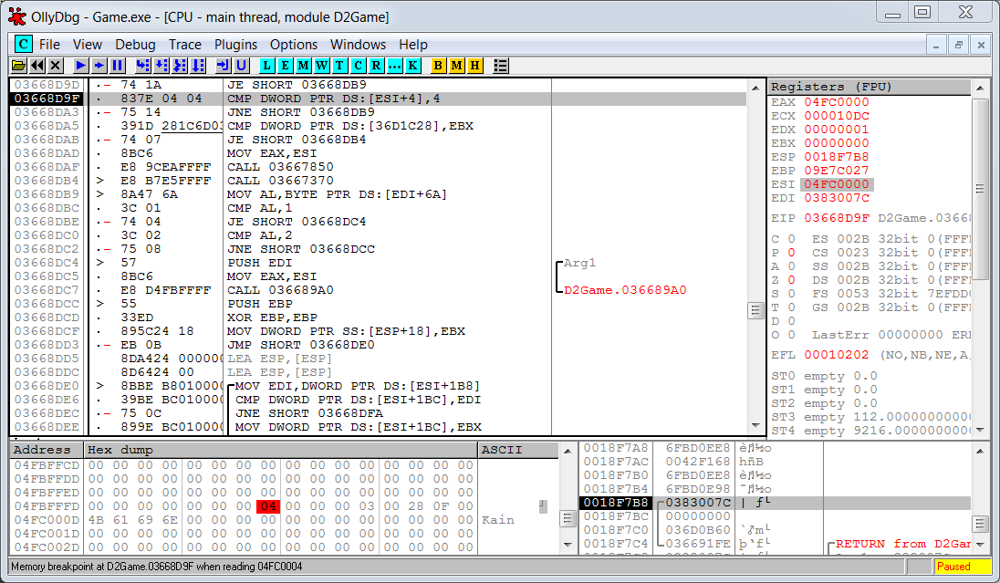
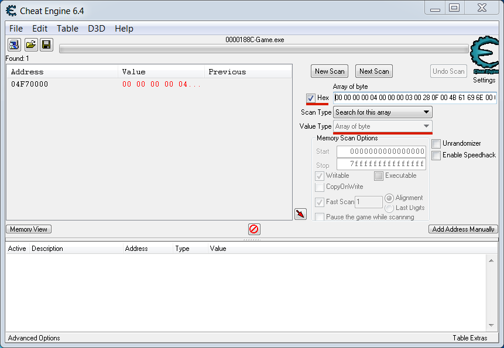

# Пример бота для Diablo 2

## Обзор игры Diablo 2

Мы узнали достаточно, чтобы написать простого внутриигрового бота. Он будет автоматизировать некоторые действия в известной RPG Diablo 2. Её игровой процесс типичен для жанра: игрок должен выполнять квесты, убивать монстров и развивать своего персонажа.

Наш бот будет следить за состоянием игрового персонажа. Как только один из его параметров (например здоровье) опустится ниже порогового значения, бот будет выполнять некоторое действие (например использовать зелье лечения).

Перед тем как начать писать код, познакомимся с интерфейсом игры. Скриншот окна Diablo 2 приведён на иллюстрации 3-15. В центре находится игровой персонаж. Слева и справа от него – монстры, один из которых выделен курсором мыши. В нижней части окна находится панель управления. На ней есть четыре слота с зельями лечения, которые привязаны к горячим клавишам. Наш бот будет использовать предметы в этих слотах по мере необходимости.



***Иллюстрация 3-15.** Скриншот окна Diablo 2*

Все параметры персонажа приведены на иллюстрации 3-16. На ней вы видите два открытых внутриигровых окна: левое и правое. В верхней части левого находится общая информация о персонаже: имя Kain, класс Paladin, уровень 70, очки опыта 285160782. Ниже указаны параметры персонажа, влияющие на игровую механику. Например, "Strength" (сила) определяет урон, наносимый противнику при ударе.



***Иллюстрация 3-16.** Параметры игрового персонажа*

Правое окно на иллюстрации 3-16 отображает дерево способностей персонажа. Способности позволяют наносить больше урона противникам. Каждая из них имеет уровень, который определяет её эффективность. Более подробная информация о параметрах и способностях персонажа доступна на [Wiki](https://diablo.gamepedia.com/Classes_(Diablo_II)).

В Diablo 2 есть два режима игры: однопользовательский и многопользовательский. Мы будем рассматривать только однопользовательский. В нём вы сможете останавливать игру под отладчиком в любой момент на неограниченное время, чтобы исследовать адресное пространство её процесса. В многопользовательском режиме этому будут мешать таймауты. Если игровой клиент не отвечает какое-то время, сервер его отключает.

Чтобы протестировать нашего бота, вы можете купить игру Diablo 2 на [официальном сайте](eu.shop.battle.net/en-b/product/diablo-ii) разработчика. Альтернативное решение – воспользоваться бесплатным клоном игры под названием [Flaire](http://flarerpg.org). В этом случае вам придётся немного изменить код бота самостоятельно. Diablo 2 отличается от своего клона интерфейсом и сложностью. Память процесса оригинальной игры намного сложнее анализировать из-за большого количество вспомогательных библиотек.

## Задачи бота

Прежде всего, чётко определим наши цели. Мы не собираемся взламывать игру, то есть нарушать её правила, и вмешиваться в механику игрового процесса. Примеры подобных взломов вы можете найти в статьях Jan Miller:

* extreme-gamerz.org/diablo2/viewdiablo2/hackingdiablo2

* www.battleforums.com/threads/howtohackd2-edition-2.111214

Наш бот следует правилам игры. Он реагирует на изменение состояния персонажа и симулирует действие. При этом параметры всех игровых объектов меняются согласно правилам. Процесс Diablo 2 продолжает работать по своим оригинальным алгоритмам так же, как если бы действия совершал игрок.

Мы рассмотрели параметры персонажа. Из них проще всего контролировать уровень здоровья. Он уменьшается, когда игрок получает урон от монстров. При использовании зелья лечения – увеличивается. Учитывая эту механику, наш бот может работать по следующему алгоритму:

1. Прочитать текущий уровень здоровья игрового персонажа.

2. Сравнить этот уровень с пороговым значением.

3. Если здоровье меньше порога, использовать зелье лечения.

Этот алгоритм позволит игровому персонажу выживать до тех пор, пока у него остаются зелья лечения. Однако, несмотря на кажущуюся простоту, для реализации бота нам придётся хорошо разобраться в структуре памяти процесса Diablo 2.

## Исследование памяти процесса Diablo 2

Мы готовы приступить к исследованию памяти процесса Diablo 2. Наша задача – найти переменную, которая хранит значение текущего здоровья персонажа.

Выполним предварительную настройку окна Diablo 2, чтобы с ним было удобнее работать. Сразу после установки игра запускается в полноэкранном режиме. Это неудобно, если приходится часто переключаться на отладчик или сканер памяти.

Чтобы запустить игру в оконном режиме, выполните следующие действия:

1. Щёлкните правой кнопкой мыши по иконке "Diablo II" на рабочем столе. В открывшемся меню выберите пункт "Properties" (свойства).

2. В диалоге "Properties" перейдите на вкладку "Shortcut" (ярлык).

3. В поле "Target" (объект) добавить параметр "-w". В результате полная команда запуска приложения будет выглядеть так:
```
"C:\DiabloII\Diablo II.exe" -w
```

Если вы запустите Diablo 2 через настроенную иконку на рабочем столе, приложение откроется в оконном режиме. Чтобы начать игру, нажмите кнопку "Single player" (одиночная игра) в главном меню и создайте нового персонажа.

### Поиск параметров персонажа

Найдём уровень здоровья игрового персонажа в памяти процесса Diablo 2. Для этого воспользуемся сканером Cheat Engine. Он разработан именно для решения подобных задач.

Если вы попробуйте найти уровень здоровья по его текущему значению без предварительной настройки Cheat Engine, поиск не даст результата. Вероятнее всего, после первого сканирования вы получите длинный список предполагаемых адресов. При повторном поиске (кнопка "Next Scan") после изменения уровня здоровья персонажа, список результатов станет пустым.

Прямолинейный подход не заработал. Это совершенно нормально для больших и сложных приложений, как Diablo 2. В памяти процесса находится очень много игровых объектов, причём параметры некоторых из них совпадают. Мы не знаем, как именно они хранятся в памяти. Поэтому будет разумно сначала разобраться с этим вопросом. Если мы сможем найти нужный нам объект в памяти, получить доступ к его параметрам будет очень просто.

Еще раз обратимся к окну с параметрами игрового персонажа. Значения некоторых из них наверняка уникальны и не встречаются у других игровых объектов. Какие именно? Возможны следующие варианты:

1. **Имя персонажа**
Очень маловероятно, что есть объект с тем же именем, которое игрок дал своему персонажу. Если это всё-таки произошло, всегда можно создать нового персонажа с другим уникальным именем.

2. **Очки опыта**
Это длинное положительное целочисленное число. Число такого размера может встретиться в другом объекте только случайно. Если Cheat Engine всё же нашел несколько потенциальных адресов, очки опыта персонажа очень просто увеличить. Убейте одного-двух монстров и выполните повторное сканирование памяти кнопкой "Next Scan".

3. **Значение выносливости**
Это ещё одно длинное число, которое определяет, как долго игрок способен быстро двигаться по карте. Его очень просто уменьшить: для этого достаточно перемещать персонажа вне города.

Из всех вариантов, предлагаю искать очки опыта персонажа. Если вы только начали игру, вам нужно убить нескольких монстров, чтобы этот параметр стал больше нуля. Иллюстрация 3-17 демонстрирует окно Cheat Engine с возможным результатом поиска. Сканер нашёл несколько переменных с одинаковым значением. Только некоторые из них относятся к объекту игрового персонажа. Другие могут быть связаны с интерфейсом игры и выводом информации на экран.


***Иллюстрация 3-17.** Результаты поиска параметра игрового персонажа*

Теперь определим, какие из найденных параметров относятся к объекту персонажа. Тип сегмента, в котором они хранятся, может дать нам подсказку.

Запустите отладчик WinDbg, подключитесь к работающему процессу Diablo 2 и выполните команду `!address`. Сегменты с найденными параметрами выглядят следующим образом:
```
+ 0`003c0000  0`003e0000  0`00020000  MEM_PRIVATE MEM_COMMIT PAGE_READWRITE <unknown>
+ 0`03840000  0`03850000  0`00010000  MEM_PRIVATE MEM_COMMIT PAGE_READWRITE <unknown>
+ 0`03850000  0`03860000  0`00010000  MEM_PRIVATE MEM_COMMIT PAGE_READWRITE <unknown>
+ 0`04f50000  0`04fd0000  0`00080000  MEM_PRIVATE MEM_COMMIT PAGE_READWRITE <unknown>
```
Отладчик не смог определить тип этих сегментов и указал, что он неизвестен ("unknown"). Мы знаем, что WinDbg умеет корректно определять сегменты стека и динамической памяти. Если тип неизвестен, скорее всего, это не первое и не второе.

Сегменты неизвестного типа может выделять WinAPI функция `VirtualAllocEx`. Чтобы это проверить, воспользуемся простым тестовым приложением. Файл `VirtualAllocEx.cpp` с его исходным кодом есть в архиве с примерами для этой книги. Если вы запустите приложение под отладчиком WinDbg и прочитаете его адресное пространство, вы увидите один сегмент с неизвестным типом. Функция `VirtualAllocEx` выделяет его и возвращает базовый адрес.

Вернемся к процессу Diablo 2. Все сегменты, хранящие переменные со значением очков опыта персонажа, имеют одинаковый тип. Следовательно, мы не сможем их отличить по этому признаку. Это важно, поскольку после перезапуска игры, порядок следования сегментов может измениться. Если мы не сможем их отличить, мы не определим сегмент, в котором находится игровой объект персонажа. Размер сегмента тоже не подходит в качестве критерия проверки, потому что он совпадает у двух сегментов.

Попробуем другой подход. Очевидно, что параметры персонажа меняются, когда игрок совершает действия. Например, после любого перемещения персонажа по карте, его координата изменится. Мы можем следить за такими изменениями в области памяти около найденных нами адресов параметра очков опыта. У Cheat Engine есть возможность отображения области памяти в реальном времени. Чтобы ей воспользоваться, надо открыть окно Memory Viewer (просмотрщик памяти). Для этого выполните следующие шаги:

1. Выберите один из адресов в списке результатов поиска.

2. Щелкните по нему правой кнопкой мыши.

3. Выберите пункт "Browse this memory region" (просмотреть эту область памяти) в открывшемся меню.

Откроется окно Memory Viewer, как показано на иллюстрации 3-18. Оно разделено на две части. В верхней части выводится область памяти около выбранного адреса в виде **дизассемблированного кода**. Это значит, что Cheat Engine пытается представить данные в виде инструкций процессора. В нижней части окна отображаются данные той же самой области памяти в шестнадцатеричном формате. Обе части окна Memory Viewer выводят одни и те же данные, но представленные в разном виде.

Нас интересует нижняя половина окна. Данные, соответствующие очкам опыта персонажа, подчеркнуты красным на иллюстрации 3-18. В моём примере персонаж имеет 285161118 очков опыта.

Почему последовательность байт "9E 36 FF 10" равна числу 285161118? Мы запускаем Diablo 2 на процессоре с архитектурой x86, которая имеет [**порядок байт**](https://ru.wikipedia.org/wiki/Порядок_байтов) от младшего к старшему (little-endian byte order). Следовательно, значение из окна Memory Viewer нужно перевернуть, чтобы получить правильно число. Другими словами, последовательность байтов "9E 36 FF 10" надо интерпретировать как "10 FF 36 9E". Вы можете воспользоваться стандартным приложением Windows Calculator, чтобы перевести число 10FF369E в десятичную систему и получить 285161118.



***Иллюстрация 3-18.** Окно Memory Viewer сканера Cheat Engine*

Окно Memory Viewer позволяет настроить формат вывода данных. Для этого щелкните правой кнопкой мыши в любом месте нижней половины окна и выберите пункт "Display Type" (тип отображения) в открывшемся меню. Дальше вы можете выбрать нужный вам тип. Однако, я рекомендую всегда пользоваться форматом "Byte hex", как на иллюстрации 3-18. Другие форматы могут вызвать путаницу, потому что объединяют соседние байты в числа. Когда размер искомых чисел неизвестен, их фрагменты могут объединяться неправильно.

Теперь попробуем проследить изменения данных в областях памяти. Для удобства размести окна Memory Viewer и Diablo 2 рядом, но без перекрытия, как изображено на иллюстрации 3-19. Это позволит вам одновременно управлять персонажем и следить за изменениями в памяти.



***Иллюстрация 3-19.** Исследование изменений в памяти процесса Diablo 2*

В окне Memory Viewer, приведённом на иллюстрации 3-19, открыта область памяти около адреса 04FC04A4. Это один из адресов, который мы получили при поиске очков опыта персонажа. Вам нужно исследовать области около каждого из них.

Как мы поймём, что нашли объект игрового персонажа в памяти? Предлагаю простое правило: если объект хранит больше параметров персонажа, чем другие, – его информация наиболее полная, и боту следует использовать именно его. В моём случае этот объект имеет адрес 04FC04A4 и находится последним в списке результатов сканирования Cheat Engine.

Таблица 3-6 демонстрирует параметры, которые мы обнаружили в объекте.

***Таблица 3-6.** Найденные параметры игрового объекта*

| Параметр | Адрес | Смещение | Размер | Шестнадцатеричное значение | Десятичное значение |
| -- | -- | -- | -- | -- | -- |
| Здоровье | 04FC0490 | 490 | 2 | 40 01 | 320 |
| Мана | 04FC0492 | 492 | 2 | 9D 01 | 413 |
| Выносливость | 04FC0494 | 494 | 2 | FE 1F | 8190 |
| Координата X | 04FC0498 | 498 | 2 | 37 14 | 5175 |
| Координата Y | 04FC04A0 | 4A0 | 2 | 47 12 | 4679 |
| Очки опыта | 04FC04A4 | 4A4 | 4 | 9E 36 FF 10 | 285161118 |

Эти параметры подчёркнуты красным на иллюстрации 3-19. Чтобы их обнаружить, я выполнял следующие игровые действия:

1. Оставаться на месте и получать урон от атакующего монстра. В этом случае уменьшается только параметр здоровья по адресу 04FC0490.

2. Оставаться на месте и использовать любую способность. В этом случае уменьшается запас маны персонажа. Соответствующая переменная находится по адресу 04FC0492.

3. Перемещаться бегом вне города. При этом действии меняются сразу три параметра: выносливость, координаты X и Y. Если персонаж бегает достаточно долго, его выносливость уменьшится до нуля. Тогда можно отличить в памяти её значение (по адресу 04FC0494) от координат. Если перемещать персонажа только в горизонтальном или вертикальном направлении будет меняться одна из координат (X по адресу 04FC0498 или Y по 04FC04A0).

4. Убить любого монстра. В результате увеличатся очки опыта персонажа. Адрес соответствующей переменой равен 04FC04A4. Этот параметр легко отличить от уровней здоровья и маны, поскольку они наоборот обычно уменьшаются во время сражения с монстрами.

Что мы узнали нового о параметрах персонажа? Во-первых, уровень здоровья хранится в двухбайтовой переменной. Следовательно, чтобы найти его в памяти, надо указать "2 Byte" в поле "Value Type" (тип значения) окна Cheat Engine перед поиском.

Также мы выяснили, что у некоторых параметров нет четырехбайтового выравнивания. Это означает, что их адреса не кратны четырём. Например, уровень маны по адресу 04FC0492. Чтобы найти значения таких параметров, вам надо убрать галочку "Fast Scan" (быстрое сканирование) в окне Cheat Engine.

Правильная конфигурация Cheat Engine для поиска параметров игрового персонажа приведена на иллюстрации 3-20. Красным подчёркнуты изменённые настройки.


***Иллюстрация 3-20.** Конфигурация Cheat Engine*

Возможно, вы обратили внимание на столбец "Смещение" в таблице 3-6. В нём указаны смещения каждого параметра относительно адреса начала объекта. Рассмотрим, как найти этот адрес в памяти процесса.

### Поиск объекта в памяти

Задумаемся над тем, как наш бот будет искать параметр здоровья персонажа в памяти процесса Diablo 2. Эту задачу можно разделить на два этапа:

1. Найти объект персонажа.

2. Добавить к адресу объекта постоянное смещение, чтобы получить адрес параметра.

Можем ли мы быть уверены, что смещение параметра будет всегда постоянным? Если приложение написано на C++ или C (обычно именно эти языки применяют для разработки игр), параметры игрового объекта, скорее всего, будут храниться в структуре или классе (особый вид структуры). Структура – это тип, в котором все поля и их порядок жёстко определены. Поэтому при каждом запуске приложения смещение полей структуры от её начала остаётся неизменным.

Мы знаем, как искать игровой объект в памяти приложения с помощью Cheat Engine. К сожалению, наш бот не может пользоваться сканером памяти. Точнее такое решение было бы слишком громоздким. Вместо этого, он должен полагаться на собственные алгоритмы. Поэтому нам нужно найти способ поиска объекта на единственном снимке памяти, который доступен боту через WinAPI функции.

Прокрутите окно Memory Viewer вверх от переменной с очками опыта в сторону младших адресов. Вы обнаружите имя персонажа, как на иллюстрации 3-21. Четыре байта, подчёркнутых красным, представляют собой строку "Kain". Обратите внимание, что порядок байтов для строк не перевернут на процессорах с little-endian архитектурой. Причина в том, что внутренняя структура ASCII строк и массивов с элементами в один байт совпадает. Процессор обрабатывает байтовые массивы поэлементно, то есть читает в свои регистры по одному байту и никаких перестановок не происходит.

Ещё раз посмотрите на иллюстрацию 3-21. Легко заметить, что область памяти в сторону младших адресов от имени персонажа занулена. Предположим, что это признак границы игрового объекта. Можем ли мы проверить эту гипотезу?

Воспользуемся OllyDbg, чтобы поставить точку останова (breakpoint) на адрес переменной с именем персонажа. Когда какой-то код процесса Diablo 2 попытается прочитать или записать значение по этому адресу, процесс остановится и отладчик получит управление. Мы сможем проанализировать этот код и, возможно, найдём признаки начала игрового объекта.



***Иллюстрация 3-21.** Имя персонажа в памяти процесса*

Алгоритм поиска границ объекта с помощью отладчика OllyDbg выглядит следующим образом:

1. Запустите отладчик с правами администратора и подключитесь к уже запущенному процессу Diablo 2.

2. Щёлкните правой кнопкой мыши в левом нижнем окне OllyDbg и переключитесь на шестнадцатеричный формат [**дампа памяти**](https://ru.wikipedia.org/wiki/Дамп_памяти).

3. Нажмите комбинацию клавиш Ctrl+G, чтобы открыть диалог "Enter expression to follow" (ввести выражение для перехода) для поиска адреса в памяти.

4. Введите адрес строки с именем персонажа в поле "Enter address expression" (ввести адрес выражения) диалога поиска. В моём случае это адрес 04FC000D. Нажмите кнопку "Follow expression" (перейти к выражению). Теперь курсор в окне с дампом памяти указывает на первый байт строки.

5. Прокрутите окно дампа памяти вверх, чтобы найти первый ненулевой байт, с которого предположительно начинается объект персонажа. Выделите этот байт щелчком левой кнопки мыши.

6. Нажмите комбинацию клавиш Shift+F3, чтобы открыть диалог "Set memory breakpoint" для установки точки останова. Выберите в диалоге галочки "Read access" (доступ на чтение) и "Write access" (доступ на запись), чтобы точка останова срабатывала на чтение и запись по выбранному адресу памяти. Нажмите кнопку "OK".

7. Нажмите F9, чтобы продолжить выполнение процесса Diablo 2. Он остановится несколько раз. Продолжайте его выполнение по нажатию F9, пока процесс не будет стабильно работать. В этом случае вы увидите состояние "Running" в правом нижнем углу окна отладчика.

8. Переключитесь на окно Diablo 2. Сразу после этого сработает наша точка останова.

9. Переключитесь на окно OllyDbg. Оно должно выглядеть также, как на иллюстрации 3-22.

Дизассемблированный код процесса отображается в левом верхнем окне отладчика. Инструкция процессора с адресом 03668D9F, исполнение которой вызвало срабатывание нашей точки останова, выделена серой линией:
```assembly
CMP DWORD PTR DS:[ESI+4], 4
```
Эта инструкция сравнивает константу 4 и число типа DWORD, хранящееся по адресу "ESI + 4". Регистр **ESI** используется для указания на источник данных в инструкциях процессора. Регистр **DS** хранит базовый адрес сегмента с данными. Как правило, регистры ESI и DS используются совместно. В правом верхнем окне отладчика отображается текущее значение всех регистров процессора. ESI хранит адрес 04FC0000.



***Иллюстрация 3-22.** Точка останова на начале объекта игрового персонажа*

Изучим дизассемблированный код после инструкции, на которой сработала точка останова. На иллюстрации 3-22 найдите следующий код, начинающийся по адресу 03668DE0:
```assembly
MOV EDI,DWORD PTR DS:[ESI+1B8]
CMP DWORD PTR DS:[ESI+1BC],EDI
JNE SHORT 03668DFA
MOV DWORD PTR DS:[ESI+1BC],EBX
```
Эти инструкции выглядят как обращения к полям C++ или C структуры. Константы 1B8 и 1BC – это смещения полей от её начала. Если вы прокрутите дизассемблированный код ниже, вы найдёте ещё несколько подобных обращений. Следовательно, адрес начала структуры, в которой хранятся параметры игрового персонажа, равен 04FC0000, то есть текущему значению регистра ESI.

Теперь мы можем вычислить смещение параметра здоровья от начала структуры:
```
04FC0490 - 04FC0000 = 0x490
```
Смещение равно 490 в шестнадцатеричной системе счисления.

Следующий вопрос: как бот найдёт адрес начала объекта игрового персонажа в памяти? Мы знаем, что этот объект хранится в сегменте неизвестного (unknown) типа, размер которого 80000 байт в шестнадцатеричной системе. У сегмента есть три флага: MEM\_PRIVATE, MEM\_COMMIT и PAGE\_READWRITE. В адресном пространстве процесса Diablo 2 есть минимум десять сегментов этого же типа, размера и с теми же флагами. Следовательно, мы не можем просто перебрать все сегменты и найти нужный по этим признакам.

Ещё раз рассмотрим первые несколько байт объекта персонажа:
```
00 00 00 00 04 00 00 00 03 00 28 0F 00 4B 61 69 6E 00 00 00
```
Если перезапустить игру и найти объект снова, эти байты будут теми же. Можно предположить, что эта последовательность байтов представляет собой неизменяемые параметры персонажа. Они задаются однократно при его создании и больше никогда не меняются.

Список неизменяемых параметров персонажа следующий:

* Имя.

* Флаг, означающий что персонаж играет в [расширенную версию Diablo 2](https://diablo.fandom.com/wiki/Expansion_Character).

* Флаг [hardcore режима](https://diablo.fandom.com/wiki/Hardcore). Он означает, что игра закончится после первой смерти персонажа.

* Класс персонажа.

Последовательность неизменных байтов в начале объекта можно использовать как цель для поиска. Назовём её [**магическим числом** или сигнатурой](https://ru.wikipedia.org/wiki/%D0%9C%D0%B0%D0%B3%D0%B8%D1%87%D0%B5%D1%81%D0%BA%D0%BE%D0%B5_%D1%87%D0%B8%D1%81%D0%BB%D0%BE_(%D0%BF%D1%80%D0%BE%D0%B3%D1%80%D0%B0%D0%BC%D0%BC%D0%B8%D1%80%D0%BE%D0%B2%D0%B0%D0%BD%D0%B8%D0%B5%29) Учтите, что в вашем случае эта последовательность будет отличаться.

Проверим предположение о неизменных параметрах с помощью Cheat Engine. Запустите сканер и подключитесь к процессу Diablo 2. Выберите пункт "Array of byte" (массив байт) в поле "Value Type". Затем выберите галочку "Hex" и скопируйте свою последовательность байт в поле "Array of byte". Ожидаемый результат поиска представлен на иллюстрации 3-23.



***Иллюстрация 3-23.** Поиск объекта игрового персонажа в памяти процесса Diablo 2*

Если вы перезапустите игру, адрес объекта изменится. На иллюстрации 3-23 он равен 04F70000. Тем не менее, смещения всех параметров персонажа внутри объекта остаются неизменными. Исходя из этого, абсолютный адрес уровня здоровья персонажа в нашем случае будет равен 04F70490, т.к. его смещение равно 490.

Есть альтернативный способ найти уровень здоровья персонажа с помощью Cheat Engine. Он может быть полезен при первоначальном анализе памяти игрового приложения. Cheat Engine предоставляет функцию сканирования указателей (pointer scanning). С её помощью можно найти базовый адрес и смещение переменной после нескольких этапов сканирования памяти процесса. К сожалению, в некоторых случаях эта функция не работает. Подробнее о ней можно узнать в [статье](https://sethioz.com/mediawiki/index.php/Pointer_Scanning_/_Finding_Pointer).

## Реализация бота

Мы собрали всю необходимую информацию, чтобы реализовать нашего внутриигрового бота. Составим подробный алгоритм его работы:

1. Предоставить привилегию `SE_DEBUG_NAME` процессу бота.

2. Подключиться к процессу Diablo 2 для доступа к его памяти.

3. Искать объект игрового персонажа в адресном пространстве игры.

4. Вычислить абсолютный адрес параметра здоровья персонажа.

5. Читать значение параметра в бесконечном цикле. Как только оно опустится ниже 100 пунктов, использовать зелье лечения.

Мы уже рассмотрели реализацию первого шага алгоритма в предыдущем разделе этой главы.

Второй шаг алгоритма можно реализовать двумя способами:

1. Указать PID целевого процесса в коде бота, как мы делали в предыдущих примерах.

2. Определять PID динамически по активному в данный момент окну.

Во втором случае важно следить, чтобы в момент запуска бота было активно именно окно Diablo 2. Благодаря этому подходу, им будет намного удобнее пользоваться, поскольку его не придётся перекомпилировать с корректным PID целевого процесса перед каждым запуском.

Листинг 3-11 демонстрирует чтение PID и подключение к процессу Diablo 2.

***Листинг 3-11.** Код подключения к процессу*
```C++
int main()
{
    Sleep(4000);

    HWND wnd = GetForegroundWindow();
    DWORD pid = 0;
    if (!GetWindowThreadProcessId(wnd, &pid))
    {
        printf("Error of the pid detection\n");
        return 1;
    }

    HANDLE hTargetProc = OpenProcess(PROCESS_ALL_ACCESS, FALSE, pid);
    if (!hTargetProc)
    {
        printf("Failed to open process: %u\n", GetLastError());
    }
    return 0;
}
```
Перед началом работы мы ждём четыре секунды с помощью WinAPI функции `Sleep`. Этого времени должно быть достаточно, чтобы вы успели переключиться на окно Diablo 2.

Для чтения PID процесса мы использовали две новые WinAPI функции: 

1. `GetForegroundWindow` возвращает дескриптор активного в данный момент окна.

2. `GetWindowThreadProcessId` возвращает PID процесса, который владеет окном, указанным по его дескриптору.

Прочитанный PID активного окна сохраняется в переменную `pid`.

Третий шаг алгоритма заключается в поиске объекта игрового персонажа в памяти процесса. Для этого предлагаю воспользоваться подходом, описанном в серии [видеоуроков](https://www.youtube.com/watch?v=YRPMdb1YMS8). В них рассматривается разработка простого сканера памяти, алгоритм работы которого очень похож на Cheat Engine. Идея заключается в переборе всех сегментов процесса Diablo 2 с помощью WinAPI функции `VirtualQueryEx`.

Код для поиска объекта персонажа в памяти процесса приведён в листинге 3-12.

***Листинг 3-12.** Код поиска игрового объекта в памяти процесса*
```C++
SIZE_T IsArrayMatch(HANDLE proc, SIZE_T address, SIZE_T segmentSize, BYTE array[], SIZE_T arraySize)
{
    BYTE* procArray = new BYTE[segmentSize];

    if (ReadProcessMemory(proc, (void*)address, procArray, segmentSize, NULL) != 0)
    {
        printf("Failed to read memory: %u\n", GetLastError());
        delete[] procArray;
        return 0;
    }

    for (SIZE_T i = 0; i < segmentSize; ++i)
    {
        if ((array[0] == procArray[i]) && ((i + arraySize) < segmentSize))
        {
            if (!memcmp(array, procArray + i, arraySize))
            {
                delete[] procArray;
                return address + i;
            }
        }
    }

    delete[] procArray;
    return 0;
}

SIZE_T ScanSegments(HANDLE proc, BYTE array[], SIZE_T size)
{
    MEMORY_BASIC_INFORMATION meminfo;
    LPCVOID addr = 0;
    SIZE_T result = 0;

    if (!proc)
        return 0;

    while (1)
    {
        if (VirtualQueryEx(proc, addr, &meminfo, sizeof(meminfo)) == 0)
            break;

        if ((meminfo.State & MEM_COMMIT) && (meminfo.Type & MEM_PRIVATE) && (meminfo.Protect & PAGE_READWRITE) && !(meminfo.Protect & PAGE_GUARD))
        {
            result = IsArrayMatch(proc, (SIZE_T)meminfo.BaseAddress, 
                    meminfo.RegionSize, array, size);

            if (result != 0)
                return result;
        }
        addr = (unsigned char*)meminfo.BaseAddress + meminfo.RegionSize;
    }
    return 0;
}

int main()
{
    // Предоставить SE_DEBUG_NAME привилегию текущему процессу

    // Подключиться к процессу Diablo 2

    BYTE array[] = { 0, 0, 0, 0, 0x04, 0, 0, 0, 0x03, 0, 0x28, 0x0F, 0, 0x4B, 0x61, 0x69, 0x6E, 0, 0, 0 };

    SIZE_T objectAddress = ScanSegments(hTargetProc, array, sizeof(array));

    return 0;
}
```
Алгоритм прохода по сегментам памяти целевого процесса реализован в функции `ScanSegments`. Она возвращает указатель на объект персонажа и принимает на вход три параметра:

1. Дескриптор процесса Diablo 2.

2. Указатель на искомую последовательность байт.

3. Размер последовательности.

Алгоритм `ScanSegments` состоит из следующих шагов:

1. Прочитать сегмент памяти с базовым адресом равным переменной `addr` с помощью функции `VirtualQueryEx`.

2. Проверить совпадают ли флаги прочитанного сегмента с флагами искомого. Если нет, перейти к следующему сегменту.

3. Искать последовательность байт, характерную для объекта персонажа в прочитанном сегменте.

4. Если последовательность найдена, вернуть её абсолютный адрес. Иначе читать следующий сегмент.

Алгоритм поиска последовательности байт в сегменте реализован в функции `IsArrayMatch`. Он выглядит следующим образом:

1. Прочитать все данные из указанного сегмента с помощью WinAPI функции `ReadProcessMemory`.

2. Искать в этих данных последовательность путём побайтного сравнения.

---
Не забывайте, что искомая последовательность байт отличается в вашем случае.
---

Четвертый шаг общего алгоритма бота – это вычисление абсолютного адреса параметра здоровья персонажа. Для этого воспользуемся переменной `objectAddress`, хранящей результат вызова функции `ScanSegments`. Прибавим к ней смещение параметра в объекте по следующей формуле:
```C++
SIZE_T hpAddress = objectAddress + 0x490;
```
Теперь абсолютный адрес, по которому можно прочитать параметр здоровья, находится в переменной `hpAddress`.

Последним действием бот проверяет уровень здоровья персонажа. Если он оказался ниже порогового значения, бот должен использовать зелье лечения. Реализация этой проверки приведена в листинге 3-13.

***Листинг 3-13.** Код проверки уровня здоровья персонажа*
```C++
WORD ReadWord(HANDLE hProc, DWORD_PTR address)
{
    WORD result = 0;

    if (ReadProcessMemory(hProc, (void*)address, &result, sizeof(result), NULL) == 0)
        printf("Failed to read memory: %u\n", GetLastError());

    return result;
}

int main()
{
    // Предоставить SE_DEBUG_NAME привилегию текущему процессу

    // Подключиться к процессу Diablo 2

    // Искать объект игрового персонажа в памяти процесса Diablo 2

    // Вычислить абсолютный адрес переменной с уровнем здоровья персонажа

    ULONG hp = 0;

    while (1)
    {
        hp = ReadWord(hTargetProc, hpAddress);
        printf("HP = %lu\n", hp);

        if (hp < 100)
            PostMessage(wnd, WM_KEYDOWN, 0x31, 0x1);

        Sleep(2000);
    }
    return 0;
}
```
Здоровье персонажа читается в бесконечном `while` цикле с помощью функции `ReadWord`, которая представляет собой обёртку для WinAPI вызова `ReadProcessMemory`. Прочитав значение здоровья, бот выводит его на консоль. Это позволит вам проверить, что параметр найден правильно. Сравните его значение с тем, что выводится в окне Diablo 2. Если уровень здоровья окажется меньше 100, бот симулирует нажатие горячей клавиши "1". По нему игровой персонаж использует зелье лечения. Для симуляции нажатия клавиши вызывается WinAPI функция `PostMessage`.

Вы можете возразить, что использование функции `PostMessage` – это не встраивание данных в память процесса, характерное для внутриигровых ботов. Вместо модификации памяти, мы внедряем сообщение `WM_KEYDOWN`, которое соответствует нажатию клавиши, в очередь сообщений процесса Diablo 2. Мы используем этот способ симуляции действий игрока для упрощения кода нашего примера. Более сложный подход рассматривается далее.

Параметры функции `PostMessage` описаны в таблице 3-7.

***Таблица 3-7.** Параметры функции `PostMessage`*

| Параметр | Описание |
| --- | --- |
| `wnd` | Дескриптор окна. Создавший это окно процесс получит сообщение. |
| `WM_KEYDOWN` | Код сообщения. |
| `0x31` | [**Виртуальный код**](http://msdn.microsoft.com/en-us/library/windows/desktop/dd375731(v=vs.85).aspx) нажатой клавиши. |
| `0x1` | Параметры нажатия. Самый важный из них – число срабатываний нажатия (хранится в битах с 0 по 15). |

---
Симуляция нажатия клавиши не сработает, если четвёртый параметр функции `PostMessage` равен нулю.
---
Полная реализация бота доступна в файле `AutohpBot.cpp` из архива примеров к этой книге.

Для тестирования бота выполните следующие действия:

1. Измените последовательность байт для поиска так, чтобы она соответствовала вашему персонажу. В исходном коде бота это строка:
```C++
BYTE array[] = { 0, 0, 0, 0, 0x04, 0, 0, 0, 0x03, 0, 0x28, 0x0F, 0, 0x4B, 0x61, 0x69, 0x6E, 0, 0, 0 };
```
2. Скомпилируйте бота с новой последовательностью байт.

3. Запустите Diablo 2 в оконном режиме.

4. Запустите бота с правами администратора.

5. В течение четырёх секунд после старта бота переключитесь на окно Diablo 2. После этой задержки, бот подключится к процессу игры и начнёт следить за уровнем здоровья персонажа.

6. Найдите в игре монстра и получите от него урон так, чтобы здоровье персонажа опустилось ниже 100 пунктов.

В результате бот симулирует нажатие горячей клавиши "1".

Не забудьте привязать к панели горячих клавиш зелье лечения. Для вызова справки по интерфейсу игры, нажмите клавишу H. Панель "Belt" (пояс) горячих клавиш находится в правой нижней части экрана. Вы можете перенести на неё зелья лечения левой кнопкой мыши.

## Дальнейшие улучшения

Есть несколько изменений, которые могут значительно улучшить нашего бота. Рассмотрим их подробнее.

Главная проблема бота в том, что он нажимает только одну горячую клавишу из четырёх доступных. Из-за этого персонаж не будет использовать все зелья лечения, которые у него есть. Чтобы исправить это, перепишем цикл проверки параметра здоровья, как предлагается в листинге 3-14.

***Листинг 3-14.** Использование всех слотов панели горячих клавиш*
```C++
    ULONG hp = 0;
    BYTE keys[] = { 0x31, 0x32, 0x33, 0x34 };
    BYTE keyIndex = 0;

    while (1)
    {
        hp = ReadWord(hTargetProc, hpAddress);
        printf("HP = %lu\n", hp);

        if (hp < 100)
        {
            PostMessage(wnd, WM_KEYDOWN, keys[keyIndex], 0x1);
            ++keyIndex;
            if (keyIndex == sizeof(keys))
                keyIndex = 0;
        }
        Sleep(2000);
    }
```
Теперь мы храним список горячих клавиш в байтовом массиве `keys`. Для его индексации используется переменная `keyIndex`. Она инкрементируется после каждого применения зелья лечения. При достижении конца массива, `keyIndex` сбрасывается в ноль. Таким образом бот будет использовать все слоты панели горячих клавиш. Когда зелья лечения в первом ряду панели закончатся, бот перейдёт ко второму ряду и т.д.

Бота можно улучшить, если мы добавим функцию контроля за уровнем маны персонажа. Для этого подойдёт такой же алгоритм, как и для проверки здоровья. Чтобы восстанавливать ману, бот может использовать специальное зелье.

Сейчас бот симулирует нажатие клавиши с помощью функции `PostMessage`. Вместо этого он может писать новое значение здоровья персонажа прямо в память процесса Diablo 2. Листинг 3-15 демонстрирует соответствующий код.

***Листинг 3-15.** Запись нового значения параметра персонажа в память процесса*
```C++
void WriteWord(HANDLE hProc, DWORD_PTR address, WORD value)
{
    if (WriteProcessMemory(hProc, (void*)address, &value, sizeof(value), NULL) == 0)
        printf("Failed to write memory: %u\n", GetLastError());
}

int main()
{
    // Предоставить SE_DEBUG_NAME привилегию текущему процессу

    // Подключиться к процессу Diablo 2

    // Искать объект игрового персонажа в памяти процесса Diablo 2

    // Вычислить абсолютный адрес переменной с уровнем здоровья персонажа

    ULONG hp = 0;

    while (1)
    {
        hp = ReadWord(hTargetProc, hpAddress);
        printf("HP = %lu\n", hp);

        if (hp < 100)
            WriteWord(hTargetProc, hpAddress, 100);

        Sleep(2000);
    }
    return 0;
}
```
Запись нового значения параметра персонажа происходит через WinAPI функцию `WriteProcessMemory`. Для удобства работы с ней используется обёртка `WriteWord`. Теперь если уровень здоровья персонажа становится меньше 100, бот переписывает его значением 100 в памяти процесса. У этого подхода есть один серьёзный недостаток – он нарушает игровую механику. Параметр объекта меняется в обход алгоритмов игры. По этой причине состояние объекта может стать неконсистентным.

Попробуйте протестировать версию бота из листинга 3-15. В большинстве случаев уровень здоровья персонажа не будет меняться после записи нового значения. Причина в том, что приложение хранит этот параметр в нескольких местах (не только в объекте персонажа, который мы нашли). После записи ботом нового значения, у приложения есть несколько несовпадающих переменных для одного и того же параметра. Очевидно, что механика игры не может корректно обработать эту ситуацию, и происходят ошибки. Запись данных в память процесса работает только в простых играх без многочисленных копий параметров объектов.

Есть ещё один способ встраивания данных в память процесса игрового приложения. Он основан на техниках внедрения кода, описанных в следующих статьях:

* www.codeproject.com/Articles/4610/Three-Ways-to-Inject-Your-­Code-into-Another-Proces

* www.codeproject.com/Articles/9229/RemoteLib-DLL-Injection-for-Win-x-NT-Platforms

Идея заключается в том, чтобы заставить игровое приложение исполнять код бота в своём адресном пространстве. Если это удастся, бот сможет вызывать любую функцию игры или её библиотек. В этом случае не нужно симулировать нажатие клавиши. Можно просто напрямую вызвать функцию самой игры типа "UseHealPotion" (использовать зелье лечения). Однако, внедрение кода требует глубокого анализа и реверс-инжиниринга целевого приложения.

Алгоритм нашего бота очень простой. Он автоматизирует использование зелий лечения, и игрок может на них не отвлекаться. Можно ли написать более сложного бота, который бы самостоятельно убивал монстров? Эта задача выполнима. Самым трудным шагом для бота будет поиск объектов монстров в памяти игрового процесса. Рассмотрим возможное решение.

Мы знаем, как и где хранятся координаты X и Y игрового персонажа (см. таблицу 3-6). Это два двухбайтовых числа, следующие друг за другом в памяти. Скорее всего, координаты других игровых объектов хранятся в таком же формате.

Теперь предположим, что когда монстр атакует персонажа, они находятся рядом друг с другом, и их координаты отличаются незначительно. Бот мог бы сканировать память игрового процесса на наличие следующих друг за другом двухбайтовых чисел, значения которых близки к текущим координатам игрового персонажа. Многие результаты такого поиска будут ложными и их надо отфильтровать. Подсказкой для алгоритма фильтрации может быть то, что координаты всех видимых на экране монстров должны находиться в одном и том же сегменте памяти.

Бот может запомнить сегмент в котором хранятся найденные координаты монстров, а после этого искать их только в нём. Для атаки монстров бот может симулировать действия клавиатуры или мыши с помощью WinAPI функции `PostMessage`.

## Выводы

Мы реализовали простого внутриигрового бота для Diablo 2. Он использует характерные для своего типа техники взаимодействия с игрой. Рассмотрим его достоинства и недостатки. В принципе, мы можем обобщить их на любого внутриигрового бота.

Преимущества:

1. Бот получает точную информацию о состоянии игровых объектов. Ошибки и неточности (как в кликерах) крайне маловероятны.

2. Есть несколько способов встраивать действия бота в процесс игрового приложения: симулировать действия игрока, писать значения в память процесса, вызывать внутренние функции игры. Можно выбрать наиболее подходящий вариант.

3. Бот способен очень быстро реагировать на события в игре. Зачастую скорость его реакции выше, чем у игрока.

Недостатки:

1. Анализ памяти игрового процесса и его дизассемблированного кода требует значительных усилий и времени.

2. В большинстве случаев бот совместим только с одной версией игры, для которой он разрабатывался. Для новых версий его необходимо адаптировать.

3. Существует много эффективных средств защиты как от реверс-инжиниринга и отладки, так и от несанкционированного доступа к памяти процесса.

Основной недостаток внутриигровых ботов – это сложность их разработки и сопровождения. Но с другой стороны они очень надёжны в работе.