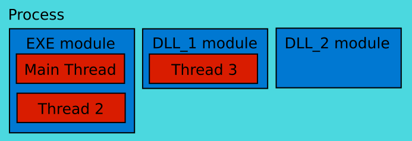
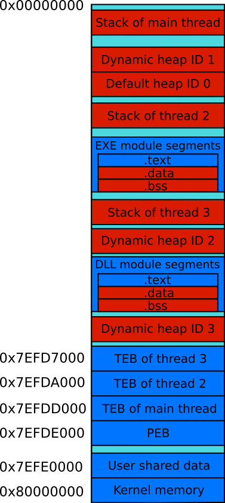
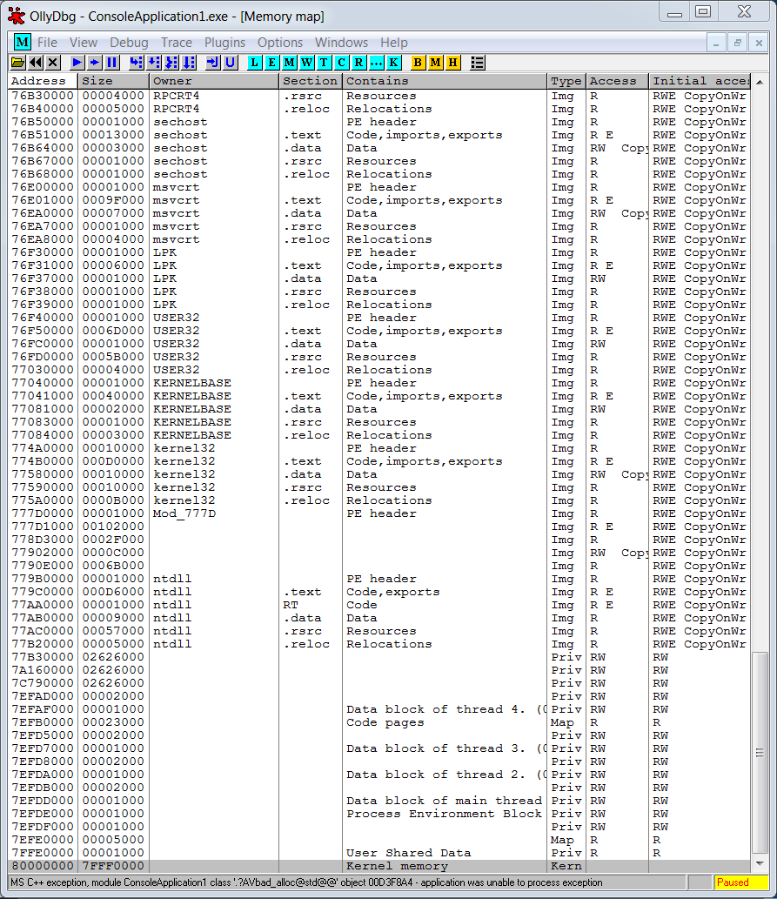
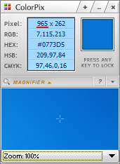
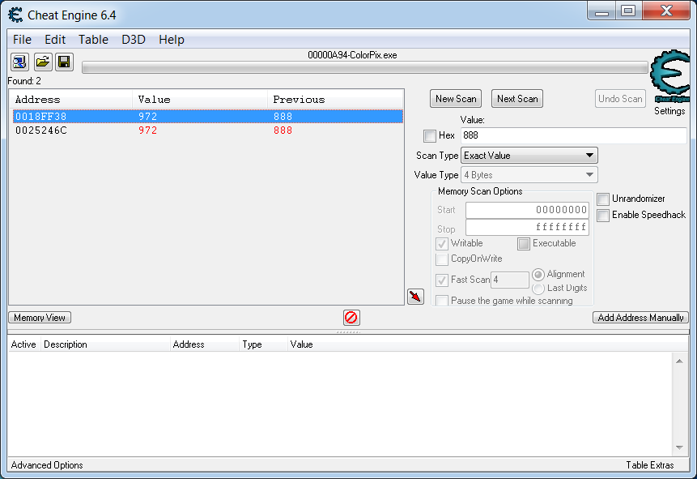

# Анализ памяти процесса

Адресное пространство процеесов рассмотрено во многих книгах и статьях. Мы изучим только те аспекты этого вопроса, которые имеют отношение к поиску, чтению и записи в память.

## Адресное пространство процесса

Начнём с того, что ещё раз подчеркнём отличие исполняемого файла и запущенного процесса ОС. Файл - это некоторые данные, записанные на устройство хранения информации (например жесткий диск). Исполняемый файл содержит инструкции (или машинный код) для процессора.

Когда вы запускаете исполняемый файл, ОС выполняет несколько последовательных действий. Первое - чтение содержимого файла с устройства хранения и запись его в оперативную память (random-access memory или RAM). Благодаря этому процессор получает намного более быстрый доступ к инструкциям, поскольку скорость его интерфейса с оперативной памятью на несколько порядков выше чем с любым диском.

После загрузки исполняемого файла в оперативную память, ОС загружает все необходимые для его работы динамические библиотеки. После этого шага, процесс готов к выполнению. Для этого он должен получить процессорное время, т.е. время в течении которого CPU будет выполнять его инструкции. В многозадачных ОС распределением этого времени занимается программа **планировщик** (или scheduler). Каждый процесс получает единицы времени (тики или секунды) в зависимости от своего приоритета.

Чем занимается процесс? Чтобы ответить на этот вопрос, заглянем в типичный исполняемый файл. В основном он содержит алгоритмы обработки и интерпретации каких-то данных. Мы можем прийтий к выводу, что основная работа типичного процесса заключается в манипуляции данными.

Следующий вопрос: где процесс хранит свои данные? Мы уже знаем, что ОС всегда хранит исполняемые инструкции процессора в оперативной памяти. В случае процесса, он имеет право свободно выбирать место хранения данных. Это может быть жесткий диск, оперативная память или даже удалённый компьютер (например игровой сервер подключённый по сети). Большая часть данных, необходимых во время работы процесса копируются в оперативную память для ускорения доступа к ней. Поэтому, именно в RAM мы можем прочитать состояния всех игровых объектов. Они будут доступны на протяжении всего времени выполнения (или runtime) процесса.

Иллюстрация 3-2 демонстрирует элементы типичного процесса. Как правило, он состоит из нескольких модулей. Обязательный из них - это EXE, который содержит все инструкции и данные, загруженные из исполняемого файла. Другие модули (обозначенные DLL\_1 и DLL\_2) соответствуют библиотекам, подпрограммы которых вызываются из главного.



**Иллюстрация 3-2.** *Элементы типичного процесса Windows*

Все Windows приложения используют как минимум одну системную библиотеку, которая предоставляет доступ к WinAPI функциям. Даже если вы не пользуетесь WinAPI явно в своей программе, компилятор вставляет вызовы `ExitProcess` и `VirtualQuery` автоматически в ходе компиляции. Они отвечают за корректное завершение процесса и управление его памятью.

Мы рассмотрели исполняемый файл. Теперь изучим библиотеки с подпрограммами. Они деляться на два типа: **динамически подключаемые** (dynamic-link libraries или DLL) и **статически подключаемые** (static libraries). Главное различие между ними - это время разрешения зависимостей. Когда исполняемый файл использует подпрограмму библиотеки, говорят, что он от неё зависит.

Статически подключаемые библиотеки должны быть доступны в момент компиляции. Программа компоновщик собирает их и исполняемый файл в единый выходной файл. Таким образом EXE модуль на иллюстрации 3-2 содержит машинный код и статических библиотек и исполняемого файла.

Динамически подключаемые библиотеки также должны быть доступны в момент компиляции. Однако, результирующий файл на выходе компоновщика не содержит их машинный код. Вместо этого ОС ищет и загружает эти DLL библиотеки в момент старта приложения. Если их не удаётся найти, приложение завершает свою работу с ошибкой. На иллюстрации 3-2 представлены два DLL модуля.

Рассмотрим, как именно CPU выполняет инструкции процесса. Эти инструкции - элементарные блоки более сложных высокоуровневых алгоритмов. Запущенное приложение может использовать несколько алгоритмов в процессе своей работы, и некоторые из них могут выполняться параллельно. Поток (или thread) - это часть машинного кода процесса, которая может выполняться независимо от других частей. Потоки взаимодействуют друг с другом (обмениваются информацией) через разделяемые ресурсы, например файл или область RAM. За выбор потока для исполнения отвечает уже знакомый нам планировщик ОС. Как правило, число одновременно работающих потоков определяется числом ядер процессора. Но есть технологии (например hyper-threading от Intel), позволяющие более эффективно использовать мощности процессора и исполнять сразу два потока на одном ядре.

Иллюстрация 3-2 демонстрирует, что модули могут содержать несколько потоков, а могут не содержать ни одного. EXE модуль всегда имеет главный поток (main thread), который получает управление при старте приложения.

Рассмотрим структуру памяти типичного процесса. Иллюстрация 3-3 демонстрирует адресное пространство процесса, состоящего из двух модулей: EXE и DLL библиотеки. Адресное пространство разделено на блоки памяти, называемые **сегментами**. У каждого сегмента есть **базовый адрес**, длина и набор прав доступа (на запись, чтение и исполнение). Разделение памяти на сегменты упрощает задачу контроля доступа к памяти. ОС может оперировать блоками памяти, а не отдельными адресами.



**Иллюстрация 3-3.** *Адресное пространство типичного процесса*

Процесс на иллюстрации 3-3 имеет три потока (включая главный). У каждого потока есть свой **сегмента стека**. Стек - это область памяти, организованная по принципу "последним пришёл — первым вышел" ("last in — first out" или LIFO). Она инициализируется ОС при старте приложения и используется для хранения переменных и вызова подпрограмм. В стеке сохраняется адрес инструкции следующей за вызовом подпрограммы. После её завершения процесс продолжает свое выполнение с инструкции по этому адресу.

Кроме сегментов стека, у процесса есть несколько **сегментов динамической памяти** (heap). Каждый поток имеет к ним доступ.

Каждый модуль процесса имеет обязательные сегменты: `.text`, `.data` и `.bss`. Также есть дополнительные сегменты (например `.rsrc`), которые могут отсутствовать. Они не представлены на схеме 3-3. 

Таблица 3-1 кратко описывает каждый сегмент иллюстрации 3-3. Во втором столбце приведены обозначения соответствующих сегментов в отладчике OllyDbg.

**Таблица 3-1.** *Описание сегментов*

| Сегмент | Обозначение в OllyDbg | Описание |
| --- | --- | --- |
| Стек главного потока | Stack of main thread | Содержит автоматические переменные (память под которые выделяется при входе в блок области видимости и освобождается при выходе из него), стек вызовов с адресами возврата из подпрограмм и их входные параметры. |
| Динамическая память ID 1 | Heap | Дополнительный сегмент памяти, который создаётся при переполнения сегмента динамической памяти ID 0. |
| Динамическая память ID 0 | Default heap | ОС создает этот сегмент всегда при запуске процесса. Он используется по-умолчанию для хранения переменных. |
| Стек потока 2 | Stack of thread 2 | Выполняет те же функции, что и стек главного потока, но используется только потоком 2. |
| `.text` EXE модуля | Code | Содержит машинный код модуля. |
| `.data` EXE модуля | Data | Содержит статические и не константные глобальные переменные модуля EXE, которые инициализируются каким-то значением при создании. |
| `.bss` EXE модуля | | Содержит статические и не константные глобальные переменные модуля EXE, которые не инициализируются при создании. |
| Стек потока 3 | Stack of thread 2 | То же самое, что и стек потока 2, только используется потоком 3. |
| Динамическая память ID 2 | | Дополнительный сегмент памяти, расширяющий сегмент динамической памяти ID 1 при его переполнении. |
| `.text` DLL модуля | Code | Содержит машинный код модуля. |
| `.data` DLL модуля | Data | Содержит статические и не константные глобальные переменные модуля DLL, которые инициализируются каким-то значением при создании. |
| `.bss` DLL модуля | | Содержит статические и не константные глобальные переменные модуля DLL, которые не инициализируются при создании. |
| Динамическая память ID 3 | | Дополнительный сегмент памяти, расширяющий сегмент динамической памяти ID 2 при его переполнении. |
| TEB потока 3 | Data block of thread 3 | Содержит **блок информации о потоке** (Thread Information
Block или TIB), также известный как **блок контекста потока** (Thread Environment Block или TEB). Он представляет собой структуру с информацией о потоке. |
| TEB потока 2 | Data block of thread 2 | Содержит TEB структуру потока 2. |
| TEB главного потока | Data block of main thread | Содержит TEB структуру главного потока. |
| PEB | Process Environment Block | Содержит **блок контекста процесса** (Process Environment Block или PEB). Эта структура данных с информацией о процессе в целом. |
| Пользовательские данные | User Share Data | Содержит область памяти, которая доступна и совместно используется несколькими процессами и текущим. |
| Память ядра | Kernel memory | Содержит область памяти, которая доступна и совместно используется несколькими процессами и текущим. |

Предположим, что на иллюстрации 3-3 приведено адресное пространство процесса игрового приложения. В этом случае состояние игровых объектов может находится в сегментах, отмеченных красным цветом.

ОС назначает базовые адреса этих сегментов в момент старта приложения. Эти адреса могут отличаться от запуска к запуску. Кроме того, последовательность сегментов в памяти процесса также может меняться. В то же время некоторые из сегментов, отмеченных синим цветом на иллюстрации 3-3 (например PEB, User Share Data и Kernel memory), имеют неизменный адрес при каждом старте приложения.

Отладчик OllyDbg позволяет прочитать структуру памяти (memory map) запущенного процесса. Иллюстрации 3-4 и 3-5 демонстрируют вывод OllyDbg для приложения, адресное пространство которого мы рассматривали на схеме 3-3.


**Иллюстрация 3-4.** *Структура памяти процесса в OllyDbg (начало)*



**Иллюстрация 3-5.** *Структура памяти процесса в OllyDbg (конец)*

Таблица 3-2 демонстрирует соответствие между схемой 3-3 и сегментами настоящего процесса из иллюстраций 3-4 и 3-5.

**Таблица 3-2.** *Сегменты настройщего процесса*

| Базовый адрес | Сегмент | Обозначение в OllyDbg |
| --- | --- | --- |
| 001ED000 | Стек главного потока | Stack of main thread |
| 004F0000 | Динамическая память ID 1 | Heap |
| 00530000 | Динамическая память ID 0 | Default heap |
| 00ACF000
  00D3E000
  0227F000 | Стеки вспомогательных потоков | Stack of thread N |
| 00D50000-00D6E000 | Сегменты EXE модуля "ConsoleApplication1" | |
| 02280000-0BB40000
  0F230000-2BC70000 | Дополнительные сегменты динамической памяти | |
| 0F0B0000-0F217000 | Сегменты DLL модуля "ucrtbased" | |
| 7EFAF000
  7EFD7000
  7EFDA000 | TEB вспомогательных потоков | Data block of thread N |
| 7EFDD000 | TEB главного потока | Data block of main thread |
| 7EFDE000 | PEB главного потока | Process Environment Block |
| 7FFE0000 | Пользовательские данные | User shared data |
| 80000000 | Память ядра | Kernel memory |

Возможно вы обратили внимание, что OllyDbg не может автоматически идентифицировать все сегменты динамической памяти. Для этой цели вы можете воспользоваться отладчиком WinDbg или инструментом HeapMemView.

## Поиск переменной в памяти

Внутриигровые боты читают состояния объектов из памяти процесса игрового приложения. Эти состояния могут храниться в нескольких переменных, находящихся в разных сегментах. Базовые адреса этих сегментов и смещение переменных внутри них могут меняться от запуска к запуску. Это означает, что абсолютные адреса переменных не являются константами. Бот может прочитать память процесса только по абсолютному адресу. Следовательно, он должен уметь искать нужные ему переменные в памяти.

Термин "абсолютный адрес" не точен в терминах **модели сегментации памяти x86**. x86 - это архитектура процессора, впервые реализованная компанией Intel. Правильный термин, который мы должны употреблять - "линейный адрес". Он вычисляется по следующей формуле:
```
линейный адрес = базовый адрес сегмента + смещение в сегменте
```
Мы продолжим употреблять термин "абсолютный адрес", поскольку он интуитивно понятен. Правильный термин будет применяться в местах, где важно подчеркнуть особенности модели сегментации памяти x86.

Задачу поиска переменной в памяти процесса мы можем разделить на три этапа. В результате получится следующий алгоритм:

1. Найти сегмент, который содержит искомую переменную.

2. Определить базовый адрес сегмента.

3. Определить смещение переменной внутри сегмента.

Существует высокая вероятность того, что переменная будет храниться в одном и том же сегменте при каждом старте приложения. Это правило не выполняется только для сегментов динамической памяти, что связано с особеностью её организации. Если мы установили, что переменная не находится в сегменте динамической памяти, первый шаг алгоритма может быть выполнен вручную. Полученный результат можно закодировать в боте без каких-либо дополнительных условий и проверок. В противном случае, бот должен выполнять поиск сегмента самостоятельно.

Второй шаг алгоритма должен всегда выполняться ботом самостоятельно. Как мы упоминали ранее, адреса сегментов меняются при старте приложения.

Последний шаг алгоритма - нахождение смещения переменной в сегменте. Нет никаких гарантий, что это смещение не будет меняться при каждом старте приложения. Однако, оно может оставаться тем же в некоторых случаях. Как правило, это зависит от типа сегмента, как демонстрирует таблица 3-3.

**Таблица 3-3.** *Смещение переменных в различнах типах сегментов*

| Тип сегмента | Постоянство смещения |
| --- | --- |
| `.bss` | Смещение переменной не меняется при перезапуске приложения. |
| `.data` | Смещение переменной не меняется. |
| стек | В большинстве случаев смещение переменной не меняется. Но оно зависит от **порядка выполнения инструкций** (или control flow). Если этот порядок меняется, смещение, скорее всего, тоже изменится. |
| динамическая память | В большинстве случаев смещение переменной меняется. |

Таким образом, в некоторых случаях мы можем выполнить третий шаг алгоритма вручную и закодировать результат в боте.

### Поиск переменной в 32-битном приложении

Применим алгоритм поиска переменной на практике. Выполним все его шаги вручную для приложения ColorPix, которым мы пользовались в прошлой главе для чтения цветов и координат пикселей экрана. Это поможет лучше понять все необходимые действия.

Приложения ColorPix является 32-битным. Скриншот его окна приведён на иллюстрации 3-6. Попробуем найти в памяти переменную, которая соответствует координате X выделенного на экране пикселя. На иллюстрации 3-6 она подчеркнута красной линией.



**Иллюстрация 3-6.** *Окно приложения ColorPix*

---
В ходе дальнейших действий вы не должны закрывать уже запущенное приложение ColorPix. Иначе, вам придется начать поиск переменной сначала.
---

Первый шаг при поиске переменной - найти сегмент памяти, в котором она хранится. Эту задачу можно разделить на два этапа:

1. Найти абсолютный адрес переменной с помощью сканера памяти Cheat Engine.

2. Сравнить найденный абсолютный адрес с базовыми адресами всех сегментов. Благодаря этому, находим нужный сегмент.

Чтобы найти абсолютный адрес переменной с помощью Cheat Engine, выполните следующие действия:

1. Запустите 32-битную версию сканера с правами администратора.

2. Выберите пункт главного меню "File" ➤ "Open Process". Вы увидите диалог со списком запущенных процессов (см. иллюстрацию 3-7).


**Иллюстрация 3-7.** *Диалог выбора процесса Cheat Engine*

3. Выберите процесс с именем "ColorPixel.exe" и нажмите кнопку "Open". В результате имя этого процесса отобразится в верхней части окна Cheat Engine.

4. Введите значение координаты X, которое вы видите в данный момент в окне ColorPixel, в поле "Value" окна Cheat Engine.

5. Нажмите кнопку "First Scan", чтобы найти абсолютный адрес указанного значения координаты X в памяти процесса ColorPixel.

---
Когда вы нажимаете кнопку "First Scan", значение в поле "Value" окна Cheat Engine, должно соответствовать тому, что отображает ColorPixel. Координата X меняется, когда вы перемещаете курсор мыши по экрану. Поэтому воспользуйтесь комбинацией клавиш Shift+Tab для переключения на кнопку "First Scan" и Enter, чтобы её нажать.
---

В левой части окна Cheat Engine вы увидите результаты поиска как на иллюстрации 3-8.



**Иллюстрация 3-8.** *Результаты поиска в окне Cheat Engine*

Если в момент сканирования процесса несколько переменных имели то же самое значение что и координата X, найденных переменных будет больше чем две. В этом случае вам надо отфильтровать ошибочные результаты. Для этого выполните следующие шаги:

1. Переместите курсор мыши, чтобы значение координаты X в окне ColorPixel изменилось.

2. Введите новую координату X в поле "Value" окна Cheat Engine.

3. Нажмите кнопку "Next Scan".

После этого вы должны увидить только две найденные переменные как на иллюстрации 3-8. В моём случае их абсолютные адреса равны “0018FF38" и "0025246C". У вас они могут отличаться, но это не существенно для нашего примера.

Сейчас вам известны абсолютные адреса двух переменных, которые хранят значение координаты X. Наш следующий шаг - поиск сегментов, в которых они хранятся. Для этой цели воспользуемся отладчиком OllyDbg.

Для поиска сегментом выполните следующие шаги:

1. Запустите отладчик OllyDbg с правами администратора. Путь к нему по-умолчанию: `C:\Program Files (x86)\odbg201\ollydbg.exe`.

2. Выберите пункт главного меню "File" ➤ "Attach". Вы увидите диалог со списком запущенных 32-битных процессов (см. иллюстрацию 3-9).


**Иллюстрация 3-9.** *Диалог выбора процесса в отладчике OllyDbg*

3. Выберите процесс "ColorPix" в списке и нажмите кнопку "Attach". Когда отладчик подключится к нему, вы увидите состояние "Paused" в правом нижнем углу окна OllyDbg.

4. Нажмите комбинацию клавиш Alt+M, чтобы открыть структуру памяти процесса ColorPix.


### Поиск переменной в 64-битном приложении

## Выводы
