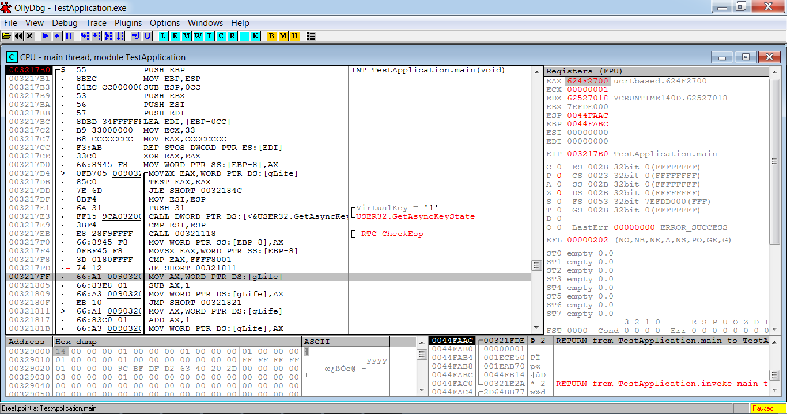
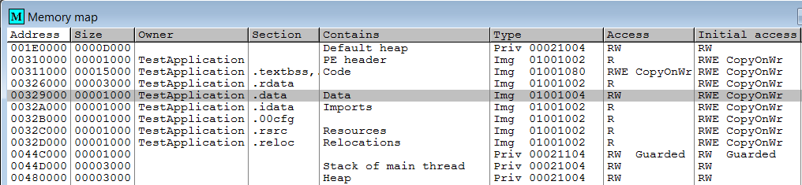
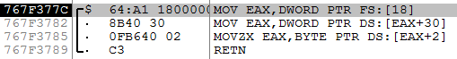

# Приёмы защиты от внутриигровых ботов

Мы реализовали внутриигрового бота для Diablo 2 и узнали, как он получает доступ к памяти процесса игры. Теперь рассмотрим способы защиты от этого типа ботов.

Есть две группы методов защиты от внутриигровых ботов:

* Защита приложения от реверс-инжиниринга.

* Блокировака алгоритмов бота.

Первая группа методов разрабатывается очень давно: со времён первых версий коммерческого ПО, которое нужно было защищать от нелицензионного распространения. Эти методы хорошо известны и документированны в Интернете. Их основаня задача - усложнить анализ приложения с помощью отладчика и дизассемблера.

Вторая группа методов защищает данные процесса игрового приложения от чтения и записи. Таким образом боту становится сложнее читать состояние объектов и внедрять свои действия.

Некоторые методы защиты могут относится сразу к обоим группам.

## Тестовое приложение

Вспомним архитетуру клиент-сервер современных онлайн игр. Клиент выполняется на компьютере пользователя и обменивается сообщениями с игровым сервером. Большая часть методов защиты от внутриигровых ботов работают на стороне клиента.

Чтобы познакомиться с методами защиты, напишем простое приложение, имитирующее состояние игрового объекта. Также разработаем простейшего внутриигрового бота, который подключается к нашему приложению и управляет им.

---
Все примеры этого раздела компилировались на Visual Studio под 32 разрядную архитектуру. Некоторые из них могут не заработать или потребуют изменений, если вы соберёте их на MinGW или под 64 разрядную архитектуру.
---

Алгоритм тестового приложения может быть следующим:

1. При старте присвоить параметру объекта (например уровень здоровья) максимально допустимое значение.

2. В цикле проверять состояние горячей клавиши "1".

3. Если пользователь не нажимает клавишу, уменьшать параметр объект. Иначе - увеличивать.

4. Если параметр объекта оказался равен 0, завершить приложение.

Листинг 3-16 демонстрирует исходный код тестового приложения.

**Листинг 3-16.** *Исходный код тестового приложения*
```C++
#include <stdio.h>
#include <stdint.h>
#include <windows.h>

static const uint16_t MAX_LIFE = 20;
static uint16_t gLife = MAX_LIFE;

int main()
{
    SHORT result = 0;

    while (gLife > 0)
    {
        result = GetAsyncKeyState(0x31);
        if (result != 0xFFFF8001)
            --gLife;
        else
            ++gLife;
 
        printf("life = %u\n", gLife);
        Sleep(1000);
    }
    printf("stop\n");
    return 0;
}
```
Уровень здоровья игрового объекта хранится в глобальной переменной `gLife`. При старте приложения мы присваиваем ей значение константы `MAX_LIFE` (равно 20).

В функции `main` есть цикл `while`, в котором мы проверяем состояние клавиши с помощью WinAPI функции `GetAsyncKeyState`. Код этой клавиши передаётся в функцию входным параметром. Виртуальный код клавиши "1" равен 0x31. Если вызов `GetAsyncKeyState` возвращает состояние "не нажато", переменная `gLife` уменьшается на 1. В противном случае - увеличивается также на 1. После этого идёт односекундная задержка, которая нужна чтобы пользователь успел отпустить клавишу.

Попробуйте скомпилировать тестовое приложение в конфигурации "Debug" (отладка) в Visual Studio и запустить его.

### Исследование памяти тестового приложения

Теперь напишем бота для нашего тестового приложения. Его алгоритм будет таким же, как и для игры Diablo 2 из прошлого раздела. Если параметр здоровья опускается ниже 10, бот симулирует нажатие клавиши "1".

Бот должен читать значение переменной `gLife`. Очевидно, мы не можем воспользоваться механизмом поиска объекта из бота для Diablo 2. Нам нужно провести полный анализ адресного пространства тестового приложения и разработать метод доступа к `gLife`. Хорошая новость в том, что это приложение очень простое и нам будет достаточно отладчика OllyDbg.

Чтобы найти сегмент, содержащий переменную `gLife` выполним следующие шаги:

1. Запустите отладчик OllyDbg. Нажмите F3, чтобы открыть диалог "Select 32-bit executable" (выберите 32-разрядный исполняемый файл). В диалоге выберите скомпилированное приложение из листинга 3-16. В резльтате отладчик запустит приложение и остановит его процесс на первой исполняемой инструкции процессора.

2. Нажмите комбинацию клавиш Ctrl+G, чтобы открыть диалог "Enter expression to follow" (ввести выражение для перехода).

3. Введите имена EXE модуля и функции `main` через точку в поле диалога "Enter address expression" (ввести адрес выражения). Должна получиться строка "TestApplication.main". После этого нажмите кнопку "Follow expression" (перейти к выражению). Теперь курсор окна дизассемблера должен указывать на первую инструкцию функции `main`.

4. Установите точкуостанова на эту инструкцию нажатием F2.

5. Начните исполнение процесса нажатием F9. Должна сработать наша точка останова.

6. Щёлкните правой кнопкой мыши по следующей строке дизассемблерного кода:
```assembly
MOV AX,WORD PTR DS:[gLife]
```
Позиция курсора должна совпадать с иллюстрацией 3-24.



**Иллюстрация 3-24.** *Точка останова в `main` функции*

7. Выберите пункт “Follow in Dump” ➤ “Memory address” ("Следить в дампе" ➤ "Адрес памяти") в открывшемся меню. Теперь курсор в окне дампа памяти указывает на переменную `gLife`. В моём случае она находится по адресу 329000 и имеет значение 14 в шестнадцатеричной системе.

8. Нажмите комбинацию клавиш Alt+M, чтобы открыть окно "Memory map" (карта памяти).

9. Найдите сегмент в котором находится переменная `gLife`. Это должен быть `.data` сегмент модуля TestApplication как на иллюстрации 3-25.



**Иллюстрация 3-25.** *Сегменты модуля TestApplication*

Мы выяснили, что переменная `gLife` хранится в самом начале сегмента `.data`. Следовательно, её адрес равен базовому адресу сегмента. Если бот найдет `.data`, он сразу сможет прочитать `gLife`.

### Бот для тестового приложения

Мы рассмотрели алгоритм бота для тестового приложения в общем. Теперь составим точную последовательность его действий, которую затем запрограммируем:

1. Предоставить привилегию SE\_DEBUG\_NAME процессу бота.

2. Подключиться к процессу тестового приложения.

3. Искать в памяти сегмент `.data`, в котором хранится переменная `gLife`.

4. Читать переменную в бесконечном цикле. Если её значение оказывается меньше 10, переписать его на 20.

Исходный код бота приведён в листинге 3-17.

**Листинг 3-17.** *Исходный код бота для тестового приложения*
```C++
#include <stdio.h>
#include <windows.h>

BOOL SetPrivilege(HANDLE hToken, LPCTSTR lpszPrivilege, BOOL bEnablePrivilege)
{
    // См. реализацию этой функции в листинге 3-1
}

SIZE_T ScanSegments(HANDLE proc)
{
    MEMORY_BASIC_INFORMATION meminfo;
    LPCVOID addr = 0;

    if (!proc)
        return 0;

    while (1)
    {
        if (VirtualQueryEx(proc, addr, &meminfo, sizeof(meminfo)) == 0)
            break;

        if ((meminfo.State == MEM_COMMIT) && (meminfo.Type & MEM_IMAGE) && (meminfo.Protect == PAGE_READWRITE) && (meminfo.RegionSize == 0x1000))
        {
            return (SIZE_T)meminfo.BaseAddress;
        }
        addr = (unsigned char*)meminfo.BaseAddress + meminfo.RegionSize;
    }
    return 0;
}

WORD ReadWord(HANDLE hProc, DWORD_PTR address)
{
    // См. реализацию этой функции в листинге 3-13
}

void WriteWord(HANDLE hProc, DWORD_PTR address, WORD value)
{
    if (WriteProcessMemory(hProc, (void*)address, &value, sizeof(value), NULL) == 0)
        printf("Failed to write memory: %u\n", GetLastError());
}

int main()
{
    // Предоставить SE_DEBUG_NAME привилегию текущему процессу

    // Подключиться к процессу тестового приложения

    SIZE_T lifeAddress = ScanSegments(hTargetProc);

    ULONG hp = 0;
    while (1)
    {
        hp = ReadWord(hTargetProc, lifeAddress);
        printf("life = %lu\n", hp);

        if (hp < 10)
            WriteWord(hTargetProc, lifeAddress, 20);

        Sleep(1000);
    }
    return 0;
}
```
Главное различие ботов для тестового приложения и для Diablo 2 - это реализация функции `ScanSegments`. Теперь мы можем отличить нужный нам сегмент `.data` по его флагам и размеру. Эта информация выводится в окне "Memory map" отладчика OllyDbg. Таблица 3-8 поясняет значения флагов.

**Таблица 3-8.** *Значения флагов сегмента `.data`*

| Столбец окна "Memory map" | Значение OllyDbg | Знаечние WinAPI | Описание |
| --- | --- | --- | --- |
| Type | Img | MEM_IMAGE | Страницы памяти были загружены из исполняемого файла. |
| Access | RW | PAGE_READWRITE | Страницы памяти доступны для чтения и записи. |

Также у сегмента `.data` есть флаг `MEM_COMMIT`, который не отображается OllyDbg. он означает, что страницы памяти были аллоцированы на физическом носители (RAM или файл подкачки на жёстком диске).

Чтобы запустить бота, выполните следующие действия:

1. Запустите тестовое приложение.

2. Запустите бота с правами администратора.

3. Переключитесь на консоль с работающим тестовым приложением.

4. Ждите, пока не увидите сообщение, что переменная `gLife` стала меньше 10.

Бот будет переписывать значение `gLife`, как только оно становится слишко мало.

## Защита приложения от реверс-инжиниринга

Сначала рассмотрим методы для защиты кода и памяти игрового приложения от исследования. Как показал пример разработки бота для Diablo 2, знание внутренних аспектов работы игры очень важно. К сожалению, абсолютно надёжной защиты не бывает. Лучшее чего мы сможем достичь - это заставить потенциального разработчика бота потратить больше времени на исследование игры. Возможно, этого будет достаточно, чтобы он отказался от своих планов.

### WinAPI функции для обнаружения отладчика

Основной инструмент для исследования памяти процесса приложения - это отладчик. Поэтому самым простым и прямолинейным способом защиты будет его обнаружение. Для этого WinAPI интерфейс предоставляет несколько подходящих функций.

Рассматриваемые далее методы не защищают память приложения от чтения сканером (например Cheat Engine) или ботом. Они только позволяют обнаружить факт подключения отладчика.

#### IsDebuggerPresent

WinAPI функция `IsDebuggerPresent` возвращает значение `true`, если к вызвавшему её процессу подключён отладчик. `IsDebuggerPresent` можно использовать следующим образом:
```C++
int main()
{
    if (IsDebuggerPresent())
    {
        printf("debugger detected!\n");
        exit(EXIT_FAILURE);
    }

    // Остальной код соответствует функции main из листинга 3-16
}
```
Мы проверяем присутствие отладчика в начале функции `main`. Если он обнаружен, процесс тестового приложения прерывается вызовом `exit`. Такой способ использования `IsDebuggerPresent` неэффективен. Мы обнаружим отладчик только в том случае, если он запускает процесс приложения. Если же подключится к уже запущенному процессу, мы сможем его отлаживать. В этом случае проверка `IsDebuggerPresent` уже прошла и регулярного её повтора нет.

Листинг 3-18 демонстрирует правильный способ использования функции `IsDebuggerPresent`.

**Листинг 3-18.** *Защита тестового приложения вызовом `IsDebuggerPresent`*
```C++
#include <stdio.h>

int main()
{
    SHORT result = 0;

    while (gLife > 0)
    {
        if (IsDebuggerPresent())
        {
            printf("debugger detected!\n");
            exit(EXIT_FAILURE);
        }
        result = GetAsyncKeyState(0x31);
        if (result != 0xFFFF8001)
            --gLife;
        else
            ++gLife;

        printf("life = %u\n", gLife);
        Sleep(1000);
    }
    printf("stop\n");
    return 0;
}
```
Теперь проверка наличия отладчика с помощью вызова `IsDebuggerPresent` происходит в начале каждой итерации `while` цикла. Поэтому он будет обнаружен, даже если подключится к работающему приложению.

Как обойти такую защиту? Первый способ - манипуляция регистрами процессора в момент проверки. Мы можем вручную подменить возвращаемое функцией значение, чтобы предотвратить выполнение блока кода с вызовом `exit`.

Чтобы подменить результат вызова функции `IsDebuggerPresent`, необходимы следующие действия:

1. Запустите отладичк OllyDbg и приложение из листинга 3-18 под его управлением.

2. Нажмите комбинацию клавиш Ctrl+N, чтобы открыть окно "Names in TestApplication" (имена в TestApplication). Перед вами [**таблица символов**](https://ru.wikipedia.org/wiki/%D0%A2%D0%B0%D0%B1%D0%BB%D0%B8%D1%86%D0%B0_%D1%81%D0%B8%D0%BC%D0%B2%D0%BE%D0%BB%D0%BE%D0%B2) тестового приложения, в которой указаны все его переменные и функции.

3. Введите имя `IsDebuggerPresent` в окне "Names in TestApplication". При этом переход в списке к соответствующей функции произойдёт автоматически.

4. Щёлкните левой кнопкой мыши по строчке "&KERNEL32.IsDebuggerPresent" в списке.

5. Нажмите Ctrl+R, чтобы открыть диалог "Search - References to..." (поиск ссылок на...). Вы увидите список мест в коде приложения из которых вызывается функция `IsDebuggerPresent`.

6. Двойным левым щелчком мыши выберите первую строчку в окне "Search - References to...". Курсор окна дизассемблера перейдёт на вызов `IsDebuggerPresent` из функции `main`.

7. В окне дизассемблера левым щелчком мыши выберите инструкцию `TEST EAX,EAX`, которая следует за вызовом `IsDebuggerPresent`. Установите на ней точку останова нажатием F2.

8. Нажмите F9, чтобы продолжить работу тестового приложения. Должна сработать наша точка останова.

9. Измените значение регистра EAX на 0. Для этого двойным щелчком мыши выберите значение регистра EAX в окне "Registers (FPU)" (регистры). Откроется диалог "Modify EAX" (изменение EAX), как на иллюстрации 3-26. Затем введите значение 0 в ряд "Signed" (знаковый), столбец "EAX". Нажмите кнопку "OK".

10. Нажмите F9, чтобы приложение работало дальше.


**Иллюстрация 3-26.** *Изменение значения регистра EAX*

После изменения значения регистра процессора, тестовое приложение не обнаружит отладчик на текущей итерации цикла `while`. Однако, проверка `IsDebuggerPresent` произойдёт на следующей итерации, и OllyDbg будет обнаружен. Следовательно, необходимо изменение регистра вручную перед каждой такой проверкой, что неудобно.

Другой способ обойти проверку `IsDebuggerPresent` - модифицировать код тестового приложения. Он уже загружен в память процесса, а у OllyDbg есть возможность её чтения и записи.

Чтобы модифицировать код приложения, выполним следующие действия:

1. Запустите отладичк OllyDbg и тестовое приложение с проверкой `IsDebuggerPresent` под его управлением.

2. Найдите место вызова функции `IsDebuggerPresent` в коде.

3. Выберите левым щелчком мыши инструкцию `JE SHORT 01371810`, следующую сразу за `TEST EAX,EAX` (см. иллюстрацию 3-27). Нажмите клавишу пробел, чтобы открыть диалог "Assemble" её редактирования.

4. Измените инструкцию `JE SHORT 01371810` на `JNE SHORT 01371810` в диалоге, как показано на иллюстрации 3-27. После этого нажмите кнопку "Assemble".

5. Нажмите F9, чтобы продолжить работу тестового приложения.


**Иллюстрация 3-27.** *Диалог редактирования инструкции*

После этих действий тестовое приложение больше не обнаруживает отладчик.

Что означает замена инструкции `JE` на `JNE`? Рассмотрим, какой C++ соответствует каждому варианту. Исходная инструкция `JE` соответствует следующему оператору `if`:
```C++
if (IsDebuggerPresent())
{
    printf("debugger detected!\n");
    exit(EXIT_FAILURE);
}
```
После замены инструкции на `JNE` мы получили следующий код:
```C++
if ( ! IsDebuggerPresent())
{
    printf("debugger detected!\n");
    exit(EXIT_FAILURE);
}
```
Другими словами, мы инвертировали условие оператора `if`. Теперь если к тестовому приложению не подключён отладчик, оно будет звершено с сообщением "debugger detected!" (отладчик обнаружен) в консоль. Если же отладчик подключён, приложение продолжит свою работу.

После перезапуска тестового приложения, модификацию кода придётся повторить. Чтобы этого избежать, можно воспользоваться плагином [**OllyDumpEx**](low-priority.appspot.com/ollydumpex) отладчика OllyDbg. Он позволяет сохранить отредактированный код в исполняемый файл.

Для установки плагина OllyDumpEx выполните следующее:

1. Скачайте архив с лпгином с сайта разработчика.

2. Распакуйте архив в папку установки OllyDbg. По-умолчанию это:<br/>
```
C:\Program Files (x86)\odbg200
```
3. Проверьте путь до папки с плагинами в настройке OllyDbg. Для этого выберите пункт “Options” ➤ “Options...” главного меню. Откроется диалог "Options" (настройки). В левой его части выберите пункт “Directories” (каталоги). Поле "Plug-in directory" (каталог плагинов) должно соответствовать пути установки OllyDbg (например `C:\Program Files (x86)\odbg200`).

4. Перезапустите отладчик.

После этого появится новый пункт главного меню "Plug-ins" (плагины). Чтобы воспользоваться возможностью сохранения модифицированного кода приложения в исполняемый файл, выполните:

1. Выберите пункт главного меню “Plug-ins“ ➤ ”OllyDumpEx“ ➤ ”Dump process”. Откроется диалог "OllyDumpEx".

2. Нажмите кнопку "Dump" (выгрузить) в диалоге. Откроется диалог "Save Dump to File" (сохранение дампа в память).

3. Укажите путь к исполняемому файлу для сохранения кода.

После этого на жёстком диске будет создан исполняемый файл с модифицированным кодом приложения. Вы можете его запустить, как обычный EXE файл. Для простых приложений запуск произойдёт корректно. К сожалению, если вы работаете с большой и сложной игрой, она может завершиться с ошибкой после старта из дампа.

В интерфейсе WinAPI есть ещё одна функция для обнаружения отладчика - `CheckRemoteDebuggerPresent`. Она позволяет обнаружить отладчик, подключённый к указанному процессу. `CheckRemoteDebuggerPresent` может быть полезна, если система защиты и игра работают в разных процессах.

Обе функции `CheckRemoteDebuggerPresent` и `IsDebuggerPresent` проверяют данные PEB сегмента. `CheckRemoteDebuggerPresent` вызывает внутри себя функцию `NtQueryInformationProcess`, которая возвращает структуру типа [`PROCESS_BASIC_INFORMATION`](https://docs.microsoft.com/en-us/windows/win32/api/winternl/nf-winternl-ntqueryinformationprocess). Её второе поле - это указатель на структуру типа [`PEB`](https://docs.microsoft.com/en-us/windows/win32/api/winternl/ns-winternl-_peb). У `PEB` есть поле под названием `BeingDebugged`, значение которого равно 1, если к процессу подключен отладчик. Иначе значение поля равно 0.

#### CloseHandle

У функции `IsDebuggerPresent` есть два серьёзных недостатка. Во-первых, эту функцию легко обнаружить в исходном коде приложения и инвертировать условие проверки её результата. Во-вторых, достаточно просто изменить значение поля `BeingDebugged` в PEB сегменте, чтобы предотвратить обнаружение отладчика.

Есть более изящные способы проверки наличия отладчика с помощью WinAPI. Один из них - использование побочного эффекта функции `CloseHandle`. Обычно `CloseHandle` вызывается, чтобы сообщить ОС об окончании работы с каким-то объектом. После этого объект может быть удалён, либо к нему могут получить доступ другие процессы. Очевидно, что любое сложное приложение интенсивно использует `CloseHandle`.

Функция `CloseHandle` имеет единственный входной параметр - дескриптиор объекта. Если переданный дескриптор некорректен будет сгенерированно [**исключение**](http://www.cplusplus.com/doc/tutorial/exceptions) (exception) `EXCEPTION_INVALID_HANDLE`. То же самое произойдёт если процесс вызовет `CloseHandle` дважды для одного и того же дескриптора. Теперь важный момент - исключение генерируется только тогда, когда к процессу подключен отладчик. Если отладчика нет, исключения не будет, и функция вернёт код ошибки. Таким образом, мы можем следить за поведением функции и делать вывод о наличии отладчика.

Для обхода защиты, использующей `CloseHandle`, потребудется много работы. Прежде всего, надо отследить все вызовы функции. Затем надо отличить места, где с её помощью проверяется наличие отладчика. Во всех этих местах надо будет отредактировать код, например заменить вызов функции на `NOP` (no operation) инструкции.

Пример использования `CloseHandle`:
```C++
BOOL IsDebug()
{
    __try
    {
        CloseHandle((HANDLE)0x12345);
    }
    __except (GetExceptionCode() == EXCEPTION_INVALID_HANDLE ?
              EXCEPTION_EXECUTE_HANDLER : EXCEPTION_CONTINUE_SEARCH)
    {
        return TRUE;
    }
    return FALSE;
}
```
Для обработки исключения `EXCEPTION_INVALID_HANDLE` мы применили конструкцию **try-except**, которая отличается от **try-catch**, определённой в стандарте C++. Эта конструкция - расширение для C и C++ от Microsoft, которое является частью механизма [**Structured Exception Handling**](https://docs.microsoft.com/en-us/windows/win32/debug/structured-exception-handling) (SEH).

Изменим наше тестовое приложение из листинга 3-18. Добавим определение функции `IsDebug` (приведённое выше) и будем вызывать её вместо `IsDebuggerPresent` в цикле `while`. Результат приведён в файле `CloseHandle.cpp` из примеров к книге. Попробуйте его скомпилировать и протестировать с отладчиками OllyDbg и WinDbg. Приложение успешно обнаруживает WinDbg, но не OllyDbg. Это связано с тем, что OllyDbg имеет встроенный механизм для обхода этой защиты.

С помощью WinAPI функции `DebugBreak` можно сделать очень похожую проверку на наличие отладчика:
```C++
BOOL IsDebug()
{
    __try
    {
        DebugBreak();
    }
    __except (GetExceptionCode() == EXCEPTION_BREAKPOINT ?
              EXCEPTION_EXECUTE_HANDLER : EXCEPTION_CONTINUE_SEARCH)
    {
        return TRUE;
    }
    return FALSE;
}
```
В отличие от `CloseHandle`, `DebugBreak` всегда генерирует исключение `EXCEPTION_BREAKPOINT`. Если к приложению подключён отладчик, он обработает это исключение. Это значит, что блок `__except` приведённого выше кода не полчит управление. Если же отладчика нет, исключение должно быть обработано приложением. В этом случае, мы попадём в блок `__except`, и функция `IsDebug` вернёт значение `TRUE`.

Проверка отладчика через `DebugBreak` обнаруживает и OllyDbg, и WinDbg.

В WinAPI есть функция `DebugBreakProcess`, которая очень похожа на `DebugBreak`. Она позволяет сгенерировать исключение `EXCEPTION_BREAKPOINT` для указанного процесса. Это может быть полезно для реализации защиты, работающей в отдельном процессе.

#### CreateProcess

Есть метод запрещающий отладку процесса в принципе. Он связан со следующим ограничением ОС Windows: только один отладчик может быть подключён к процессу. Следовательно, если одна часть приложения подключается к другой в качестве отладчика, эта вторая часть становится защищённой. Метод известен, как **самоотладка** (self-debugging).

Идея заключается в разделении приложения на два отдельных процесса: родительский и дочерний. При этом возможны следующие разделения обязанностей:

1. Дочерний процесс отлаживает родительский, который в свою очередь выполняет алгоритмы защищаемого приложения (TestApplication в нашем случае). Этот подход описан в [статье](https://www.codeproject.com/Articles/30815/An-Anti-Reverse-Engineering-Guide#SelfDebugging).

2. Родительский процесс отлаживает дочерний. Дочерний выполняет алгоритмы защищаемого приложения.

Мы рассмотрим второй подход. Для создания дочернего процесса воспользуемся WinAPI функцией `CreateProcess`. Результат приведён в листинге 3-19.

**Листинг 3-19.** *Защита тестового приложения методом самоотладки*
```C++
#include <stdio.h>
#include <stdint.h>
#include <windows.h>
#include <string>

using namespace std;

static const uint16_t MAX_LIFE = 20;
static uint16_t gLife = MAX_LIFE;

void DebugSelf()
{
    wstring cmdChild(GetCommandLine());
    cmdChild.append(L" x");

    PROCESS_INFORMATION pi;
    STARTUPINFO si;
    ZeroMemory(&pi, sizeof(PROCESS_INFORMATION));
    ZeroMemory(&si, sizeof(STARTUPINFO));
    GetStartupInfo(&si);

    CreateProcess(NULL, (LPWSTR)cmdChild.c_str(), NULL, NULL, FALSE,
            DEBUG_PROCESS | CREATE_NEW_CONSOLE, NULL, NULL, &si, &pi);

    DEBUG_EVENT de;
    ZeroMemory(&de, sizeof(DEBUG_EVENT));

    for (;;)
    {
        if (!WaitForDebugEvent(&de, INFINITE))
            return;

        ContinueDebugEvent(de.dwProcessId,
                de.dwThreadId,
                DBG_CONTINUE);
    }
}

int main(int argc, char* argv[])
{
    if (argc == 1)
    {
        DebugSelf();
    }
    SHORT result = 0;

    while (gLife > 0)
    {
        result = GetAsyncKeyState(0x31);
        if (result != 0xFFFF8001)
            --gLife;
        else
            ++gLife;

        printf("life = %u\n", gLife);
        Sleep(1000);
    }

    printf("stop\n");
    return 0;
}
```
Иллюстрация 3-28 демонстрирует взаимодействие родительского и дочернего процессов.


**Иллюстрация 3-28.** *Взаимодействие родительского и дочернего процессов*

Приложение из листинга 3-19 запускается в два этапа. Первый этап - пользователь щёлкает по иконке рабочего стола и приложение запускается без параметров командной строки. В этом случае следующее `if` условие будет истинным:
```C++
    if (argc == 1)
    {
        DebugSelf();
    }
```
Параметр `argv` функции `main` - это указатель на строку параметров командной строки. `argc` хранит их количество. Когда приложение запущено без параметров командной строки, `argc` равен 1, а строка `argv` содержит только имя запускаемого файла. Таким образом приложение вызовет функцию `DebugSelf`. Её алгоритм следующий:

1. Прочитать параметры командной строки и добавить к ним "x". Этот параметр сообщает дочернему процессу, что он был запущен из родительского:
```C++
wstring cmdChild(GetCommandLine());
cmdChild.append(L" x");
```

2. Создать дочерний процесс с помощью вызова `CreateProcess`. В эту функцию мы передаём флаг `DEBUG_PROCESS`, который означает что новый процесс будет отлаживаться родительским. Так же мы передаём флаг `CREATE_NEW_CONSOLE`, благодаря которому у дочернего процесса будет отдельная консоль. В ней вы сможете прочитать вывод нашего приложения.

3. Запустить бесконечный цикл `for`, в котором будем обрабатывать все события дочернего процесса.

Попробуйте запустить приложение из листинга 3-19 и подключиться к нему отладчиками OllyDbg и WinDbg. Ни одному из них это не удастся.

Наше тестовое приложение демонстрирует метод самоотладки в максимально простом и лаконичном виде. Его защиту очень просто обойти. Для этого достаточно запустить приложение из командной строки, передав параметром символ "x":
```
TestApplication.exe x
```
В этом случае приложение запустится без самоотладки и к нему можно будет подключиться.

В настоящей защите нельзя полагаться на число параметров командной строки. Вместо этого надо проверять их значение. Например родительский процесс может сгенерировать случайный ключ и передать его дочернему через вызов `CreateProcess`. Дочерний процесс проверяет корректность ключа при старте. Если ключ ошибочный, работа приложения завершается.

Есть более надёжные техники обмена информацией между родительским и дочерним процессом, чем параметры командной строки. Они описаны в официальной [документации](https://docs.microsoft.com/en-us/windows/win32/ipc/interprocess-communications) Microsoft.

### Операции с регистрами для обнаружения отладчиков

Все техники обнаружения отладчиков, использующие WinAPI функции, имеют серьёзный недостаток - отследить места их вызовов достаточно легко. Даже если вы используете `CloseHandle` против отладки, и ваше приложение имеет 500 таких вызовов, такую защиту можно обойти за предсказуемое время.

Есть несколько техник, лишённых этого недостатка. Они основаны на манипуляции регистрами процессора. Доступ к этим регистрам можно получить через ассемблерные вставки или встроенные функции компилятора. Преимущество такого подхода в том, что анализ таблицы символов не поможет в поиске проверок на наличие отладчика. Из-за этого их намного сложнее обнаружить.

Рассмотрим как устроена WinAPI функция `IsDebuggerPresent` внутри. Мы знаем, что онм проверяет данные PEB сегмента. Возможно, мы сможем повторить её алгоритм.

Выполним следующие шаги для исследования `IsDebuggerPresent`:

1. Запустите OllyDbg.

2. Запустите из него тестовое приложение из листинга 3-18.

3. Найдите место вызова функции `IsDebuggerPresent` из `main`. Поставьте в нём точку останова. Продолжайте исполнение приложения.

4. Когда сработает точка останова нажмите F7, чтобы перейти к инструкциям функции `IsDebuggerPresent`.

Вы увидите код в окне дизассемблера OllyDbg, как на иллюстрации 3-29.



**Иллюстрация 3-29.** *Инструкции функции IsDebuggerPresent*

Рассмотрим каждую инструкцию функции `IsDebuggerPresent`:

1. Прочитать линейный (или абсолютный) адрес TEB сегмента, соответствующего текущему потоку, в регистр EAX. Как мы уже знаем, регистр FS всегда указывает на сегмент TEB, а по смещению 0x18 в нём лежит собственный линейный адрес.

2. Прочитать линейный адрес сегмента PEB в регистр EAX. Он хранится по смещению 0x30 в регистре TEB.

3. Прочитать значение со смещением 0x2 из сегмента PEB в EAX регистр. По этому смещению хранится флаг `BeingDebugged`, по значению которого можно определить наличие отладчика.

4. Вернуться из функции.

Повторим рассмотренный алгоритм в коде нашего тестового приложения. Результат приведён в листинге 3-20.

**Листинг 3-20.** *Обнаружение отладчика через прямой доступ к PEB сегменту*
```C++
#include <stdio.h>

int main()
{
    SHORT result = 0;

    while (gLife > 0)
    {
        int res = 0;
        __asm
        {
            mov eax, dword ptr fs:[18h]
            mov eax, dword ptr ds:[eax+30h]
            movzx eax, byte ptr ds:[eax+2h]
            mov res, eax
        };
        if (res)
        {
            printf("debugger detected!\n");
            exit(EXIT_FAILURE);
        }
        result = GetAsyncKeyState(0x31);
        if (result != 0xFFFF8001)
            --gLife;
        else
            ++gLife;

        printf("life = %u\n", gLife);
        Sleep(1000);
    }
    printf("stop\n");
    return 0;
}
```
Сравните наш код и инструкции процессора на иллюстрации 3-29. Они почти одинаковы. Единственное отличие - это последняя инструкция. В нашем коде значение флага `BeingDebugged` присваивается переменной `res`. Сразу после ассемблерной вставки она проверяется в `if` условии.

Если вы поместите такую ассемблерную вставку и проверку на отладчик в нескольких местах приложения, их будет труднее найти чем вызовы функции `IsDebuggerPresent`. Можем ли мы в этом случае избежать дублирования кода? Это хороший вопрос. Если в следующих версиях Windows поменяется структура TEB или PEB сегмента, исправление придётся вносить в нескольких местах.

Есть несколько способов избежать дублирования кода в ассемблерных вставках. Очевидно, что в нашем случае мы не можем просто поместить этот код в обычную C++ функцию. Она обязательно попадёт в таблицу символов, по которой легко отследить все места её вызовов.

Первое решение - вынести код ассемблерной вставки в C++ функцию, но пометить её ключевым словом `__forceinline`. Благодаря этому, компилятор будет вставлять код функции в места её вызовов. К сожалению, `__forceinline` игнорируется в нескольких случаях:

1. Приложение компилируется в конфигурации "Debug" (отладка).

2. Если встраиваемая функция содержит рекурсивные вызовы (она вызывает саму себя).

3. Если встраиваемая функция вызывает WinAPI подпрограмму `alloca`.

Ключевое слово `__forceinline` работает только в конфигурации сборки "Release" (релиз), что может быть неудобно. В этом случае выходной исполняемый файл не содержит отладочной информации.

Второе решение - использовать макрос препроцессора. Компилятор вставляет тело макроса в каждое место исходного кода, где упоминается его имя. В этом случае поведение компилятиора не зависит от конфигурации сборки.

Листинг 3-21 демонстрирует проверку флага `BeingDebugged` с помощью ассемблерной вставки, завёрнутой в макрос препроцессора.


**Листинг 3-21.** *Обнаружение отладчика через прямой доступ к PEB сегменту*
```C++
#include <stdio.h>

#define CheckDebug() \
int isDebugger = 0; \
{ \
__asm mov eax, dword ptr fs : [18h] \
__asm mov eax, dword ptr ds : [eax + 30h] \
__asm movzx eax, byte ptr ds : [eax + 2h] \
__asm mov isDebugger, eax \
} \
if (isDebugger) \
{ \
printf("debugger detected!\n"); \
exit(EXIT_FAILURE); \
}

int main()
{
    SHORT result = 0;

    while (gLife > 0)
    {
        CheckDebug();

        result = GetAsyncKeyState(0x31);
        if (result != 0xFFFF8001)
            --gLife;
        else
            ++gLife;
    }

    printf("stop\n");

    return 0;
}
```
Обратите внимание на использование макроса `CheckDebug` в функции `main`. Это выглядит, как обычный вызов функции. Однако, поведение макроса кардинально отличается от функции. Ещё на этапе обработки препроцессора, который идёт до компиляции, код `main` будет преобразован в следующий:
```C++
int main()
{
    SHORT result = 0;

    while (gLife > 0)
    {
        int res = 0;
        __asm
        {
            mov eax, dword ptr fs:[18h]
            mov eax, dword ptr ds:[eax + 30h]
            movzx eax, byte ptr ds:[eax + 2h]
            mov res, eax
        };
        if (res)
        {
            printf("debugger detected!\n");
            exit(EXIT_FAILURE);
        }
        ...
```
Учитывайте эту особенность макросов, когда будете использовать их в своих проектах. Если в теле макросе есть ошибка, компилятор будет указывать на строку его использования, а не определения.

Защита, приведённая в листинге 3-21, выглядит достаточно надёжной. Так ли это и сможем ли мы её обойти?


