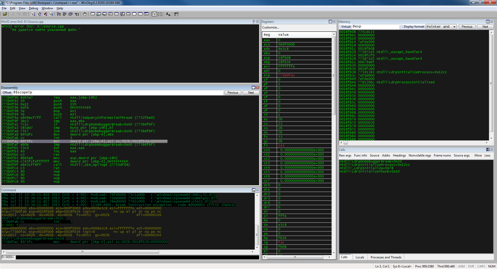

# Инструменты для разработки

Разработка внутриигровых ботов происходит на более низком уровне по сравнению с кликерами. В ней приходится оперировать более примитивными абстракциями ОС. Поэтому наши инструменты будут сложнее, чем в прошлой главе.

## Язык программирования

В этой главе мы будем использовать только язык C++. Я рекомендую вам использовать бесплатную IDE Microsoft Visual Studio (www.visualstudio.com/vs/express) вместо открытого набора инструментов MinGW. Проблема в том, что MinGW плохо интегрируется с некоторыми Windows библиотеками (например dbghelp.dll). Вы можете пробовать компилировать примеры этой главы в MinGW, но будьте готовы переключиться на Visual Studio IDE.

Не забудьте обновить Internet Explorer (windows.microsoft.com/en-us/
internet-explorer/download-ie) для того, чтобы использовать последнюю версию Visual Studio IDE.

Так же для доступа к Windows Native API и линковки с системной библиотекой `ntdll.dll` вам понадобится Windows SDK (msdn.microsoft.com/en-us/library/ms717358%28v=vs.110%29.aspx).

## Отладчики

**Отладчик** - это инструмент для тестированя и поиска ошибок в приложениях. Как правило, им пользуются разработчики программ для исправления своего кода. При этом у отладчиков есть возможности, которые могут быть полезны для исследования чужих программ. Для рассмотрения некоторых примеров этой главы нам понадобится такой инструмент.

**OllyDbg** (www.ollydbg.de) - этот бесплатный отладчик мы будем активно использовать на протяжении всей главы. Одно из основных его преимуществ - простой и понятный интерфейс пользователя. Также OllyDbg предоставляет широкие возможности для анализа Windows приложений без исходного кода. Главный недостаток этого отладчика - поддержка только 32-битный приложений.

**x64dbg** (x64dbg.com) - отладчик с открытым исходным кодом для Windows, который поддерживает и 32-битные, и 64-битные приложения. В нём недоступны некоторые возможности OllyDbg, поэтому при работе с ним вам придётся производить некоторые вычисления вручную. Я рекомендую использовать x64dbg только для отладки 64-битных приложений, а в остальных случаях - OllyDbg.

**WinDbg** (docs.microsoft.com/en-us/windows-hardware/drivers/download-the-wdk) - многоцелевой бесплатный отладчик для работы с пользовательскими приложениями, драйверами устройств, системными библиотеками и ядром ОС. Он предоставляет некоторые возможности недоступные в OllyDbg и x64dbg, а также поддерживает 32 и 64-битные приложения. Единственный серьёзынй недостаток WinDbg - это неудобный пользовательский интерфейс. Эта проблема частично решается с помощью специальной настройки рабочего окружения (github.com/Deniskore/windbg-workspace), которая делает его визуально похожим на OllyDbg. К сожалению, большинство возможностей WinDbg всё равно доступны только из его командной строки (www.windbg.info/doc/1-
common-cmds.html).

Для установки настройки рабочего окружения выполните следующие шаги:

1. Скачать архив с настройкой по ссылке: 
github.com/Deniskore/windbg-workspace

2. Распаковать полученный архив `windbg-workspace-master.zip` в папку с настройками отладчика. Путь к ней по-умолчанию: 
`C:\Program Files (x86)\Windows Kits\8.1\Debuggers\x64\themes`

3. Среди скопированных файлов запустить `windbg.reg` и нажать кнопку "Yes" в диалогах подтверждения.

Теперь после запуска окно WinDbg будет выглядеть как на иллюстрации 3-1.

**Иллюстрация 3-1.** *Главное окно WinDbg после настройки рабочего окружения*

## Инструменты для анализа памяти

Помимо отладчика нам понадобится инструмент для анализа память запущенного процесса.

**Cheat Engine** (www.cheatengine.org) - инструмент с открытым исходным кодом, предоставляющий функции сканера памяти, отладчика и **Hex-редактора** (редактор бинарных файлов). Главная функция Cheat Engine, которая нам интересна, - это поиск адреса переменной в памяти процесса и модификация её значения.

**HeapMemView** (www.nirsoft.net/utils/heap_memory_view.html) - бесплатный инструмент для анализа сегментов динамической памяти (heap, иногда переводится как "куча"), выделенных процессом. Он имеет две версии - для 32 и 64-битных приложений.
