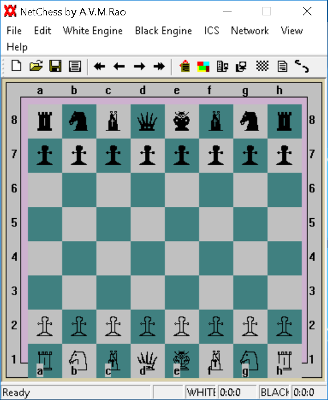
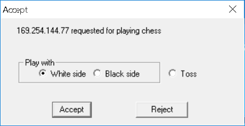
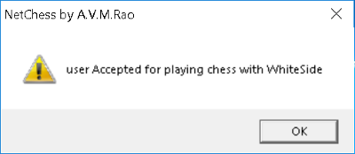
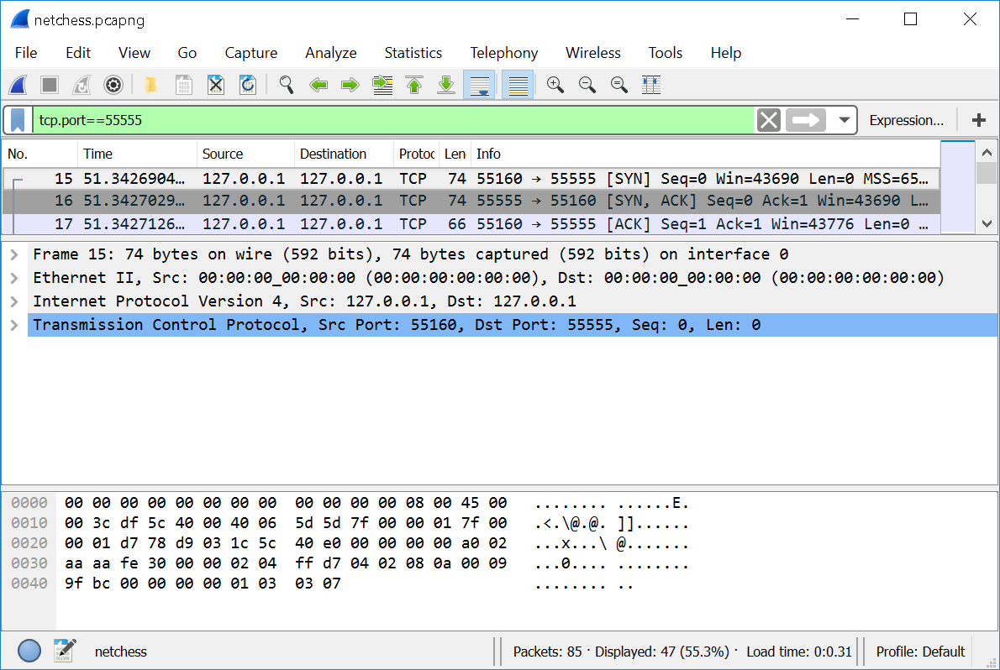
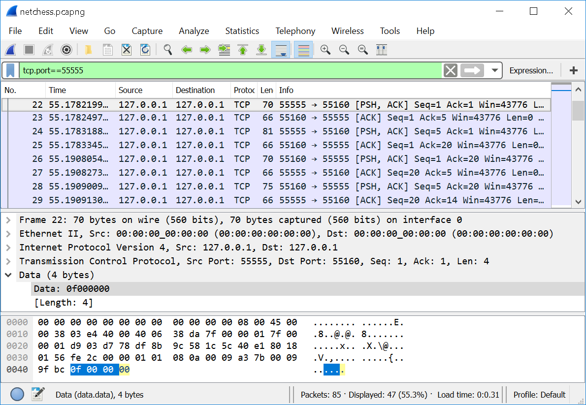
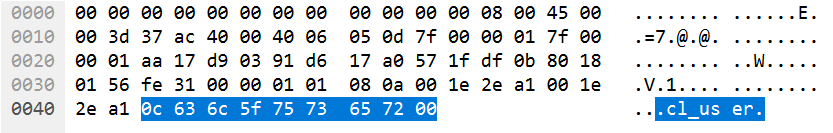
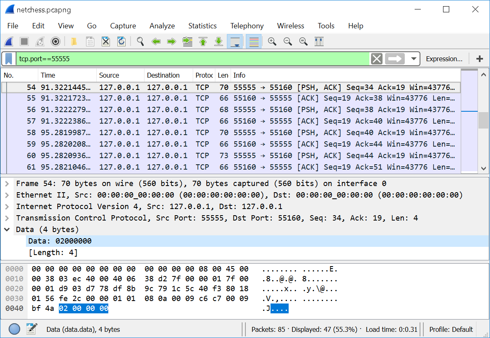

# Пример бота для NetChess

Мы узнали достаточно, чтобы написать простого внеигрового бота. Он будет делать ходы в шахматной программе NetChess. Эта программа состоит из клиентской и серверной частей. Она позволяет играть двум пользователям по локальной сети. Вы можете бесплатно скачать её на сайте [Sourceforge](https://sourceforge.net/projects/avmnetchess). Чтобы установить игру, просто распакуйте архив с ней в любой каталог.

Рассмотрим интерфейс игры. Её главное окно изображено на иллюстрации 4-11. Большую его часть занимает шахматная доска с фигурами. Главное меню находится в верхней области окна. Ряд иконок под меню дублирует некоторые из его функций.



**Иллюстрация 4-11.** *Окно NetChess*

Чтобы начать игру, необходимо запустить приложение NetChess и назначить ему роль сервера. После этого второй игрок запускает приложение на другом компьютере и настраивает его на роль клиента. Он подключается к серверу, и игра начинается. Благодаря loopback интерфейсу мы можем запустить клиент и сервер на одном хосте.

Чтобы запустить NetChess и начать игру, выполните следующие действия:

1. Дважды запустите исполняемый файл `NetChess2.1.exe` из каталога `Debug` игры. В результате откроется два окна NetChess, соответствующие двум процессам. Выберите из них то, которое будет выполнять роль сервера. Тогда другое - клиент.

2. Переключитесь на окно сервера и выберите пункт меню "Network" ➤ "Server" ("Сеть" ➤ "Сервер"). Откроется диалог конфигурации приложения в роли сервера, как на иллюстрации 4-12.


**Иллюстрация 4-12.** *Диалог конфигурации сервера*

3. Введите имя пользователя, который играет на стороне сервера, и нажмите кнопку "OK".

4. Переключитесь на окно приложения NetChess, выполняющее роль клиента. Выберите пункт меню "Network" ➤ "Client" ("Сеть" ➤ "Клиент"). Откроется диалог конфигурации клиента, как на иллюстрации 4-13.


**Иллюстрация 4-13.** *Диалог конфигурации клиента*

5. Введите имя пользователя на стороне клиента и IP-адрес сервера (в моём случае это 169.254.144.77). Затем нажмите кнопку "OK".

6. Переключитесь на окно сервера. Когда клиент попытается подключиться, должен открыться диалог "Accept" (принять), как на иллюстрации 4-14. В нём выберите цвет фигур (чёрный, белый, случайный). После этого нажмите кнопку "Accept" (принять).



**Иллюстрация 4-14.** *Диалог подключения клиента*

7. Переключитесь на окно клиента. Вы увидите сообщение об успешном подключении к серверу. В нём выводится имя оппонента и цвет его фигур (см иллюстрацию 4-15).



**Иллюстрация 4-15.** *Диалог подтверждения подключения*

8. Переключитесь на окно сервера и выберите пункт меню "Edit" ➤ "Manual Edit" ➤ "Start Editing" ("Редактирование" ➤ "Ручное редактирование" ➤ "Начать редактирование"). Откроется диалог с подтверждением, в котором вы должны нажать кнопку "Yes" (да). После этого приложение позволит вам запустить игровые часы.

9. Переключитесь на окно клиента и подтвердите включение режима "Manual Edit" в открывшемся диалоге. Для этого нажмите кнопку "Yes".

10. Переключитесь на окно сервера. Вы увидите сообщение, что клиент подтвердил включение режима "Manual Edit". Закройте его нажатием кнопки "OK". Затем уберите галочку с пункта меню "Edit" ➤ "Manual Edit" ➤ "Pause clock" ("Редактирование" ➤ "Ручное редактирование" ➤ "Остановить часы").

Игровые часы запустятся, и белая сторона может сделать первый ход. Для этого достаточно перетащить мышкой нужную фигуру на другую клетку доски.

## Обзор бота

Наш внеигровой бот будет подключаться к серверу и полностью замещать собой приложение NetChess, выполняющее роль клиента.

У бота есть много способов выбрать свой ход. Предлагаю остановиться на самом простом решении. Ведь мы рассматриваем взаимодействие с игровым сервером, а не алгоритмы шахматных программ. Наш бот будет зеркально повторять ходы игрока до тех пор, пока это позволяют правила игры. Задача выглядит достаточно простой, но потребует изучения протокола NetChess.

Приложение NetChess распространяется с открытым исходным кодом. Вы можете изучить код и быстро разобраться в протоколе приложения. Мы выберем другой путь. Давайте предположим, что NetChess - проприетарная игра, и её исходный код недоступен. Для исследования у нас есть только перехваченный сетевой трафик между клиентом и сервером.

## Изучение трафика NetChess

Мы рассмотрели шаги, необходимые для установки соединения между клиентом и сервером NetChess, а также чтобы начать игру. Теперь мы можем перехватить трафик и найти сетевые пакеты, соответствующие каждому из этих шагов. Но сначала рассмотрим два важных вопроса.

Как мы будем отличать трафик NetChess от остальных приложений в Wireshark логе? Если бы мы использовали сетевую плату вместо loopback интерфейса, в лог попали бы пакеты всех работающих в данный момент сетевых приложений. Но пакеты NetChess мы можем отличить по номеру порта. Мы указали его при настройке серверной части приложения. По-умолчанию он равен 55555. Применим следующее условие проверки порта в качестве Wireshark фильтра:
```
tcp.port==55555
```
Теперь в логе будет выводиться только трафик NetChess.

Следующий вопрос: как именно следует перехватывать трафик? Можно просто запустить Wireshark, начать прослушивать loopback интерфейс и сыграть несколько игр подряд. Поступив так, мы потеряем важную информацию, которая очень пригодилась бы для изучения трафика. В Wireshark логе, собранном по нескольким играм, будет сложно различить отдельные ходы каждой стороны. Например, какой именно пакет соответствует первому ходу белых? В логе накопилось более ста пакетов, а мы не можем даже сказать, когда начиналась каждая игра. Чтобы избежать этого затруднения, будем проверять Wireshark лог после каждого совершённого действия. В этом случае мы сразу увидим соответствующие ему пакеты.

Теперь запустим Wireshark, NetChess клиент и сервер. Начнём прослушивание loopback интерфейса в анализаторе. После этого выполните следующие действия:

1. Запустите NetChess в режиме сервера (настройка “Network” ➤ “Server”). После этого действия приложение только открывает сокет. Поэтому в логе Wireshark новых пакетов не появится.

2. Подключитесь NetChess клиентом к серверу (настройка “Network” ➤ “Client”). В Wireshark окне появятся три пакета, как на иллюстрации 4-16. Это установка TCP соединения через тройное рукопожатие.



**Иллюстрация 4-16.** *Установка соединения между NetChess клиентом и сервером*

3. Сервер принимает соединение клиента. После этого анализатор перехватит два пакета, отправленные сервером. На иллюстрации 4-17 их номера 22 и 24. Клиент подтверждает их получение и сам посылает два пакета с данными (их номера 26 и 28).

Остановимся на этом шаге и рассмотрим четыре только что перехваченных пакета. Первый пакет от сервера под номером 22 содержит следующие данные:
```
0f 00 00 00
```
Попробуйте перезапустить клиент и сервер NetChess. После этого снова установите соединение между ними. Данные, передаваемые первым пакетом не изменятся. Вероятнее всего, на прикладном уровне модели TCP/IP они означают, что сервер принял соединение клиента. Чтобы проверить это предположение, попробуйте отклонить подключение клиента на сервере. В этом случае данные пакета изменятся на следующие:
```
01 00 00 00
```
Из этого следует, что наша гипотеза верна. Приняв соединение, сервер отвечает первым байтом 0f. Иначе в ответе будет 01.



**Иллюстрация 4-17.** *Подтверждение подключения NetChess сервером*

Второй пакет от сервера с номером 24 содержит следующие байты данных:
```
0b 02 46 6d e7 5a 73 72 76 5f 75 73 65 72 00
```
В моём случае игрок на стороне сервера выбрал белые фигуры и ввёл имя "srv_user". Wireshark способен частично декодировать эти данные. Согласно иллюстрации 4-18, байты с 7-ого по 15-ый соответствуют имени пользователя.


**Иллюстрация 4-18.** *Декодирование данных второго пакета от сервера в Wireshark*

Что означают первые шесть байт в ответе сервера? Перезапустим приложение и заставим его отправить этот пакет снова. Не забудьте выбрать то же имя пользователя "srv_user" и белые фигуры на стороне сервера. Благодаря этому уже известные нам байты данных не изменятся.

После перезапуска NetChess, у меня получились следующие данные в пакете:
```
0b 02 99 b3 ee 5a 73 72 76 5f 75 73 65 72 00
```
Обратите внимание, что первые два байта (0b и 02) не изменились. Скорее всего, в них закодирован цвет фигур, который выбрал игрок на стороне сервера. Попробуйте перезапустить NetChess и выбрать сторону черных. Данные этого пакета поменяются:
```
0b 01 ba 45 e8 5a 73 72 76 5f 75 73 65 72 00
```
Если повторить тест с выбором чёрных фигур несколько раз, второй байт всегда будет равен 01. Это подтверждает наше предположение. Цвет фигур игрока на стороне сервера кодируется согласно таблице 4-2. Эта информация может оказаться полезной для бота.

**Таблица 4-2.** *Кодирование цвета фигур игрока на стороне сервера*

| Байт | Цвет |
| --- | --- |
| 01 | Чёрный |
| 02 | Белый |

Следующие два пакета с данными отправляются клиентом. Первый из них под номером 26 содержит байты:
```
09 00 00 00
```
Они не изменятся, если мы перезапустим приложение и попробуем поменять имя игрока на стороне сервера или цвет его фигур. Поэтому предположительно это неизменный ответ клиента.

Следующий пакет под номером 28 содержит данные:
```
0c 63 6c 5f 75 73 65 72 00
```
Wireshark декодирует эти байты, начиная со второго, как имя игрока на стороне клиента (см. иллюстрацию 4-19). Значение первого байта неясно. Оно не меняется после перезапуска приложения. Бот может обращаться с ним, как с константой, и всегда включать в свой ответ серверу.



**Иллюстрация 4-19.** *Декодирование данных второго пакета от клиента в Wireshark*

Продолжим действия в приложении NetChess, необходимые для начала игры. Включим режим "Manual Edit" на стороне сервера ("Edit" ➤ "Manual Edit" ➤ "Start Editing"). После этого сервер отправляет два пакета клиенту.

Первый пакет под номером 41 на иллюстрации 4-20 содержит следующие данные:
```
0a 00 00 00
```
Вероятнее всего, первый байт 0a соответствует коду запроса сервера. Данные второго пакета под номером 43 выглядят так:
```
13 73 72 76 5f 75 73 65 72 00
```
Мы уже встречали набор байтов со 2-ого по 9-ый и знаем, что он соответствует строке "srv_user". Первый же байт со значением 13 не меняется и наш бот может его игнорировать.

Когда клиент подтверждает включение режима "Manual Edit", он отправляет два пакета с номерами 45 и 47 на иллюстрации 4-20. Их данные следующие:
```
01 00 00 00
17
```
При получение запроса сервера, начинающегося с 0a, бот должен повторить этот ответ без изменений.


**Иллюстрация 4-20.** *Включение режима "Manual Edit" сервером*

Чтобы начать игру, нам осталось только включить часы. После этого действия сервер отправляет два пакета с номерами 54 и 56 на иллюстрации 4-21. Данные этих пакетов следующие:
```
02 00 00 00
22 00
```
Клиент не отвечает на эти пакеты, поэтому наш бот может их просто проигнорировать.

Все последующие пакеты (начиная с номера 58) передают данные о перемещении фигур игроками. Первой ходит белая сторона. В нашем случае это игрок на стороне сервера. Каждому ходу соответствует два пакета с данными в Wireshark логе.

Если белые сделают первый ход e2-e4, сервер передаст пакеты со следующими данными:
```
07 00 00 00
00 00 06 04 04 04 00
```
Попробуйте сделать ещё несколько ходов за обе стороны. Вы заметите, что данные первого из двух пакетов (07 00 00 00) не меняются. По ним бот может определить, что передаётся ход игрока.



**Иллюстрация 4-21.** *Запуск игровых часов сервером*

Мы подошли к самому важному вопросу: как декодировать данные о ходе игрока? Представим себе шахматную доску. В ней всего 64 поля: 8 по вертикали и 8 по горизонтали. По вертикали поля нумеруются цифрами от 1 до 8, а по горизонтали - латинскими буквами от a до h. Очевидно, что ход каждого игрока должен содержать информацию о поле, где находится фигура сейчас, и поле, куда её следует переместить.

Вернёмся к перехваченному пакету с информацией о перемещении фигуры. Его данные содержат четыре ненулевых байта. Попробуйте сделать ещё несколько ходов. Первые два и последний байт всегда равны нулю, а остальные - нет. Следовательно, начальная и конечная позиция фигуры должна быть закодирована в этих четырёх байтах. То есть каждое поле задаётся двумя байтами.

Предположим, что первым указывается текущее поле фигуры. В нашем случае клетке e2 соответствуют два байта 06 04, а e4 - 04 04. Обратите внимание, что буква у обоих полей одинакова. Исходя из этого предположим, что байт 04 соответствует букве "e".

Теперь сделайте ход пешкой на поле с другой буквой, чтобы подтвердить наше предположение. В случае "d2-d4" данные соответствующего пакета выглядят следующим образом:
```
00 00 06 03 04 03 00
```
Получается, что букве "d" соответствует байт 03. Логично предположить, что коды букв идут последовательно один за другим. Учитывая это, составим таблицу 4-3 соответствия букв и их кодов.

**Таблица 4-3.** *Коды букв полей шахматной доски*

| Байт | Буква |
| --- | --- |
| 00 | a |
| 01 | b |
| 02 | c |
| 03 | d |
| 04 | e |
| 05 | f |
| 06 | g |
| 07 | h |

Как мы получили эту таблицу? Начнём заполнять её левый столбец с уже известных нам байтов 03 и 04, которые соответствуют буквам "d" и "e". Затем продолжим вверх значения в левом столбце: 02, 01, 00. Точно так же продолжим вверх значения в правом столбце: "c", "b", "a". Аналогично заполним строки таблицы после байта 04.

Теперь составим похожую таблицу для номеров клеток. Мы уже знаем, что байт 06 соответствует номеру 2, а 04 - номеру 4. Поместим эти значения в таблицу и заполним остальные её строки. Вы должны получить таблицу 4-4.

Проверьте наши выводы, делая различные игровые ходы. По номерам и буквам клеток вы легко сможете предсказать данные пакетов, которые отправляют друг другу клиент и сервер.

Теперь мы знаем об игровом протоколе всё необходимое, чтобы написать бота.

**Таблица 4-4.** *Коды номеров полей шахматной доски*

| Байт | Номер |
| --- | --- |
| 07 | 1 |
| 06 | 2 |
| 05 | 3 |
| 04 | 4 |
| 03 | 5 |
| 02 | 6 |
| 01 | 7 |
| 00 | 8 |

## Реализация бота

### Начало игры

Первая задача, с которой должен справиться наш бот, - подключиться к серверу и начать игру в качестве клиента. Мы уже рассмотрели все пакеты которыми обмениваются обе стороны на этом этапе. Теперь реализуем скрипт, который отвечает на запросы сервера точно так же, как клиент NetChess. Результат приведён в листинге 4-5.

**Листинг 4-5.** *Скрипт `StartGameBot.py`*
```Python
import socket

def main():
  s = socket.socket(socket.AF_INET, socket.SOCK_STREAM, 0)
  s.settimeout(60)
  s.connect(("127.0.0.1", 55555))

  # получить от сервера подтверждение соединения
  s.recv(1024, socket.MSG_WAITALL)
  s.recv(1024, socket.MSG_WAITALL)

  # отправить имя пользователя на стороне клиента
  s.send(bytes([0x09, 0, 0, 0]))
  s.send(bytes([0x0C, 0x63, 0x6C, 0x5F, 0x75, 0x73, 0x65, 0x72, 0x00]))

  # получить от сервера уведомление о включении режима "Manual Edit"
  s.recv(1024, socket.MSG_WAITALL)
  s.recv(1024, socket.MSG_WAITALL)

  # отправить подтверждение клиентом режима "Manual Edit"
  s.send(bytes([0x01, 0, 0, 0]))
  s.send(bytes([0x17]))

  # получить от сервера уведомление о включении игровых часов
  s.recv(1024, socket.MSG_WAITALL)
  s.recv(1024, socket.MSG_WAITALL)

  s.close()

if __name__ == '__main__':
  main()
```
---
Некоторые строки скрипта `StartGameBot.py` начинаются со знака решётки (#). Это комментарии, а не код.
---
Первые три строчки функции `main` устанваливают TCP соединение. Обратите внимание, что мы установили таймаут на 60 секунд. В течении этого времени вызовы `recv` ожидают пакеты от сервера. За это время игрок на стороне сервера должен успеть сделать свой ход.

Затем идут два вызова `recv`, чтобы получить подтверждение от сервера об успешном соединении. В этих пакетах указано имя пользователя на стороне сервера и цвет его фигур. Эти данные не интересны для бота, поэтому он их игнорирует.

Почему цвет фигур оппонента не важен для бота? На самом деле вопрос стоит сформулировать по-другому: сможет ли бот сыграть любым цветом? На самом деле не сможет. Наш бот отвечает на ходы игрока зеркально, то есть повторяет их пока может. Следовательно, он может сделать свой ход только после человека. То есть бот играет только за чёрных.

Получив подтверждение от сервера, бот отправляет имя пользователя на стороне клиента. Именем служит строка "cl_user", которая в виде байтового массива представляется следующим образом:
```
63 6C 5F 75 73 65 72
```
Перед именем пользователя бот добавляет обязательную константу 0c.

Следующий шаг процедуры начала игры - включение режима "Manual Edit". Получив уведомление от сервера, бот отправляет пакет с подтверждением включения этого режима.

Последнее действия сервера перед тем, как пользователь и бот начнут делать ходы, - запуск игровых часов. Уведомление об этом не требует ответа.

Можем ли мы удалить лишние `recv` вызовы из скрипта `StartGameBot.py`? В процессе начала игры бот игнорирует практически всю информацию от сервера: выбранный пользователем цвет фигур, его имя, код режима "Manual Edit". Всё что на самом деле нужно боту - это информация о ходах игрока. Мы могли бы удалить лишние вызовы `recv`, но тогда возникает проблема. Как бот узнает, в какой момент ему следует посылать подтверждения на действия пользователя на стороне сервера и пакеты со своими ходами? Можно останавливать выполнение скрипта с помощью функции `sleep`. Но тогда возникает вопрос: в какой момент боту следует просыпаться и совершает свой ход? Ответ зависит от действий игрока. На один ход ему может понадобиться 15 секунд, а на другой минута. Следовательно мы не можем точно определить моменты времени, когда бот должен ходить. Получается, что единственный способ для бота вовремя реагировать на действия игрока - это получать все пакеты от сервера с помощью вызова `recv`. Зная заранее последовательность действии для начала игры, бот может точно установить момент получения пакета с первым ходом пользователя.

### Повторение ходов игрока

Мы рассмотрели часть скрипта бота, которая отвечает за процесс начала игры. Следующий шаг - реализовать алгоритм для зеркального повторения ходов пользователя.

Как правильно выбрать фигуру для хода и её новое поле? Рассмотрим несколько примеров зеркальных ходов в таблице 4-5.

**Таблица 4-5.** *Зеркальные ходы*

| Ход | Байты данных | Зеркальный ход | Байты данных |
| --- | --- | --- | --- |
| e2 - e4 | 00 00 06 04 04 04 00 | e7 - e5 | 00 00 01 04 03 04 00 |
| d2 - d4 | 00 00 06 03 04 03 00 | d7 - d5 | 00 00 01 03 03 03 00 |
| b1 - c3 | 00 00 07 01 05 02 00 | b8 - c6 | 00 00 00 01 02 02 00 |

Первый ход в таблице "e2 - e4" делает белая пешка. Зеркальный ход чёрной пешкой "e7 - e5". Следующую пару ходов делают пешки на линии "d". Затем идёт ход белого коня "b1 - c3". Когда вы прочитаете соответствующий ему зеркальный ход чёрных, вы должны заметить некоторые закономерности в байтах данных.

Первая закономерность относится к буквам клеток. Поля зеркального хода имеют те же буквенные обозначения, что и хода белых. Это правило выполняется для всех фигурых.

Вторая закономерность поможет рассчитать номера клеток. Внимательно помотрите на следующие пары чисел:

* 6 и 1
* 4 и 3
* 7 и 0
* 5 и 2

Как из правого числа получить левое? Для этого надо вычести его из семи. Это правило выполняется для каждой из рассмотренных пар.

Теперь реализуем алгоритм расчёта зеркальных ходов. Результат приведён на листинге 4-6.

**Листинг 4-6.** *Алгоритм расчёта зеркальных ходов*
```Python
  while(1):
    # получить от сервера ход игрока
    s.recv(1024, socket.MSG_WAITALL)
    data = s.recv(1024, socket.MSG_WAITALL)
    print(data)

    start_num = 7 - data[2]
    end_num = 7 - data[4]

    # отправить ход бота
    s.send(bytes([0x07, 0, 0, 0]))
    s.send(bytes([0, 0, start_num, data[3], end_num, data[5], 0x00]))
```
Алгоритм работает в бесконечном цикле `while`. В нём мы получаем пакет от сервера с ходом игрока и сохраняем его данные в переменной `data`. С помощью функции `print` выводим эти данные на консоль. Далее вычисляем номер клетки в которой находится фигура чёрных, которая должна сделать ход. Для расчёта используем третий байт массива `data` (с индексом 2). Он соответствует номеру начального поля белой фигуры. Результат сохраняем в переменной `start_num`. Аналогично вычисляем номер поля, куда фигура должна походить. Результат сохраняем в переменной `end_num`. После этого отправляем два пакета с ходом бота. Первый пакет содержит константные данные (07 00 00 00). Второй - рассчитанные номера клеток и такие же буквы, как в ходе игрока. Они хранятся в байтах с индексами 3 и 5 массива `data`.

Полная реализация бота доступна в файле `MirrorBot.py` из архива примеров к этой книге. В нём объединён код из листингов 4-5 и 4-6.

Чтобы протестировать бота выполните следующие действия:

1. Запустите приложение NetChess.

2. Настройте его на работу в режиме сервера.

3. Запустите скрипт `MirrorBot.py`.

4. В приложении включите режим "Manual Edit".

5. Запустите игровые часы.

6. Сделайте первый ход за белых.

Бот будет повторять каждый ваш ход до тех пор, пока это позволяют правила игры. Если такой ход невозможен, бот не будет ничего делать.

## Выводы

Рассмотрим эффективность нашего внеигрового бота, сопоставив его достоинства и недостатки.

Достоинства бота:

1. Он получает полную и точную информацию о состоянии игровых объектов.

2. Он может симулировать действия игрока без каких-либо ограничений.

Недостатки бота:

1. Анализ игрового протокола требует времени. Чем сложнее игра, тем более трудоёмким становится этот процесс.

2. Чтобы защититься от этого типа ботов, достаточно зашифровать трафик между клиентом и сервером.

3. Незначительные изменения в протоколе игры приводят к обнаружению бота. Так же они могут помешать работе бота, поскольку сервер может блокировать пакеты устаревшего формата.

Мы можем обобщить наши выводы на большинство внутриигровых ботов. Они хорошо справляются с автоматизацией игрового процесса но только до тех пор, пока на стороне сервера не поменяется протокол взаимодействия. После этого скорее всего ваша игровая учётная запись будет заблокирована. Разработка ботов этого типа требует значительных усилий и времени.
