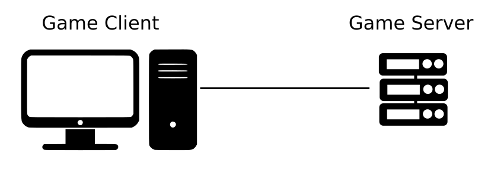
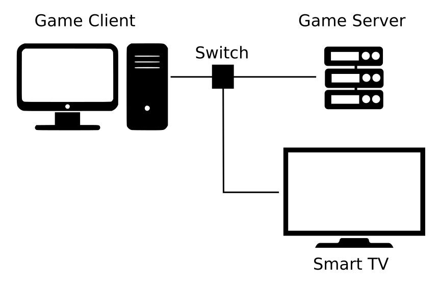
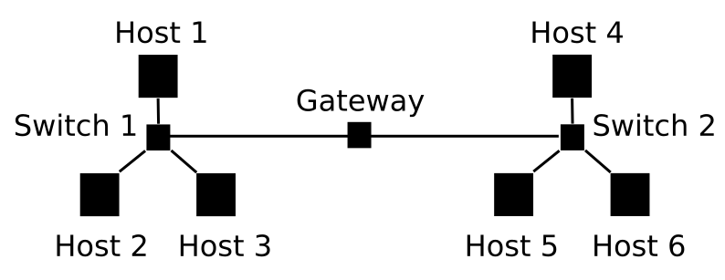
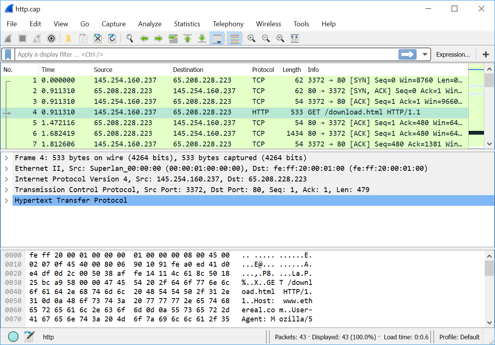

# Сетевые протоколы

В первой главе мы рассмотрели архитектуру типичной онлайн-игры. Как вы помните, в ней игровой клиент взаимодействует с сервером через сеть (в большинстве случаев это Интернет). Для передачи пакетов клиент вызывает WinAPI функции. ОС обрабатывает эти вызовы и отправляет указанные данные по сети. На аппаратном уровне для этого используется сетевая плата, функции которой доступны ОС благодаря драйверу устройства. 

Возникает вопрос: как именно происходит передача данных по сети? Попробуем найти на него ответ вместе.

## Задачи при передаче данных

Чтобы лучше понять существующие решения в какой-то технической области, будет разумным рассмотреть решаемые ими задачи. Представим, что мы с вами разработчики программ, и нам поставили задачу передать данные игрового клиента на сервер через существующую сеть.

У нас есть два устройства, подключенных к сети как на иллюстрации 4-1. Они называются **сетевыми хостами**.

***Иллюстрация 4-1.** Игровой клиент и сервер, соединенные сетью*

Самое прямолинейное и простое решение – реализовать алгоритм передачи данных целиком в игровом клиенте. Этот алгоритм может выглядеть следующим образом:

1. Скопировать все состояния игровых объектов в байтовый массив. Такой массив называется [**сетевым пакетом**](https://ru.wikipedia.org/wiki/%D0%9F%D0%B0%D0%BA%D0%B5%D1%82_(%D1%81%D0%B5%D1%82%D0%B5%D0%B2%D1%8B%D0%B5_%D1%82%D0%B5%D1%85%D0%BD%D0%BE%D0%BB%D0%BE%D0%B3%D0%B8%D0%B8%29).

2. Скопировать подготовленный пакет в память, доступную для сетевой платы. Обычно эта память работает в режиме [DMA](https://ru.wikipedia.org/wiki/%D0%9F%D1%80%D1%8F%D0%BC%D0%BE%D0%B9_%D0%B4%D0%BE%D1%81%D1%82%D1%83%D0%BF_%D0%BA_%D0%BF%D0%B0%D0%BC%D1%8F%D1%82%D0%B8).

3. Дать плате команду на отправку пакета.

Наш алгоритм успешно справляется с передачей данных до тех пор, пока сеть состоит только из двух устройств. Но что произойдёт, если подключить третий хост как на иллюстрации 4-2?

***Иллюстрация 4-2.** Сеть из трёх хостов*

В этому случае нам не обойтись без дополнительного устройства, известного как [**сетевой коммутатор**](https://ru.wikipedia.org/wiki/%D0%A1%D0%B5%D1%82%D0%B5%D0%B2%D0%BE%D0%B9_%D0%BA%D0%BE%D0%BC%D0%BC%D1%83%D1%82%D0%B0%D1%82%D0%BE%D1%80) (network switch). У обычной современной сетевой платы Ethernet есть только один порт. Она рассчитана на подключение точка-точка. Поэтому трёх сетевых плат просто не хватит для сети из трёх хостов. Конечно, можно установить несколько сетевых плат на каждый компьютер, но это будет слишком дорого. Сетевой коммутатор решает проблему. На данный момент будем рассматривать его, только как средство физического подключения нескольких хостов к одной сети.

После появления третьего устройства в сети возникла проблема. Каким-то образом необходимо различать хосты и направлять игровые данные от клиента на сервер, а не на телевизор. Вы можете возразить, что нет ничего плохого, если телевизор получит несколько ненужных ему пакетов. Он может их просто проигнорировать. Эта мысль верна до тех пор, пока наша сеть небольшая. Но что случится, если к ней подключатся сотни хостов? Если каждый узел будет посылать трафик для каждого, сеть окажется перегружена. Задержки в передаче пакетов станут настолько велики, что никакого эффективного взаимодействия между хостами не получится. Причина этого в том, что сетевые кабели и платы имеют ограниченную пропускную способность в силу аппаратных особенностей. С этим ресурсом нам следует работать осмотрительно.

Проблему различия хостов в сети можно решить, если каждому из них назначить уникальный идентификатор. Мы пришли к первому решению, которое приняли настоящие разработчики сетей.  **MAC-адрес** – это уникальный идентификатор сетевой платы или другого передающего в сеть устройства. Этот адрес неизменный и назначается изготовителем на этапе производства устройства. Теперь наше игровое приложение может добавлять MAC-адрес целевого хоста к каждому передаваемому пакету. Благодаря этому сетевой коммутатор сможет перенаправлять пакет только на тот свой порт, к которому подключён целевой хост.

Откуда коммутатор знает MAC-адреса хостов подключённые к его портам? Для этого он следит за всеми входящими на каждый порт пакетами. Из них он читает MAC адрес отправителя и добавляет его в таблицу разрешения адресов, также известную как Address Resolution Logic (ARL). В этой таблице каждая строка содержит MAC-адрес и соответствующий ему порт.

Когда сервер получит пакет клиента, он захочет подтвердить корректность принятых данных, либо в случае ошибки запросить повторной передачи. Для этого нужно знать MAC-адрес отправителя. Поэтому будет разумным при отправке пакета клиентом добавлять не только MAC-адрес целевого хоста, но и свой собственный.

Предположим, что наша сеть стала больше. Например, к ней подключены хосты, находящиеся в двух расположенных недалеко друг от друга зданиях. Каждое из них имеет собственную локальную сеть (или подсеть), состоящую для простоты из трёх компьютеров. Обе они объединены в единую сеть через [**маршрутизатор**](https://ru.wikipedia.org/wiki/%D0%9C%D0%B0%D1%80%D1%88%D1%80%D1%83%D1%82%D0%B8%D0%B7%D0%B0%D1%82%D0%BE%D1%80) (router), как на иллюстрации 4-3.

***Иллюстрация 4-3.** Две локальные сети, соединённые маршрутизатором*

На самом деле в каждой из двух локальных сетей могут быть десятки хостов. Если мы по-прежнему будем использовать MAC-адреса для указания целей пакетов, возникнут сложности. Каждый хост должен знать адреса всех получателей, с которыми он обменивается данными. Самое простое решение этой проблемы заключается в том, чтобы хранить список MAC-адресов всех хостов в сети на каждом из них. Тогда при подключении нового компьютера надо выполнить следующие действия:

1. Добавить MAC-адрес нового хоста во все существующие списки.

2. Скопировать исправленный список на новый хост.

Не забывайте также об исправлении списков адресов, когда один из хостов отключается. Очевидно, что вручную поддерживать эти списки в актуальном состоянии очень трудоёмко.

Вместо ручной правки и копирования списков можно написать алгоритм автоматического обнаружения хостов. Например, только что подключившийся к сети компьютер отправляет [**широковещательный запрос**](https://ru.wikipedia.org/wiki/%D0%A8%D0%B8%D1%80%D0%BE%D0%BA%D0%BE%D0%B2%D0%B5%D1%89%D0%B0%D1%82%D0%B5%D0%BB%D1%8C%D0%BD%D1%8B%D0%B9_%D0%B0%D0%B4%D1%80%D0%B5%D1%81) всем остальным. Любой, кто получает этот запрос, должен выслать свой MAC-адрес отправителю. Подобный механизм существует и известен как [**протокол определения адреса**](https://ru.wikipedia.org/wiki/ARP) (Address Resolution Protocol или ARP). На самом деле ARP работает несколько сложнее. Когда какой-то хост хочет начать обмен данными, но не знает MAC-адрес получателя, он отправляет широковещательный запрос. В этом запросе указано (по IP-адресу о котором далее), кто именно должен на него ответить. Таким образом отвечает только тот хост, которого ищут.

Что означает термин "протокол" применительно к сетям? Это набор соглашений о формате данных. Например, наше приложение посылает игровые данные на сервер. Должны ли мы добавлять MAC-адреса отправителя и получателя в начале сетевого пакета или в конце? Если в начале – получатель должен знать об этом решении и интерпретировать первые байты пакета как адреса. Кроме того протокол определяет, как будут обрабатывать ошибки передачи данных.  Например, сервер получает только половину отправленного клиентом пакета. Логично будет запросить его повторную передачу. Чтобы это сработало, клиент должен правильно понять сообщение от сервера о потере пакета. Спецификация протокола включает в себя все подобные нюансы взаимодействия сетевых хостов.

Вернёмся к нашей разросшейся сети. Очевидно, мы имеем некоторое дублирование данных, поскольку все хосты знают друг друга и должны хранить таблицу MAC-адресов в своей памяти. ARP протокол помогает частично решить эту проблему. Благодаря ему, актуальность таблиц будет поддерживаться динамически. Но их размер станет значительным, если сеть насчитывает десятки тысяч хостов. Было бы намного эффективнее, если бы только хосты одной подсети знали друг друга. При обмене данными между компьютерами из разных подсетей, маршрутизатор мог бы перенаправлять их пакеты. Таким образом хостам нужно будет знать только свою подсеть, частью которой является маршрутизатор.

Чтобы решить проблему с дублированием данных в таблицах, нам нужно что-то более гибкое чем MAC-адреса. Для передачи пакетов между подсетями был бы удобен механизм назначения хостам произвольных идентификаторов. Тогда мы могли бы назначить определённый диапазон "адресов" компьютерам одной подсети. Зная правило выбора диапазона, маршрутизатор мог бы быстро вычислять подсеть получателя по идентификатору и перенаправлять пакет. Мы говорим об уже существующем решении, известном как [**IP-адреса**](https://ru.wikipedia.org/wiki/IP-%D0%B0%D0%B4%D1%80%D0%B5%D1%81).

Теперь наше игровое приложение и сервер могут эффективно взаимодействовать, даже находясь в разных подсетях. Но что случится если мы запустим чат-программу на том же компьютере, где уже работает игровой клиент? Оба приложения должны посылать и принимать сетевые пакеты. Когда ОС получает пакет, указанные в нём IP и MAC-адреса соответствуют текущему хосту. Однако, этой информации недостаточно, чтобы найти программу-получатель среди работающих в данный момент. Для решения этой проблемы нужно добавить некий идентификатор приложения. Он называется [**портом**](https://ru.wikipedia.org/wiki/%D0%9F%D0%BE%D1%80%D1%82_(%D0%BA%D0%BE%D0%BC%D0%BF%D1%8C%D1%8E%D1%82%D0%B5%D1%80%D0%BD%D1%8B%D0%B5_%D1%81%D0%B5%D1%82%D0%B8%29). В каждом сетевом пакете должны быть указаны порты приложения отправителя и получателя. Тогда ОС сможет гарантировать правильность передачи пакета ожидающему его процессу. Порт отправителя нужен, чтобы получатель смог ответить.

Возможно, вы уже заметили, что реализация нашего игрового приложения становится слишком сложной. Оно должно подготовить пакет, содержащий состояния игровых объектов, MAC-адреса, IP-адреса и порты. Также было бы полезно подсчитать [**контрольную сумму**](https://ru.wikipedia.org/wiki/%D0%9A%D0%BE%D0%BD%D1%82%D1%80%D0%BE%D0%BB%D1%8C%D0%BD%D0%B0%D1%8F_%D1%81%D1%83%D0%BC%D0%BC%D0%B0) передаваемых данных и поместить её в тот же пакет. Приложение на стороне сервера должно иметь те же самые алгоритмы для кодирования и декодирования адресов, портов, игровых данных, а также подсчёта контрольной суммы. Эти алгоритмы выглядят достаточно универсальными. Любое приложение (например чат-программа или веб-браузер) могло бы использовать их для передачи своих данных. В то же время каждый хост сети должен иметь эти алгоритмы. Лучшим решением будет поместить их в библиотеки ОС.

Мы пришли к решению, известному как [**стек протоколов**](https://ru.wikipedia.org/wiki/%D0%A1%D1%82%D0%B5%D0%BA_%D0%BF%D1%80%D0%BE%D1%82%D0%BE%D0%BA%D0%BE%D0%BB%D0%BE%D0%B2). Этот термин означает реализацию набора сетевых протоколов. Слово "стек" используется, чтобы подчеркнуть иерархическую зависимость одних протоколов от других. Каждый из них относится к одному из **уровней** иерархии. При этом низкоуровневые протоколы предоставляют свои возможности для высокоуровневых. Например, стандарт IEEE 802.3 описывает правила передачи данных на физическом уровне по витой паре, а стандарт IEEE 802.11 - для беспроводной связи WiFi. Протоколы уровней выше должны уметь передавать данные по обоим типам соединений. Это означает, что на каждом уровне может быть реализовано несколько взаимозаменяемых протоколов. В зависимости от требований пользователь может выбрать протокол подходящий для его задачи. Когда возникает разнообразие реализаций, крайне важно чётко определить обязанности каждого уровня. Именно для этого была создана [**сетевая модель OSI**](https://ru.wikipedia.org/wiki/%D0%A1%D0%B5%D1%82%D0%B5%D0%B2%D0%B0%D1%8F_%D0%BC%D0%BE%D0%B4%D0%B5%D0%BB%D1%8C_OSI) (Open Systems Interconnection).

Мы кратко рассмотрели основные решения современных сетевых коммуникаций. Теперь у нас достаточно знаний, чтобы изучить реальный стек протоколов, используемый сегодня в сети Интернет.

## Стек протоколов TCP/IP

Почему мы собираемся рассмотреть [**стек TCP/IP**](https://ru.wikipedia.org/wiki/TCP/IP), когда речь зашла об Интернете? Возможно, вы ожидали, что в самой большой сети на планете должен использоваться стек, строго построенный по OSI модели. Ведь на её создание у двух интернациональных комитетов (ISO и CCITT) ушло несколько лет. В результате они разработали хорошо продуманный стандарт, покрывающий все возможные требования по взаимодействию в сети.

Было несколько попыток применить OSI модель на практике и реализовать протоколы для каждого её уровня. Все эти проекты не увенчались успехом. Главная проблема заключается в том, что OSI модель избыточна. Многие её функции оказались не нужны при практическом применении. В результате сетевые пакеты содержали никем не используемые данные, а это лишние накладные расходы.

Ещё одна проблема модели заключается в частичном перекрытии обязанностей некоторых уровней. Как результат в сетевом пакете оказываются дублирующиеся данные, используемые разными протоколами. Алгоритмы для их обработки копируются, что приводит к увеличению объёма исполняемого кода. Это также негативно отражается на быстродействии. Разработчикам требуется больше усилий на написание и сопровождение стека протоколов. Всё это приводит к его удорожанию.

Пока велась работа над OSI моделью, два исследователя Роберт Кан и Винтон Серф создали стек протоколов TCP/IP. Это произошло на несколько лет раньше публикации стандарта OSI. Роберт и Винтон занимались конкретной практической задачей – передачей данных в сети ARPANET. Возможно, благодаря этому их решение оказалось эффективным и простым в реализации. Впоследствии этот стек был опубликован комитетом IEEE в качестве открытого стандарта, получившего название **модель TCP/IP**, в 1974 году. OSI модель увидела свет только в 1984.

Сразу после публикации модели TCP/IP разработчики энтузиасты и компании начали реализовывать собственные версии стека для существовавших в то время ОС. Он оказался настолько прост, что программист в одиночку мог написать его за разумное время. Таким образом на большинстве работающих компьютеров появилась та или иная реализация стека, и он стал стандартом де-факто сети Интернет.

В чём различие моделей OSI и TCP/IP? Обе они следуют принципу разделения задач, связанных с передачей данных, по нескольким уровням иерархии протоколов. Но в TCP/IP число этих уровней меньше: четыре против семи в OSI модели. Таблица 4-1 демонстрирует соответствие этих уровней.

***Таблица 4-1.** Уровни моделей OSI и TCP/IP*

| Уровень | OSI | TCP/IP |
| --- | --- | --- |
| 7 6 5 | Прикладной (Application) Представления (Presentation) Сеансовый (Session) | Прикладной (Application) |
| 4 | Транспортный (Transport) | Транспортный (Transport) |
| 3 | Сетевой (Network) | Межсетевой (Internet) |
| 2 1 | Канальный (Link) Физический (Physical) | Канальный (Link) |

Рассмотрим все уровни TCP/IP на примере реального сетевого пакета. Для этого воспользуемся анализатором трафика Wireshark. Скачайте и установите его на свой компьютер. После этого загрузите с Wiki ресурса Wireshark [лог файл](http://wiki.wireshark.org/SampleCaptures?action=AttachFile&do=get&target=http.cap) с примером перехваченного Интернет трафика. Откройте лог файл `http.cap` в Wireshark. Диалог открытия файла можно вызвать по комбинации клавиш Ctrl+O. После этого окно анализатора должно выглядеть как на иллюстрации 4-4.

***Иллюстрация 4-4.** IP пакеты в окне Wireshark*

Окно анализатора разделено на три части. Верхняя из них представляет собой таблицу. Её горизонтальные ряды – это список перехваченных пакетов. Для каждого пакета в вертикальных столбцах приведена общая информация: адреса отправителя и получателя, время перехвата и т.д. Вы можете пролистать таблицу вниз и выбрать нужный пакет для вывода более подробной информации. Она отображается в средней части окна приложения. Здесь представлены **заголовки** всех протоколов, которые смог распознать Wireshark в этом пакете. Если вы выделите левым щелчком мыши один из заголовков, Wireshark подсветит соответствующие ему байты в нижней части окна. Более подробно интерфейс анализатора описан в [официальной документации](http://www.wireshark.org/docs/wsug_html_chunked/ChUseMainWindowSection.html).

Мы рассмотрим пакет под номером четыре в лог файле `http.cap`. Это типичный запрос браузера на загрузку веб-страницы из Интернета. Согласно таблице 4-1, в самом низу стека TCP/IP находятся протоколы канального уровня. Они отвечают за передачу пакетов по локальной сети. Как вы помните, в этом случае для обмена пакетами отправитель и получатель должны знать MAC-адреса друг друга. Этой информации будет достаточно для сетевого коммутатора, чтобы перенаправить пакет по назначению.

Согласно информации от Wireshark, отправитель четвёртого пакета в логе использует Ethernet II в качестве протокола канального уровня. Его заголовок идёт сразу после строчки "Frame" (кадр) в средней части окна анализатора. Если развернуть этот заголовок левым щелчком мыши по треугольнику рядом с ним, Wireshark отобразит содержащуюся в нём информацию: MAC-адреса получателя и отправителя. Кроме них, есть поле "Type" (тип) размером два байта. Оно содержит идентификатор протокола следующего уровня, который использовал отправитель. Заголовки протоколов следуют друг за другом в пакете. При этом можно рассматривать каждый протокол как контейнер содержащий заголовок и данные протокола следующего уровня. В нашем случае поле "Type" равно 0x0800, что соответствует [**протоколу IP версии 4**](https://ru.wikipedia.org/wiki/IP) (Internet Protocol Version 4 или IPv4).

IPv4 соответствует межсетевому уровню модели TCP/IP. Он отвечает за маршрутизацию пакетов между сетями. Самая важная информация его заголовка – это IP-адреса отправителя и получателя. Основываясь на них, маршрутизатор выбирает целевую сеть для передачи пакета. Чтобы прочитать эти адреса, разверните заголовок "Internet Protocol Version 4". Кроме них есть несколько полей, информация которых также нужна для корректной маршрутизации. Например, поле "Time to live" (время жизни) определяет максимальное время, в течение которого пакет может передаваться по сети. Если оно оказалось превышено, первый маршрутизатор, получивший такой пакет, заблокирует его. Поля "Identification" (идентификатор) и "Fragment offset" (смещение фрагмента) хранят информацию, необходимую для механизма фрагментации. Он позволяет делить пакет на части (называемые фрагментами) и передавать их по отдельности через сеть. Такое разделение позволяет балансировать нагрузку в сети. Передача слишком больших пакетов увеличивает цену ошибки. Если один бит данных окажется искажённым в процессе передачи, весь пакет придётся отправлять повторно. Маленькие пакеты приводят к увеличению накладных расходов, т.е. уменьшится отношение полезной нагрузки (передаваемые данные) к служебной информации (заголовки протоколов). Последнее поле IPv4 заголовка называется "Protocol" (протокол). В нём хранится идентификатор протокола следующего уровня. В нашем случае – это [**протокол управления передачей**](https://ru.wikipedia.org/wiki/Transmission_Control_Protocol) (Transmission Control Protocol или TCP).

Протоколы транспортного уровня обеспечивают соединение между взаимодействующими по сети процессами, запущенными на разных хостах. Самая важная информация для этого соединения – номера портов, которые позволяют идентифицировать процессы отправителя и получателя. Разверните заголовок "Transmission Control Protocol" в окне Wireshark, чтобы прочитать значения "Source Port" (порт отправителя в нашем случае равен 3372) и "Destination Port" (порт получателя – 80). Кроме них, в заголовке есть поля "Sequence number" (порядковый номер) и "Acknowledgment number" (номер подтверждения). Эти номера нужны для [**установки соединения**](https://ru.wikipedia.org/wiki/Transmission_Control_Protocol#%D0%A3%D1%81%D1%82%D0%B0%D0%BD%D0%BE%D0%B2%D0%BA%D0%B0_%D1%81%D0%BE%D0%B5%D0%B4%D0%B8%D0%BD%D0%B5%D0%BD%D0%B8%D1%8F) и обнаружения потерянных пакетов.

Сегодня в сети Интернет чаще других встречаются два протокола транспортного уровня: TCP и [**протокол пользовательских датаграмм**](https://ru.wikipedia.org/wiki/UDP) (User Datagram Protocol или UDP). Основное различие между ними заключается в надёжности передачи данных. Протокол TCP имеет механизм проверки того, что все отправленные пакеты дошли до получателя. Если какой-то пакет был потерян, получатель просит его передать повторно. В протоколе UDP такого механизма нет. Получатель не проверяет последовательность входящих пакетов, а просто игнорирует потери.

Зачем может понадобиться такой ненадёжный протокол, как UDP? Наряду со всеми достоинствами у протокола TCP есть один существенный недостаток. Механизм обнаружения потерянных пакетов может привести к задержкам в передаче пакетов. В некоторых случаях такие задержки неприемлемы.

Для примера рассмотрим отправку и получение по сети видеопотока. В этом случае потеря одного кадра несущественна, поскольку воспроизведение видео можно продолжить со следующего. Однако, если мы используем протокол TCP, ОС запросит повторную отправку потерянного сетевого пакета. Тогда отправитель вместо следующего кадра будет пересылать потерянный. Это приведёт к остановкам при воспроизведении видео, поскольку у приложения видеопроигрывателя не будет нужного в данный момент кадра. Если же для передачи видеопотока применить протокол UDP, зависаний удастся избежать. При этом очень вероятно, что пользователь вообще не заметит потерянные кадры.

На самом верхнем уровне модели TCP/IP находятся прикладные протоколы. Их формат произволен, и разработчики программ могут выбирать его по своему усмотрению. Таким образом порядок и значение байтов этой части сетевых пакетов целиком зависит от взаимодействующих приложений.

В нашем примере в качестве прикладного протокола используется [**протокол передачи гипертекста**](https://ru.wikipedia.org/wiki/HTTP) (Hypertext Transfer Protocol или HTTP). Данные этого протокола передаются в виде текста, который можно прочитать в нижней части окна Wireshark. Хост-отправитель пакета запрашивает у веб-сервера с [**единым указателем ресурса**](https://ru.wikipedia.org/wiki/URL) (Uniform Resource Locator или URL) "www.ethereal.com" страницу под названием "download.html". URL, также известный как веб-адрес, представляет собой псевдоним для IP-адреса. Он был введён в употребление, чтобы упростить использование [**всемирной паутиной**](https://ru.wikipedia.org/wiki/%D0%92%D1%81%D0%B5%D0%BC%D0%B8%D1%80%D0%BD%D0%B0%D1%8F_%D0%BF%D0%B0%D1%83%D1%82%D0%B8%D0%BD%D0%B0) (World Wide Web или WWW). Благодаря URL, пользователям нужно запоминать не IP-адреса, а названия веб-сайтов.