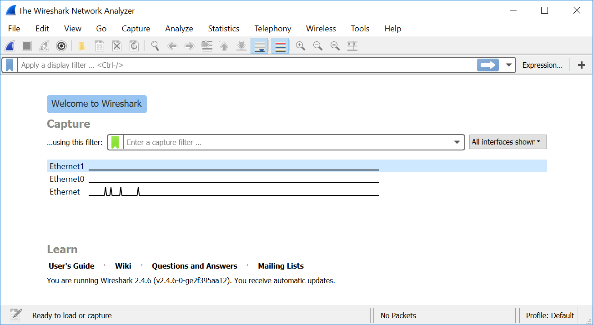
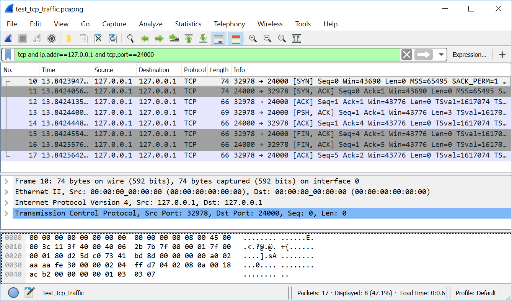
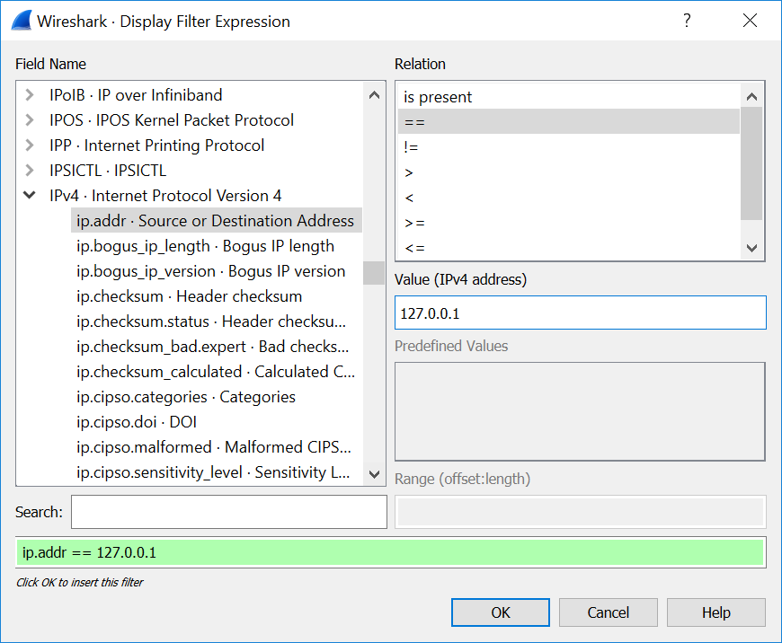
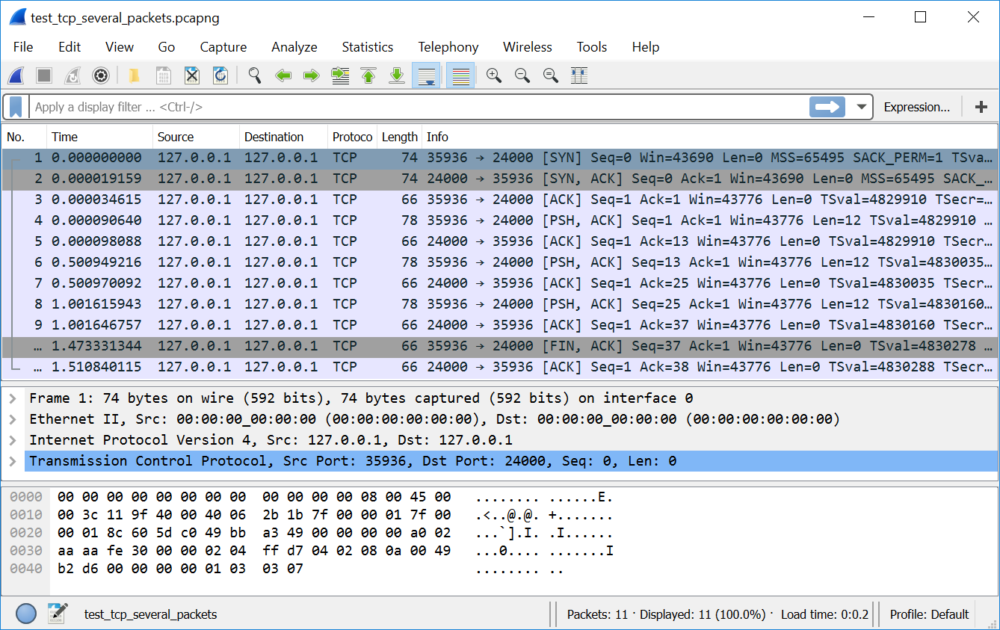

# Перехват трафика

Мы рассмотрели протоколы, используемые в сети Интернет. Теперь познакомимся с методом перехвата сетевого трафика двух взаимодействующих процессов, работающих на разных хостах. Анализ трафика игрового приложения – первый шаг при разработке внеигрового бота.

## Тестовое приложение

Для начала напишем простое приложение, которое передаёт по сети несколько байт. Оно состоит из двух частей: клиент и сервер. Благодаря loopback интерфейсу мы можем запустить их на одном компьютере и сымитировать передачу данных по сети. С помощью Wireshark перехватим этот трафик.

Перед тем как начать писать код, рассмотрим ресурс операционной системы, известный как [**сетевой сокет**](https://ru.wikipedia.org/wiki/%D0%A1%D0%BE%D0%BA%D0%B5%D1%82_(%D0%BF%D1%80%D0%BE%D0%B3%D1%80%D0%B0%D0%BC%D0%BC%D0%BD%D1%8B%D0%B9_%D0%B8%D0%BD%D1%82%D0%B5%D1%80%D1%84%D0%B5%D0%B9%D1%81)) (network socket). Именно он предоставляет приложению функции ОС для передачи сетевых пакетов.

Понятие сокета тесно связано с портом и IP-адресом. Как вы помните, порты отправителя и получателя указаны в заголовках протоколов TCP и UDP. Благодаря им, ОС доставляет пакет тому процессу, который его ожидает.

Предположим, вы запускаете игровой клиент и чат-программу на своём компьютере. Что случится если оба приложения решат использовать один и тот же сетевой порт для связи со своими серверами? В теории, каждая программа может выбрать порт по своему усмотрению. Чтобы предотвратить конфликты такого выбора, будет разумно зарезервировать некоторые порты для широко распространённых приложений. Это решение [уже существует](https://ru.wikipedia.org/wiki/%D0%A1%D0%BF%D0%B8%D1%81%D0%BE%D0%BA_%D0%BF%D0%BE%D1%80%D1%82%D0%BE%D0%B2_TCP_%D0%B8_UDP). Есть три диапазона портов:

1. **Общеизвестные** или системные от 0 до 1023. Используются процессами ОС, которые предоставляют широко распространённые сетевые сервисы.

2. **Зарегистрированные** или пользовательские от 1024 до 49151.
Они частично зарезервированы за конкретными приложениями и сервисами **администрацией адресного пространства Интернет** (IANA).

3. **Динамические** или частные от 49152 до 65535. Не зарезервированные порты, которые могут быть использованы для любых целей.

Очевидно, что кто-то должен контролировать использование портов запущенными приложениями. Эту функцию выполняет ОС. Когда процесс хочет воспользоваться конкретным портом, он запрашивает у ОС сетевой сокет. Сокет – это абстрактный объект, представляющий собой конечную точку соединения. Этот объект содержит следующую информацию: IP-адрес, номер порта, состояние соединения. Как правило, приложение владеет сокетом и использует его монопольно. Когда он становится не нужен, его освобождают (release).

Вид сокета зависит от комбинации используемых протоколов. В наших примерах мы будем применять только виды соответствующие парам IPv4 и TCP, IPv4 и UDP.

Наше первое приложение отправляет один пакет данных по протоколу TCP. Оно состоит из двух Python скриптов: `TestTcpReceiver.py` (см листинг 4-1) и `TestTcpSender.py` (см листинг 4-2). Алгоритм их работы следующий:

1. Скрипт `TestTcpReceiver.py` запускается первый. Он создаёт TCP сокет, привязанный (bind) к порту 24000 и IP-адресу 127.0.0.1, известному как localhost (локальный хост). Такая конфигурация называется **TCP сокет сервера**.

2. Скрипт `TestTcpReceiver.py` запускает цикл ожидания запроса на установку соединения через открытый им сокет. Говорят, что скрипт **слушает** (listen) порт 24000.

3. Запускается скрипт `TestTcpSender.py`. Он открывает TCP сокет, но не привязывает его к какому-либо порту или IP-адресу. Эта конфигурация называется **TCP сокет клиента**.

4. Скрипт `TestTcpSender.py` устанавливает соединение с сокетом получателя по IP-адресу 127.0.0.1 и порту 24000. После этого он отправляет пакет данных. ОС самостоятельно выбирает IP-адрес и порт отправителя, т.е. скрипт `TestTcpSender.py` не может выбрать их по своему усмотрению. После отправки пакета, скрипт освобождает свой сокет.

5. Скрипт `TestTcpReceiver.py` принимает запрос наустановку соединения от отправителя, получает пакет данных, выводит их в консоль и освобождает свой сокет.

Рассмотренный нами алгоритм выглядит простым и прямолинейным. Однако, некоторые шаги по установке и разрыву TCP соединения скрыты от пользователя и выполняются ОС автоматически. Мы увидим их, если перехватим и просмотрим трафик приложения в Wireshark.

**Листинг 4-1.** *Скрипт `TestTcpReceiver.py`*
```Python
import socket

def main():
  s = socket.socket(socket.AF_INET, socket.SOCK_STREAM, 0)
  s.bind(("127.0.0.1", 24000))
  s.listen(1)
  conn, addr = s.accept()
  data = conn.recv(1024, socket.MSG_WAITALL)
  print(data)
  s.close()

if __name__ == '__main__':
  main()
```
Скрипт `TestTcpReceiver.py` использует модуль `socket`, который предоставляет доступ к сокетам ОС. Алгоритм скрипта реализован в функции `main`. Рассмотрим её подробнее. Сначала вызывается функция `socket` модуля `socket`. Она создаёт новый объект для сокета. У неё есть три входных параметра:

* Набор протоколов, который будет использован при установке соединения. Наиболее часто выбираемые варианты: `AF_INET` (IPv4), `AF_INET6` (IPv6), `AF_UNIX` (локальное соединение)

* Тип сокета: `SOCK_STREAM` (TCP), `SOCK_DGRAM` (UDP), `SOCK_RAW` (без указания протокола транспортного уровня).

* Номер протокола используется, когда для указанного набора протоколов и типа сокета возможны несколько вариантов. В большинстве случаев этот параметр равен 0.

Мы создали сокет, использующий протоколы IPv4 и TCP, а затем поместили его в переменную с именем `s`. Следующий шаг нашего скрипта – привязать сокет к конкретному IP-адресу и порту с помощью метода `bind` объекта `s`. Затем с помощью метода `listen` запускаем цикл ожидания входящего соединения. Единственный входной параметр `listen` определяет максимальное число попыток установить соединение. В этой точке скрипт `TestTcpReceiver.py` останавливает своё выполнение, потому что вызов `listen` не возвращает управление пока не будет установлено соединение.

Когда скрипт `TestTcpSender.py` пытается установить соединение, `TestTcpReceiver.py` принимает его через вызов метода `accept`. Этот метод возвращает два значения: объект соединения, пару IP-адрес и порт отправителя. Мы сохраняем их в переменные `conn` и `addr` соответственно. Для чтения данных из принятого пакета мы вызываем метод `recv` объекта `conn`. Затем печатаем их на консоль с помощью функции `print`.

Последним действием функции `main` освобождаем сокет через вызов метода `close` его объекта. После этого ОС помечает ресурс, как свободный. Теперь другое приложение может слушать TCP порт 24000.

Листинг 4-2 демонстрирует реализацию скрипта `TestTcpSender.py`.

**Листинг 4-2.** *Скрипт `TestTcpSender.py`*
```Python
import socket

def main():
  s = socket.socket(socket.AF_INET, socket.SOCK_STREAM, 0)
  s.settimeout(2)
  s.connect(("127.0.0.1", 24000))
  s.send(bytes([44, 55, 66]))
  s.close()

if __name__ == '__main__':
  main()
```
Здесь мы создаём такой же объект `s` для сокета, использующего протоколы IPv4 и TCP. Затем через метод `settimeout` устанавливаем двухсекундный таймаут на все операции с сокетом. Если сервер не ответит в течении этого времени на любой запрос клиента, будет сгенерировано исключение. Оно не обрабатывается в нашем скрипте, поэтому просто приведёт к его завершению.

Следующий шаг – установка соединения через вызов метода `connect`. В качестве входного параметра он получает пару: IP-адрес и порт сервера. В Python для объединения двух значений в пару используются круглые скобки. Метод `connect` возвращает управление сразу после успешной установки соединения. Теперь мы готовы к отправке пакета с данными. Для этого вызываем метод `send`. В примере отправляются три байта со значениями: 44, 55, 66. В конце функции `main` освобождаем сокет.

Перед запуском примера, необходимо проверить IP-адрес вашего интерфейса loopback. Для этого выполните следующие шаги:

1. Откройте окно "Network Connections" (сетевые подключения).

2. Правым щелчком мыши по иконке "Microsoft Loopback Adapter" откройте всплывающее меню и выберите пункт "Status" (состояние).

3. Нажмите кнопку "Details..." (сведения). Откроется окно “Network Connection Details” (сведения о сетевом подключении), в котором указан IPv4 адрес.

Если этот адрес отличается от 127.0.0.1, добавьте его в оба скрипта. В `TestTcpReceiver.py` нужно поправить вызов метода `bind`, а в `TestTcpSender.py` – вызов `connect`.

Лучше запускать оба скрипта в командной строке. Тогда вы сможете прочитать их выводы. Получатель должен напечатать три байта, переданных через интерфейс loopback.

## Перехват пакета

Перехватим и проанализируем трафик нашего тестового с помощью Wireshark. Для этого выполните следующие действия:

1. Запустите Wireshark. В главном окне анализатора отобразится список сетевых интерфейсов, как на иллюстрации 4-5.



**Иллюстрация 4-5.** *Список активных сетевых интерфейсов в окне Wireshark*

2. Двойным щелчком левой кнопки мыши выберите loopback интерфейс в списке. Его имя вы можете уточнить в окне "Network Connections" (сетевые подключения). После выбора интерфейса, Wireshark сразу начнёт перехватывать проходящие через него пакеты.

3. Запустите скрипт `TestTcpReceiver.py`.

4. Запустите скрипт `TestTcpSender.py`.

В окне Wireshark вы увидите список перехваченных пакетов, как на иллюстрации 4-6.



**Иллюстрация 4-6.** *Перехваченные пакеты тестового приложения*

Как правило, перехват трафика на сетевом интерфейсе нужен, чтобы отследить работу одного конкретного приложения. К сожалению, этим интерфейсом в то же самое время могут пользоваться сервисы ОС (например менеджер обновлений) и другие приложения (например веб-браузер). Их пакеты также попадут в список перехваченных Wireshark. Чтобы исключить их из списка, анализатор предоставляет возможность фильтрации.

Под панелью иконок находится строка для ввода текста. Когда она пустая, в ней выводится серый текст: "Apply a display filter ..." (применить фильтр отображения). В эту строку вы можете ввести правила фильтрации пакетов. Чтобы применить правила, нажмите иконку в виде стрелки слева от кнопки "Expression..." (выражение). После этого в списке перехваченных пакетов отобразятся только те, которые удовлетворяют условиям фильтрации.

Чтобы отобразить только пакеты нашего тестового приложения, применим следующий фильтр:
```
tcp and ip.addr==127.0.0.1 and tcp.port==24000
```
Он состоит из трёх условий. Первое из них представляет собой единственное слово "tcp". Оно означает, что отобразить следует только пакеты, использующие TCP протокол. Второе условие "ip.addr==127.0.0.1" проверяет IP-адрес отправителя и получателя. Если любой из них равен 127.0.0.1, пакет попадёт в список для отображения. Последнее условие "tcp.port==24000" ограничивает TCP порты отправителя и получателя. Пакете будет отображён, если любой из них равен 24000.

Для комбинации правил в единый фильтр используется служебное слово "and" (И). Оно означает, что отобразятся пакеты, для которых выполняются все три условия одновременно. Иначе пакет будет отфильтрован. Другие часто используемые служебные слова: "or" (ИЛИ) и "not" (НЕ). Первое означает, что пакет будет отображён если хотя бы одно из указанных условий выполнено. Второе слово инвертирует условие. Служебные слова подробно описаны в [офицальной документации](https://www.wireshark.org/docs/wsug_html_chunked/ChWorkBuildDisplayFilterSection.html).

Указывать правила для фильтрации пакетов можно двумя способами: набирать текст условий в поле ввода (как мы сделали ранее) либо использовать диалог "Display Filter Expression" (фильтр отображения), приведённый на иллюстрации 4-7. Чтобы его открыть, нажмите кнопку "Expression...".



**Иллюстрация 4-7.** *Диалог "Display Filter Expression"*

В левой части диалога находится список "Field Name" (название поля) всех поддерживаемых протоколов и полей их заголовков. В списке "Relation" (отношение) приведены операторы отношения, с помощью которых вы можете накладывать ограничения на значения полей. Под ним находится поле ввода "Value" (значение), в котором указывается значение для сравнения. В нижней части диалога есть поле с получившимися правилами фильтрации в текстовой форме. На иллюстрации 4-7 это поле подсвечено зелёным цветом. Если в фильтре ошибка, цвет поменяется на красный.

Механизм фильтрации – это мощный инструмент, помогающий анализировать лог файлы с перехваченным трафиком. Используйте его как можно чаще, чтобы ускорить свою работу с Wireshark.

Вернёмся к перехваченным пакетам нашего тестового приложения на иллюстрации 4-6. Почему в списке оказалось восемь пакетов, хотя наше приложение посылает один? Передача данных происходит только в пакете номер 13. Остальные, переданные до него (с номерами 10, 11, 12), нужны чтобы установить TCP соединение. Этот процесс известен, как **тройное рукопожатие** (three-way handshake). Он состоит из следующих шагов:

1. Клиент (скрипт `TestTcpSender.py`) отправляет первый пакет (номер 10) на сервер. В TCP заголовке этого пакета установлен флаг SYN, а sequence number или seq (порядковый номер) равен 0. Это означает, что клиент хочет установить соединение. Следующий фильтр отобразит в окне Wireshark только SYN пакеты:
```
tcp.flags.syn==1 and tcp.seq==0 and tcp.ack==0
```

2. Сервер (скрипт `TestTcpReceiver.py`) отвечает пакетом (номер 11), в котором установлены флаги SYN и ACK. Кроме них в пакете передаётся acknowledgment number или ack (номер подтверждения), равный seq, полученный от клиента, плюс один. Таким образом подтверждается seq клиента. Также сервер передаёт клиенту собственный seq, равный 0. Чтобы отобразить ответы сервера на установку соединения, используйте следующий фильтр:
```
tcp.flags.syn==1 and tcp.flags.ack==1 and tcp.seq==0 and tcp.ack==1
```

3. Клиент отвечает пакетом (номер 12) с установленным флагом ACK. Его ack номер, равный единице, подтверждает seq сервера. После этого шага обе стороны подтвердили свои seq номера и готовы к взаимодействию. Следующий фильтр отображает ответ клиента:
```
tcp.flags.syn==0 and tcp.flags.ack==1 and tcp.flags.push==0 and tcp.seq==1 and tcp.ack==1
```
Подробнее состояния клиента и сервера в процессе установки соединения рассмотрены в следующей [статье](www.tcpipguide.com/free/t_TCPConnectionEstablishmentProcessTheThreeWayHandsh-­3.htm).

Возможно, вы заметили, что в последнем фильтре для ответа клиента мы проверяем значение флага PUSH. Если этот флаг установлен в единицу, пакет содержит данные, отправленные приложением. Вы можете инвертировать условие, чтобы отобразить только эти пакеты:
```
not tcp.flags.push==0
```
Если вы хотите прочитать данные, отправленные нашим тестовым приложением, выделите пакет под номером 13 с установленным в единицу флагом PUSH. Затем щелкните левой кнопкой мыши по пункту "Data" (данные) в списке заголовков. В результате в нижней части окна Wireshark синим цветом будут выделены соответствующие байты пакета, как на иллюстрации 4-8.


**Иллюстрация 4-8.** *Пакет с данными*

Тестовое приложение передаёт три байта, которые в шестнадцатеричной системе равны 2C, 37, 42. Если перевести эти числа в десятичную систему, получим: 44, 55, 66. Вы можете удостовериться в листинге 4-2, что именно эти три байта передаёт скрипт `TestTcpSender.py`.

Вы могли заметить на иллюстрации 4-6, что пакет с номером 14, следующий за передачей данных, имеет ack номер равный четырём. Что означает это число? После установки соединения номера seq и ack используются для подтверждения числа байт данных, полученных сервером от клиента. Следовательно, когда сервер получает данные, он отвечает пакетом с ack номером, рассчитанным по формуле:
```
ack ответа = seq клиента + размер данных
```
В случае 14-ого пакета из нашего лог файла, расчёт номера ack выглядит следующим образом:
```
ack = 1 + 3 = 4
```
Номер seq для этой формулы можно уточнить в последнем отправленном клиентом пакете с установленным флагом PUSH. В нашем случае это пакет с номером 13.

Иллюстрация 4-9 демонстрирует пример, когда клиент передаёт не один пакет данных, а несколько. В столбце `Info` вы можете проследить увеличение номеров ack и seq. Каждый пакет с подтверждением от сервера имеет ack, рассчитанный по рассмотренной выше формуле.



**Иллюстрация 4-9.** *Последовательность TCP пакетов*

Обратите внимание, что клиент всегда посылает свои пакеты на целевой порт 24000. Порт отправителя равен 35936 на иллюстрации 4-9, и 32978 на иллюстрации 4-6. Как вы помните, ОС назначает его клиенту каждый раз, когда тот пытается установить новое соединение. Номер порта выбирается случайным образом, и его невозможно предсказать. Поэтому в условиях фильтрации пакетов лучше всегда проверять порт TCP сервера, а не клиента.

Вернёмся к иллюстрации 4-6, на которой приведен TCP трафик для передачи одного пакета данных. После его получения сервер отправляет пакет номер 14 с подтверждением. Затем следуют три пакета с номерами 15, 16 и 17 для закрытия TCP соединения:

1. Клиент отправляет пакет номер 15, в котором установлен флаг FIN. Таким образом он запрашивает разрыв соединения. В нашем случае в этом пакете также установлен флаг ACK. С его помощью клиент подтверждает получение от сервера пакета номер 14, seq которого равен 1. Чтобы отобразить только этот пакет в Wireshark, примените следующий фильтр:
```
tcp.flags.fin==1 and tcp.dstport==24000
```

2. Сервер отвечает пакетом номер 16, в котором установлены флаги FIN и ACK. Его номер ack равен пяти, т.е. номеру seq клиента плюс один. Теперь флаг ACK означает, что сервер подтверждает получение FIN пакета. С помощью флага FIN сервер просит клиента закрыть соединение на своей стороне. Фильтр для отображения этого пакета следующий:
```
tcp.flags.fin==1 and tcp.srcport==24000
```

3. Клиент отвечает пакетом номер 17 с установленным флагом ACK. Он подтверждает получение запроса сервера на закрытие соединения. Номер seq этого пакета равен номеру ack последнего пакета (номер 16) от сервера. Фильтр для отображения:
```
tcp.flags.ack==1 and tcp.seq==5 and tcp.dstport==24000
```
Обратите внимание, что в этом фильтре мы проверяем номер seq пакета для того, чтобы найти последний пакет от клиента с установленным флагом ACK.

Подробнее закрытие TCP соединения рассмотрено в [статье](www.tcpipguide.com/free/t_TCPConnectionTermination-2.htm).

## UDP соединение

Мы рассмотрели тестовое приложение, которое передаёт данные по TCP протоколу. Мы познакомились с основными принципами его работы и знаем, как перехватить и проанализировать такой вид трафика. Однако, многие онлайн игры используют UDP протокол вместо TCP.

Перепишем наше тестовое приложение так, чтобы оно использовало протокол UDP. В этом случае его алгоритм будет выглядеть следующим образом:

1. Скрипт `TestUdpReceiver.py` (из листинга 4-3) запускается первым. Он открывает UDP сокет и привязывает (bind) его к порту 24000 и IP-адресу 127.0.0.1. UDP сокеты, в отличие от TCP, равноправны. Это значит, что любой из них может отправлять данные в произвольный момент времени. Процедур установки и разрыва соединения нет.

2. Скрипт `TestUdpReceiver.py` ожидает входящего пакета от отправителя.

3. Скрипт `TestUdpSender.py` (из листинга 4-4) запускается вторым. Он открывает UDP сокет и привязывает его к порту 24001 и адресу localhost. Последний шаг необязателен. Тогда ОС назначит произвольный порт отправителю UDP пакетов. Однако явная привязка к порту может быть полезной, если понадобится передавать данные в обоих направлениях.

4. Скрипт `TestUdpSender.py` отправляет пакет данных, после чего освобождает свой сокет.

5. Скрипт `TestUdpReceiver.py` получает пакет, выводит на консоль его содержимое и освобождает свой сокет.

Как видите, алгоритм тестового приложения стал проще, по сравнению с использованием TCP протокола. Нет необходимости устанавливать и разрывать соединение. Приложение только отправляет единственный пакет с данными.

**Листинг 4-3.** *Скрипт `TestUdpReceiver.py`*
```Python
import socket

def main():
  s = socket.socket(socket.AF_INET, socket.SOCK_DGRAM, 0)
  s.bind(("127.0.0.1", 24000))
  data, addr = s.recvfrom(1024, socket.MSG_WAITALL)
  print(data)
  s.close()

if __name__ == '__main__':
  main()
```
Алгоритм этого скрипта похож на `TestTcpReceiver.py`. В отличие от него, здесь нет цикла ожидания и установки соединения. В качестве типа сокета `s` указан `SOCK_DGRAM`, который соответствует UDP протоколу. Для получения пакета используется метод `recvfrom` объекта `s`. В отличие от метода `recv` TCP сокета, он возвращает пару значений: принятые данные и IP-адрес отправителя. Поскольку для UDP не устанавливается соединения, мы не вызываем метод `accept`. Поэтому IP-адрес отправителя можно получить только через вызов `recvfrom`. Если его адрес не важен, можно использовать метод `recv`, как и в случае TCP.

**Листинг 4-4.** *Скрипт `TestUdpSender.py`*
```Python
import socket

def main():
  s = socket.socket(socket.AF_INET, socket.SOCK_DGRAM, 0)
  s.bind(("127.0.0.1", 24001))
  s.sendto(bytes([44, 55, 66]), ("127.0.0.1", 24000))
  s.close()

if __name__
  main()
```
В скрипте `TestUdpSender.py` мы так же указываем тип сокета `SOCK_DGRAM` при создании его объекта `s`. Нам не нужен таймаут на операции с сокетом, поскольку UDP протокол не предполагает подтверждений для передаваемых пакетов. Вместо этого мы просто отправляем данные и освобождаем сокет.

Запустите Wireshark и начните перехват трафика на loopback интерфейсе. После этого запустите скрипты `TestUdpReceiver.py` и `TestUdpSender.py`. Вы должны получить результат, приведённый на иллюстрации 4-10.

Если вы видите несколько пакетов в списке перехваченных Wireshark, примените следующий фильтр:
```
udp.port==24000
```
Вы увидите единственный пакет, содержащий три байта данных: 2C, 37, 42.


**Иллюстрация 4-10.** *Перехваченный UDP пакет*
