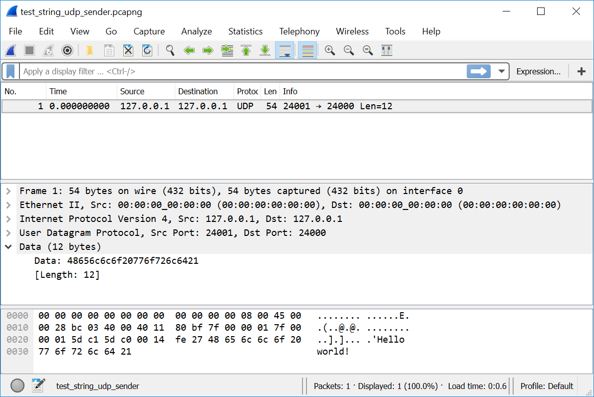

# Методы защиты от внеигровых ботов

Мы разработали бота для NetChess. Это простое приложение для игры в шахматы двух пользователей по локальной сети. Современные онлайн игры насчитывают тысячи пользователей, которые подключаются к серверу через Интернет. Несмотря на эти различия, разработка внеигровых ботов в обоих случаях пойдёт по одному и тому же плану. Прежде всего необходимо изучить протокол взаимодействия игрового клиента и сервера.

У приложения NetChess нет никакой защиты от реверс-инжиниринга и внеигровых ботов. Именно по этой причине нам так быстро удалось понять его протокол. Если вы попробуйте проделать то же самое с современной онлайн игрой, возникнут затруднения. Скорее всего, вы не сможете так просто установить соответствие между действиями игрока и данными в перехваченных пакетах. Одни и те же действия меняют байты по разным смещениям без какой-либо закономерности. Если вы столкнулись с подобным поведением, значит игра имеет систему защиты. Самый надёжный и широко применяемый подход для защиты трафика приложения - это шифрование.

В главе 3 мы рассмотрели два алгоритма шифрования применительно к защите памяти приложения. Теперь рассмотрим, как применить эти и другие алгоритмы к сетевому трафику.

## Криптосистема

Перед тем, как перейти к практическим примерами, рассмотрим понятие [**криптосистемы**](https://ru.wikipedia.org/wiki/Криптосистема). Криптосистема - это набор криптографических алгоритмов для обеспечения конфиденциальности информации. Как правило, криптосистема имеет три алгоритма для следующих целей:

1. Генерация ключа шифрования.

2. Шифрование.

3. Дешифрование.

Термин [**шифр**](https://ru.wikipedia.org/wiki/Шифр) относится только к алгоритмам шифрования и дешифрования. Первый же из алгоритмов в списке использется для создания [**секретного ключа**](https://ru.wikipedia.org/wiki/Ключ_(криптография)), который удовлетворяет требованиям шифра.

Как работает шифрование? Предположим, что у нас есть некотоаря информация (например сообщение), которое мы хотим защитить от несанкционированного чтения. Эта информация называется [**открытый текст**](https://ru.wikipedia.org/wiki/Открытый_текст) (plaintext). Открытый текст вместе с секретным ключом передаётся алгоритму шифрования. После отработки алгоритм выдаст информацию в зашифрованном виде или [**шифротекст**](https://ru.wikipedia.org/wiki/Шифротекст). Чтобы снова получить открытый текст, необходимо передать шифротекст и ключ в алгоритм дешифрования. Это значит, что исходное сообщение смогут прочитать только те получатели, которые знают ключ и алгоритм шифрования.

Мы рассмотрели работу типичной криптосистемы в общих чертах. В реальных системах могут быть дополнительные шаги шифрования и дешифрования, а также возможности управления ключами.

## Тестовое приложение

Для демонстрации алгоритмов шифрования воспользуемся простым приложением, которое передаёт текстовое сообщение по протоколу UDP. Мы использовали это приложение в разделе "Перехват трафика" (см. листинги 4-3 и 4-4). Немного изменим скрипт отправителя, чтобы вместо трёх байт отправлялась строка "Hello world!".

**Листинг 4-7.** *Скрипт `TestStringUdpSender.py`*
```Python
import socket

def main():
  s = socket.socket(socket.AF_INET, socket.SOCK_DGRAM, 0)
  s.bind(("127.0.0.1", 24001))
  data = bytes("Hello world!", "utf-8")
  s.sendto(data, ("127.0.0.1", 24000))
  s.close()

if __name__
  main()
```
Скрипт отправляет строку, хранящуюся в переменной `data`. Это байтовый массив, в котором каждой букве соответствует один байт (ASCII кодировка). Чтобы получить этот массив из исходной строки в кодировке UTF-8, используется функция `bytes`.

Запустите срипт `TestUdpReceiver.py` из листинга 4-3 и `TestStringUdpSender.py`. Когда получатели примет сообщение, он выведет на консоль текст:
```
b'Hello world!'
```
Символ "b" в начале строки означает, что строка хранится в памяти в виде байтового массива.

Иллюстрация 4-22 демонстрирует перехваченный пакет тестового приложения.



**Иллюстрация 4-22.** *Перехваченный пакет тестового приложения*

Wireshark корректно декодировал строку "Hello world!". Мы можем её прочитать в нижней части окна анализатора в области байтового представления пакета.

## XOR шифр

Одна из простейших криптосистем - шифр XOR. Мы применяли его в главе 3 для сокрытия данных процесса от сканеров памяти. Теперь воспользуемся им для шифрования сетевого пакета.

Библиотека PyCrypto предоставляет шифр XOR. Мы можем воспользоваться уже готовой реализацией и не писать алгоритм самостоятельно.

---
В библиотеки PyCryptodome нет реализации шифра XOR. Если вы установили её, а не PyCrypto, вы не сможете запустить следующие примеры из листингов 4-8, 4-9, 4-10 и 4-11.
---

Листинг 4-8 демонстрирует использование шифра XOR, предоставляемого библиотекой PyCrypto.

**Листинг 4-8.** *Скрипт `XorTest.py`*
```Python
from Crypto.Cipher import XOR

def main():
  key = b"The secret key"

  # Encryption
  encryption_suite = XOR.new(key)
  cipher_text = encryption_suite.encrypt(b"Hello world!")
  print(cipher_text)

  # Decryption
  decryption_suite = XOR.new(key)
  plain_text = decryption_suite.decrypt(cipher_text)
  print(plain_text)

if __name__ == '__main__':
  main()
```
Первая строка скрипта импортирует Python модуль `XOR`, в котором реализованы алгоритмы шифра. Чтобы ими воспользоваться, нам надо подготовить секретный ключ. В нашем случае это переменная `key` со строкой "The secret key".

Чтобы зашифровать строку, мы создаем объект `encryption_suite` класса `XORCipher` с помощью функции `new` (вызов `XOR.new`). В качестве параметра она принимает секретный ключ. У созданного объекта есть метод `encrypt`, который применяет шифр к переданному ему открытому тексту в формате байтового массива. Получившийся шифротекст сохраняется в переменной `cipher_text` и выводится на консоль. Этот вывод выглядит следующим образом:
```
b'\x1c\r\tL\x1cE\x14\x1d\x17\x18DJ'
```
Оставшаяся часть функции `main` дешифрует шифротекст в исходный вид. Для этого мы создаём объект `dencryption_suite` точно так же, как и `encryption_suite` ранее. С помощью метода `decrypt` этого объекта мы дешифруем строку `cipher_text`. После этого выводим результат на консоль. Он должен совпасть с исходной строкой "Hello world!".

После внимательного изучения кода листинга 4-8 возникает вопрос. Можно ли использовать один и тот же объект класса `XORCipher` и для шифрования, и для дешифрования? Ответ - нет. Классы библиотеки PyCrypto имеют внутренние состояния, которые зависят от последней выполненной операции. Это означает, что любое действие над ними окажет влияние на последующее. Если вы зашифруете две строки друг за другом с помощью одного объекта, расшифровать их возможно только в той же последовательности. Иначе результат будет ошибочным. Надёжный и правильный способ использовать объекты `XORCipher` - применять их для однократных операций шифрования и дешифрования.

Теперь применим шифр XOR для скриптов отправки и получения UDP пакета нашего тестового приложения. Листинг 4-9 демонстрирует дополненный срипт отправителя.

**Листинг 4-9.** *Скрипт `XorUdpSender.py`*
```Python
import socket
from Crypto.Cipher import XOR

def main():
  s = socket.socket(socket.AF_INET, socket.SOCK_DGRAM, 0)
  s.bind(("127.0.0.1", 24001))

  key = b"The secret key"
  encryption_suite = XOR.new(key)
  cipher_text = encryption_suite.encrypt(b"Hello world!")

  s.sendto(cipher_text, ("127.0.0.1", 24000))
  s.close()

if __name__ == '__main__':
  main()
```
В скрипте `XorUdpSender.py` мы шифруем строку "Hello world!" и отправляем её по протоколу UDP.

Скрипт получателя приведён в листинге 4-10.

**Листинг 4-10.** *Скрипт `XorUdpReceiver.py`*
```Python
import socket
from Crypto.Cipher import XOR

def main():
  s = socket.socket(socket.AF_INET, socket.SOCK_DGRAM, 0)
  s.bind(("127.0.0.1", 24000))
  data, addr = s.recvfrom(1024, socket.MSG_WAITALL)

  key = b"The secret key"
  decryption_suite = XOR.new(key)
  plain_text = decryption_suite.decrypt(data)
  print(plain_text)

  s.close()

if __name__ == '__main__':
  main()
```
Если вы запустите дополненные скрипты отправителя и получателя, результат будет тем же что и раньше. Скрипт `XorUdpReceiver.py` выведет на консоль полученную строку:
```
b'Hello world!'
```
Однако, если вы перехватите переаднный пакет с помощью Wireshark, вы заметите разницу. Этот пакет приведён на иллюстрации 4-23.


**Иллюстрация 4-23.** *Перехваченный пакет, который был зашифрован XOR*

Обратите внимание, что теперь Wireshark не может декодировать строку. Теперь эту операцию надо выполнять вручную, но для этого понадобится секретный ключ.

У вас может возникнуть мысль, что XOR шифр - это хороший вариант для вашего приложения. Он прост в использовании и быстро работает. На самом деле это не так, поскольку этот шифр легко взломать.

В шифре применяется логическая операция [**исключающее "или"**](https://ru.wikipedia.org/wiki/Сложение_по_модулю_2). Предположим, что мы шифруем открытый текст A с помощью секретного ключа K. Тогда мы получим шифротекст B:
```
A ⊕ K = B
```
Если мы применим исключающее "или" к A и B, то получим ключ K:
```
A ⊕ B = K
```
Это означает, что мы можем восстановить секретный ключ, если нам известны открытый текст и шифротекст. Скрипт `XorCrack.py` из листинга 4-11 восстанавливает секретный ключ по этому алгоритму.

**Листинг 4-11.** *Скрипт `XorCrack.py`*
```Python
from Crypto.Cipher import XOR

def main():
  key = b"The secret key"

  # Encryption
  encryption_suite = XOR.new(key)
  cipher_text = encryption_suite.encrypt(b"Hello world!")
  print(cipher_text)

  # Decryption
  decryption_suite = XOR.new(key)
  plain_text = decryption_suite.decrypt(cipher_text)
  print(plain_text)

  # Crack
  crack_suite = XOR.new(plain_text)
  key = crack_suite.encrypt(cipher_text)
  print(key)

if __name__ == '__main__':
  main()
```
При запуске этот скрипт выведет на консоль следующее:
```
b'\x1c\r\tL\x1cE\x14\x1d\x17\x18DJ'
b'Hello world!'
b'The secret k'
```
Первая строка соответствует шифротексту. Далее идёт открытый текст и восстановленный секретный ключ.

Почему скрипт `XorCrack.py` восстановил только часть секретного ключа? В XOR шифре оператор исключающего "или" последовательно применяется к каждой букве открытого текста и соответствующему ей байту ключа. В нашем случае индексы букв текста и байтов ключа совпадают. Если строка текста оказывается короче ключа, оставшаяся его часть не используется. Если же ключ оказался длиннее, то он будет применяться циклично.

Как рассмотренное свойство оператора исключающего "или" поможет нам расшифровать пакет с реальными игровыми данными? В этом случае у нас есть шифротекст. Наша задача - получить открытый текст. Прежде всего, нам необходимо восстановить секретный ключ. Для этого применим в точности ту же криптосистему для шифрования известного нам открытого текста. Тогда нам станет известен шифротекст и соответствующий ему открытый текст. Это позволит нам восстановить ключ.

Предположим, что мы заполняем форму регистрации для онлайн игры. В неё надо указать информацию о новом игроке (имя, пароль, адрес электронной почты). Все эти данные нам известны. После заполнения формы, обычно надо нажать кнопку "отправить". Перехватим пакеты, которые игровое приложение посылает по этому нажатию. Данные пользователя из формы регистрации находятся в этих пакетах. Применим оператор исключающего "или" к этим данным и шифротексту из пакета. Чтобы перепробовать все комбинации, понадобится время, но рано или поздно мы восстановим секретный ключ.

Можно заключить, что у шифра XOR есть положительные стороны, но он не способен обеспечить надёжную защиту для трафика приложений.

## Шифр Triple DES

Следующий шифр, который мы рассмотрим называется [**Triple DES**](https://ru.wikipedia.org/wiki/Triple_DES) (3DES). Для шифрования в нём трижды применяется алгоритм [**DES**](https://ru.wikipedia.org/wiki/DES) (Data Encryption Standard) над открытым текстом. Алгоритм DES был разработан в 1975 году компанией IBM. Сегодня он считается ненадёжным из-за использования коротких секретных ключей длиной 56 бит. Современные компьютеры позволяют перебрать все возможные ключи (количеством 2<sup>56</sup>) такой длины в течении нескольких дней. Алгоритм 3DES решает эту проблему путём увеличения длины ключа в три раза до 168 бит.

Почему необходимо применять алгоритм DES именно три раза? Почему недостаточно двух? В этом случае мы получили бы ключ длиной 112 бит, которого достаточно для современных требований. Ожидается, что этот ключ потребует перебора 2<sup>112</sup> всех возможных комбинаций **атакующим** (лицом взламывающим шифр). Это предположение не верно. Атака под названием [**встреча по середине**](https://ru.wikipedia.org/wiki/Метод_встречи_посередине) (meet-in-the-middle) позволяет сократить число перебираемых вариантов ключей до 2<sup>57</sup>. Этого недостаточно для надёжного шифрования открытого текста. Если же применить алгоритм 3DES, атакующему придётся перебрать 2<sup>112</sup> комбинаций ключей, даже если он применит атаку встреча по середине.

При разработке шифра 3DES учитывалось, насколько удобно будет его применение на специальных чипах. Сегодня по-прежнему эксплуатируется много устройств, выпущенных десять и более лет назад. Они поддерживают алгоритм DES на аппаратном уровне. Достаточно просто настроить эти устройства на использование шифрования 3DES. Обратная совместимость с устаревшими решениями - это основная причина использования 3DES в наши дни. Более современные шифры быстрее и надёжнее.

Обе библиотеки PyCrypto и PyCryptodome предоставляют реализации шифров DES и 3DES. Мы рассмотрим только 3DES алгоритм.

Листинг 4-12 демонстрирует скрипт для шифрования и дешифрования строки с помощью 3DES.

**Листинг 4-12.** *Скрипт `3DesTest.py`*
```Python
from Crypto.Cipher import DES3
from Crypto import Random

def main():
  key = b"The secret key a"
  iv = Random.new().read(DES3.block_size)

  # Encryption
  encryption_suite = DES3.new(key, DES3.MODE_CBC, iv) 
  cipher_text = encryption_suite.encrypt(b"Hello world!    ")
  print(cipher_text)

  # Decryption
  decryption_suite = DES3.new(key, DES3.MODE_CBC, iv)
  plain_text = decryption_suite.decrypt(cipher_text)
  print(plain_text)

if __name__ == '__main__':
  main()
```
В этом скрипте мы импортируем Python модули `DES3` и `Random` библиотеки PyCrypto. Первый из них предоставляет класс DES3Cipher, в котором реализованы алгоритмы шифрования и дешифрования. Модуль `Random` предоставляет генератор случайных последовательностей байтов. Его следует использовать вместо стандартного модуля `random`, распространяемого с интерпретатором Python. Потому что `random` считается небезопасным для целей шифрования.

Зачем нам понадобился массив случайных байтов для алгоритма 3DES? 3DES - это блочный шифр. В нём открытый текст разделяется на блоки, которые последовательно шифруются с помощью секретного ключа. Если мы применим алгоритм в таком виде, шифр будет недостаточно надёжным. Причина в том, что атакующий может найти закономерность между отдельными блоками открытого текста и шифротекста. Тогда он сможет определить содержимое зашифрованных блоков. Чтобы предотвратить эту уязвимость, можно смешать каждый блок открытого текста с предыдущим блоком шифротекста. Этот подход известен как [**сцепление блоков шифротекста**](https://ru.wikipedia.org/wiki/Режим_сцепления_блоков_шифротекста) (Cipher Block Chaining или CBC). Единственная проблема возникает с первым блоком открытого текста. С какими данными следует смешивать его? Этия данные должны генерироваться случайно. Они называются [**вектором инициализации**](https://en.wikipedia.org/wiki/Initialization_vector) (Initialization Vector или IV).

В скрипте `3DesTest.py` мы создаём [**файлоподобный объект**](https://docs.python.org/3/library/io.html) (file-like) с помощью функции `new` модуля `Random`. После этого вызываем метод `read`, который возвращает массив случайных байтов указанной длины. Эта длина должна быть равна длине одного блока, на которые разбивается открытый текст в алгоритме 3DES. В нашем случае это `DES3.block_size`. Мы сохраняем массив случайных байтов в переменной `iv`. Он будет смешиваться с первым блоком открытого текста при шифровании.

Возможно, вы заметили, что мы расширили секретный ключ двумя дополнительными символами до 16 байтной длины. При использовании алгоритма 3DES длина ключа может быть либо 16, либо 24 байта.

После подготовки вектора инициализации и ключа, мы создаём объект `encryption_suite` класса `DES3Cipher` с помощью функции `new` модуля `DES3`. Она принимает три входных параметра:

1. Секретный ключ.

2. Режим сцепления блоков шифротекста.

3. Вектор инициализации (если он нужен для выбранного режима).

В скрипте `3DesTest.py` используется режим `DES3.MODE_CBC`. Библиотека PyCrypto предоставляет несколько альтернативных вариантов. Вы можете выбрать один из них.

---
При конструировании объектов для шифрования и дешифрования необходимо указывать один и тот же режим сцепления блоков шифротекста и вектор инициализации.
---

Класс `DES3Cipher` предоставляет такие же методы `encrypt` и `decrypt`, что и класс `XORCipher`.

После запуска скрипта `3DesTest.py`, вывод на консоли должен выглядеть следующим образом:
```
b'\xdc\xce\xf1^_\x95[\x16K\x93\x9a\xb8\x01\xf3\x1b\xcb'
b'Hello world!    '
```
Обратите внимание, что мы добавили четыре пробела в конце строки открытого текста "Hello world!". Они необходимы, поскольку его длина должна быть кратна восьми байтам. Это требование выбранного нами режима сцепления блоков шифротекста.

Теперь дополним скрипты отправки и приёма UDP сообщения так, чтобы они использовали 3DES шифр. Листинг 4-13 демонстрирует код отправителя.

**Листинг 4-13.** *Скрипт `3DesUdpSender.py`*
```Python
import socket
from Crypto.Cipher import DES3
from Crypto import Random

def main():
  s = socket.socket(socket.AF_INET, socket.SOCK_DGRAM, 0)
  s.bind(("127.0.0.1", 24001))

  key = b"The secret key a"
  iv = Random.new().read(DES3.block_size)
  encryption_suite = DES3.new(key, DES3.MODE_CBC, iv)
  cipher_text = iv + encryption_suite.encrypt(b"Hello world!    ")

  s.sendto(cipher_text, ("127.0.0.1", 24000))
  s.close()

if __name__ == '__main__':
  main()
```
Скрипт `3DesUdpSender.py` шифрует открытый текст так же как и `3DesTest.py`. Единственное отличие в том, что мы добавляем вектор инициализации в начало шифротекста. Это необходимо, чтобы отправить его получателю в UDP пакете. Для чего это нужно? Как вы помните для дешифровки сообщения нужен секретный ключ и вектор инициализации. Ключ мы можем сгенерировать заранее и сохранить на стороне отправителя и получателя. К сожалению, мы не можем проделать то же самое с вектором инициализации. Он должен быть уникальным для каждой операции шифрования иначе алгоритм будет скомпроментирован и атакующему будет прозе взломать шифр. Следовательно получатель сообщения должен каким-то образом узнать IV. Самое простое решение - отправить его вместе с шифротекстом в одном пакете.

Возникает вопрос: безопасно ли передавать вектор инициализации в открытом виде? Да, это вполне безопасно. Главная задача IV - добавлять случайность в шифротекст. Благодаря ему, мы получаем разный результат при шифровании одного и того же открытого текста. При применении криптосистем IV часто рассматривается, как обязательная часть шифротекста.

Листинг 4-14 демонстрирует реализацию скрипта получателя.

**Листинг 4-14.** *Скрипт `3DesUdpReceiver.py`*
```Python
import socket
from Crypto.Cipher import DES3

def main():
  s = socket.socket(socket.AF_INET, socket.SOCK_DGRAM, 0)
  s.bind(("127.0.0.1", 24000))
  data, addr = s.recvfrom(1024, socket.MSG_WAITALL)

  key = b"The secret key a"
  decryption_suite = DES3.new(key, DES3.MODE_CBC, data[0:DES3.block_size])
  plain_text = decryption_suite.decrypt(data[DES3.block_size:])
  print(plain_text)

  s.close()

if __name__ == '__main__':
  main()
```
В скрипте `3DesUdpReceiver.py` мы передаём первый блок полученных данных (байты с нулевого по `DES3.block_size`) в функцию `new` в качестве вектора инициализации. Она конструирует объект `decryption_suite`, с помощью которого мы расшифровываем оставшиеся байты сообщения.

Если вы запустите сначала скрипт `3DesUdpReceiver.py`, а потом `3DesUdpSender.py`, получатель корректно расшифрует переданное сообщение и выведет его на консоль.

Вы можете использовать шифр 3DES в своих приложениях только в том случае, когда на это есть серьёзные причины (например аппаратная поддержка со стороны используемого оборудования). Сегодня он не считается достаточно надёжным. Теоретические варианты атаки на шифр рассмотрены в этой [статье](https://habr.com/ru/post/239287). Кроме того, современные шифры работают быстрее 3DES.

## Шифр AES

В 1998 году два бельгийских криптографа Винсент Рэймен и Йоан Даймен создали [**шифр AES**](https://ru.wikipedia.org/wiki/Advanced_Encryption_Standard#История_AES) (Advanced Encryption Standard). Он заменил DES и его вариации в качестве криптографического стандарта США.

В AES были решены проблемы шифра DES. Прежде всего он позволяет использовать длинные секретные ключи (128, 192 и 256 бит). Такая возможность появилась потому, что в AES длины блоков и ключа могут различаться. Можно выбрать любую допустимую длину ключа, и это не вызовет накладных расходов алгоритма шифрования, как в случае 3DES. Отсутствие накладных расходов на шифрование - одна из причин высокой скорости работы AES.

Обе библиотеки PyCrypto и PyCryptodome предоставляют шифр AES. Интерфейс для его использования похож на 3DES.

Листинг 4-15 демонстрирует применение AES для шифрования и дешифрования строки.

**Листинг 4-15.** *Скрипт `AesTest.py`*
```Python
from Crypto.Cipher import AES
from Crypto import Random

def main():
  key = b"The secret key a"
  iv = Random.new().read(AES.block_size)

  # Encryption
  encryption_suite = AES.new(key, AES.MODE_CBC, iv)
  cipher_text = encryption_suite.encrypt(b"Hello world!    ")
  print(cipher_text)

  # Decryption
  decryption_suite = AES.new(key, AES.MODE_CBC, iv)
  plain_text = decryption_suite.decrypt(cipher_text)
  print(plain_text)

if __name__ == '__main__':
  main()
```
Сравните скрипты `AesTest.py` и `3DesTest.py`. Они очень похожи. Функция `new` модуля `AES` создаёт объект `encryption_suite` класса `AESCipher`. У неё те же три входных параметра, что и в случае 3DES: секретный ключ, режим сцепления блоков, IV. AES поддерживает те же режимы сцепления блоков, что и 3DES.

После запуска скрипта `AesTest.py`, в консоли напечатаются следующие строки:
```
b'\xed\xd5\x19]\x04\xba\xc5\x05^s\x18t\xa3\xb59x'
b'Hello world!    '
```
Нам опять пришлось дополнить открытый текст проблеами, до длины кратной восьми байтов. Это требование режима сцепления блоков `AES.MODE_CBC`.

Листинг 4-16 демонстрирует скрипт `AesUdpSender.py`, который шифрует сообщение алгоритмом AES и отправляет его.

**Листинг 4-16.** *Скрипт `AesUdpSender.py`*
```Python
import socket
from Crypto.Cipher import AES
from Crypto import Random

def main():
  s = socket.socket(socket.AF_INET, socket.SOCK_DGRAM, 0)
  s.bind(("127.0.0.1", 24001))

  key = b"The secret key a"
  iv = Random.new().read(AES.block_size)
  encryption_suite = AES.new(key, AES.MODE_CBC, iv)
  cipher_text = iv + encryption_suite.encrypt(b"Hello world!    ")

  s.sendto(cipher_text, ("127.0.0.1", 24000))
  s.close()

if __name__ == '__main__':
  main()
```
Здесь мы отправляем IV в начале данных пакета точно так же, как и в скрипте `3DesUdpSender.py` (листинг 4-13). Алгоритм шифрования и отправки пакета такой же, как при использовании 3DES.

Скрипт `AesUdpReceiver.py` из листинга 4-17 получает и дешифрует сообщение.

**Листинг 4-17.** *Скрипт `AesUdpReceiver.py`*
```Python
import socket
from Crypto.Cipher import AES

def main():
  s = socket.socket(socket.AF_INET, socket.SOCK_DGRAM, 0)
  s.bind(("127.0.0.1", 24000))
  data, addr = s.recvfrom(1024, socket.MSG_WAITALL)

  key = b"The secret key a"
  decryption_suite = AES.new(key, AES.MODE_CBC, data[0:AES.block_size])
  plain_text = decryption_suite.decrypt(data[AES.block_size:])
  print(plain_text)

  s.close()

if __name__ == '__main__':
  main()
```
Скрипт получателя работает по тому же алгоритму, что и `3DesUdpReceiver.py` из листинга 4-14.

Попробуйте запустить скрипты отправителя и получателя, чтобы проверить корректность их работы.

Если вы собираетесь использовать [**симметричный шифр**](https://ru.wikipedia.org/wiki/Симметричные_криптосистемы) в своём приложении, всегда выбирайте AES вместо 3DES.

Предположим, что игровое приложение, для которого мы собираемся написать бота, использует симметричный шифр для защиты своего трафика. Можем ли мы его взломать, чтобы изучить протокол игры? Если используются надёжные алгоритмы вроде 3DES или AES, скорее всего придётся перебрать и проверить все возможные комбинации секретных ключей. Этот подход известен, как [**метод "грубой силы"**](https://ru.wikipedia.org/wiki/Полный_перебор#Атака_методом_«грубой_силы»). Однако, существуют атаки на шифр, позволяющие уменшить число ключей для перебора и проверки. Они специфичны для алгоритма шифрования, режима его работы, деталей реализации и качества выбранного секретного ключа.

Возникает другой вопрос. Если мы применили какую-то технику и получили набор ключей для перебора и проверки, как понять, что один из них подошёл? Ведь в большинстве случаев мы не знаем точно, как выглядит открытый текст.

Первое решение этого затруднения заключается в том, чтобы собрать информацию об открытом тексте. Мы можем прочитать состояния игровых объектов в окне приложения или проанализировать память его процесса. Высока вероятность, что эти состояния окажутся в одном из пакетов, которыми обменивается игровой клиент и сервер. Следовательно, если секретный ключ подойдёт, мы можем ожидать прочитать эти данные.

Альтернативное решение заключается в применении статистического теста к расшифрованным данным. Если проверяемый секретный ключ корректен, они должны быть более упорядоченными. В противном случае, мы получим набор случайных байт без какой-либо закономерности.

## Шифр RSA

Все рассмотренные нами ранее шифры (XOR, 3DES, AES) являются симметричными. Это означает, что для шифрования и дешифрования используется один и тот же секретный ключ. Следовательно, он должен быть у отправителя и получателя сообщения. Этот факт может навести на одну идею: зачем вообще нужно взламывать надёжный шифр? Ведь по-сути секретный ключ находится на стороне пользователя в памяти игрового клиента. Достаточно найти его и импортировать в код внеигрового бота. После этого он сможет взаимодействовать с сервером точно так же, как и оригинальный клиент.

Затем возникает вопрос: возможно ли защитить секретный ключ на стороне игрового клиента? Лучшим решение было бы вообще не хранить ключ локально у пользователя. С другой стороны, сервер не может просто отправлять ключ перед началом каждого обмена пакетами. Если атакующий перехватит его, он легко расшифрует все дальнейшие пакеты. [**Ассиметричное шифрование**](https://ru.wikipedia.org/wiki/Криптосистема_с_открытым_ключом) решает именно эту проблему. Оно предоставляет алгоритмы для безопасной передачи ключа.

Мы рассмотрим ассиматричный [**шифр RSA**](https://ru.wikipedia.org/wiki/RSA). Его идея заключается в том, чтобы применять [**одностороннюю математическую функцию**](https://ru.wikipedia.org/wiki/Односторонняя_функция) для шифрования открытого текста. Ключ является входным параметром этой функции. Чтобы взломать шифр, необходимо решить математическое уравние, то есть найти открытый текст по известному шифротексту и ключу. Однако, главная особенность односторонних функций заключается в сложности нахождения входного параметра по её известному значению. Поэтому взломать шифр за разумное время невозможно.

Если вычислить функцию [**обратную**](https://ru.wikipedia.org/wiki/Обратная_функция) односторонней нельзя, как же тогда происходит дешифрование сообщения? Предположим, что мы зашифровали сообщение с помощью ключа и односторонней функции. Шифротекст мы отправили получателю. Даже зная ключ, он не сможет дешифровать наше сообщение. Однако, для ассиметричного шифрования выбираются особенные односторонние функции, у которых есть лазейка. Лазейка - эта некоторая подсказка, которая помогает вычислить обратную функцию, т.е. получить открытый текст по известному шифротексту и ключу. Мы пришли к концепции двух ключей: первый для выполнения шифрования (известен как [**закрытый ключ**](https://ru.wikipedia.org/wiki/Закрытый_ключ)) и второй (лазейка) для вычисления обратной функции (**открытый ключ**).

Рассмотрим, как работает ассиметричное шифрование с точки зрения пользователя. Когда мы хотим получим зашифрованное сообщение, мы вычисляем пару ключей: открытый и закрытый. Затем мы передаём открытый ключ отправителю информации. Он шифрует своё сообщение этим ключом и отправляет нам шифротекст. Благодаря закрытому ключу, который служит лазейкой к односторонней функции шифрования, мы расшифровываем сообщение. Как видно из рассмотренной схемы, атакующий может перехватить открытый ключ и шифротекст, но это не поможет ему расшифровать сообщение. Для этого нужен закрытый ключ, но его получатель хранит у себя и никому не передаёт.

Обе библиотеки PyCrypto и PyCryptodome предоставляют реализацию RSA шифра. Но в PyCryptodome отсутствуют некоторые недостаточно надёжные функции RSA.

Листинг 4-18 демонстрирует использование RSA для шифрования и дешифрования строки.

**Листинг 4-18.** *Скрипт `RsaTest.py`*
```Python
from Crypto.PublicKey import RSA
from Crypto import Random

def main():
  key = RSA.generate(1024, Random.new().read)

  # Encryption
  cipher_text = key.encrypt(b"Hello world!", 32)
  print(cipher_text)

  # Decryption
  plain_text = key.decrypt(cipher_text)
  print(plain_text)

if __name__ == '__main__':
  main()
```

---
Скрипт `RsaTest.py` не заработает, если вы используете библиотеку PyCryptodome.
---
В скрипте мы импортируем два Python модуля `Random` и `RSA`. Первый из них нам уже известен. Второй предоставляет функции для генерации и применения открытого и закрытого ключа.

Сначала мы создаём объекта `key` класса `_RSAobj` с помощью функции `generate` модуля `RSA`. Этот объект содержит пару ключей (открытый и закрытый). Первый параметр функции обязательный. Он задаёт длину ключей (в нашем случае 1024 бита). Второй параметр опциональный. В нём передаётся функция генерации случайных чисел.

После создания объекта `key` мы вызываем его методы `encrypt` и `decrypt` для шифрования и дешифрования текста.

Может возникнуть вопрос: где применяются открытый и закрытый ключи в нашем примере? Ведь явно они нигде в коде не упоминаются. На самом деле шифрование и дешифрование происходит в одном и том же процессе, поэтому нет необходимости в передаче открытого ключа. Если это необходимо, объект `key` предоставляет методы для экспорта и импорта ключей.

В листинге 4-18 мы рассмотрели использование шифра RSA в отдельности. В таком виде он уязвим для [**атаки на основе подобранного открытого текста**](https://ru.wikipedia.org/wiki/Атака_на_основе_подобранного_открытого_текста) (chosen-plaintext attack или CPA). Поэтому RSA всегда используют в комбинации со [**схемой дополнения OAEP**](https://ru.wikipedia.org/wiki/Оптимальное_асимметричное_шифрование_с_дополнением) (Optimal Asymmetric Encryption Padding), которая предотвращает эту уязвимость. Такая комбинация шифра и схемы дополнения известна как RSA-OAEP.

Листинг 4-19 демонстрирует использование RSA-OAEP алгоритма для шифрования строки.

**Листинг 4-19.** *Скрипт `RsaOaepTest.py`*
```Python
from Crypto.PublicKey import RSA
from Crypto.Cipher import PKCS1_OAEP
from Crypto import Random

def main():
  key = RSA.generate(1024, Random.new().read)

  # Encryption
  encryption_suite = PKCS1_OAEP.new(key)
  cipher_text = encryption_suite.encrypt(b"Hello world!")
  print(cipher_text)

  # Decryption
  decryption_suite = PKCS1_OAEP.new(key)
  plain_text = decryption_suite.decrypt(cipher_text)
  print(plain_text)

if __name__ == '__main__':
  main()
```
Теперь для шифрования и дешифрования мы используем не `key`, а объекты класса `PKCS1OAEP_Cipher` из модуля `PKCS1_OAEP`. Он конструируется функцией `new`, которая принимает входным параметром объект класса `_RSAobj` (то есть RSA ключи). Для шифрования и дешифрования используются два разных OAEP объекта: `encryption_suite` и `decryption_suite`.

Применим RSA-OAEP шифр для нашего тестового приложения, отправляющего UDP пакет по сети. Прежде всего необходимо изменить его алгоритм. В случае симметричного шифрования он тривиален: зашифровать открытый текст, передать его в пакете, расшифровать на стороне получателя. При применении ассиметричного шифра появляется дополнительный шаг: передача открытого ключа отправителю сообщения. Ведь с помощью него и будет происходит шифрование.

Рассмотрим пошагово новый алгоритм тестовго приложения:

1. Скрипт отправителя сообщения запускается первым. Он создаёт UDP сокет и ожидает получения открытого ключа.

2. Скрипт получателя запускается. Он создаёт UDP сокет. Затем генерирует пару ключей.

3. Получатель сообщения посылает свой открытый ключ.

4. Отправитель читает ключ из пришедшего UDP пакета и использует его для шифрования открытого текста по алгоритму RSA-OAEP.

5. Отправитель посылает шифротекст с сообщением.

6. Получатель принимает шифротекст и дешифрует его, используя свою пару ключей.

Листинг 4-20 демонстрирует скрипт, отправляющий сообщение.

**Листинг 4-20.** *Скрипт `RsaUdpSender.py`*
```Python
import socket
from Crypto.PublicKey import RSA
from Crypto.Cipher import PKCS1_OAEP

def main():
  s = socket.socket(socket.AF_INET, socket.SOCK_DGRAM, 0)
  s.bind(("127.0.0.1", 24001))

  public_key, addr = s.recvfrom(1024, socket.MSG_WAITALL)

  key = RSA.importKey(public_key)
  cipher = PKCS1_OAEP.new(key)

  cipher_text = cipher.encrypt(b"Hello world!")

  s.sendto(cipher_text, ("127.0.0.1", 24000))
  s.close()

if __name__ == '__main__':
  main()
```
В этом скрипте мы используем функцию `importKey` модуля `RSA`. Она конструирует объект класса `_RSAobj`, содержащий только открытый ключ. Этого объекта будет достаточно для шифрования, но не для дешифрования. На входе `importKey` принимает ключ в формате байтового массива, который мы получаем из UDP пакета. Переменная `key` используется для конструировании объекта `cipher` класса `PKCS1OAEP_Cipher`. С его помощью мы шифруем сообщение и отправляем его получателю.

Скрипт, получающий сообщение, приведён в листинге 4-21.

**Листинг 4-21.** *Скрипт `RsaUdpReceiver.py`*
```Python
import socket
from Crypto.PublicKey import RSA
from Crypto.Cipher import PKCS1_OAEP
from Crypto import Random

def main():
  s = socket.socket(socket.AF_INET, socket.SOCK_DGRAM, 0)
  s.bind(("127.0.0.1", 24000))

  key = RSA.generate(1024, Random.new().read)
  public_key = key.publickey().exportKey()

  s.sendto(public_key, ("127.0.0.1", 24001))

  data, addr = s.recvfrom(1024, socket.MSG_WAITALL)

  cipher = PKCS1_OAEP.new(key)
  plain_text = cipher.decrypt(data)
  print(plain_text)

  s.close()

if __name__ == '__main__':
  main()
```
Как мы рассмотрели ранее, в скрипте получателя сообщения появились дополнительные шаги для передачи открытого ключа. Мы генерируем пару ключей и сохраняем её в объекте `key`. Затем с помощью его метода `publickey` создаём временный объект класса `_RSAobj`, содержащий только открытый ключ. Его нужно представить в формате байтового массива, чтобы передать в UDP пакете. Для этого вызываем метод `exportKey` временного объекта. Результат сохраняем в переменную `public_key`.

Метод `exportKey` есть у любого объекта класса `_RSAobj`. Что он экспортирует, если мы вызовем его для объекта `key`, содержащего и открытый ключ и закрытый? В этом случае будет экспортирован закрытый ключ. Это может быть полезно для сохранения его на жёстком диске и дальнейшего использования.

